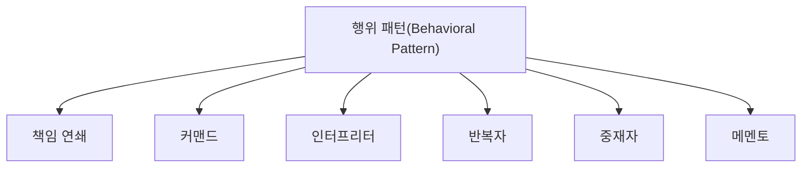

# 052 행위 패턴(Behavioral Pattern)

작성 기준일: 2026-05-02  
과목: `1과목 소프트웨어 설계`  
기준 PDF: `/Users/nes0903/Documents/study/정보처리기사/핵심요약집_2026_정보처리기사필기핵심요약.pdf`  
PDF 확인 위치: `7~8페이지`  
검색 보강: 공식/표준/고품질 참고 자료를 함께 확인하여 시험 중심으로 확장 정리

---

## 1. 한 줄 요약

- 행위 패턴은 객체들이 책임을 나누고 메시지를 주고받는 방식을 정리하여 알고리즘 교체, 요청 전달, 상태 변화, 통지 등을 해결하는 디자인 패턴이다.
- 이 챕터는 `디자인 패턴` 영역에 속한다.
- 시험에서는 정의, 핵심 키워드, 비슷한 개념과의 구분을 함께 묻는 경우가 많다.

---

## 2. PDF 기준 핵심

- 책임 연쇄: 요청을 처리하지 못하면 다음 객체로 넘긴다.
- 커맨드: 재이용하거나 취소할 수 있도록 요청에 필요한 정보를 저장한다.
- 인터프리터: 언어에 문법 표현을 정의한다.
- 반복자: 접근이 잦은 객체에 대해 동일한 인터페이스를 사용한다.
- 중재자: 복잡한 상호 작용을 캡슐화한다.
- 메멘토: 객체를 해당 시점의 상태로 돌릴 수 있는 기능을 제공한다.
- 옵서버: 객체에 상속되어 있는 다른 객체들에게 변화된 상태를 전달한다.
- 상태: 객체의 상태에 따라 동일한 동작을 다르게 처리한다.
- 전략: 동일한 계열의 알고리즘들을 상호 교환할 수 있게 정의한다.
- 템플릿 메소드: 하위 클래스에서 세부 처리를 구체화한다.
- 방문자: 처리 기능을 분리하여 별도의 클래스로 구성한다.

- 위 항목은 PDF에서 직접 확인한 최소 암기 골격이다.
- 세부 설명은 이 골격을 기준으로 확장해서 이해하면 된다.

---

## 3. 개념 설명

- 책임 연쇄는 요청 처리자를 체인으로 연결한다.
- 커맨드는 요청을 객체로 만들어 실행/취소/재실행을 다루기 쉽게 한다.
- 반복자는 컬렉션 내부 구조를 노출하지 않고 순회한다.
- 중재자는 객체들이 서로 직접 얽히는 것을 줄인다.
- 메멘토는 undo 기능과 연결된다.
- 옵서버는 상태 변경을 알린다.
- 전략은 알고리즘을 런타임에 바꿔 끼울 수 있게 한다.
- 디자인 패턴은 이름보다 어떤 문제를 어떤 방식으로 해결하는지 단서어로 구분한다.
- 생성/구조/행위 3분류와 각 패턴의 대표 단어를 연결해 외운다.

---

## 4. 핵심 포인트

- 문제를 풀 때는 먼저 지문 속 단서어를 찾고, 그 단서어가 어떤 개념을 가리키는지 연결한다.
- 정의형 문제는 표현이 조금 바뀌어도 핵심 의미가 같으면 같은 개념으로 판단한다.
- 옳고 그름 문제에서는 `항상`, `반드시`, `전혀`, `모두` 같은 극단 표현을 특히 조심한다.
- 이 챕터는 단독 암기보다 인접 챕터와 비교해 기억하면 정답률이 올라간다.

---

## 5. 시험에서 헷갈리는 비교

| 구분 | 핵심 |
|---|---|
| `Chain of Responsibility` | 다음 객체로 넘김 |
| `Command` | 요청 정보 저장 |
| `Iterator` | 순회 인터페이스 |
| `Mediator` | 상호작용 중재 |
| `Memento` | 되돌리기 |
| `Observer` | 상태 통지 |
| `State` | 상태별 동작 |
| `Strategy` | 알고리즘 교환 |
| `Template Method` | 상위 틀, 하위 세부 |
| `Visitor` | 처리 기능 분리 |

- 비교 문제는 이름보다 `역할`, `목적`, `사용 시점`, `장점/단점`을 기준으로 구분하면 안정적이다.

---

## 6. 예시 또는 암기 포인트

- 행위 패턴은 `책-커-인-반-중-메-옵-상-전-템-방`으로 반복 암기한다.

- 암기는 단어만 외우기보다 `정의 -> 특징 -> 예시 -> 반대 개념` 순서로 묶는 것이 좋다.

---

## 7. 빠른 복습

- 챕터명: `052 행위 패턴(Behavioral Pattern)`
- 소속 영역: `디자인 패턴`
- 자주 나오는 문제 유형:
  - 정의를 주고 개념명을 고르는 문제
  - 특징을 섞어 놓고 옳은/틀린 설명을 고르는 문제
  - 유사 개념과 비교하여 다른 하나를 찾는 문제

---

## 8. 참고 링크

- 기준 PDF: `/Users/nes0903/Documents/study/정보처리기사/핵심요약집_2026_정보처리기사필기핵심요약.pdf`
- [Q-Net 정보처리기사 종목 페이지](https://www.q-net.or.kr/crf005.do?id=crf00503s02&jmCd=1320&jmInfoDivCcd=B0)
- [Refactoring.Guru - Design Patterns Catalog](https://refactoring.guru/design-patterns/catalog)
- [Microsoft - SOLID principles and Dependency Injection](https://learn.microsoft.com/en-us/dotnet/architecture/microservices/microservice-ddd-cqrs-patterns/microservice-application-layer-web-api-design)
