# 052 행위 패턴(Behavioral Pattern)

작성 기준일: 2026-05-02
검색/보강일: 2026-06-01
과목: `1과목 소프트웨어 설계`
기준 PDF: `/Users/nes0903/Documents/study/정보처리기사/핵심요약집_2026_정보처리기사필기핵심요약.pdf`
PDF 확인 위치: `7~8페이지`
주제별 검색 키워드: `GoF behavioral patterns Chain of Responsibility Command Interpreter Iterator Mediator Memento Observer State Strategy Template Method Visitor`, `behavioral design patterns intent`, `Command Observer Strategy State Memento Visitor`

---

## 1. 한 줄 요약

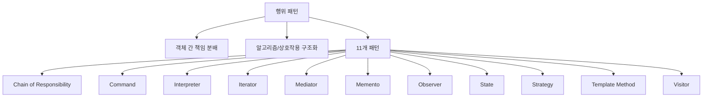

- 행위 패턴은 객체나 클래스 사이의 책임 분배, 요청 전달, 상태 변화, 알고리즘 교체, 통지 같은 상호작용 방식을 다루는 디자인 패턴이다.
- PDF 기준 행위 패턴은 `책임 연쇄`, `커맨드`, `인터프리터`, `반복자`, `중재자`, `메멘토`, `옵서버`, `상태`, `전략`, `템플릿 메소드`, `방문자` 11개이다.
- 시험에서는 `요청 전달`, `요청 객체화`, `문법`, `순회`, `중재`, `복원`, `통지`, `상태별 동작`, `알고리즘 교환`, `골격`, `방문 처리` 단서를 정확히 매칭해야 한다.

---

## 2. 한눈에 보는 구조

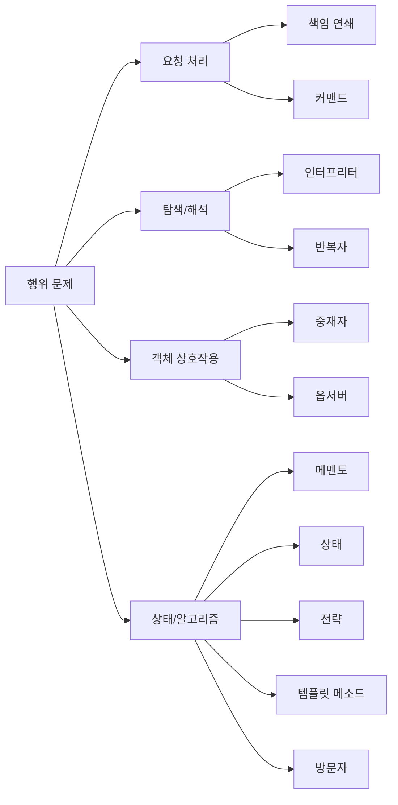

- 행위 패턴은 객체가 어떻게 협력하는지를 설계한다.
- 생성 패턴이 객체 생성 문제를 다루고, 구조 패턴이 객체 조합 문제를 다룬다면, 행위 패턴은 객체 사이의 요청, 책임, 알고리즘, 상태, 통신 문제를 다룬다.
- 11개 패턴이 많기 때문에 단어 하나로 압축해 암기하는 것이 좋다.
  - 책임 연쇄: 다음 객체
  - 커맨드: 요청 저장
  - 인터프리터: 문법
  - 반복자: 순회
  - 중재자: 중재
  - 메멘토: 복원
  - 옵서버: 통지
  - 상태: 상태별 동작
  - 전략: 알고리즘 교환
  - 템플릿 메소드: 알고리즘 골격
  - 방문자: 처리 기능 분리

---

## 3. PDF 기준 핵심

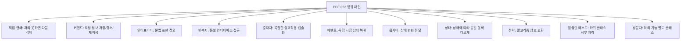

- `책임 연쇄(Chain of Responsibility)`
  - 요청을 한 객체가 처리하지 못하면 다음 객체로 넘어가는 형태이다.
- `커맨드(Command)`
  - 재이용하거나 취소할 수 있도록 요청에 필요한 정보를 저장한다.
- `인터프리터(Interpreter)`
  - 언어에 문법 표현을 정의한다.
- `반복자(Iterator)`
  - 접근이 잦은 객체에 대해 동일한 인터페이스를 사용하도록 한다.
- `중재자(Mediator)`
  - 복잡한 상호 작용을 캡슐화하여 객체로 정의한다.
- `메멘토(Memento)`
  - 객체를 해당 시점의 상태로 돌릴 수 있는 기능을 제공하며 되돌리기 기능에 이용된다.
- `옵서버(Observer)`
  - 객체의 상태 변화를 관련 객체들에게 전달한다.
- `상태(State)`
  - 객체의 상태에 따라 동일한 동작을 다르게 처리해야 할 때 사용한다.
- `전략(Strategy)`
  - 동일한 계열의 알고리즘들을 상호 교환할 수 있게 정의한다.
- `템플릿 메소드(Template Method)`
  - 하위 클래스에서 세부 처리를 구체화한다.
- `방문자(Visitor)`
  - 처리 기능을 분리하여 별도의 클래스로 구성한다.

- 위 11개 항목이 기준 PDF에서 직접 확인되는 시험용 골격이다.
- PDF 표현을 먼저 외우고, 아래 확장 설명은 단서어를 구분하기 위한 보조로 사용한다.

---

## 4. 검색으로 보강한 관점

- Refactoring.Guru는 행위 패턴을 알고리즘과 객체 간 책임 할당에 관련된 패턴으로 설명한다.
- GoF 행위 패턴은 객체 간 통신, 책임 분배, 알고리즘 선택, 상태 관리, 순회 방법을 구조화한다.
- Chain of Responsibility는 요청을 핸들러 체인을 따라 전달한다.
- Command는 요청을 객체로 캡슐화한다.
- Iterator는 컬렉션 내부 표현을 숨기고 순회한다.
- Mediator는 객체 사이의 직접 의존을 줄이고 중재 객체를 통해 협력하게 한다.
- Memento는 객체의 과거 상태를 저장하고 복원한다.
- Observer는 구독/통지 메커니즘을 제공한다.
- State는 내부 상태가 바뀔 때 객체 행동이 달라지게 한다.
- Strategy는 알고리즘 군을 캡슐화하여 교체 가능하게 한다.
- Template Method는 알고리즘 골격을 상위 클래스에 두고 일부 단계를 하위 클래스가 구현하게 한다.
- Visitor는 자료 구조와 그 위에서 수행되는 연산을 분리한다.

---

## 5. 행위 패턴 전체 비교

| 패턴 | 의도 | 핵심 단서 | 시험 구분 포인트 |
|---|---|---|---|
| 책임 연쇄 | 요청을 처리 가능한 객체를 만날 때까지 다음 객체로 전달 | 다음 객체, 체인, 넘김 | 요청이 `연쇄적으로 전달`됨 |
| 커맨드 | 요청을 객체로 캡슐화해 저장, 실행, 취소, 재사용 | 요청 정보 저장, 취소, 재이용 | `요청 자체를 객체화`함 |
| 인터프리터 | 언어의 문법 표현과 해석 규칙 정의 | 문법, 언어, 해석 | 문법 규칙이 단서 |
| 반복자 | 컬렉션 내부 구조를 숨기고 동일 인터페이스로 순회 | 순회, 접근, 동일 인터페이스 | 내부 표현 노출 없이 접근 |
| 중재자 | 객체 간 복잡한 상호작용을 중재 객체로 캡슐화 | 중재, 복잡한 상호작용 | 객체들이 직접 얽히지 않음 |
| 메멘토 | 객체 상태를 저장하고 이전 상태로 복원 | 되돌리기, 이전 상태, 복원 | Ctrl+Z, 스냅샷 |
| 옵서버 | 상태 변화가 발생하면 관련 객체들에게 통지 | 상태 변화 전달, 구독, 알림 | 일대다 통지 |
| 상태 | 객체 상태에 따라 같은 동작을 다르게 처리 | 상태별 동작, 상태 변화 | 상태가 행동을 결정 |
| 전략 | 같은 계열 알고리즘을 교환 가능하게 함 | 알고리즘 교환, 알고리즘 군 | 알고리즘 선택/교체 |
| 템플릿 메소드 | 알고리즘 골격은 상위 클래스, 세부 단계는 하위 클래스 | 골격, 하위 클래스 세부 처리 | 상속 기반 알고리즘 단계 |
| 방문자 | 처리 기능을 객체 구조에서 분리해 별도 클래스로 구성 | 방문, 처리 기능 분리, 연산 추가 | 자료 구조 수정 없이 연산 추가 |

- 이 표가 052의 핵심이다.
- 11개가 많아도 단서어만 정확하면 객관식에서 빠르게 줄일 수 있다.

---

## 6. 요청 처리 계열

### 6.1 책임 연쇄(Chain of Responsibility)

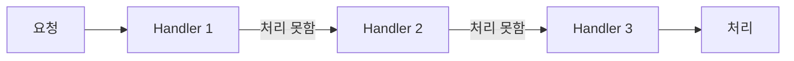

- 책임 연쇄는 요청을 처리할 수 있는 객체를 만날 때까지 다음 객체로 넘기는 패턴이다.
- 각 처리 객체는 자신이 처리할 수 있으면 처리하고, 아니면 다음 처리자에게 넘긴다.
- 예시는 다음과 같다.
  - 고객 문의가 상담원, 팀장, 관리자 순으로 넘어감
  - 승인 요청이 금액에 따라 대리, 과장, 부장에게 전달됨
  - 웹 요청이 인증 필터, 권한 필터, 로깅 필터를 순서대로 통과함
- 시험 단서는 `처리하지 못하면 다음 객체로 넘김`이다.

### 6.2 커맨드(Command)

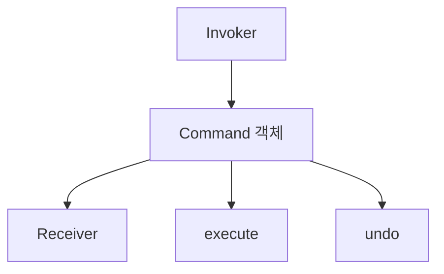

- 커맨드는 요청을 객체로 캡슐화하는 패턴이다.
- 요청에 필요한 정보를 저장해 재이용하거나 취소할 수 있게 한다.
- 예시는 다음과 같다.
  - 문서 편집기의 실행 취소/다시 실행
  - 버튼 클릭 명령을 객체로 저장
  - 작업 큐에 명령을 넣고 나중에 실행
  - 매크로 기록
- 시험 단서는 `요청 정보 저장`, `취소`, `재이용`, `명령 객체`이다.

---

## 7. 탐색/해석 계열

### 7.1 인터프리터(Interpreter)

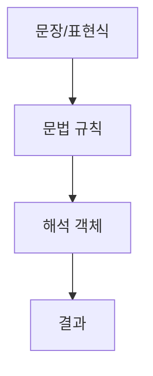

- 인터프리터는 특정 언어의 문법 표현을 정의하고 해석하는 패턴이다.
- 간단한 규칙 언어, 수식 해석, 검색 조건 해석 등에 적용할 수 있다.
- 문법의 각 규칙을 클래스로 표현하고, 문장을 해석하여 결과를 얻는다.
- 시험 단서는 `언어`, `문법 표현`, `해석`이다.

### 7.2 반복자(Iterator)

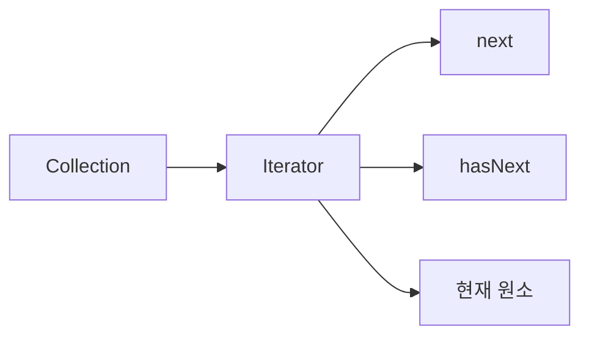

- 반복자는 접근이 잦은 객체에 대해 동일한 인터페이스를 사용하도록 하는 패턴이다.
- 컬렉션 내부 구조를 노출하지 않고 원소를 순차적으로 접근한다.
- 리스트, 스택, 트리처럼 내부 구조가 달라도 같은 방식으로 순회할 수 있게 한다.
- 시험 단서는 `동일한 인터페이스`, `접근`, `순회`, `내부 구조 숨김`이다.

---

## 8. 상호작용 계열

### 8.1 중재자(Mediator)

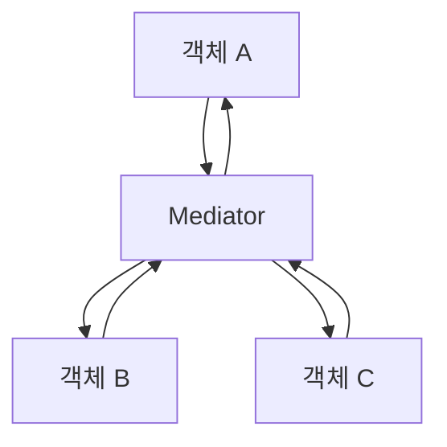

- 중재자는 복잡한 상호작용을 캡슐화하여 중재 객체로 정의하는 패턴이다.
- 객체들이 서로 직접 모두 연결되면 의존 관계가 복잡해진다.
- 중재자를 두면 객체들은 중재자와만 통신하고, 중재자가 상호작용을 조정한다.
- 예시는 다음과 같다.
  - 채팅방이 사용자 간 메시지를 중재
  - UI 대화상자에서 여러 입력 요소 간 상호작용을 중재
  - 항공 관제탑이 비행기 간 직접 통신 대신 조정
- 시험 단서는 `복잡한 상호 작용 캡슐화`, `중재 객체`이다.

### 8.2 옵서버(Observer)

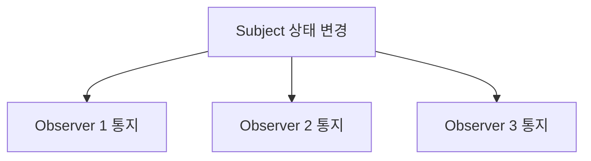

- 옵서버는 객체의 상태 변화를 관련 객체들에게 전달하는 패턴이다.
- 관찰 대상의 상태가 바뀌면 등록된 관찰자들이 통지를 받는다.
- 예시는 다음과 같다.
  - 뉴스 구독자에게 새 기사 알림
  - 모델 변경 시 여러 화면 자동 갱신
  - 이벤트 발생 시 리스너 호출
- 시험 단서는 `상태 변화 전달`, `통지`, `구독`, `일대다 의존`이다.

---

## 9. 상태/알고리즘 계열

### 9.1 메멘토(Memento)

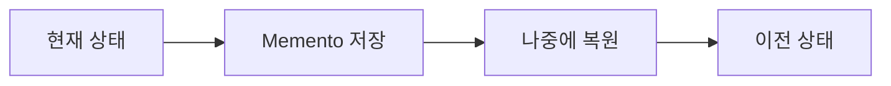

- 메멘토는 객체를 특정 시점의 상태로 되돌릴 수 있는 기능을 제공한다.
- 내부 구현을 직접 노출하지 않고 상태 스냅샷을 저장한다.
- 되돌리기 기능에 자주 사용된다.
- 예시는 다음과 같다.
  - 문서 편집기 Ctrl+Z
  - 게임 저장 지점
  - 설정 변경 전 상태 저장
- 시험 단서는 `되돌리기`, `이전 상태`, `복원`, `시점의 상태`이다.

### 9.2 상태(State)

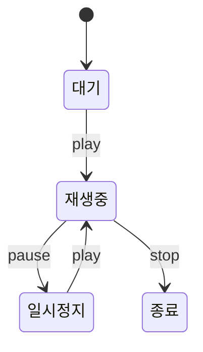

- 상태 패턴은 객체의 상태에 따라 동일한 동작을 다르게 처리해야 할 때 사용한다.
- 객체 내부 상태가 바뀌면 같은 메서드 호출도 다른 결과를 낼 수 있다.
- 예시는 다음과 같다.
  - 미디어 플레이어의 `play()`가 대기, 재생 중, 일시정지 상태에서 다르게 동작
  - 주문 객체가 접수, 결제 완료, 배송 중, 취소 상태에 따라 다르게 처리
- 시험 단서는 `상태에 따라 동일 동작을 다르게 처리`이다.

### 9.3 전략(Strategy)

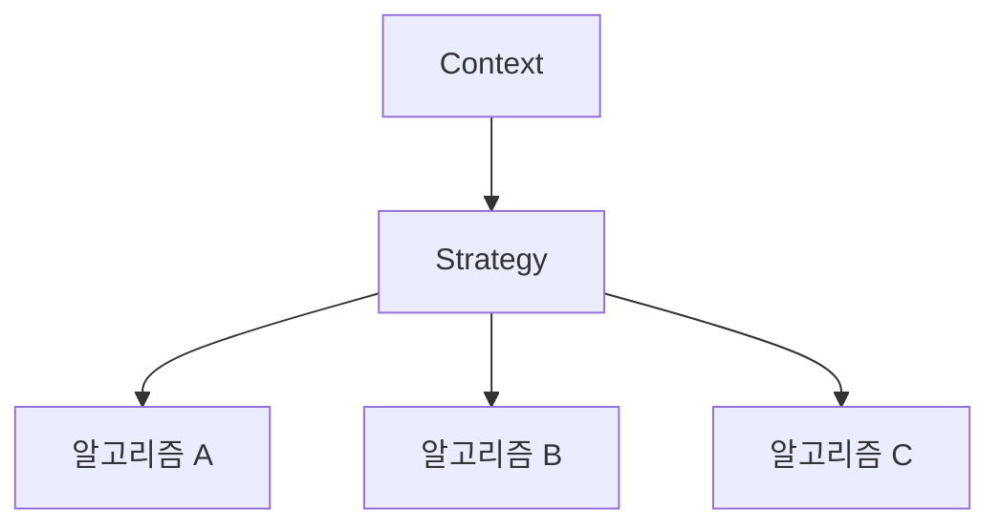

- 전략 패턴은 동일한 계열의 알고리즘들을 상호 교환할 수 있게 정의한다.
- 알고리즘을 각각의 전략 클래스로 분리하고, 필요에 따라 교체한다.
- 예시는 다음과 같다.
  - 정렬 알고리즘을 퀵 정렬, 병합 정렬, 버블 정렬로 교체
  - 할인 정책을 정액 할인, 정률 할인, 쿠폰 할인으로 교체
  - 결제 수수료 계산 방식을 상황에 따라 교체
- 시험 단서는 `알고리즘 상호 교환`, `동일한 계열의 알고리즘`이다.

### 9.4 템플릿 메소드(Template Method)

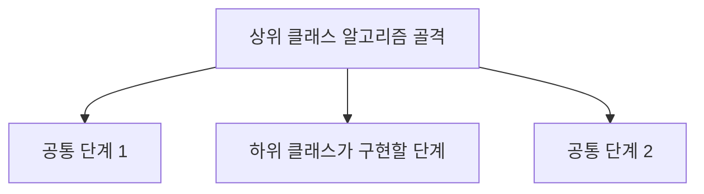

- 템플릿 메소드는 알고리즘의 전체 흐름은 상위 클래스에 정의하고, 일부 세부 처리는 하위 클래스에서 구체화한다.
- PDF 표현은 `하위 클래스에서 세부 처리를 구체화`이다.
- 예시는 다음과 같다.
  - 데이터 처리 흐름은 같지만 파일, DB, API 입력 방식만 하위 클래스에서 다르게 구현
  - 게임 진행 흐름은 같고 캐릭터별 세부 행동만 다르게 구현
- 시험 단서는 `하위 클래스`, `세부 처리`, `알고리즘 골격`, `상위 클래스 흐름`이다.

### 9.5 방문자(Visitor)

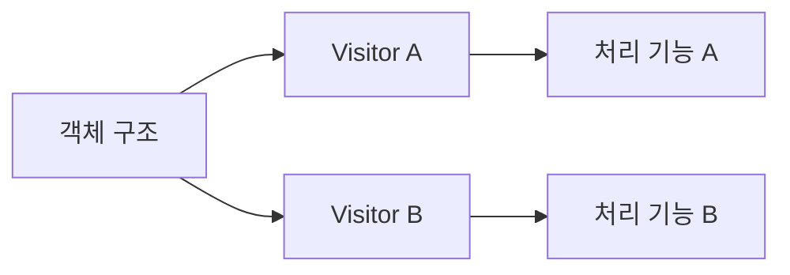

- 방문자는 처리 기능을 분리하여 별도의 클래스로 구성하는 패턴이다.
- 객체 구조를 바꾸지 않고 새로운 연산을 추가하고 싶을 때 사용한다.
- 예시는 다음과 같다.
  - 문서 구조의 각 요소를 방문하며 HTML 출력, PDF 출력, 통계 계산을 각각 수행
  - AST 노드를 방문하며 해석, 타입 검사, 코드 생성을 각각 수행
- 시험 단서는 `처리 기능 분리`, `별도 클래스`, `방문`, `새 연산 추가`이다.

---

## 10. 헷갈리는 쌍 비교

### 10.1 상태 vs 전략

| 구분 | 상태 | 전략 |
|---|---|---|
| 핵심 | 객체 상태에 따라 행동이 바뀜 | 알고리즘을 교체함 |
| 단서 | 상태 변화, 상태별 처리 | 알고리즘 군, 상호 교환 |
| 변경 이유 | 객체 내부 상태 | 선택한 알고리즘 |

- 상태 패턴은 상태가 행동을 결정한다.
- 전략 패턴은 알고리즘을 선택하거나 교체한다.

### 10.2 커맨드 vs 메멘토

| 구분 | 커맨드 | 메멘토 |
|---|---|---|
| 핵심 | 요청을 객체로 저장 | 상태를 저장하고 복원 |
| 단서 | 요청 정보, 실행, 취소, 재이용 | 이전 상태, 되돌리기, 복원 |
| 예시 | 명령 큐, 매크로, undo 명령 | 상태 스냅샷, Ctrl+Z |

- 커맨드는 `요청`이 중심이다.
- 메멘토는 `상태`가 중심이다.

### 10.3 중재자 vs 옵서버

| 구분 | 중재자 | 옵서버 |
|---|---|---|
| 핵심 | 객체 간 상호작용을 중재 | 상태 변화를 여러 객체에 통지 |
| 단서 | 복잡한 상호작용 캡슐화 | 구독, 알림, 상태 변화 전달 |
| 관계 | 객체들이 중재자와 통신 | Subject가 Observer들에게 알림 |

- 중재자는 관계를 중앙에서 조정한다.
- 옵서버는 변화가 생겼을 때 관련 객체에 알린다.

### 10.4 템플릿 메소드 vs 전략

| 구분 | 템플릿 메소드 | 전략 |
|---|---|---|
| 핵심 | 상위 클래스 알고리즘 골격, 하위 클래스 세부 구현 | 알고리즘을 객체로 분리해 교체 |
| 구현 느낌 | 상속 기반 | 합성 기반 |
| 단서 | 하위 클래스 세부 처리 | 알고리즘 상호 교환 |

---

## 11. 시험 포인트

- 책임 연쇄는 요청을 처리하지 못하면 다음 객체로 넘긴다.
- 커맨드는 요청 정보를 저장해 재이용하거나 취소할 수 있게 한다.
- 인터프리터는 언어의 문법 표현을 정의한다.
- 반복자는 동일한 인터페이스로 접근하거나 순회하게 한다.
- 중재자는 복잡한 상호작용을 캡슐화한다.
- 메멘토는 객체를 해당 시점의 상태로 되돌린다.
- 옵서버는 객체의 상태 변화를 관련 객체들에게 전달한다.
- 상태는 객체 상태에 따라 동일 동작을 다르게 처리한다.
- 전략은 동일 계열 알고리즘을 상호 교환한다.
- 템플릿 메소드는 하위 클래스에서 세부 처리를 구체화한다.
- 방문자는 처리 기능을 분리하여 별도 클래스로 구성한다.

---

## 12. 예시로 판단하기

| 상황 | 패턴 | 이유 |
|---|---|---|
| 승인 요청이 처리 가능한 결재자에게 차례로 전달됨 | 책임 연쇄 | 다음 객체로 넘김 |
| 버튼 클릭 요청을 객체로 저장해 나중에 실행/취소 | 커맨드 | 요청 정보 저장 |
| 간단한 수식 언어의 문법을 객체로 표현 | 인터프리터 | 문법 표현 |
| 리스트와 트리를 같은 방식으로 순회 | 반복자 | 동일 인터페이스 접근 |
| UI 구성요소 간 복잡한 상호작용을 대화상자가 조정 | 중재자 | 상호작용 캡슐화 |
| 문서 편집기에서 이전 상태로 되돌림 | 메멘토 | 상태 복원 |
| 모델 변경 시 여러 화면에 알림 | 옵서버 | 상태 변화 통지 |
| 주문 상태에 따라 취소 처리 방식이 달라짐 | 상태 | 상태별 동작 |
| 할인 알고리즘을 정액/정률/쿠폰으로 교체 | 전략 | 알고리즘 교환 |
| 전체 처리 흐름은 고정하고 일부 단계만 하위 클래스가 구현 | 템플릿 메소드 | 세부 처리 구체화 |
| 객체 구조를 유지한 채 출력/검증/통계 기능을 별도 클래스로 추가 | 방문자 | 처리 기능 분리 |

---

## 13. 암기 포인트

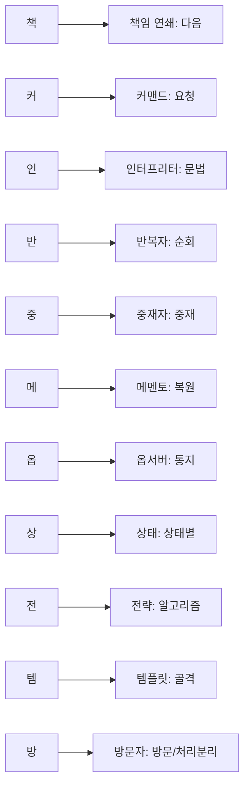

- 암기어: `책커인반중메옵상전템방`
- 단서 암기:
  - 책임 연쇄 = 다음 객체
  - 커맨드 = 요청 저장
  - 인터프리터 = 문법
  - 반복자 = 순회
  - 중재자 = 중재
  - 메멘토 = 되돌리기
  - 옵서버 = 통지
  - 상태 = 상태별 동작
  - 전략 = 알고리즘 교환
  - 템플릿 메소드 = 골격과 세부 처리
  - 방문자 = 처리 기능 분리

---

## 14. 빠른 복습

- 행위 패턴은 객체 간 책임 분배와 상호작용을 다룬다.
- 책임 연쇄는 다음 객체로 요청을 넘긴다.
- 커맨드는 요청 정보를 객체로 저장한다.
- 인터프리터는 문법 표현을 정의한다.
- 반복자는 동일 인터페이스로 객체를 접근/순회한다.
- 중재자는 복잡한 상호작용을 캡슐화한다.
- 메멘토는 이전 상태로 복원한다.
- 옵서버는 상태 변화를 전달한다.
- 상태는 상태에 따라 동작을 바꾼다.
- 전략은 알고리즘을 교환한다.
- 템플릿 메소드는 하위 클래스가 세부 처리를 구체화한다.
- 방문자는 처리 기능을 별도 클래스로 분리한다.

---

## 15. 참고 링크

- 기준 PDF: `/Users/nes0903/Documents/study/정보처리기사/핵심요약집_2026_정보처리기사필기핵심요약.pdf`
- [Q-Net - 정보처리기사 종목 정보](https://www.q-net.or.kr/crf005.do?id=crf00503&jmCd=1320)
- [Refactoring.Guru - Behavioral Design Patterns](https://refactoring.guru/design-patterns/behavioral-patterns)
- [GoFPattern - Behavioral Design Patterns](https://www.gofpattern.com/behavioral/index.php)
- [O'Reilly - Design Patterns: Elements of Reusable Object-Oriented Software](https://www.oreilly.com/library/view/design-patterns-elements/0201633612/)

<!-- study-links:start -->
## 관련 문서

- `디자인 패턴`: [[정보처리기사/1과목 소프트웨어 설계/049 디자인 패턴(Design Pattern)/049 디자인 패턴(Design Pattern)|049 디자인 패턴(Design Pattern)]]
- `생성 패턴`: [[정보처리기사/1과목 소프트웨어 설계/050 생성 패턴(Creational Pattern)/050 생성 패턴(Creational Pattern)|050 생성 패턴(Creational Pattern)]]
- `구조 패턴`: [[정보처리기사/1과목 소프트웨어 설계/051 구조 패턴(Structural Pattern)/051 구조 패턴(Structural Pattern)|051 구조 패턴(Structural Pattern)]]
- `버블 정렬`: [[정보처리기사/2과목 소프트웨어 개발/068 버블 정렬(Bubble Sort)/068 버블 정렬(Bubble Sort)|068 버블 정렬(Bubble Sort)]]
- `캡슐화`: [[정보처리기사/1과목 소프트웨어 설계/033 캡슐화(Encapsulation)/033 캡슐화(Encapsulation)|033 캡슐화(Encapsulation)]]
- `상속`: [[정보처리기사/1과목 소프트웨어 설계/034 상속(Inheritance)/034 상속(Inheritance)|034 상속(Inheritance)]]
- `스택`: [[정보처리기사/2과목 소프트웨어 개발/057 스택(Stack)/057 스택(Stack)|057 스택(Stack)]]
<!-- study-links:end -->
