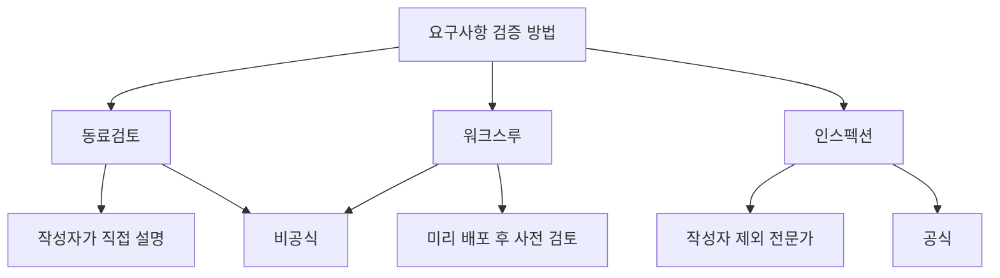
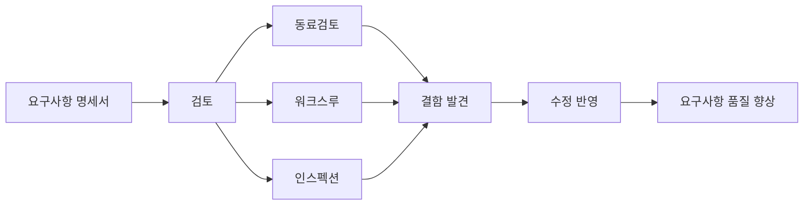
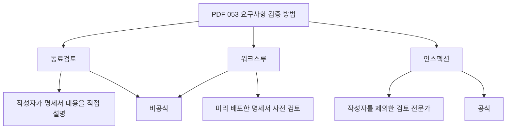
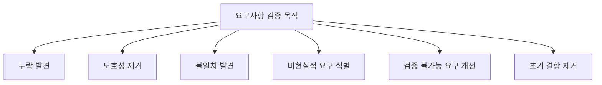
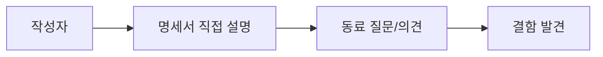
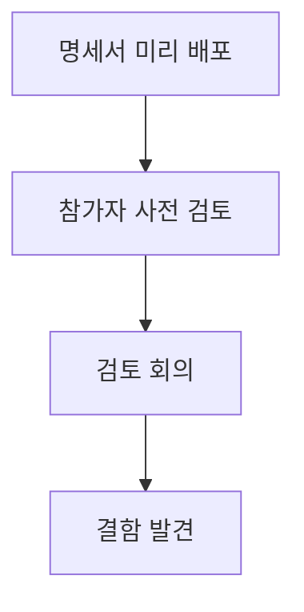
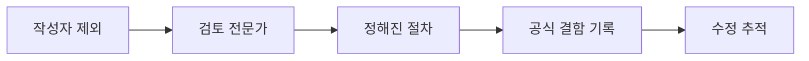
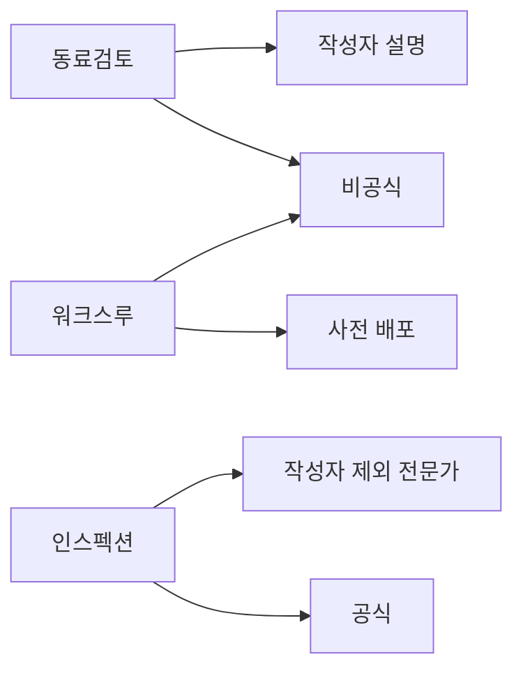

# 053 요구사항 검증 방법

작성 기준일: 2026-05-02
검색/보강일: 2026-06-01
과목: `1과목 소프트웨어 설계`
기준 PDF: `/Users/nes0903/Documents/study/정보처리기사/핵심요약집_2026_정보처리기사필기핵심요약.pdf`
PDF 확인 위치: `8페이지`
주제별 검색 키워드: `requirements validation peer review walkthrough inspection`, `software peer review walkthrough inspection formal informal`, `requirements review inspection NASA`

---

## 1. 한 줄 요약

- 요구사항 검증은 요구사항 명세서가 정확하고 완전하며 일관적인지 확인해 결함을 조기에 발견하는 활동이다.
- PDF 기준 검증 방법은 `동료검토`, `워크스루`, `인스펙션`이다.
- 시험 핵심은 `동료검토/워크스루=비공식 검토`, `인스펙션=공식 검토`와 각 방법의 단서어이다.

---

## 2. 한눈에 보는 구조

- 요구사항 결함은 설계와 구현 이후에 발견될수록 수정 비용이 커진다.
- 검토는 실행 가능한 프로그램이 없어도 문서 수준에서 결함을 찾는 정적 검증 활동이다.
- 요구사항 검토에서 찾는 결함은 누락, 모호성, 모순, 비현실성, 검증 불가능성 등이 있다.
- 요구사항 검증 방법은 사람 중심의 검토 기법이므로 참여자 역할과 절차가 중요하다.

---

## 3. PDF 기준 핵심

- `동료검토(Peer Review)`
  - 작성자가 명세서 내용을 직접 설명하면서 결함을 발견한다.
- `워크스루(Walk Through)`
  - 미리 배포한 명세서를 사전 검토한 후 결함을 발견한다.
- `인스펙션(Inspection)`
  - 작성자를 제외한 다른 검토 전문가들이 결함을 발견한다.
- 동료검토와 워크스루가 비공식적인 검토 방법인데 반해 인스펙션은 공식적인 검토 방법이다.

- 위 네 줄이 기준 PDF에서 직접 확인되는 시험용 골격이다.
- `작성자 설명`, `미리 배포`, `작성자 제외 전문가`, `비공식/공식` 단서가 가장 중요하다.

---

## 4. 검색으로 보강한 관점

- NASA 소프트웨어 공학 핸드북은 요구사항, 설계, 코드, 테스트 계획 같은 산출물에 대해 peer review와 inspection을 수행해 결함을 조기에 발견하고 위험을 줄인다고 설명한다.
- NASA 요구사항 검증 자료는 요구사항 검증에서 체크리스트와 문서화된 절차를 활용해 일관성을 확보할 수 있다고 설명한다.
- 소프트웨어 리뷰 자료에서 walkthrough는 작성자가 산출물을 설명하며 참가자가 질문과 의견을 제시하는 검토로 설명된다.
- inspection은 역할, 절차, 준비, 기록이 있는 더 공식적인 검토로 설명된다.
- 시험에서는 세부 프로세스보다 PDF의 공식/비공식 구분과 각 방법의 주체를 우선한다.

---

## 5. 요구사항 검증의 목적

- 요구사항 검증은 요구사항이 올바르게 작성되었는지 확인한다.
- 요구사항 명세서가 잘못되면 이후 설계, 구현, 테스트가 모두 잘못된 방향으로 갈 수 있다.
- 검토에서 확인하는 대표 항목은 다음과 같다.
  - 요구사항이 누락되지 않았는가
  - 표현이 모호하지 않은가
  - 서로 모순되는 요구사항이 없는가
  - 실제 구현 가능한가
  - 테스트하거나 검증할 수 있는가
  - 이해관계자 요구와 일치하는가
  - 표준과 규칙을 만족하는가
- 요구사항 검증은 테스트와 다르다. 테스트는 구현된 소프트웨어를 실행해 확인하지만, 요구사항 검증은 문서와 명세를 검토해 결함을 찾는다.

---

## 6. 동료검토(Peer Review)

- 동료검토는 작성자가 명세서 내용을 직접 설명하면서 결함을 발견하는 방법이다.
- 같은 팀 또는 관련 분야의 동료가 검토에 참여한다.
- 작성자가 자신의 의도를 설명하는 과정에서 누락이나 모순을 스스로 발견할 수도 있다.
- 동료는 작성자의 설명을 듣고 질문을 던져 모호하거나 잘못된 부분을 찾는다.
- PDF 기준으로 동료검토는 비공식적인 검토 방법에 속한다.

### 시험 단서

- 작성자가 직접 설명
- 동료가 검토
- 비공식 검토
- 설명하면서 결함 발견

---

## 7. 워크스루(Walk Through)

- 워크스루는 미리 배포한 명세서를 사전 검토한 후 결함을 발견하는 방법이다.
- 참가자들이 회의 전에 문서를 읽고 질문이나 문제점을 준비한다.
- 회의에서는 작성자 또는 진행자가 명세서를 따라가며 내용을 설명하고, 참가자들이 의견을 제시한다.
- 동료검토보다 준비 과정이 명확하지만, PDF 기준으로는 여전히 비공식적인 검토 방법이다.
- `미리 배포`, `사전 검토`, `검토 후 회의`가 핵심 단서이다.

### 시험 단서

- 미리 배포한 명세서
- 사전 검토
- walkthrough
- 비공식 검토
- 회의에서 결함 논의

---

## 8. 인스펙션(Inspection)

- 인스펙션은 작성자를 제외한 다른 검토 전문가들이 결함을 발견하는 공식 검토 방법이다.
- 일반적으로 역할, 절차, 체크리스트, 기록, 결함 추적이 더 명확하다.
- 검토자는 요구사항 문서를 독립적으로 살펴보고 결함을 찾아낸다.
- 작성자가 검토를 주도하지 않기 때문에 더 객관적인 결함 발견을 기대할 수 있다.
- PDF 기준으로 인스펙션은 공식적인 검토 방법이다.

### 시험 단서

- 작성자를 제외
- 검토 전문가
- 공식 검토
- 정해진 절차
- 체크리스트
- 결함 기록

---

## 9. 세 방법 비교

| 방법 | 핵심 설명 | 공식성 | 주요 단서 | 시험 구분 포인트 |
|---|---|---|---|---|
| 동료검토 | 작성자가 명세서 내용을 직접 설명하면서 결함 발견 | 비공식 | 작성자 설명, 동료 | 작성자가 직접 설명 |
| 워크스루 | 미리 배포한 명세서를 사전 검토한 후 결함 발견 | 비공식 | 미리 배포, 사전 검토 | 회의 전 문서 검토 |
| 인스펙션 | 작성자를 제외한 검토 전문가들이 결함 발견 | 공식 | 작성자 제외, 전문가, 공식 | 공식 절차와 전문가 검토 |

- 가장 단순한 구분은 다음과 같다.
  - 동료검토: 작성자 설명
  - 워크스루: 사전 배포
  - 인스펙션: 작성자 제외 전문가
- 공식성 구분은 다음과 같다.
  - 비공식: 동료검토, 워크스루
  - 공식: 인스펙션

---

## 10. 검토에서 찾는 요구사항 결함

| 결함 유형 | 설명 | 예시 |
|---|---|---|
| 누락 | 필요한 요구사항이 빠짐 | 환불 정책은 있는데 취소 정책 없음 |
| 모호성 | 여러 의미로 해석 가능 | 빠르게 처리해야 한다 |
| 불일치 | 요구사항끼리 서로 충돌 | 비밀번호 8자 이상 vs 6자 이상 |
| 비현실성 | 일정/기술/비용상 구현 어려움 | 모든 요청을 0ms로 처리 |
| 검증 불가능 | 테스트 기준이 없음 | 사용자가 만족할 만큼 편리해야 한다 |
| 중복 | 같은 요구가 여러 곳에 반복 | 같은 기능 설명이 두 절에서 다르게 표현 |
| 추적성 부족 | 출처와 연결이 불명확 | 어떤 이해관계자 요구인지 모름 |

- 요구사항 검증은 이런 결함을 구현 전에 찾기 위한 활동이다.
- 시험에서 요구사항 검증의 목적을 물으면 `정확성`, `완전성`, `일관성`, `명확성`, `검증 가능성`을 함께 떠올린다.

---

## 11. 검증과 확인의 구분

| 구분 | 핵심 질문 | 요구사항 검토와의 관계 |
|---|---|---|
| Verification | 명세대로 만들고 있는가 | 요구사항 문서가 기준과 규칙에 맞는지 확인 |
| Validation | 사용자가 원하는 것이 맞는가 | 요구사항이 실제 필요와 문제 해결에 맞는지 확인 |
| Review | 사람이 산출물을 읽고 결함을 찾음 | 동료검토, 워크스루, 인스펙션 |
| Test | 실행 결과로 결함을 찾음 | 구현 이후 동적 확인 |

- 정보처리기사의 이 챕터는 요구사항 검증 방법으로 세 가지 검토 기법을 다룬다.
- `검토`는 실행하지 않고 문서나 산출물을 확인하는 정적 활동이다.
- `테스트`는 구현물을 실행해 확인하는 동적 활동이다.

---

## 12. 시험 포인트

- 요구사항 검증 방법은 동료검토, 워크스루, 인스펙션이다.
- 동료검토는 작성자가 명세서 내용을 직접 설명하면서 결함을 발견한다.
- 워크스루는 미리 배포한 명세서를 사전 검토한 후 결함을 발견한다.
- 인스펙션은 작성자를 제외한 다른 검토 전문가들이 결함을 발견한다.
- 동료검토와 워크스루는 비공식 검토 방법이다.
- 인스펙션은 공식 검토 방법이다.
- 요구사항 검토는 누락, 모호성, 불일치, 검증 불가능성을 찾는다.
- 테스트와 달리 요구사항 검토는 문서 수준의 정적 검토이다.

---

## 13. 헷갈리는 비교

| 헷갈리는 쌍 | 구분 기준 |
|---|---|
| 동료검토 vs 워크스루 | 작성자가 직접 설명하는 데 초점이면 동료검토, 사전 배포/사전 검토가 강조되면 워크스루 |
| 워크스루 vs 인스펙션 | 워크스루는 비공식, 인스펙션은 공식 |
| 동료검토 vs 인스펙션 | 동료검토는 작성자 설명, 인스펙션은 작성자를 제외한 전문가 |
| 검토 vs 테스트 | 검토는 문서/산출물 정적 확인, 테스트는 실행 확인 |
| 공식 검토 vs 비공식 검토 | 역할/절차/기록이 엄격하면 공식 |

- `미리 배포`라는 단어가 나오면 워크스루를 먼저 본다.
- `작성자 제외`라는 단어가 나오면 인스펙션을 먼저 본다.
- `작성자가 직접 설명`이라는 단어가 나오면 동료검토를 먼저 본다.

---

## 14. 예시로 판단하기

| 상황 | 방법 | 이유 |
|---|---|---|
| 요구사항 작성자가 회의에서 문서를 설명하고 동료가 질문 | 동료검토 | 작성자가 직접 설명 |
| 회의 전에 명세서를 배포하고 참가자가 읽어 온 뒤 문제를 논의 | 워크스루 | 사전 배포와 사전 검토 |
| 작성자를 제외한 검토 전문가들이 체크리스트로 결함을 기록 | 인스펙션 | 공식 검토와 전문가 |
| 구현된 기능을 실행해 요구사항 만족 여부를 확인 | 테스트 | 동적 확인 |
| 요구사항 간 모순을 문서 검토로 찾음 | 요구사항 검증 | 정적 검토 |

---

## 15. 암기 포인트

- 암기 문장: `동료는 작성자 설명, 워크는 사전 배포, 인스펙션은 작성자 제외 전문가`
- 공식성 암기:
  - 비공식: 동료검토, 워크스루
  - 공식: 인스펙션
- 결함 암기:
  - 누락
  - 모호성
  - 불일치
  - 검증 불가능성
  - 비현실성

---

## 16. 빠른 복습

- 요구사항 검증 방법은 동료검토, 워크스루, 인스펙션이다.
- 동료검토는 작성자가 명세서 내용을 직접 설명하면서 결함을 발견한다.
- 워크스루는 미리 배포한 명세서를 사전 검토한 뒤 결함을 발견한다.
- 인스펙션은 작성자를 제외한 검토 전문가들이 결함을 발견한다.
- 동료검토와 워크스루는 비공식 검토이다.
- 인스펙션은 공식 검토이다.
- 요구사항 검증은 구현 전에 문서 수준의 결함을 줄이는 활동이다.

---

## 17. 참고 링크

- 기준 PDF: `/Users/nes0903/Documents/study/정보처리기사/핵심요약집_2026_정보처리기사필기핵심요약.pdf`
- [Q-Net - 정보처리기사 종목 정보](https://www.q-net.or.kr/crf005.do?id=crf00503&jmCd=1320)
- [NASA SWE-055 - Requirements Validation](https://swehb.nasa.gov/spaces/7150/pages/16449673/SWE-055%2B-%2BRequirements%2BValidation)
- [NASA SWE-087 - Software Peer Reviews and Inspections](https://swehb.nasa.gov/spaces/SWEHBVC/pages/50888942/SWE-087%2B-%2BSoftware%2BPeer%2BReviews%2Band%2BInspections%2Bfor%2BRequirements%2BPlans%2BDesign%2BCode%2Band%2BTest%2BProcedures)
- [Software Engineering 10th edition companion - Requirements Reviews](https://software-engineering-book.com/web/requirements-reviews/)
- [Johanna Rothman - Definitions of Peer Review, Walkthrough, Inspection](https://www.jrothman.com/mpd/2004/11/definitions-of-peer-review-walkthrough-inspection/)
