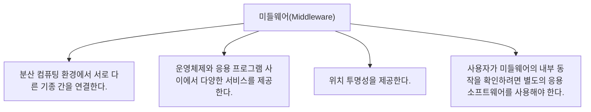

# 054 미들웨어(Middleware)

작성 기준일: 2026-05-02  
과목: `1과목 소프트웨어 설계`  
기준 PDF: `/Users/nes0903/Documents/study/정보처리기사/핵심요약집_2026_정보처리기사필기핵심요약.pdf`  
PDF 확인 위치: `8페이지`  
검색 보강: 공식/표준/고품질 참고 자료를 함께 확인하여 시험 중심으로 확장 정리

---

## 1. 한 줄 요약

- 미들웨어는 운영체제와 응용 프로그램 사이, 또는 분산 시스템의 서로 다른 구성요소 사이에서 통신과 공통 서비스를 제공하는 소프트웨어 계층이다.
- 이 챕터는 `미들웨어` 영역에 속한다.
- 시험에서는 정의, 핵심 키워드, 비슷한 개념과의 구분을 함께 묻는 경우가 많다.

---

## 2. PDF 기준 핵심

- 분산 컴퓨팅 환경에서 서로 다른 기종 간을 연결한다.
- 운영체제와 응용 프로그램 사이에서 다양한 서비스를 제공한다.
- 위치 투명성을 제공한다.
- 사용자가 미들웨어의 내부 동작을 확인하려면 별도의 응용 소프트웨어를 사용해야 한다.

- 위 항목은 PDF에서 직접 확인한 최소 암기 골격이다.
- 세부 설명은 이 골격을 기준으로 확장해서 이해하면 된다.

---

## 3. 개념 설명

- 미들웨어는 서로 다른 시스템을 연결하는 소프트웨어 접착제처럼 동작한다.
- 통신, 메시징, 트랜잭션, 인증, 데이터 접근, API 연결 같은 공통 기능을 제공한다.
- 위치 투명성은 사용자가 서비스가 실제 어디에 있는지 몰라도 사용할 수 있게 하는 성질이다.
- 미들웨어는 분산 환경의 이질성을 감추고 응용 간 연결을 쉽게 만드는 중간 계층이다.
- 종류 문제는 약어 풀이와 담당 역할을 함께 외워야 한다.

---

## 4. 핵심 포인트

- 문제를 풀 때는 먼저 지문 속 단서어를 찾고, 그 단서어가 어떤 개념을 가리키는지 연결한다.
- 정의형 문제는 표현이 조금 바뀌어도 핵심 의미가 같으면 같은 개념으로 판단한다.
- 옳고 그름 문제에서는 `항상`, `반드시`, `전혀`, `모두` 같은 극단 표현을 특히 조심한다.
- 이 챕터는 단독 암기보다 인접 챕터와 비교해 기억하면 정답률이 올라간다.

---

## 5. 시험에서 헷갈리는 비교

| 구분 | 핵심 |
|---|---|
| `운영체제` | 하드웨어 자원 관리 |
| `미들웨어` | 응용 간 연결/통신/공통 서비스 |
| `응용 프로그램` | 사용자 업무 기능 수행 |

- 비교 문제는 이름보다 `역할`, `목적`, `사용 시점`, `장점/단점`을 기준으로 구분하면 안정적이다.

---

## 6. 예시 또는 암기 포인트

- 미들웨어 = `OS와 앱 사이, 시스템과 시스템 사이의 연결 계층`.

- 암기는 단어만 외우기보다 `정의 -> 특징 -> 예시 -> 반대 개념` 순서로 묶는 것이 좋다.

---

## 7. 빠른 복습

- 챕터명: `054 미들웨어(Middleware)`
- 소속 영역: `미들웨어`
- 자주 나오는 문제 유형:
  - 정의를 주고 개념명을 고르는 문제
  - 특징을 섞어 놓고 옳은/틀린 설명을 고르는 문제
  - 유사 개념과 비교하여 다른 하나를 찾는 문제

---

## 8. 참고 링크

- 기준 PDF: `/Users/nes0903/Documents/study/정보처리기사/핵심요약집_2026_정보처리기사필기핵심요약.pdf`
- [Q-Net 정보처리기사 종목 페이지](https://www.q-net.or.kr/crf005.do?id=crf00503s02&jmCd=1320&jmInfoDivCcd=B0)
- [IBM - What is Middleware?](https://www.ibm.com/think/topics/middleware)
- [Red Hat - What is middleware?](https://www.redhat.com/en/topics/middleware/what-is-middleware)
- [OMG - CORBA](https://www.omg.org/corba/)
- [OMG - ORB basics](https://www.omg.org/gettingstarted/orb_basics.htm)
