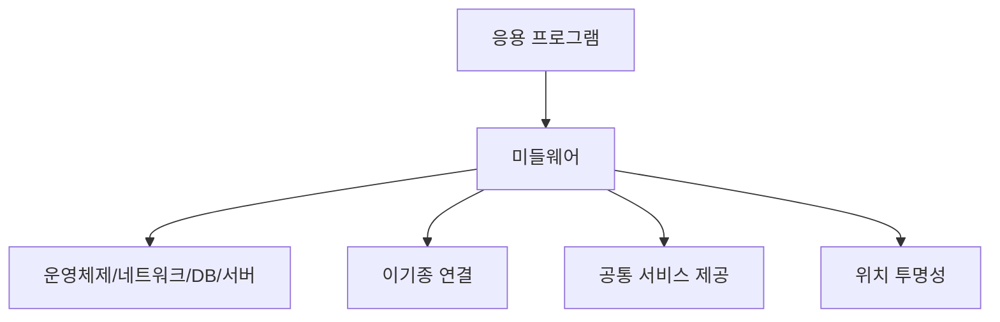
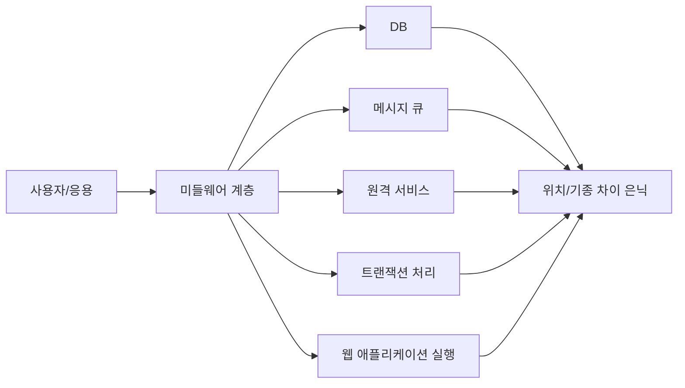
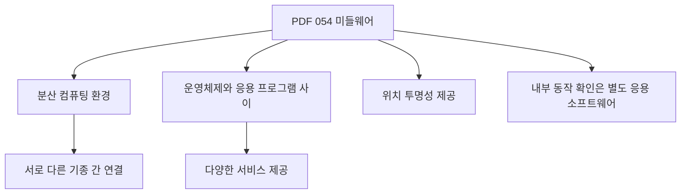
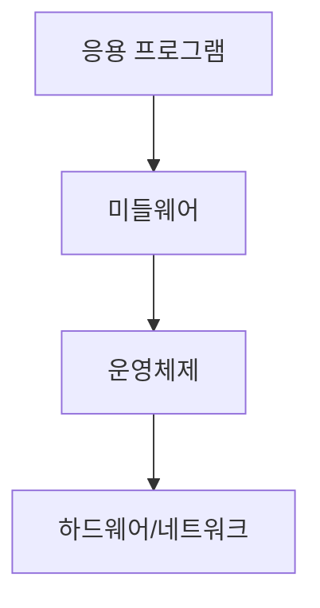
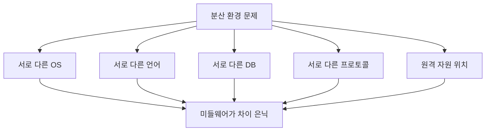
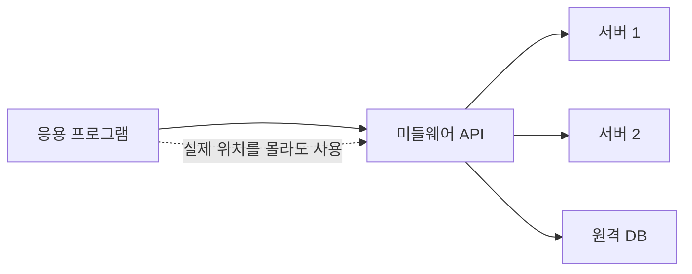
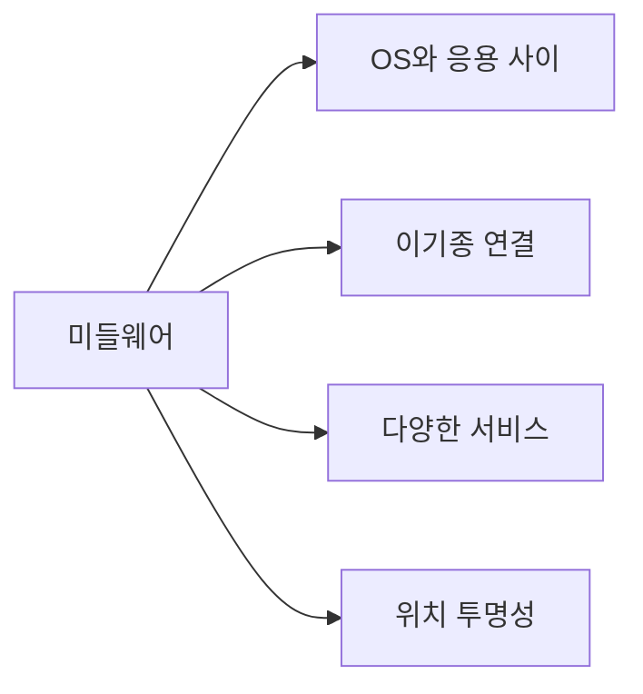

# 054 미들웨어(Middleware)

작성 기준일: 2026-05-02
검색/보강일: 2026-06-01
과목: `1과목 소프트웨어 설계`
기준 PDF: `/Users/nes0903/Documents/study/정보처리기사/핵심요약집_2026_정보처리기사필기핵심요약.pdf`
PDF 확인 위치: `8페이지`
주제별 검색 키워드: `middleware operating system application distributed computing`, `IBM middleware`, `Red Hat middleware`, `location transparency middleware`

---

## 1. 한 줄 요약

- 미들웨어는 운영체제와 응용 프로그램 사이에서 다양한 서비스를 제공하고, 분산 컴퓨팅 환경의 서로 다른 기종을 연결하는 중간 소프트웨어이다.
- PDF 기준 핵심은 `서로 다른 기종 간 연결`, `OS와 응용 프로그램 사이`, `다양한 서비스`, `위치 투명성`이다.
- 시험에서는 미들웨어가 응용 프로그램 자체나 운영체제 자체가 아니라, 그 사이에서 통신과 연결, 트랜잭션, 데이터 접근 같은 공통 기능을 제공한다는 점을 묻는다.

---

## 2. 한눈에 보는 구조

- 미들웨어는 애플리케이션이 하위 시스템의 복잡성을 직접 다루지 않게 해 준다.
- 분산 환경에서는 서버, 데이터베이스, 메시지 큐, 원격 객체, 웹 애플리케이션 서버가 서로 다른 위치와 기종에 존재할 수 있다.
- 미들웨어는 이런 차이를 감추고 응용 프로그램이 일관된 방식으로 서비스를 사용하도록 돕는다.
- 위치 투명성은 자원의 실제 위치를 사용자가 직접 알지 않아도 사용할 수 있게 하는 성질이다.

---

## 3. PDF 기준 핵심

- 분산 컴퓨팅 환경에서 서로 다른 기종 간을 연결한다.
- 운영체제와 응용 프로그램 사이에서 다양한 서비스를 제공한다.
- 위치 투명성을 제공한다.
- 사용자가 미들웨어의 내부 동작을 확인하려면 별도의 응용 소프트웨어를 사용해야 한다.

- 위 네 문장이 기준 PDF에서 직접 확인되는 시험용 골격이다.
- `분산`, `서로 다른 기종`, `운영체제와 응용 사이`, `위치 투명성`은 미들웨어를 고르는 대표 단서이다.
- `내부 동작 확인에는 별도 응용 소프트웨어가 필요`하다는 문장도 PDF에 있는 특징으로 기억한다.

---

## 4. 검색으로 보강한 관점

- IBM은 미들웨어를 분산 네트워크에서 애플리케이션이나 컴포넌트 사이의 통신과 연결을 가능하게 하는 소프트웨어로 설명한다.
- Red Hat은 미들웨어를 운영체제와 애플리케이션, 데이터, 사용자 사이를 연결하는 소프트웨어 계층으로 설명한다.
- Microsoft Azure 설명에서도 미들웨어는 운영체제와 그 위에서 실행되는 애플리케이션 사이에 위치하며 분산 애플리케이션의 통신과 데이터 관리를 가능하게 한다고 정리한다.
- 공통적으로 미들웨어는 `소프트웨어 접착제`, `중간 계층`, `연결 계층`, `통신과 데이터 관리 지원`이라는 관점으로 설명된다.
- 정보처리기사에서는 실무 제품명보다 PDF의 위치와 역할, 그리고 055의 종류를 연결해 외우는 것이 중요하다.

---

## 5. 미들웨어의 위치

- 미들웨어는 운영체제와 응용 프로그램 사이에 위치한다.
- 운영체제는 프로세스, 메모리, 파일, 장치, 네트워크 같은 기본 자원을 관리한다.
- 응용 프로그램은 사용자 업무 기능을 수행한다.
- 미들웨어는 응용 프로그램이 운영체제나 네트워크, 데이터베이스, 다른 서버의 세부 차이를 직접 처리하지 않도록 중간 서비스를 제공한다.
- 예를 들어 애플리케이션은 데이터베이스 위치나 메시지 전송 방식의 세부 사항을 모두 직접 구현하지 않고, 미들웨어가 제공하는 API나 서비스를 사용할 수 있다.

---

## 6. 미들웨어가 필요한 이유

- 현대 시스템은 여러 서버, 여러 데이터베이스, 여러 언어, 여러 운영체제가 함께 동작하는 경우가 많다.
- 각 응용 프로그램이 모든 통신, 보안, 트랜잭션, 데이터 변환, 오류 처리를 직접 구현하면 복잡도가 급격히 커진다.
- 미들웨어는 이런 공통 기능을 제공해 개발자가 업무 로직에 더 집중하게 한다.
- 미들웨어가 제공하는 대표 기능은 다음과 같다.
  - 통신
  - 메시지 전달
  - 원격 호출
  - 데이터베이스 연결
  - 트랜잭션 처리
  - 보안
  - 세션 관리
  - 로깅과 모니터링
  - 부하 분산
  - 데이터 변환

---

## 7. 위치 투명성

- 위치 투명성은 사용자가 자원이나 서비스의 실제 위치를 의식하지 않고 사용할 수 있게 하는 성질이다.
- 예를 들어 데이터베이스가 같은 서버에 있는지, 다른 서버에 있는지, 다른 지역의 데이터센터에 있는지 응용 프로그램이 직접 알 필요가 없게 할 수 있다.
- 원격 객체나 원격 서비스도 로컬 객체처럼 호출하는 형태로 보이게 할 수 있다.
- 시험에서는 `위치 투명성`이 나오면 미들웨어의 대표 특징으로 연결한다.
- 위치 투명성은 분산 시스템의 복잡성을 감추는 핵심 성질이다.

---

## 8. 미들웨어의 주요 서비스

| 서비스 | 설명 | 관련 미들웨어 예 |
|---|---|---|
| 통신 서비스 | 응용 프로그램 사이의 요청과 응답 전달 | RPC, ORB, WAS |
| 메시징 | 비동기 메시지 전달과 큐 관리 | MOM |
| 데이터 접근 | 데이터베이스와 연결하고 질의 수행 | DB 미들웨어 |
| 트랜잭션 처리 | 여러 작업을 하나의 논리 단위로 처리 | TP-Monitor |
| 객체 요청 중개 | 분산 객체 사이의 요청 전달 | ORB |
| 웹 실행 환경 | 웹 애플리케이션 실행과 세션/보안 처리 | WAS |
| 통합과 변환 | 서로 다른 시스템 간 데이터/프로토콜 변환 | EAI/ESB 계열 |

- 055에서 다루는 미들웨어 종류는 위 서비스와 연결해서 외우면 쉽다.
- 미들웨어는 단일 제품 하나를 뜻하기보다, OS와 응용 사이에서 공통 서비스를 제공하는 소프트웨어 계층 전체를 뜻한다.

---

## 9. 055와 연결되는 종류 비교

| 종류 | 중심 역할 | 핵심 단서 | 가장 구분되는 점 |
|---|---|---|---|
| DB 미들웨어 | 응용과 DB 사이 연결 | DB 접속, SQL, 데이터 접근 | 데이터베이스 접근을 쉽게 함 |
| RPC | 원격 프로시저 호출 | 원격 함수를 로컬처럼 호출 | 절차 호출 방식 |
| MOM | 메시지 기반 통신 | 메시지 큐, 비동기 | 송신자와 수신자 시간 분리 |
| TP-Monitor | 트랜잭션 감시/처리 | 트랜잭션, 대량 사용자, 안정성 | 트랜잭션 처리 관리 |
| ORB | 분산 객체 요청 중개 | 객체 요청, CORBA, 분산 객체 | 객체 간 요청을 중개 |
| WAS | 웹 애플리케이션 실행 환경 | 웹, 서블릿, JSP, 세션 | 웹 업무 로직 실행 |

- DB는 데이터 접근, RPC는 원격 절차 호출, MOM은 메시지, TP-Monitor는 트랜잭션, ORB는 객체 요청, WAS는 웹 애플리케이션 실행으로 구분한다.
- 054는 미들웨어의 개념이고, 055는 미들웨어의 종류이다.

---

## 10. 미들웨어와 다른 계층 비교

| 구분 | 핵심 역할 | 시험 단서 |
|---|---|---|
| 하드웨어 | 물리 자원 제공 | CPU, 메모리, 디스크, 네트워크 장비 |
| 운영체제 | 하드웨어 자원과 프로세스 관리 | 프로세스, 파일, 메모리, 장치 |
| 미들웨어 | OS와 응용 사이 공통 서비스 제공 | 이기종 연결, 위치 투명성, 분산 서비스 |
| 응용 프로그램 | 사용자 업무 기능 수행 | 화면, 업무 로직, 사용자 기능 |
| 라이브러리 | 프로그램이 호출하는 재사용 코드 | 함수, API, 패키지 |
| 프레임워크 | 애플리케이션 구조와 실행 흐름 제공 | 제어의 역전, 골격 코드 |

- 미들웨어는 운영체제도 아니고 최종 업무 애플리케이션도 아니다.
- 미들웨어는 응용 프로그램이 하위 환경 차이를 덜 의식하도록 도와주는 중간 계층이다.
- 라이브러리와 미들웨어는 모두 재사용 가능한 기능을 제공할 수 있지만, 미들웨어는 보통 분산 환경의 통신, 데이터, 트랜잭션 같은 공통 인프라 역할이 더 강하다.

---

## 11. 시험 포인트

- 미들웨어는 분산 컴퓨팅 환경에서 서로 다른 기종 간을 연결한다.
- 미들웨어는 운영체제와 응용 프로그램 사이에서 다양한 서비스를 제공한다.
- 미들웨어는 위치 투명성을 제공한다.
- 미들웨어 내부 동작 확인에는 별도의 응용 소프트웨어가 필요할 수 있다.
- 미들웨어는 분산 환경의 통신, 데이터 접근, 메시징, 트랜잭션, 보안, 세션 등을 지원한다.
- DB, RPC, MOM, TP-Monitor, ORB, WAS는 미들웨어 종류로 이어서 암기한다.
- `운영체제와 응용 사이`라는 위치를 놓치지 않는다.

---

## 12. 헷갈리는 비교

| 헷갈리는 쌍 | 구분 기준 |
|---|---|
| 미들웨어 vs 운영체제 | OS는 기본 자원 관리, 미들웨어는 OS 위에서 응용 공통 서비스 제공 |
| 미들웨어 vs 응용 프로그램 | 응용은 업무 기능, 미들웨어는 공통 연결/통신/처리 서비스 |
| 미들웨어 vs 라이브러리 | 라이브러리는 코드 묶음, 미들웨어는 분산 서비스 계층 성격 |
| 미들웨어 vs 프레임워크 | 프레임워크는 앱 구조 제공, 미들웨어는 시스템 간 연결과 실행 지원 |
| 위치 투명성 vs 보안 | 위치 투명성은 위치 은닉, 보안은 접근 통제 |

- `서로 다른 기종 연결`이라는 말이 나오면 미들웨어를 의심한다.
- `운영체제와 응용 프로그램 사이`는 미들웨어의 위치 단서이다.
- `위치 투명성`은 분산 환경에서 미들웨어의 대표 특징이다.

---

## 13. 예시

### 13.1 온라인 쇼핑몰

- 웹 애플리케이션은 WAS 위에서 실행된다.
- 주문 서비스는 DB 미들웨어를 통해 데이터베이스에 접근한다.
- 결제 결과는 MOM을 통해 정산 시스템에 비동기 메시지로 전달된다.
- 여러 결제 작업은 TP-Monitor나 트랜잭션 관리 기능으로 안정성을 확보할 수 있다.
- 다른 서버의 재고 서비스는 RPC나 객체 요청 중개 방식으로 호출될 수 있다.
- 이때 애플리케이션은 각 서버의 물리적 위치를 모두 직접 다루지 않아도 된다.

### 13.2 은행 시스템

- 창구, ATM, 모바일 앱이 서로 다른 환경에서 동작한다.
- 미들웨어는 이기종 시스템 사이의 데이터 전달과 트랜잭션 처리를 지원한다.
- 고객은 거래가 어느 서버에서 처리되는지 알 필요 없이 서비스를 이용한다.
- 이는 위치 투명성과 분산 환경 연결의 예시이다.

---

## 14. 암기 포인트

- 암기 문장: `미들웨어는 OS와 응용 사이에서 이기종을 연결하고 위치 투명성을 제공한다.`
- 종류 암기: `DB, RPC, MOM, TP, ORB, WAS`
- 역할 암기:
  - DB = 데이터 접근
  - RPC = 원격 절차 호출
  - MOM = 메시지
  - TP = 트랜잭션
  - ORB = 객체 요청
  - WAS = 웹 애플리케이션

---

## 15. 빠른 복습

- 미들웨어는 분산 컴퓨팅 환경에서 서로 다른 기종 간을 연결한다.
- 미들웨어는 운영체제와 응용 프로그램 사이에서 다양한 서비스를 제공한다.
- 미들웨어는 위치 투명성을 제공한다.
- 미들웨어 내부 동작 확인에는 별도의 응용 소프트웨어가 필요할 수 있다.
- 대표 종류는 DB, RPC, MOM, TP-Monitor, ORB, WAS이다.
- 055에서는 각 종류의 역할 차이를 비교한다.

---

## 16. 참고 링크

- 기준 PDF: `/Users/nes0903/Documents/study/정보처리기사/핵심요약집_2026_정보처리기사필기핵심요약.pdf`
- [Q-Net - 정보처리기사 종목 정보](https://www.q-net.or.kr/crf005.do?id=crf00503&jmCd=1320)
- [IBM - What Is Middleware?](https://www.ibm.com/topics/middleware)
- [Red Hat - What is middleware?](https://www.redhat.com/en/topics/middleware/what-is-middleware)
- [Microsoft Azure - What is middleware?](https://azure.microsoft.com/en-gb/overview/what-is-middleware/)
