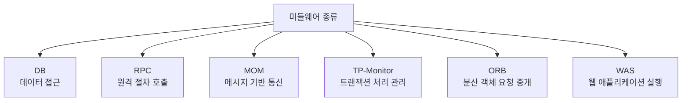
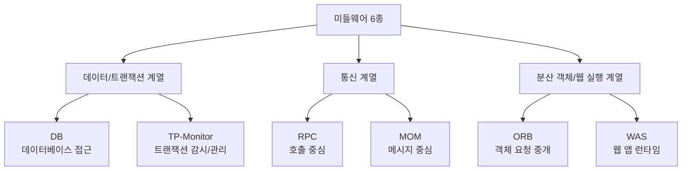
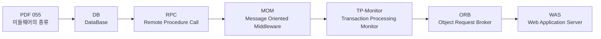
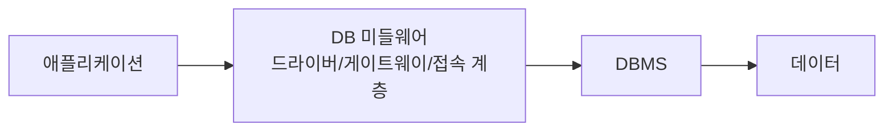
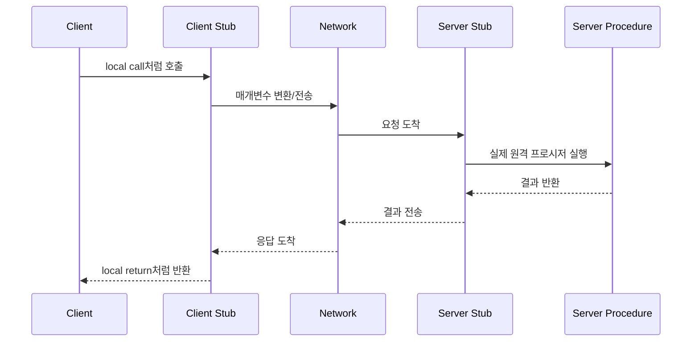
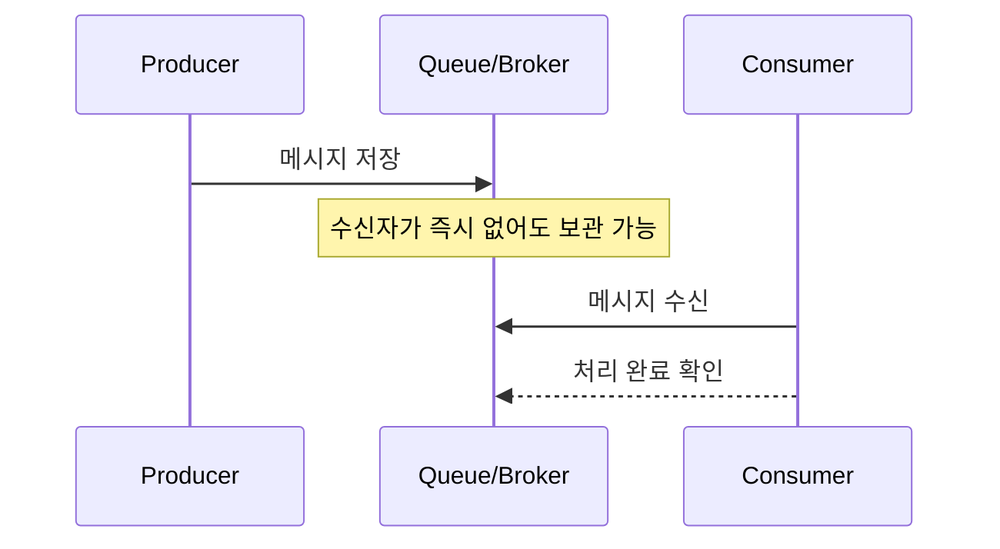
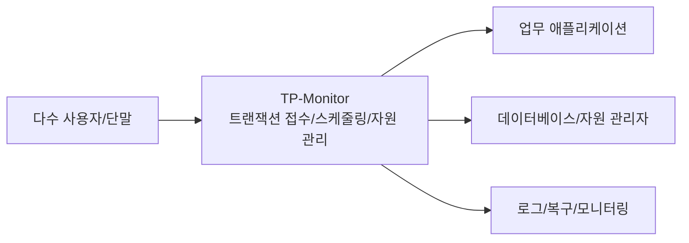
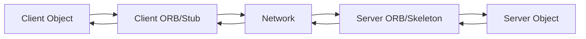
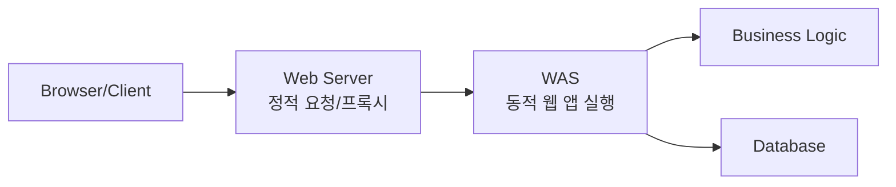
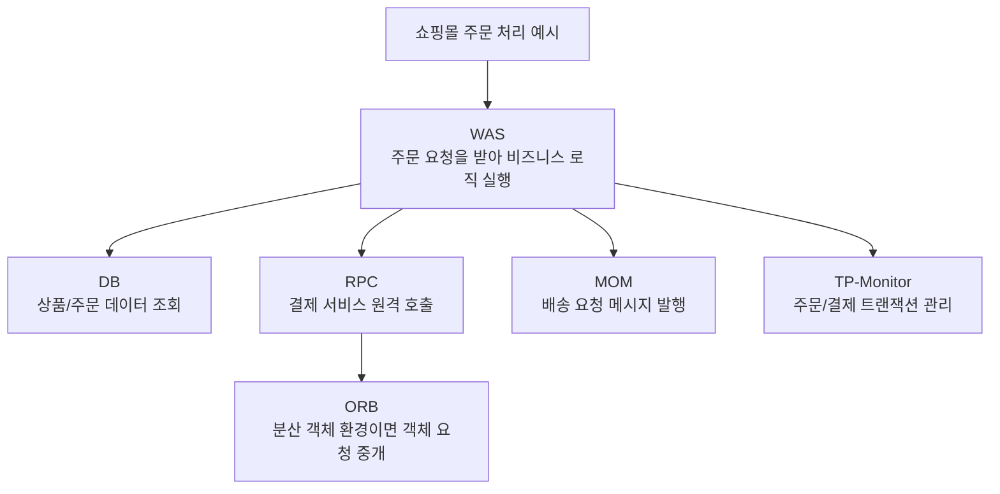

# 055 미들웨어의 종류

작성 기준일: 2026-05-02
검색/보강일: 2026-06-01
과목: `1과목 소프트웨어 설계`
기준 PDF: `/Users/nes0903/Documents/study/정보처리기사/핵심요약집_2026_정보처리기사필기핵심요약.pdf`
PDF 확인 위치: `8페이지`
검색 보강: IBM, Microsoft, OMG, Red Hat의 미들웨어/RPC/MOM/ORB/WAS 설명을 참고하여 시험 구분 중심으로 확장
주제별 검색 키워드: `middleware types DB RPC MOM TP-Monitor ORB WAS`, `Remote Procedure Call middleware`, `Message Oriented Middleware queue`, `Object Request Broker CORBA`, `Web Application Server middleware`

---

## 1. 한 줄 요약

- 미들웨어의 종류는 `DB`, `RPC`, `MOM`, `TP-Monitor`, `ORB`, `WAS`로 정리한다.
- 핵심은 “무엇을 연결하거나 중개하느냐”이다.
- `DB`는 애플리케이션과 데이터베이스, `RPC`는 클라이언트와 원격 프로시저, `MOM`은 송신자와 수신자 메시지, `TP-Monitor`는 대량 트랜잭션, `ORB`는 분산 객체, `WAS`는 웹 요청과 애플리케이션 실행 로직을 연결한다.
- 시험에서는 약어 원어와 역할 단서가 함께 출제되므로 이름만 외우면 헷갈리기 쉽다.

---

## 2. 한눈에 보는 구조

- 데이터 접근이 핵심이면 `DB` 미들웨어를 떠올린다.
- 원격 함수를 로컬 함수처럼 부르는 단서가 있으면 `RPC`를 떠올린다.
- 메시지 큐, 브로커, 비동기 전달 단서가 있으면 `MOM`을 떠올린다.
- 많은 사용자의 업무 트랜잭션, 동시성, 안정성, 자원 관리 단서가 있으면 `TP-Monitor`를 떠올린다.
- CORBA, 분산 객체, 객체 요청 브로커 단서가 있으면 `ORB`를 떠올린다.
- 웹 애플리케이션 실행, 서블릿, 세션, 트랜잭션, 보안, Java EE 같은 단서가 있으면 `WAS`를 떠올린다.

---

## 3. PDF 기준 핵심

- 기준 PDF의 최소 암기 골격은 다음 6개이다.
- `DB(DataBase)`
- `RPC(Remote Procedure Call)`
- `MOM(Message Oriented Middleware)`
- `TP(Transaction Processing)-Monitor`
- `ORB(Object Request Broker)`
- `WAS(Web Application Server)`
- PDF는 종류명을 압축적으로 제시하므로, 시험 대비에서는 약어의 원어와 역할 단서를 붙여 암기해야 한다.
- 웹 자료가 더 넓은 미들웨어 분류를 제시하더라도, 이 챕터에서는 PDF의 6종을 우선순위로 둔다.

---

## 4. 검색으로 보강한 관점

- IBM은 미들웨어를 분산 네트워크에서 애플리케이션이나 컴포넌트 사이의 통신과 연결을 가능하게 하는 소프트웨어 계층으로 설명한다.
- IBM의 미들웨어 분류에도 `MOM`, `RPC`, `Data/Database middleware`, `ORB`, `Transactional middleware`, `Web application server` 성격이 나타난다.
- Microsoft RPC 문서는 RPC가 클라이언트가 원격 서버의 프로시저를 직접 호출하는 것처럼 보이게 하며, 실제로는 스텁과 런타임 라이브러리가 네트워크 전송을 처리한다고 설명한다.
- IBM MQ 문서는 메시징 미들웨어가 서로 독립적이고 동시에 실행되지 않을 수도 있는 애플리케이션 사이의 메시지 전달을 지원한다고 설명한다.
- OMG ORB 자료는 ORB가 분산 컴퓨팅에서 네트워크를 통한 프로그램 호출과 위치 투명성을 제공하고, CORBA에서 클라이언트 객체와 서버 객체 사이의 요청/응답 라우팅을 담당한다고 설명한다.
- IBM WebSphere 자료는 WAS를 엔터프라이즈 Java 애플리케이션을 실행하고 관리하는 애플리케이션 서버 런타임으로 설명한다.

---

## 5. 개념 설명

### 5.1 DB 미들웨어

- `DB`는 기준 PDF에서 `DataBase`로 제시되는 미들웨어 종류이다.
- 시험용 의미는 애플리케이션이 데이터베이스에 접근하도록 돕는 중간 계층이다.
- 애플리케이션은 DBMS마다 다른 연결 방식, 질의 전달 방식, 결과 수신 방식, 인증 방식, 트랜잭션 처리 방식을 직접 모두 처리하기 어렵다.
- DB 미들웨어는 이 차이를 완충하여 애플리케이션이 일정한 인터페이스로 데이터베이스에 접근하게 한다.
- 대표적인 관점은 다음과 같다.
- `연결 관리`: DB 접속 정보, 인증, 커넥션 풀 등을 관리한다.
- `질의 전달`: SQL이나 데이터 요청을 DBMS에 전달한다.
- `결과 변환`: DBMS의 결과를 애플리케이션이 사용할 수 있는 형태로 돌려준다.
- `이질 DB 연결`: 서로 다른 DBMS에 대해 공통 접근 계층을 제공한다.
- 시험에서 `데이터베이스 연결`, `DB 접속`, `질의`, `데이터 접근`, `ODBC/JDBC` 같은 단서가 나오면 DB 미들웨어 쪽으로 본다.

### 5.2 RPC

- `RPC`는 `Remote Procedure Call`의 약어이다.
- 원격 컴퓨터나 다른 프로세스에 있는 프로시저를 마치 같은 프로그램 안의 함수처럼 호출하게 하는 미들웨어이다.
- 호출자는 네트워크 통신, 데이터 변환, 서버 위치 같은 세부사항을 직접 다루지 않고 호출 인터페이스를 사용한다.
- 내부적으로는 클라이언트 스텁, 서버 스텁, 런타임 라이브러리, 네트워크 전송, 직렬화/역직렬화가 개입한다.
- 기본 느낌은 `요청 -> 원격 실행 -> 응답`이다.
- 그래서 RPC는 MOM보다 동기적 호출, 즉 호출 결과를 기다리는 구조로 설명되는 경우가 많다.
- 시험 단서:
  - `Remote Procedure Call`
  - `원격 프로시저 호출`
  - `원격 함수를 로컬 함수처럼 호출`
  - `스텁`
  - `클라이언트/서버 절차 호출`

### 5.3 MOM

- `MOM`은 `Message Oriented Middleware`의 약어이다.
- 애플리케이션들이 메시지를 주고받도록 해주는 메시지 지향 미들웨어이다.
- 핵심은 송신자와 수신자를 직접 강하게 묶지 않는 것이다.
- 송신자는 메시지를 큐나 브로커에 넣고, 수신자는 가능한 시점에 메시지를 가져가 처리할 수 있다.
- 따라서 MOM은 비동기 통신, 느슨한 결합, 메시지 큐, 메시지 브로커와 함께 설명된다.
- 장애가 발생하거나 수신자가 잠시 중단되어도 메시지를 저장해 두었다가 처리하는 구조를 만들 수 있다.
- 시험 단서:
  - `Message Oriented Middleware`
  - `메시지 지향`
  - `메시지 큐`
  - `브로커`
  - `비동기`
  - `송신자와 수신자 분리`

### 5.4 TP-Monitor

- `TP-Monitor`는 `Transaction Processing Monitor`의 약어이다.
- 다수 사용자가 동시에 수행하는 업무 트랜잭션을 안정적으로 처리하도록 감시하고 관리하는 미들웨어이다.
- 트랜잭션은 은행 이체, 주문 결제, 좌석 예매처럼 중간에 실패하면 안 되는 업무 단위이다.
- TP-Monitor는 요청을 접수하고, 서버 프로세스나 스레드에 작업을 배분하고, DB 같은 자원 관리자와 연계해 트랜잭션 처리를 안정화한다.
- 분산 트랜잭션 환경에서는 여러 자원이 함께 커밋되거나 함께 롤백되도록 조정하는 역할과 연결된다.
- 시험 단서:
  - `Transaction Processing`
  - `트랜잭션 처리 감시`
  - `대량 트랜잭션`
  - `동시 사용자`
  - `자원 관리`
  - `업무 처리 안정성`
- 주의할 점은 TP-Monitor가 데이터 자체를 저장하는 DBMS가 아니라, 트랜잭션 처리를 중개하고 관리하는 계층이라는 것이다.

### 5.5 ORB

- `ORB`는 `Object Request Broker`의 약어이다.
- 객체 지향 분산 환경에서 클라이언트 객체의 요청을 서버 객체에 전달하고 응답을 돌려주는 중개자이다.
- 대표적으로 CORBA 환경에서 ORB는 객체가 어디에 있는지, 어떤 언어로 구현되었는지, 어떤 플랫폼에서 실행되는지와 같은 차이를 숨기고 객체 요청을 전달한다.
- 핵심 단어는 `분산 객체`, `객체 요청`, `브로커`, `CORBA`, `위치 투명성`이다.
- RPC가 “원격 프로시저 호출”에 초점이 있다면, ORB는 “분산 객체의 메서드 요청 중개”에 초점이 있다.
- 시험 단서:
  - `Object Request Broker`
  - `분산 객체`
  - `객체 요청 중개`
  - `CORBA`
  - `위치 투명성`
  - `서로 다른 언어/플랫폼의 객체 연동`

### 5.6 WAS

- `WAS`는 `Web Application Server`의 약어이다.
- 웹 애플리케이션을 실행하고 관리하는 서버 소프트웨어이다.
- 정적 파일 전달이 중심인 웹 서버와 달리, WAS는 동적 요청을 받아 애플리케이션 로직을 실행하고 결과를 생성하는 쪽에 초점이 있다.
- 엔터프라이즈 환경의 WAS는 세션 관리, 보안, 트랜잭션, 연결 풀, 배포 관리, 장애 대응 같은 실행 환경 서비스를 제공할 수 있다.
- Java EE/Jakarta EE 기반 애플리케이션 서버, WebSphere, JBoss/WildFly, WebLogic 같은 제품을 떠올리면 이해하기 쉽다.
- 시험 단서:
  - `Web Application Server`
  - `웹 애플리케이션 실행`
  - `동적 웹 처리`
  - `세션`
  - `보안`
  - `트랜잭션`
  - `서블릿/JSP/Java EE`

---

## 6. 시험 포인트

- 미들웨어 종류 6개를 순서대로 암기한다.
- `DB -> RPC -> MOM -> TP-Monitor -> ORB -> WAS`
- `RPC`는 `Remote Procedure Call`이다.
- `MOM`은 `Message Oriented Middleware`이다.
- `TP-Monitor`는 `Transaction Processing Monitor`이다.
- `ORB`는 `Object Request Broker`이다.
- `WAS`는 `Web Application Server`이다.
- `RPC`와 `MOM`은 모두 통신 미들웨어로 볼 수 있지만, RPC는 호출 중심이고 MOM은 메시지 전달 중심이다.
- `TP-Monitor`와 `DB`는 모두 트랜잭션과 관련될 수 있지만, DB는 데이터 저장/접근 대상이고 TP-Monitor는 트랜잭션 처리 흐름을 관리하는 계층이다.
- `ORB`와 `RPC`는 모두 원격 호출 느낌이 있지만, ORB는 객체 지향 분산 객체 요청 중개라는 점이 더 강하다.
- `WAS`와 `웹 서버`를 혼동하지 않는다. WAS는 동적 웹 애플리케이션 실행 환경이다.
- 출제자가 “분산 객체 간 메시지 전달”처럼 애매하게 표현할 수 있으므로, `객체 요청 브로커`가 있으면 ORB, `메시지 큐/브로커`가 있으면 MOM으로 구분한다.

---

## 7. 헷갈리는 비교

### 7.1 6종 역할 비교표

| 종류 | 원어 | 주 역할 | 중개 대상 | 통신/처리 방식 | 시험 단서 |
|---|---|---|---|---|---|
| DB | DataBase | 데이터베이스 접근 지원 | 애플리케이션 ↔ DBMS | 접속, 질의, 결과 반환 | DB 접속, 질의, 데이터 접근, ODBC/JDBC |
| RPC | Remote Procedure Call | 원격 프로시저 호출 | 클라이언트 ↔ 원격 함수/프로시저 | 호출/응답 중심, 대체로 동기적 | 원격 함수, 로컬 호출처럼, 스텁 |
| MOM | Message Oriented Middleware | 메시지 기반 통신 | 송신 애플리케이션 ↔ 메시지 큐/브로커 ↔ 수신 애플리케이션 | 메시지 저장/전달, 비동기 | 메시지 큐, 브로커, 비동기, 느슨한 결합 |
| TP-Monitor | Transaction Processing Monitor | 트랜잭션 처리 감시/관리 | 다수 사용자 요청 ↔ 업무 시스템/DB | 트랜잭션 스케줄링, 자원 관리, 복구 | 대량 트랜잭션, 동시 사용자, 커밋/롤백 |
| ORB | Object Request Broker | 분산 객체 요청 중개 | 클라이언트 객체 ↔ 서버 객체 | 객체 메서드 요청 라우팅 | CORBA, 분산 객체, 객체 요청, 위치 투명성 |
| WAS | Web Application Server | 웹 애플리케이션 실행 환경 제공 | 웹 요청 ↔ 애플리케이션 로직/DB | 동적 웹 처리, 세션/보안/트랜잭션 | 웹 앱 서버, Java EE, 서블릿, 세션 |

### 7.2 RPC vs MOM

| 구분 | RPC | MOM |
|---|---|---|
| 핵심 이미지 | 함수 호출 | 메시지 큐 |
| 결합 방식 | 호출자와 제공자의 인터페이스 결합이 비교적 강함 | 송신자와 수신자가 큐/브로커를 통해 느슨하게 결합 |
| 시간 관계 | 호출 결과를 기다리는 동기 구조로 자주 설명 | 수신자가 나중에 처리할 수 있는 비동기 구조 |
| 장애 대응 | 원격 서버 장애가 호출 실패로 바로 드러나기 쉬움 | 큐에 메시지를 보관해 지연 처리 가능 |
| 시험 단서 | `원격 프로시저`, `스텁`, `로컬 호출처럼` | `메시지`, `큐`, `브로커`, `비동기` |

### 7.3 DB vs TP-Monitor

| 구분 | DB 미들웨어 | TP-Monitor |
|---|---|---|
| 관심 대상 | 데이터베이스 접근 | 트랜잭션 처리 흐름 |
| 중심 기능 | 연결, 질의, 결과 반환 | 동시 요청 처리, 트랜잭션 감시, 자원 관리 |
| 저장 여부 | 데이터 저장소에 접근하지만 자체가 저장소라는 뜻은 아님 | 데이터를 저장하는 DBMS가 아니라 처리 흐름을 관리 |
| 시험 단서 | `DB`, `데이터 접근`, `SQL`, `ODBC/JDBC` | `Transaction Processing`, `대량 트랜잭션`, `동시 사용자` |

### 7.4 ORB vs RPC

| 구분 | ORB | RPC |
|---|---|---|
| 관점 | 객체 지향 분산 객체 | 절차/함수 호출 |
| 대표 단서 | CORBA, Object Request Broker | Remote Procedure Call |
| 투명성 | 객체 위치, 플랫폼, 언어 차이 완화 | 원격 호출을 로컬 호출처럼 보이게 함 |
| 시험 구분 | 객체 요청이면 ORB | 프로시저/함수 호출이면 RPC |

### 7.5 WAS vs 웹 서버

| 구분 | 웹 서버 | WAS |
|---|---|---|
| 주 역할 | HTTP 요청 수신, 정적 콘텐츠 제공, 프록시 | 웹 애플리케이션 실행, 동적 응답 생성 |
| 처리 대상 | HTML, CSS, 이미지 같은 정적 자원 중심 | 비즈니스 로직, 세션, 트랜잭션, DB 연동 |
| 시험 단서 | Web Server | Web Application Server |

---

## 8. 예시 또는 암기 포인트

- 쇼핑몰 웹 요청이 들어와 주문 로직을 실행하는 서버는 `WAS`로 볼 수 있다.
- 주문 정보를 저장하거나 조회하기 위해 DB에 접근하는 계층은 `DB` 미들웨어와 관련된다.
- 결제 서비스의 원격 기능을 호출해 결과를 기다리면 `RPC` 방식에 가깝다.
- 주문 완료 후 배송 시스템에 메시지를 큐로 보내고 배송 시스템이 나중에 처리하면 `MOM` 방식에 가깝다.
- 주문, 결제, 재고 차감이 하나의 업무 단위로 안정적으로 처리되어야 하면 `TP-Monitor`가 떠오른다.
- 서로 다른 플랫폼의 분산 객체가 CORBA 방식으로 요청을 주고받으면 `ORB`가 떠오른다.
- 암기 문장:
  - `DB는 데이터`
  - `RPC는 원격 함수`
  - `MOM은 메시지 큐`
  - `TP는 트랜잭션`
  - `ORB는 분산 객체`
  - `WAS는 웹 앱 실행`
- 순서 암기:
  - `DB-RPC-MOM-TP-ORB-WAS`
  - “디비 알피씨 맘 티피 오알비 와스”처럼 소리로 먼저 붙인 뒤 각 원어를 연결한다.

---

## 9. 빠른 복습

- 챕터명: `055 미들웨어의 종류`
- 소속 영역: `미들웨어`
- PDF 확인 위치: `8페이지`
- 최소 암기: `DB`, `RPC`, `MOM`, `TP-Monitor`, `ORB`, `WAS`
- `DB`: 데이터베이스 접근 지원
- `RPC`: 원격 프로시저 호출
- `MOM`: 메시지 지향 미들웨어, 메시지 큐/브로커
- `TP-Monitor`: 트랜잭션 처리 감시/관리
- `ORB`: 객체 요청 브로커, CORBA, 분산 객체
- `WAS`: 웹 애플리케이션 서버, 동적 웹 앱 실행
- 빠른 구분:
  - 원격 함수 호출이면 `RPC`
  - 비동기 메시지 큐이면 `MOM`
  - 대량 트랜잭션 관리이면 `TP-Monitor`
  - 분산 객체 요청이면 `ORB`
  - 웹 앱 실행 환경이면 `WAS`
  - DB 접속/질의이면 `DB`

---

## 10. 참고 링크

- 기준 PDF: `/Users/nes0903/Documents/study/정보처리기사/핵심요약집_2026_정보처리기사필기핵심요약.pdf`
- [Q-Net - 정보처리기사 종목 정보](https://www.q-net.or.kr/crf005.do?gId=&gSite=Q&id=crf00503&jmCd=1320&tabGbn=1)
- [IBM - What Is Middleware?](https://www.ibm.com/topics/middleware)
- [Red Hat - What is middleware?](https://www.redhat.com/en/topics/middleware/what-is-middleware)
- [Microsoft Learn - How RPC Works](https://learn.microsoft.com/en-us/windows/win32/rpc/how-rpc-works)
- [IBM Docs - Introduction to IBM MQ](https://www.ibm.com/docs/en/mq-as-a-service?topic=about-introduction-mq)
- [IBM - TXSeries for Multiplatforms](https://www.ibm.com/products/txseries-for-multiplatforms)
- [OMG - CORBA](https://www.omg.org/corba/)
- [OMG - ORB Basics](https://www.omg.org/gettingstarted/orb_basics.htm)
- [IBM - WebSphere Application Server](https://www.ibm.com/products/websphere-application-server)
- [Oracle - JDBC API Documentation](https://download.oracle.com/otn_hosted_doc/jdeveloper/904preview/jdk14doc/docs/guide/jdbc/index.html)

<!-- study-links:start -->
## 관련 문서

- `트랜잭션`: [[ACID-트랜잭션/ACID-트랜잭션|ACID 트랜잭션 상세 정리]]
- `미들웨어`: [[정보처리기사/1과목 소프트웨어 설계/054 미들웨어(Middleware)/054 미들웨어(Middleware)|054 미들웨어(Middleware)]]
- `스케줄링`: [[정보처리기사/4과목 프로그래밍 언어 활용/204 스케줄링 - SJF/204 스케줄링 - SJF|204 스케줄링 - SJF]]
- `sql`: [[sql-query/sql-query|반드시 알아둬야 할 SQL 쿼리 정리]]
- `css`: [[tailwindcss/tailwindcss|Tailwind CSS 상세 정리]]
<!-- study-links:end -->
