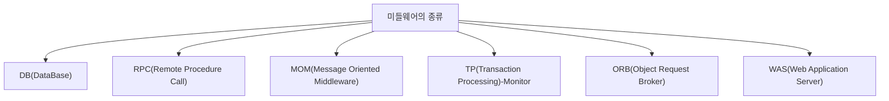

# 055 미들웨어의 종류

작성 기준일: 2026-05-02  
과목: `1과목 소프트웨어 설계`  
기준 PDF: `/Users/nes0903/Documents/study/정보처리기사/핵심요약집_2026_정보처리기사필기핵심요약.pdf`  
PDF 확인 위치: `8페이지`  
검색 보강: 공식/표준/고품질 참고 자료를 함께 확인하여 시험 중심으로 확장 정리

---

## 1. 한 줄 요약

- 미들웨어의 종류에는 DB, RPC, MOM, TP-Monitor, ORB, WAS가 있으며 각각 데이터 접근, 원격 호출, 메시징, 트랜잭션, 객체 요청, 웹 애플리케이션 실행을 담당한다.
- 이 챕터는 `미들웨어` 영역에 속한다.
- 시험에서는 정의, 핵심 키워드, 비슷한 개념과의 구분을 함께 묻는 경우가 많다.

---

## 2. PDF 기준 핵심

- DB(DataBase)
- RPC(Remote Procedure Call)
- MOM(Message Oriented Middleware)
- TP(Transaction Processing)-Monitor
- ORB(Object Request Broker)
- WAS(Web Application Server)

- 위 항목은 PDF에서 직접 확인한 최소 암기 골격이다.
- 세부 설명은 이 골격을 기준으로 확장해서 이해하면 된다.

---

## 3. 개념 설명

- DB 미들웨어는 애플리케이션과 데이터베이스 사이의 접근을 돕는다.
- RPC는 원격 시스템의 프로시저를 로컬 호출처럼 사용할 수 있게 한다.
- MOM은 메시지 큐를 통해 비동기 메시지 전달을 지원한다.
- TP-Monitor는 대량 트랜잭션 처리와 자원 관리를 지원한다.
- ORB는 분산 객체 사이의 요청 전달을 중개한다.
- WAS는 웹 애플리케이션 실행 환경과 세션, 트랜잭션, 보안 같은 서비스를 제공한다.
- 미들웨어는 분산 환경의 이질성을 감추고 응용 간 연결을 쉽게 만드는 중간 계층이다.
- 종류 문제는 약어 풀이와 담당 역할을 함께 외워야 한다.

---

## 4. 핵심 포인트

- 문제를 풀 때는 먼저 지문 속 단서어를 찾고, 그 단서어가 어떤 개념을 가리키는지 연결한다.
- 정의형 문제는 표현이 조금 바뀌어도 핵심 의미가 같으면 같은 개념으로 판단한다.
- 옳고 그름 문제에서는 `항상`, `반드시`, `전혀`, `모두` 같은 극단 표현을 특히 조심한다.
- 이 챕터는 단독 암기보다 인접 챕터와 비교해 기억하면 정답률이 올라간다.

---

## 5. 시험에서 헷갈리는 비교

| 구분 | 핵심 |
|---|---|
| `DB` | 데이터베이스 접근 |
| `RPC` | 원격 함수 호출 |
| `MOM` | 메시지 기반 비동기 통신 |
| `TP-Monitor` | 트랜잭션 처리 관리 |
| `ORB` | 분산 객체 요청 중개 |
| `WAS` | 웹 애플리케이션 실행 서버 |

- 비교 문제는 이름보다 `역할`, `목적`, `사용 시점`, `장점/단점`을 기준으로 구분하면 안정적이다.

---

## 6. 예시 또는 암기 포인트

- 미들웨어 종류 = `DB-RPC-MOM-TP-ORB-WAS`.

- 암기는 단어만 외우기보다 `정의 -> 특징 -> 예시 -> 반대 개념` 순서로 묶는 것이 좋다.

---

## 7. 빠른 복습

- 챕터명: `055 미들웨어의 종류`
- 소속 영역: `미들웨어`
- 자주 나오는 문제 유형:
  - 정의를 주고 개념명을 고르는 문제
  - 특징을 섞어 놓고 옳은/틀린 설명을 고르는 문제
  - 유사 개념과 비교하여 다른 하나를 찾는 문제

---

## 8. 참고 링크

- 기준 PDF: `/Users/nes0903/Documents/study/정보처리기사/핵심요약집_2026_정보처리기사필기핵심요약.pdf`
- [Q-Net 정보처리기사 종목 페이지](https://www.q-net.or.kr/crf005.do?id=crf00503s02&jmCd=1320&jmInfoDivCcd=B0)
- [IBM - What is Middleware?](https://www.ibm.com/think/topics/middleware)
- [Red Hat - What is middleware?](https://www.redhat.com/en/topics/middleware/what-is-middleware)
- [OMG - CORBA](https://www.omg.org/corba/)
- [OMG - ORB basics](https://www.omg.org/gettingstarted/orb_basics.htm)
