# 056 자료 구조의 분류

작성 기준일: 2026-06-01
검색/보강일: 2026-06-01
과목: `2과목 소프트웨어 개발`
기준 PDF: `/Users/nes0903/Documents/study/정보처리기사/핵심요약집_2026_정보처리기사필기핵심요약.pdf`
PDF 확인 위치: `9페이지`
검색 보강: NIST DADS의 data structure, tree, deque, linked list 정의와 OpenDSA 자료구조 설명을 참고하여 시험 중심으로 확장
주제별 검색 키워드: `data structure classification linear non-linear stack queue tree graph`, `NIST data structure tree deque linked list`, `OpenDSA linear structures stack queue list`

---

## 1. 한 줄 요약

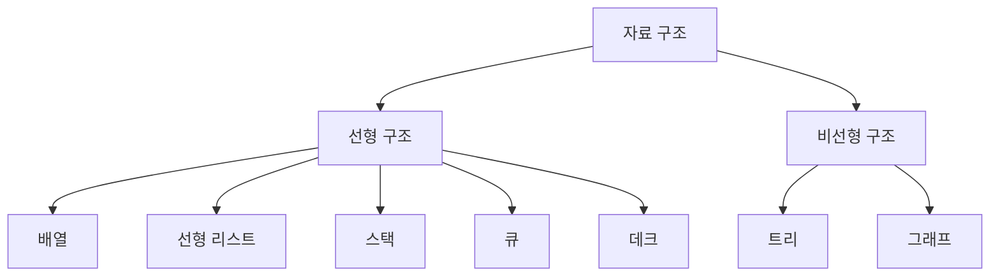

- 자료 구조는 데이터를 저장하고 처리하기 좋게 조직하는 방식이다.
- 정보처리기사 PDF 기준 분류는 `선형 구조`와 `비선형 구조`로 나뉜다.
- `선형 구조`에는 배열, 선형 리스트, 스택, 큐, 데크가 포함된다.
- `비선형 구조`에는 트리와 그래프가 포함된다.
- 시험에서는 “자료 구조의 분류” 자체를 묻거나, 예시를 주고 선형/비선형을 구분하게 한다.

---

## 2. 한눈에 보는 구조

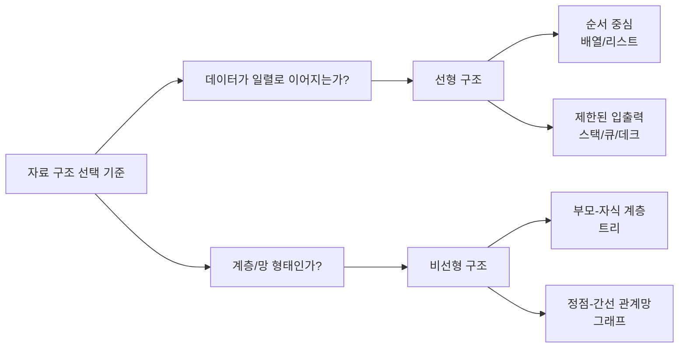

- 선형 구조는 데이터 원소들이 한 줄처럼 순서를 가지고 연결되는 구조이다.
- 비선형 구조는 하나의 원소가 여러 원소와 연결될 수 있는 구조이다.
- 배열과 리스트는 순차 저장/순차 연결의 대표 예시이다.
- 스택, 큐, 데크는 삽입과 삭제가 허용되는 위치가 제한된 선형 구조이다.
- 트리는 계층 구조, 그래프는 관계망 구조를 표현할 때 사용한다.

---

## 3. PDF 기준 핵심

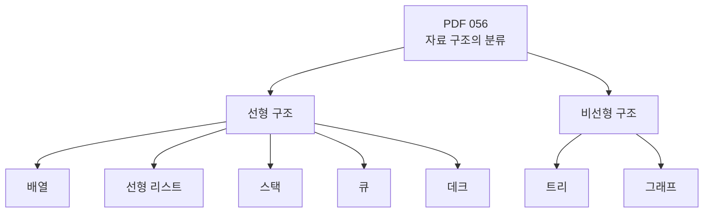

- 기준 PDF의 핵심 문장:
  - `선형 구조: 배열, 선형 리스트, 스택, 큐, 데크`
  - `비선형 구조: 트리, 그래프`
- 이 챕터는 정의보다 “분류표” 자체가 출제 포인트이다.
- `배열`, `선형 리스트`, `스택`, `큐`, `데크`는 반드시 선형 구조로 묶어 기억한다.
- `트리`, `그래프`는 반드시 비선형 구조로 묶어 기억한다.
- 이후 057~070에서 스택, 트리, 그래프, 정렬, 검색, 해싱이 이어지므로 056은 2과목 자료구조 파트의 입구 역할을 한다.

---

## 4. 검색으로 보강한 관점

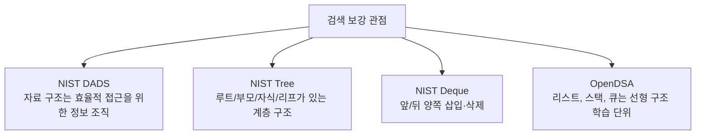

- NIST DADS는 자료 구조를 효율적인 알고리즘 처리를 위해 정보를 조직하는 방식으로 설명한다.
- NIST의 예시에도 `queue`, `stack`, `linked list`, `heap`, `dictionary`, `tree` 등이 포함된다.
- 시험에서는 이 넓은 자료구조 개념 중 PDF가 제시한 대표 구조만 우선 암기한다.
- OpenDSA는 리스트, 스택, 큐를 선형 구조 학습 단위로 다루며, 이 흐름은 PDF의 선형 구조 분류와 잘 맞는다.
- NIST tree 정의는 트리가 루트에서 시작해 부모-자식 관계로 이어지는 구조임을 보여 주므로, 왜 비선형인지 이해하는 데 도움이 된다.

---

## 5. 개념 설명

### 5.1 자료 구조란 무엇인가

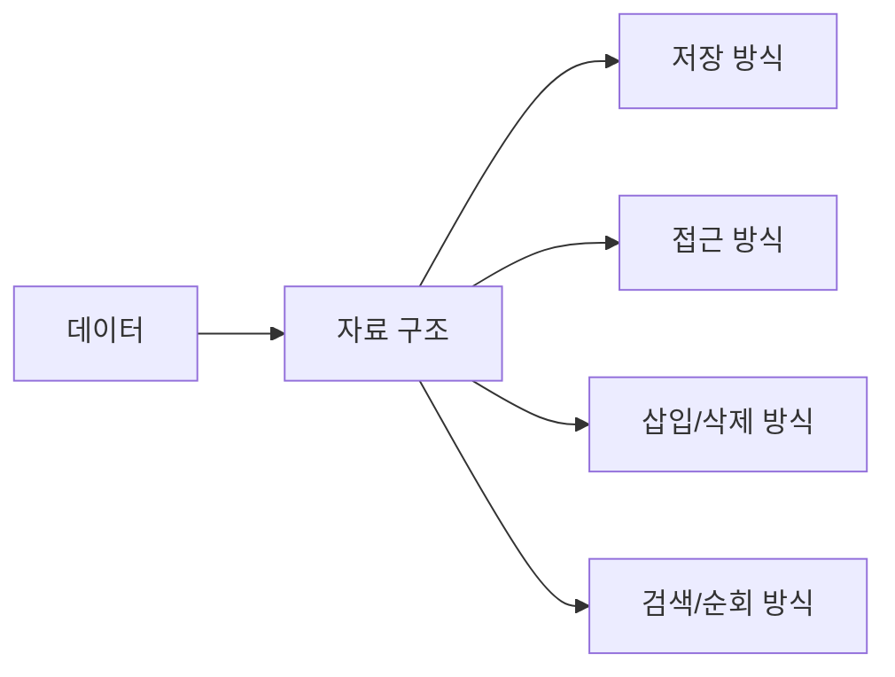

- 자료 구조는 단순히 데이터를 모아 놓은 것이 아니라, 데이터를 어떻게 저장하고 어떻게 처리할지까지 포함하는 개념이다.
- 같은 데이터라도 자료 구조가 달라지면 삽입, 삭제, 검색, 순회 비용이 달라진다.
- 예를 들어 배열은 인덱스로 빠르게 접근하기 좋지만, 중간 삽입/삭제에는 이동 비용이 생길 수 있다.
- 연결 리스트는 포인터를 따라가며 접근해야 하므로 임의 접근은 불리할 수 있지만, 연결 정보만 바꾸면 삽입/삭제를 표현하기 쉽다.
- 스택과 큐는 삽입/삭제 위치를 제한하여 특정 처리 순서를 강제한다.
- 트리와 그래프는 일렬 순서보다 계층이나 관계를 표현하는 데 적합하다.

### 5.2 선형 구조

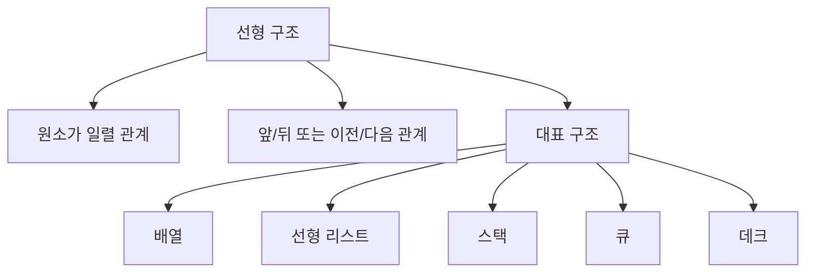

- 선형 구조는 데이터 원소가 하나의 순서를 따라 배치되는 구조이다.
- 각 원소가 논리적으로 앞 원소와 뒤 원소의 관계를 가진다고 보면 된다.
- `배열`은 같은 종류의 데이터를 연속된 공간처럼 다루며 인덱스로 접근한다.
- `선형 리스트`는 원소들이 순서를 가지고 나열된 구조이며, 배열 기반 또는 연결 기반으로 구현할 수 있다.
- `스택`은 한쪽 끝에서 삽입과 삭제가 이루어지는 LIFO 구조이다.
- `큐`는 한쪽에서는 삽입, 다른 한쪽에서는 삭제가 이루어지는 FIFO 구조이다.
- `데크`는 양쪽 끝에서 삽입과 삭제가 가능한 구조이다.

### 5.3 비선형 구조

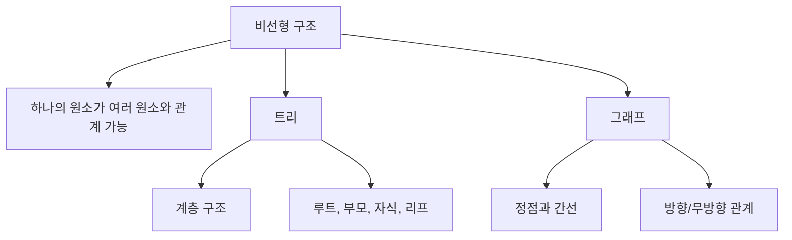

- 비선형 구조는 데이터가 단순한 일렬 순서로만 연결되지 않는다.
- `트리`는 루트에서 시작해 부모-자식 관계로 확장되는 계층 구조이다.
- 파일 시스템, 조직도, HTML DOM 같은 구조는 트리로 이해하기 좋다.
- `그래프`는 정점과 간선으로 구성된 관계 구조이다.
- 네트워크, 경로, 의존성, 친구 관계처럼 복잡한 연결을 표현할 때 그래프가 적합하다.
- 시험에서는 트리와 그래프를 선형 구조와 혼동하지 않는 것이 가장 중요하다.

---

## 6. 시험 포인트

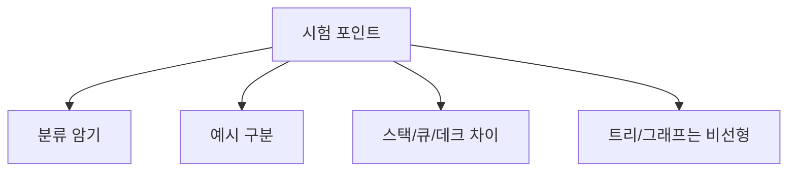

- `자료 구조의 분류` 문제는 암기형으로 자주 나온다.
- 선형 구조:
  - 배열
  - 선형 리스트
  - 스택
  - 큐
  - 데크
- 비선형 구조:
  - 트리
  - 그래프
- `데크`는 양쪽 끝에서 삽입/삭제가 가능하지만, 여전히 원소들이 일렬로 놓인 구조이므로 선형 구조이다.
- `트리`는 노드들이 계층적으로 연결되므로 비선형 구조이다.
- `그래프`는 정점들이 간선으로 복잡하게 연결될 수 있으므로 비선형 구조이다.
- “스택은 후입선출이므로 비선형이다” 같은 판단은 틀리다. 스택은 선형 구조이다.

---

## 7. 헷갈리는 비교

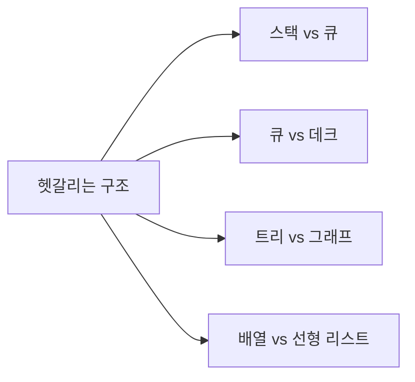

| 구분 | 선형/비선형 | 핵심 단서 | 시험에서 보는 법 |
|---|---|---|---|
| 배열 | 선형 | 인덱스, 같은 자료형, 순차 저장 | 순서와 위치가 명확하면 배열 |
| 선형 리스트 | 선형 | 원소들의 순서 있는 나열 | 이전/다음 관계 중심 |
| 스택 | 선형 | LIFO, Push, Pop, Top | 한쪽 끝 입출력 |
| 큐 | 선형 | FIFO, Front, Rear | 뒤에서 삽입, 앞에서 삭제 |
| 데크 | 선형 | 양쪽 끝 삽입/삭제 | Double-Ended Queue |
| 트리 | 비선형 | 루트, 부모, 자식, 리프 | 계층 구조 |
| 그래프 | 비선형 | 정점, 간선, 방향/무방향 | 관계망 구조 |

- `스택`, `큐`, `데크`는 입출력 규칙이 다를 뿐 모두 선형 구조이다.
- `트리`는 그래프의 특수한 형태로 설명될 수 있지만, 시험에서는 트리와 그래프 둘 다 비선형 구조로 묶는다.
- `배열`은 물리적 저장의 연속성을 강조하는 경우가 많고, `선형 리스트`는 논리적 순서 구조를 넓게 가리킨다.

---

## 8. 예시 또는 암기 포인트

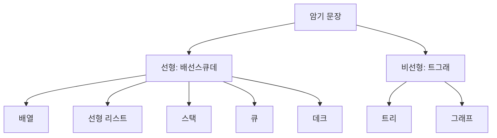

- 암기 문장:
  - `선형은 배선스큐데`
  - `비선형은 트그래`
- 예시:
  - 학생 30명의 점수를 번호순으로 저장하면 배열 관점이다.
  - 웹 브라우저 뒤로 가기는 최근 방문 기록을 먼저 꺼내므로 스택 관점이다.
  - 프린터 출력 대기열은 먼저 들어온 문서가 먼저 출력되므로 큐 관점이다.
  - 양쪽에서 삽입/삭제가 필요한 작업 목록은 데크 관점이다.
  - 회사 조직도는 트리 관점이다.
  - 지하철 노선 연결 관계는 그래프 관점이다.

---

## 9. 빠른 복습

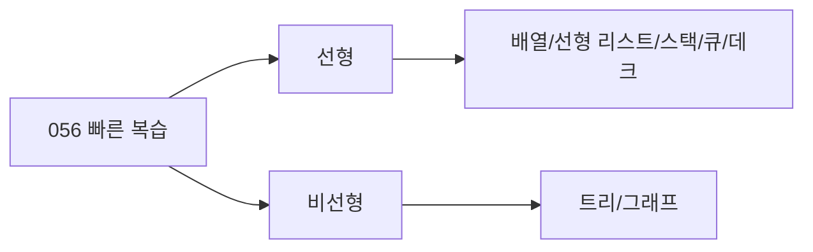

- 챕터명: `056 자료 구조의 분류`
- PDF 확인 위치: `9페이지`
- 최소 암기:
  - 선형 구조 = 배열, 선형 리스트, 스택, 큐, 데크
  - 비선형 구조 = 트리, 그래프
- 스택, 큐, 데크는 모두 선형 구조이다.
- 트리와 그래프는 비선형 구조이다.
- 문제에서 예시가 나오면 “일렬 순서인가, 계층/관계망인가”를 먼저 판단한다.

---

## 10. 참고 링크

- 기준 PDF: `/Users/nes0903/Documents/study/정보처리기사/핵심요약집_2026_정보처리기사필기핵심요약.pdf`
- [Q-Net - 정보처리기사 종목 정보](https://www.q-net.or.kr/crf005.do?gId=&gSite=Q&id=crf00503&jmCd=1320&tabGbn=1)
- [NIST DADS - data structure](https://xlinux.nist.gov/dads/HTML/dataStructure.html)
- [NIST DADS - tree](https://xlinux.nist.gov/dads/HTML/tree.html)
- [NIST DADS - deque](https://xlinux.nist.gov/dads/HTML/deque.html)
- [NIST DADS - linked list](https://xlinux.nist.gov/dads/HTML/linkedList.html)
- [OpenDSA - Lists](https://opendsa.org/OpenDSA/Books/Everything/html/ListIntro.html)

