# 057 스택(Stack)

작성 기준일: 2026-06-01
검색/보강일: 2026-06-01
과목: `2과목 소프트웨어 개발`
기준 PDF: `/Users/nes0903/Documents/study/정보처리기사/핵심요약집_2026_정보처리기사필기핵심요약.pdf`
PDF 확인 위치: `9페이지`
검색 보강: NIST DADS의 stack/LIFO 정의와 OpenDSA 선형 구조 설명을 참고하여 시험 중심으로 확장
주제별 검색 키워드: `NIST DADS stack LIFO push pop`, `stack data structure LIFO OpenDSA`, `stack top push pop isEmpty`

---

## 1. 한 줄 요약

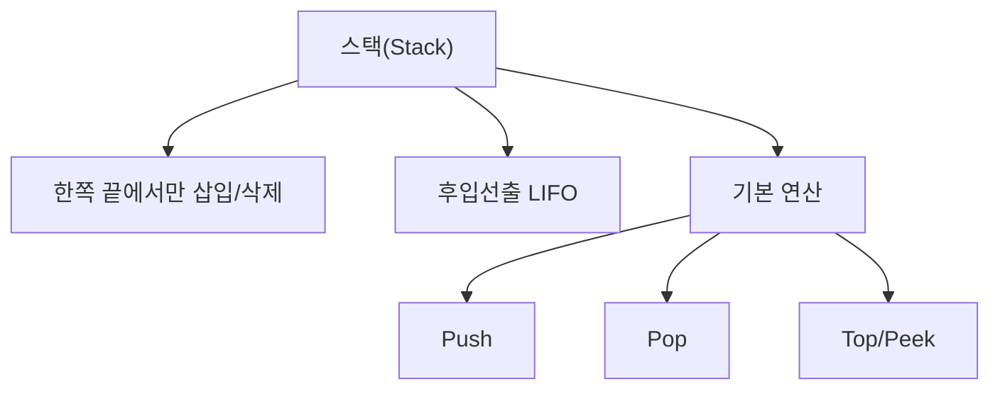

- 스택은 리스트의 한쪽 끝에서만 삽입과 삭제가 이루어지는 선형 자료 구조이다.
- 가장 나중에 들어온 자료가 가장 먼저 나가는 `후입선출(LIFO)` 방식이다.
- PDF 기준 핵심은 `한쪽 끝`, `삽입/삭제`, `후입선출(LIFO)`이다.
- 시험에서는 큐의 `FIFO`와 스택의 `LIFO`를 자주 비교한다.

---

## 2. 한눈에 보는 구조

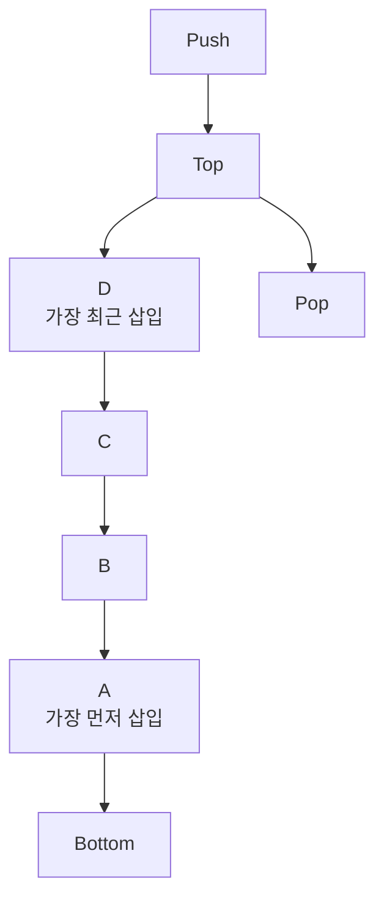

- 스택의 삽입과 삭제는 같은 쪽 끝에서 이루어진다.
- 그 끝을 보통 `Top`이라고 부른다.
- 삽입 연산은 `Push`, 삭제 연산은 `Pop`이다.
- `Top`에 있는 자료가 현재 가장 먼저 삭제될 수 있는 자료이다.
- 먼저 들어온 자료는 아래쪽에 쌓이므로 나중에 나온다.

---

## 3. PDF 기준 핵심

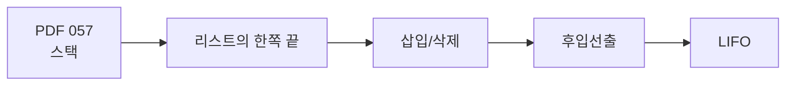

- 기준 PDF의 핵심 문장:
  - `리스트의 한쪽 끝으로만 자료의 삽입, 삭제 작업이 이루어지는 자료 구조이다.`
  - `가장 나중에 삽입된 자료가 가장 먼저 삭제되는 후입선출(LIFO) 방식으로 자료를 처리한다.`
- 시험에서는 `가장 나중에 삽입된 자료가 가장 먼저 삭제`라는 표현이 나오면 바로 스택을 고른다.
- `LIFO`는 `Last-In First-Out`의 약어이다.
- `후입선출`과 `LIFO`는 같은 의미이다.

---

## 4. 검색으로 보강한 관점

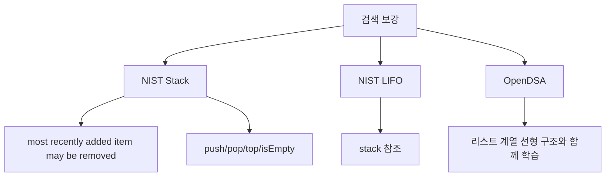

- NIST DADS는 스택을 가장 최근에 추가된 항목만 제거할 수 있는 자료 구조로 설명한다.
- NIST DADS는 기본 연산으로 `push`, `pop`, `top`, `isEmpty`를 제시한다.
- PDF는 `Push`와 `Pop`을 059에서 따로 다루므로, 057에서는 LIFO 구조 자체를 먼저 이해해야 한다.
- OpenDSA의 선형 구조 흐름에서도 스택은 리스트와 큐 사이에서 학습하는 대표 선형 자료 구조이다.

---

## 5. 개념 설명

### 5.1 스택의 핵심 구조

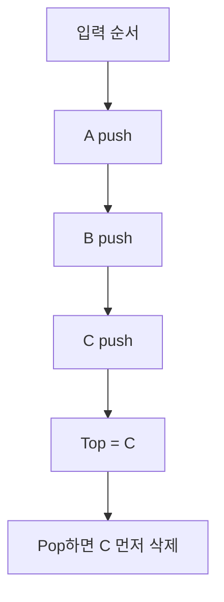

- 스택은 “쌓아 올린다”는 이미지로 이해하면 쉽다.
- 접시를 쌓을 때 마지막에 올린 접시가 맨 위에 있고, 꺼낼 때도 맨 위 접시부터 꺼낸다.
- 데이터도 마찬가지로 마지막에 삽입된 데이터가 먼저 삭제된다.
- 그래서 스택은 순서를 뒤집는 효과가 있다.
- 입력 순서가 `A -> B -> C`라면, 모두 Push한 뒤 모두 Pop하면 출력 순서는 `C -> B -> A`가 된다.

### 5.2 스택의 주요 용어

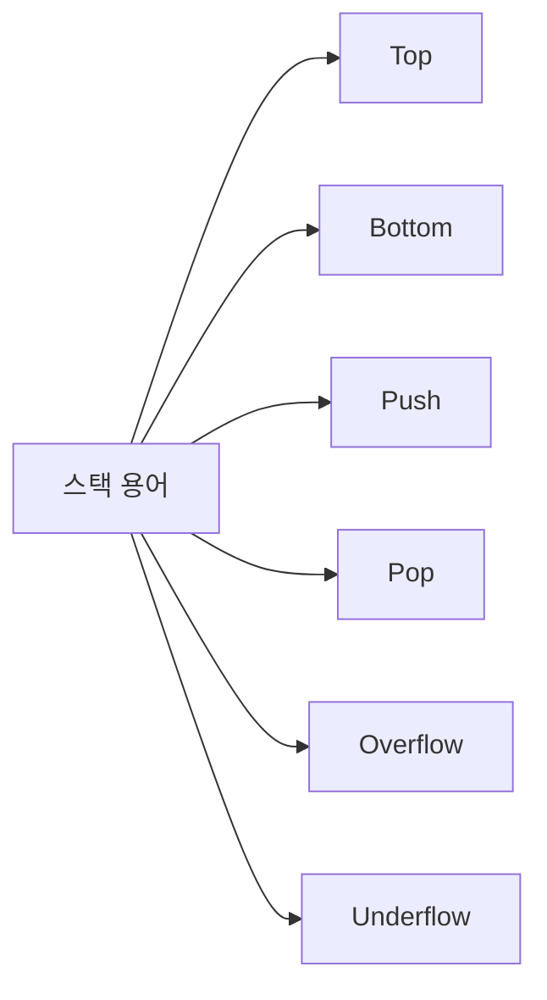

| 용어 | 의미 | 시험 단서 |
|---|---|---|
| Top | 삽입/삭제가 일어나는 스택의 한쪽 끝 | 가장 위, 현재 삭제 대상 |
| Bottom | 가장 먼저 들어온 자료가 위치하는 아래쪽 | 마지막에 삭제될 수 있음 |
| Push | 스택에 자료를 삽입 | 입력, 삽입 |
| Pop | 스택에서 자료를 삭제하며 꺼냄 | 출력, 삭제 |
| Overflow | 꽉 찬 스택에 Push하려는 상태 | 저장 공간 초과 |
| Underflow | 빈 스택에서 Pop하려는 상태 | 삭제할 자료 없음 |

- PDF 057에서는 `Top`, `Overflow`, `Underflow`까지 직접 제시하지 않지만, 스택 문제를 풀 때 함께 알아 두면 좋다.
- 실제 시험에서는 Push/Pop 순서 추적 문제가 나오므로 `Top`의 이동을 머릿속으로 따라가야 한다.

### 5.3 스택과 선형 구조

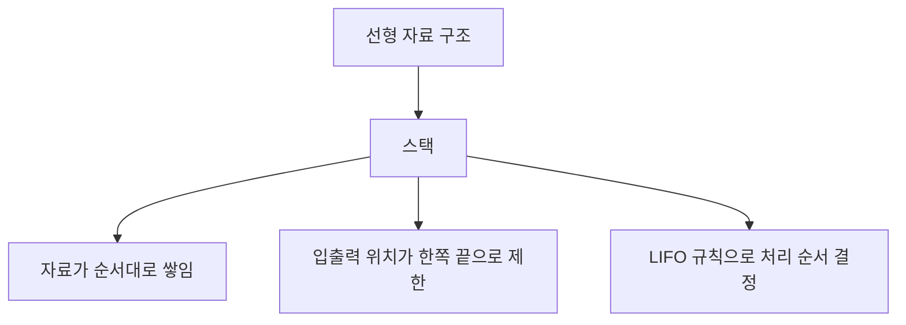

- 스택은 선형 자료 구조이다.
- 스택이 “위아래로 쌓인다”는 표현 때문에 비선형처럼 보일 수 있지만, 논리적으로는 한 줄 순서가 있는 구조이다.
- 배열로 구현할 수도 있고, 연결 리스트로 구현할 수도 있다.
- 중요한 것은 구현 방식이 아니라 `한쪽 끝에서만 삽입/삭제`와 `LIFO` 규칙이다.

---

## 6. 시험 포인트

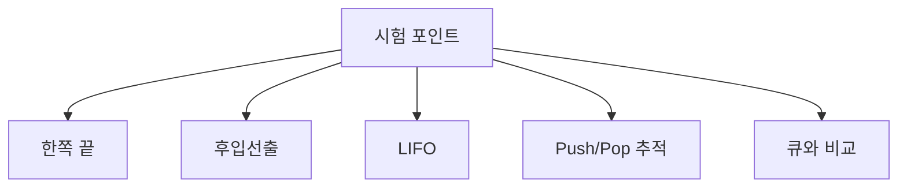

- `리스트의 한쪽 끝`이라는 표현이 나오면 스택을 의심한다.
- `가장 나중에 삽입된 자료가 가장 먼저 삭제`되면 스택이다.
- `LIFO`는 스택이다.
- `FIFO`는 큐이다.
- `Push`는 삽입이다.
- `Pop`은 삭제 또는 출력이다.
- 스택 출력 순서 문제에서는 실제로 스택을 그리면서 Top을 따라가야 실수하지 않는다.
- 입력 순서가 고정되어 있을 때, 출력 순서가 가능한지 묻는 문제가 나올 수 있다.

---

## 7. 헷갈리는 비교

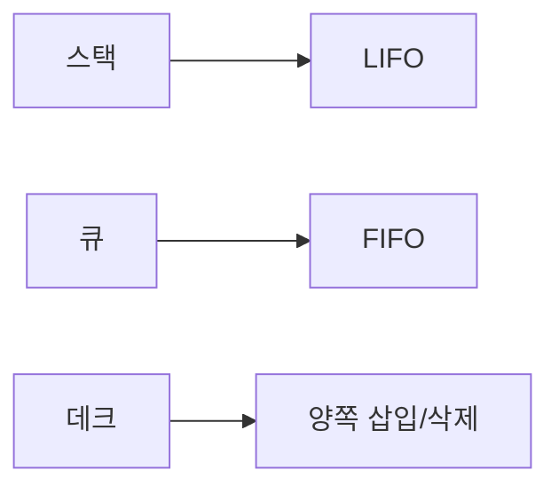

| 구분 | 스택(Stack) | 큐(Queue) | 데크(Deque) |
|---|---|---|---|
| 처리 방식 | 후입선출 | 선입선출 | 양쪽 끝 입출력 |
| 삽입 위치 | Top | Rear | Front/Rear |
| 삭제 위치 | Top | Front | Front/Rear |
| 시험 단서 | LIFO, Push, Pop | FIFO, Front, Rear | Double-Ended Queue |
| 대표 이미지 | 접시 쌓기 | 줄 서기 | 양쪽 문이 있는 줄 |

- 스택과 큐는 모두 선형 구조이지만 처리 순서가 정반대이다.
- 스택은 가장 최근 자료를 먼저 처리할 때 적합하다.
- 큐는 먼저 도착한 자료를 먼저 처리할 때 적합하다.
- 데크는 양쪽 끝을 모두 활용할 수 있으므로 스택이나 큐보다 입출력 제한이 느슨하다.

---

## 8. 예시 또는 암기 포인트

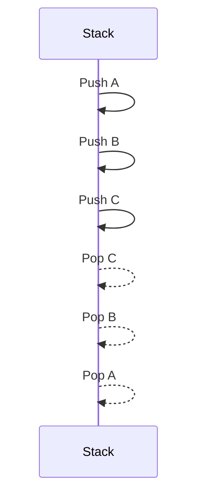

- 입력: `A, B, C`
- 작업:
  - `Push A`
  - `Push B`
  - `Push C`
  - `Pop`
  - `Pop`
  - `Pop`
- 출력: `C, B, A`
- 암기:
  - `스택 = 쌓는다`
  - `쌓으면 맨 위부터 꺼낸다`
  - `맨 위 = 마지막에 들어온 자료`
  - `따라서 스택 = 후입선출 = LIFO`

---

## 9. 빠른 복습

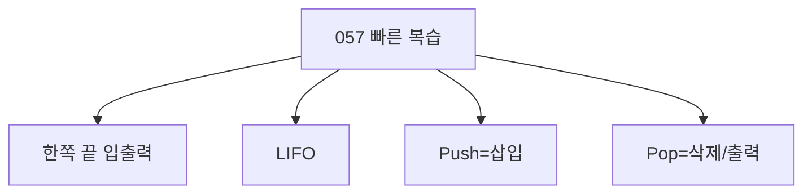

- 챕터명: `057 스택(Stack)`
- PDF 확인 위치: `9페이지`
- 스택은 한쪽 끝에서만 삽입과 삭제가 이루어진다.
- 가장 나중에 삽입된 자료가 가장 먼저 삭제된다.
- `LIFO = Last-In First-Out = 후입선출`
- `Push = 삽입`
- `Pop = 삭제/출력`
- 큐의 `FIFO`와 반드시 비교해서 외운다.

---

## 10. 참고 링크

- 기준 PDF: `/Users/nes0903/Documents/study/정보처리기사/핵심요약집_2026_정보처리기사필기핵심요약.pdf`
- [Q-Net - 정보처리기사 종목 정보](https://www.q-net.or.kr/crf005.do?gId=&gSite=Q&id=crf00503&jmCd=1320&tabGbn=1)
- [NIST DADS - stack](https://xlinux.nist.gov/dads/HTML/stack.html)
- [NIST DADS - LIFO](https://xlinux.nist.gov/dads/HTML/lifo.html)
- [OpenDSA - Lists](https://opendsa.org/OpenDSA/Books/Everything/html/ListIntro.html)

<!-- study-links:start -->
## 관련 문서

- `fifo`: [[정보처리기사/4과목 프로그래밍 언어 활용/201 페이지 교체 알고리즘 - FIFO/201 페이지 교체 알고리즘 - FIFO|201 페이지 교체 알고리즘 - FIFO]]
<!-- study-links:end -->
