# 058 스택의 응용 분야

작성 기준일: 2026-06-01
검색/보강일: 2026-06-01
과목: `2과목 소프트웨어 개발`
기준 PDF: `/Users/nes0903/Documents/study/정보처리기사/핵심요약집_2026_정보처리기사필기핵심요약.pdf`
PDF 확인 위치: `9페이지`
검색 보강: NIST DADS의 stack 정의와 OpenDSA/대학 강의 자료의 스택 활용 설명을 참고하여 시험 중심으로 확장
주제별 검색 키워드: `stack applications expression evaluation function call backtracking`, `stack data structure applications call stack expression`, `OpenDSA stack applications`

---

## 1. 한 줄 요약

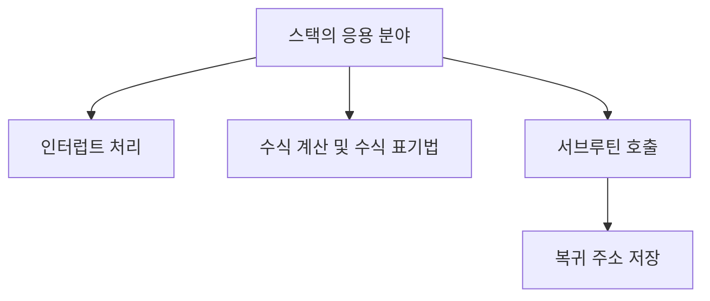

- 스택은 “최근 상태를 먼저 꺼내야 하는 상황”에 사용된다.
- PDF 기준 응용 분야는 `인터럽트 처리`, `수식 계산 및 수식 표기법`, `서브루틴 호출 및 복귀 주소 저장`이다.
- 공통 원리는 `LIFO`이다.
- 시험에서는 응용 분야를 직접 묻거나, 예시를 주고 스택 사용 여부를 판단하게 한다.

---

## 2. 한눈에 보는 구조

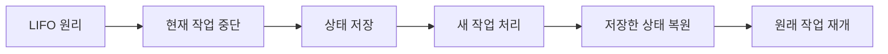

- 인터럽트나 함수 호출은 현재 작업을 잠시 중단하고 다른 작업을 처리한 뒤 원래 위치로 돌아와야 한다.
- 이때 가장 최근에 중단한 작업부터 복귀해야 하므로 스택이 적합하다.
- 수식 계산에서는 괄호, 연산자 우선순위, 후위 표기 계산처럼 “최근에 만난 항목”을 먼저 처리하는 경우가 많다.
- 스택은 단순한 자료 구조이지만 컴파일러, 운영체제, 실행 시간 환경에서 매우 자주 사용된다.

---

## 3. PDF 기준 핵심

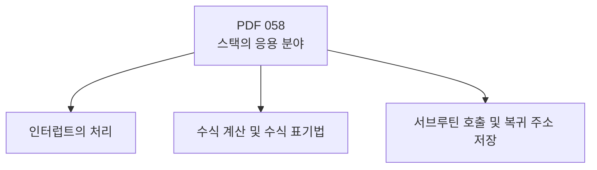

- 기준 PDF의 핵심 항목:
  - `인터럽트의 처리`
  - `수식 계산 및 수식 표기법`
  - `서브루틴 호출 및 복귀 주소 저장`
- 이 세 항목은 그대로 암기한다.
- 특히 `복귀 주소 저장`은 스택과 연결해서 자주 묻는 단서이다.
- 수식 표기법은 이어지는 063~065의 Infix, Prefix, Postfix 변환과 연결된다.

---

## 4. 검색으로 보강한 관점

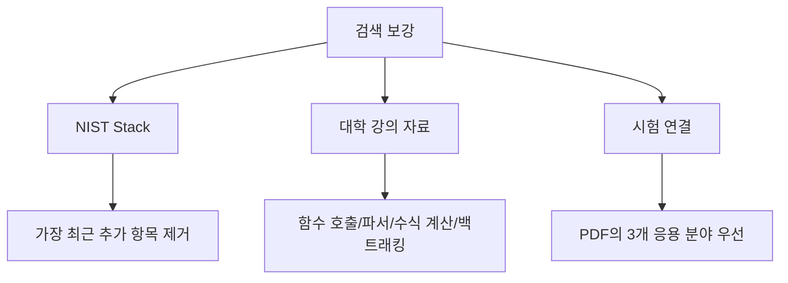

- NIST DADS는 스택의 본질을 “가장 최근에 추가된 항목만 제거 가능”으로 설명한다.
- 대학 자료구조 강의 자료들은 스택이 함수 호출, 파서, 수식 계산, 백트래킹 등에 쓰인다고 설명한다.
- 시험에서는 이 중 PDF가 제시한 3개 항목을 최우선으로 외워야 한다.
- 추가 예시인 괄호 검사, DFS, Undo/Redo는 이해 보강용으로만 활용한다.

---

## 5. 개념 설명

### 5.1 인터럽트 처리

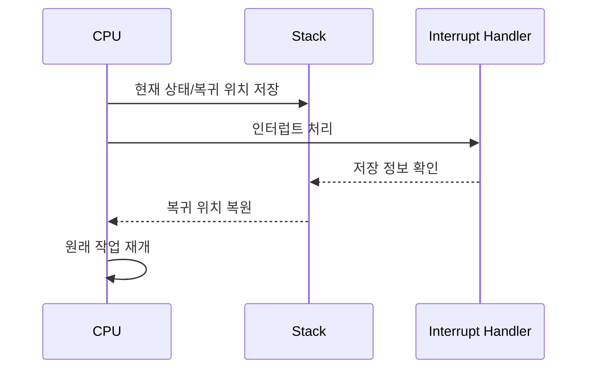

- 인터럽트는 CPU가 현재 작업을 수행하는 중 외부 또는 내부 사건 때문에 잠시 다른 처리를 해야 하는 상황이다.
- 이때 현재 작업의 위치와 상태를 잃어버리면 원래 작업으로 돌아올 수 없다.
- 따라서 복귀 위치, 레지스터 상태 같은 정보를 저장해 두고 인터럽트 처리가 끝난 뒤 복원한다.
- 가장 최근에 발생한 인터럽트 처리가 끝나면 직전에 중단된 작업으로 돌아가야 하므로 LIFO 구조가 적합하다.
- 시험에서는 `인터럽트 처리`라는 표현이 나오면 스택의 응용 분야로 바로 연결한다.

### 5.2 수식 계산 및 수식 표기법

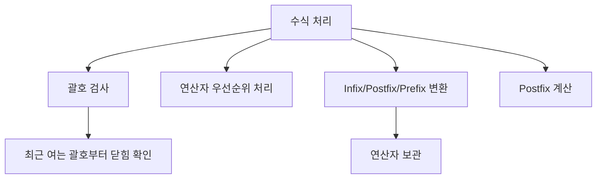

- 수식 계산에서는 연산자와 피연산자의 처리 순서가 중요하다.
- 중위 표기식에서 후위 표기식으로 바꿀 때 연산자를 잠시 저장하고 우선순위에 따라 꺼내는 과정에 스택을 사용할 수 있다.
- 후위 표기식 계산에서는 피연산자를 스택에 넣고, 연산자를 만나면 최근 피연산자 2개를 꺼내 계산한다.
- 괄호 검사에서도 최근에 열린 괄호가 먼저 닫혀야 하므로 스택이 적합하다.
- PDF의 `수식 계산 및 수식 표기법`은 063~065 챕터와 직접 연결된다.

### 5.3 서브루틴 호출 및 복귀 주소 저장

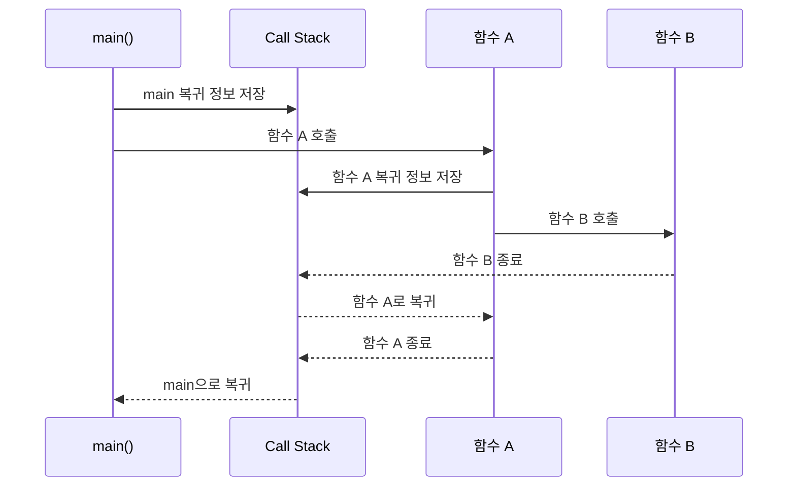

- 서브루틴은 프로그램 안에서 호출되는 함수, 프로시저, 메서드 같은 하위 프로그램을 의미한다.
- 함수가 다른 함수를 호출하면, 호출한 위치로 다시 돌아오기 위해 복귀 주소를 저장해야 한다.
- 함수 호출이 중첩되면 가장 나중에 호출된 함수가 가장 먼저 종료되어야 한다.
- 이 순서가 스택의 LIFO와 정확히 맞는다.
- 그래서 실행 시간 환경에서는 호출 스택 또는 콜 스택을 사용한다.

---

## 6. 시험 포인트

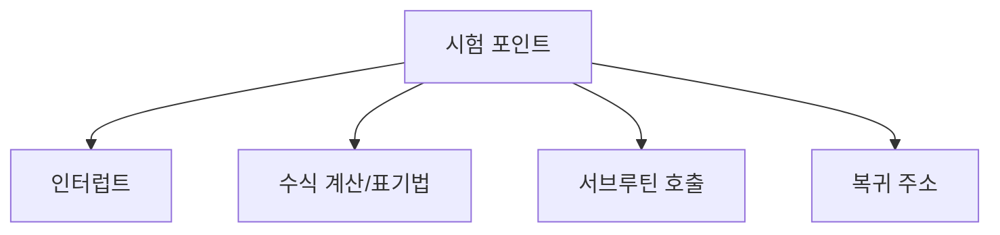

- PDF의 3개 항목을 그대로 암기한다.
- `인터럽트 처리`는 스택의 응용 분야이다.
- `수식 계산 및 수식 표기법`은 스택의 응용 분야이다.
- `서브루틴 호출 및 복귀 주소 저장`은 스택의 응용 분야이다.
- `복귀 주소`라는 표현은 스택과 강하게 연결된다.
- `후입선출`이라는 원리를 응용 사례에 붙여 이해해야 한다.
- 시험에서 “가장 최근 호출된 함수부터 복귀” 같은 문장이 나오면 스택을 고른다.

---

## 7. 헷갈리는 비교

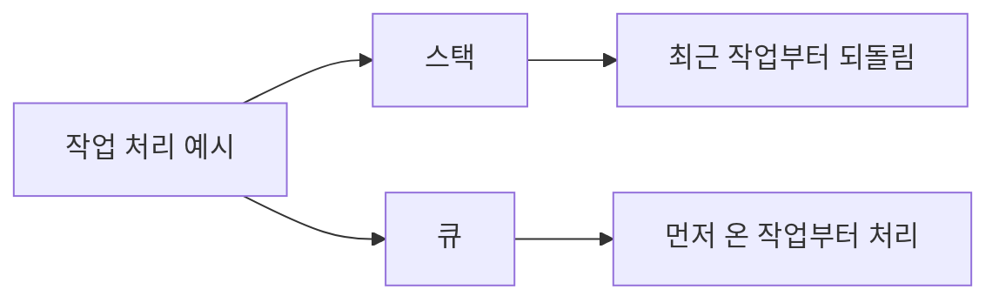

| 상황 | 적합한 구조 | 이유 |
|---|---|---|
| 함수 호출 후 복귀 | 스택 | 가장 최근 호출된 함수가 먼저 종료 |
| 인터럽트 중첩 처리 | 스택 | 최근 저장한 상태부터 복원 |
| 후위 표기식 계산 | 스택 | 최근 피연산자를 먼저 꺼내 계산 |
| 프린터 출력 대기 | 큐 | 먼저 들어온 문서부터 출력 |
| 네트워크 패킷 순서 처리 | 큐 성격 | 도착 순서대로 처리하는 경우가 많음 |

- `복귀`, `되돌리기`, `최근 것부터 처리`는 스택 단서이다.
- `대기열`, `먼저 온 것부터 처리`는 큐 단서이다.
- PDF 058의 응용 분야는 모두 “되돌아갈 위치를 저장하거나 최근 항목을 먼저 처리”하는 공통점이 있다.

---

## 8. 예시 또는 암기 포인트

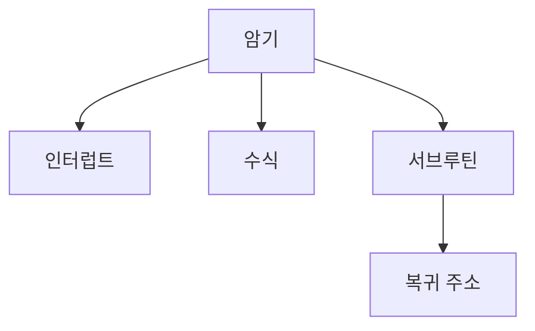

- 암기 문장:
  - `스택 응용 = 인터럽트, 수식, 서브루틴 복귀`
- 더 짧게:
  - `인터-수식-서브복귀`
- 예시:
  - 인터럽트가 발생하면 현재 실행 위치를 저장하고 인터럽트 처리가 끝난 뒤 복귀한다.
  - 후위 표기식 `A B +`는 `A`, `B`를 스택에 넣고 `+`를 만나면 두 값을 꺼내 계산한다.
  - `main()`이 `f()`, `f()`가 `g()`를 호출하면 `g()`가 먼저 끝나고 `f()`, `main()` 순으로 돌아간다.

---

## 9. 빠른 복습

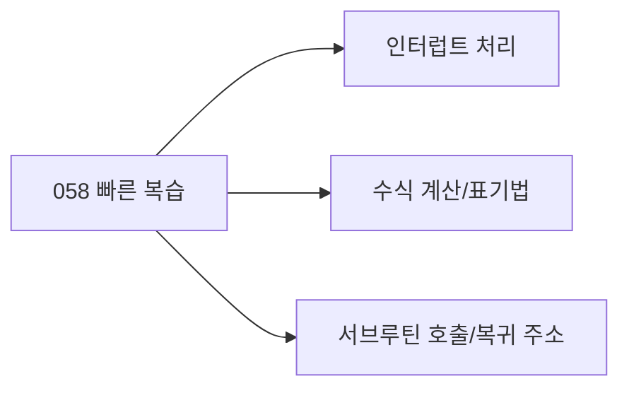

- 챕터명: `058 스택의 응용 분야`
- PDF 확인 위치: `9페이지`
- 최소 암기:
  - 인터럽트의 처리
  - 수식 계산 및 수식 표기법
  - 서브루틴 호출 및 복귀 주소 저장
- 공통 원리:
  - 최근에 저장한 것을 먼저 꺼낸다.
  - 즉, LIFO가 필요하다.
- 큐 응용 분야와 섞이지 않도록 `복귀 주소` 단서를 특히 기억한다.

---

## 10. 참고 링크

- 기준 PDF: `/Users/nes0903/Documents/study/정보처리기사/핵심요약집_2026_정보처리기사필기핵심요약.pdf`
- [Q-Net - 정보처리기사 종목 정보](https://www.q-net.or.kr/crf005.do?gId=&gSite=Q&id=crf00503&jmCd=1320&tabGbn=1)
- [NIST DADS - stack](https://xlinux.nist.gov/dads/HTML/stack.html)
- [OpenDSA](https://opendsa.org/)
- [University of Nevada, Reno - Stacks](https://www.cse.unr.edu/~sushil/class/cs202/notes/stacks/stacks.html)

<!-- study-links:start -->
## 관련 문서

- `연산자 우선순위`: [[정보처리기사/4과목 프로그래밍 언어 활용/168 연산자 우선순위/168 연산자 우선순위|168 연산자 우선순위]]
- `스택`: [[정보처리기사/2과목 소프트웨어 개발/057 스택(Stack)/057 스택(Stack)|057 스택(Stack)]]
<!-- study-links:end -->
