# 059 스택의 삽입(Push)과 삭제(Pop)

작성 기준일: 2026-06-01
검색/보강일: 2026-06-01
과목: `2과목 소프트웨어 개발`
기준 PDF: `/Users/nes0903/Documents/study/정보처리기사/핵심요약집_2026_정보처리기사필기핵심요약.pdf`
PDF 확인 위치: `9페이지`
검색 보강: NIST DADS의 stack/push/pop/top 정의를 참고하여 PDF 예제 추적 방식 중심으로 확장
주제별 검색 키워드: `stack push pop top LIFO`, `NIST stack push pop top`, `stack operation trace push pop output sequence`

---

## 1. 한 줄 요약

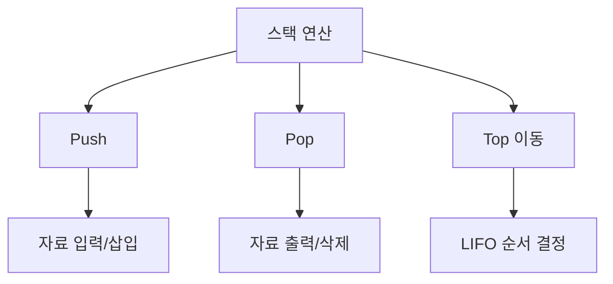

- `Push`는 스택에 자료를 입력하는 명령이다.
- `Pop`은 스택에서 자료를 출력하는 명령이다.
- 스택 문제는 Push와 Pop이 일어날 때마다 `Top`이 어디에 있는지 추적하면 풀린다.
- PDF 예제의 핵심은 입력 순서 `A, B, C, D`를 유지하면서 출력 순서 `B, C, D, A`가 가능함을 Push/Pop 과정으로 보이는 것이다.

---

## 2. 한눈에 보는 구조

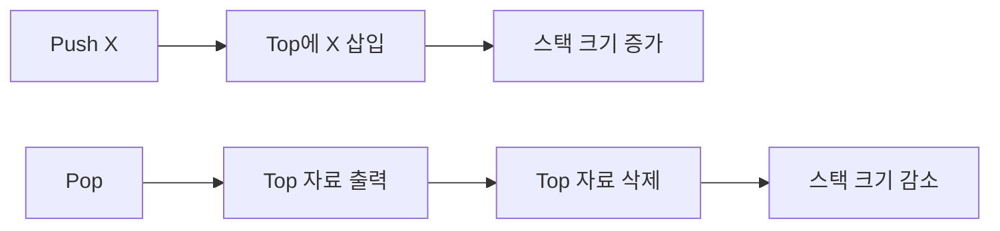

- 스택은 한쪽 끝인 `Top`에서 삽입과 삭제가 모두 일어난다.
- Push하면 새 자료가 Top이 된다.
- Pop하면 현재 Top 자료가 출력되고 스택에서 제거된다.
- 빈 스택에서 Pop하면 삭제할 자료가 없으므로 Underflow 상황이다.
- 꽉 찬 스택에서 Push하면 저장 공간이 없으므로 Overflow 상황이다.

---

## 3. PDF 기준 핵심

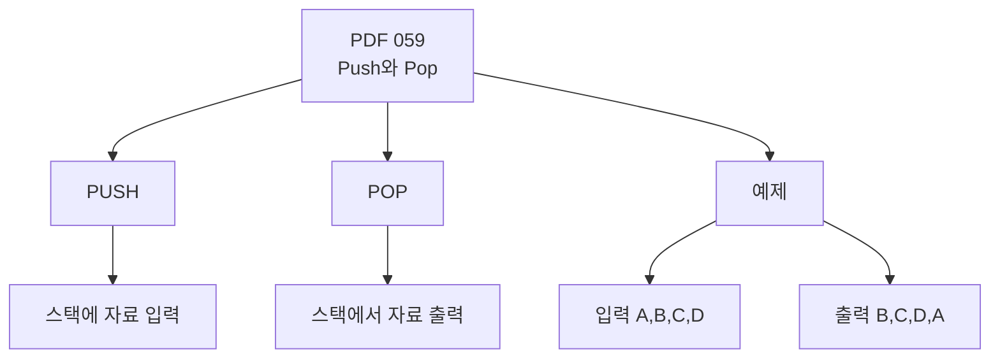

- 기준 PDF의 핵심 문장:
  - `PUSH: 스택에 자료를 입력하는 명령`
  - `POP: 스택에서 자료를 출력하는 명령`
- PDF 예제:
  - 입력 자료 순서: `A, B, C, D`
  - 출력 목표 순서: `B, C, D, A`
  - 가능한 작업 순서: `PUSH A -> PUSH B -> POP B -> PUSH C -> POP C -> PUSH D -> POP D -> POP A`
- 이 예제는 “입력 순서는 유지하면서 Push/Pop을 섞으면 원하는 출력 순서를 만들 수 있는가”를 묻는 대표 유형이다.

---

## 4. 검색으로 보강한 관점

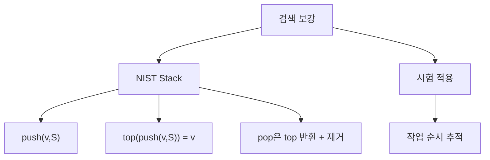

- NIST DADS는 스택의 기본 연산으로 `push`, `top`, `popoff`를 제시한다.
- NIST 설명에서 `top(push(v, S)) = v`는 방금 Push한 값이 Top이 된다는 의미이다.
- 시험 문제에서는 수학적 정의보다 작업 순서 추적이 더 중요하다.
- Push/Pop 표를 만들 때는 매 단계마다 `출력값`, `스택 내부`, `Top`을 함께 적으면 실수를 줄일 수 있다.

---

## 5. 개념 설명

### 5.1 Push

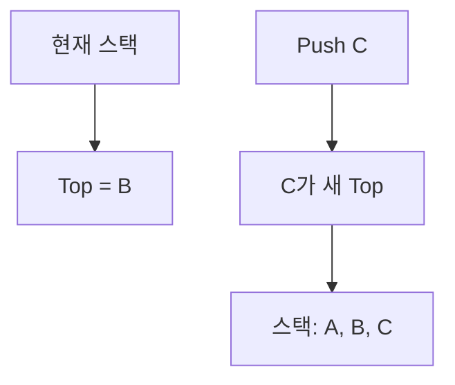

- Push는 스택에 새로운 자료를 삽입하는 연산이다.
- 삽입 위치는 항상 Top이다.
- 예를 들어 스택에 `A`, `B`가 들어 있고 `B`가 Top이라면, `Push C` 후에는 `C`가 Top이 된다.
- Push를 할수록 스택에 쌓인 자료 수가 증가한다.
- 배열 구현에서는 Top 인덱스를 증가시키고 그 위치에 값을 저장하는 방식으로 설명한다.

### 5.2 Pop

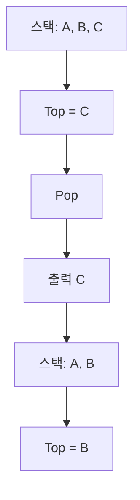

- Pop은 스택의 Top 자료를 꺼내는 연산이다.
- Pop된 자료는 출력되거나 반환되고, 스택에서는 제거된다.
- 예를 들어 스택이 아래에서 위로 `A, B, C`라면 Pop 결과는 `C`이다.
- 그 후 `B`가 새로운 Top이 된다.
- Pop을 할수록 스택에 남은 자료 수가 감소한다.

### 5.3 PDF 예제 추적

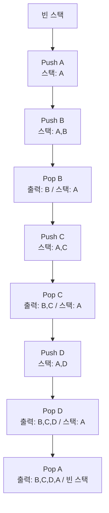

| 단계 | 작업 | 스택 상태 | 출력 |
|---:|---|---|---|
| 1 | `PUSH A` | `A` |  |
| 2 | `PUSH B` | `A, B` |  |
| 3 | `POP` | `A` | `B` |
| 4 | `PUSH C` | `A, C` | `B` |
| 5 | `POP` | `A` | `B, C` |
| 6 | `PUSH D` | `A, D` | `B, C` |
| 7 | `POP` | `A` | `B, C, D` |
| 8 | `POP` | 빈 스택 | `B, C, D, A` |

- `A`를 먼저 Push해 아래에 깔아 두고, `B`, `C`, `D`는 들어오자마자 Pop한다.
- 마지막에 남아 있던 `A`를 Pop하면 출력 순서가 `B, C, D, A`가 된다.
- 이 예제의 핵심은 “먼저 들어간 A를 아래에 보관해 두는 것”이다.

---

## 6. 시험 포인트

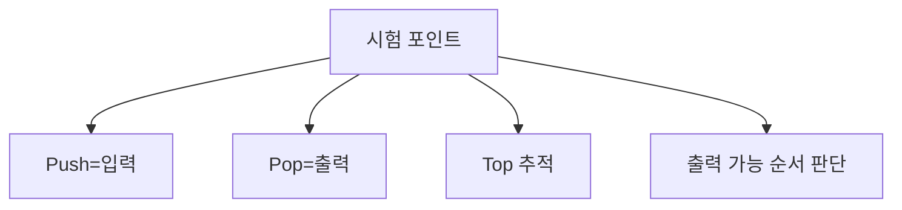

- `Push`는 삽입 또는 입력이다.
- `Pop`은 삭제 또는 출력이다.
- Push와 Pop은 모두 Top에서 일어난다.
- 스택은 LIFO이므로 Pop할 때는 항상 가장 최근에 Push된 자료가 나온다.
- 입력 순서가 `A, B, C, D`로 고정되어 있으면, 아직 입력되지 않은 자료를 먼저 출력할 수 없다.
- 목표 출력 순서를 만들 수 있는지 판단하려면 다음 절차를 따른다.
  - 목표 출력의 첫 번째 자료가 나올 때까지 입력 순서대로 Push한다.
  - Top이 목표 출력 자료와 같으면 Pop한다.
  - 다르면 다음 입력 자료를 Push한다.
  - 입력 자료를 모두 Push했는데도 Top이 목표 출력과 다르면 불가능하다.

---

## 7. 헷갈리는 비교

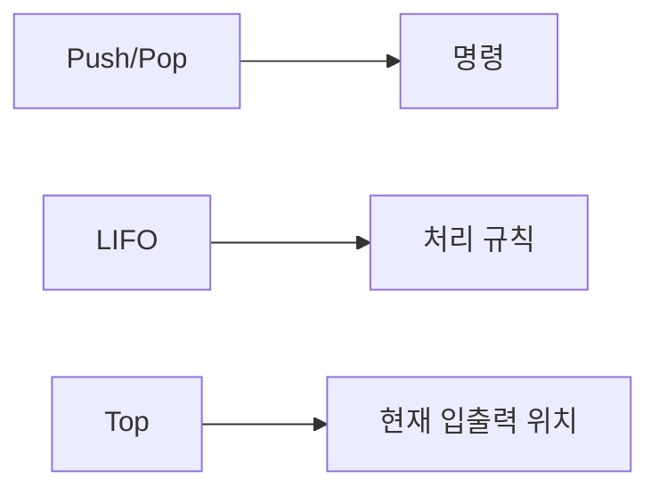

| 구분 | 의미 | 헷갈리는 지점 |
|---|---|---|
| Push | 자료를 스택에 넣음 | 출력이 아니라 입력 |
| Pop | 자료를 스택에서 꺼냄 | 단순 조회가 아니라 제거 포함 |
| Top | 현재 가장 위의 자료 | 다음 Pop 대상 |
| Peek/Top 조회 | 가장 위 자료 확인 | 제거하지 않는 경우가 많음 |
| LIFO | 마지막 입력이 먼저 출력 | Push/Pop의 결과 규칙 |

- `Pop`은 보통 자료를 꺼내면서 스택에서 제거한다.
- `Top` 또는 `Peek`는 현재 위 자료를 확인하는 의미로 쓰이며, 제거하지 않는 조회 연산으로 설명되는 경우가 많다.
- 시험에서 `출력`이라는 표현은 Pop 결과를 의미하는 경우가 많다.

---

## 8. 예시 또는 암기 포인트

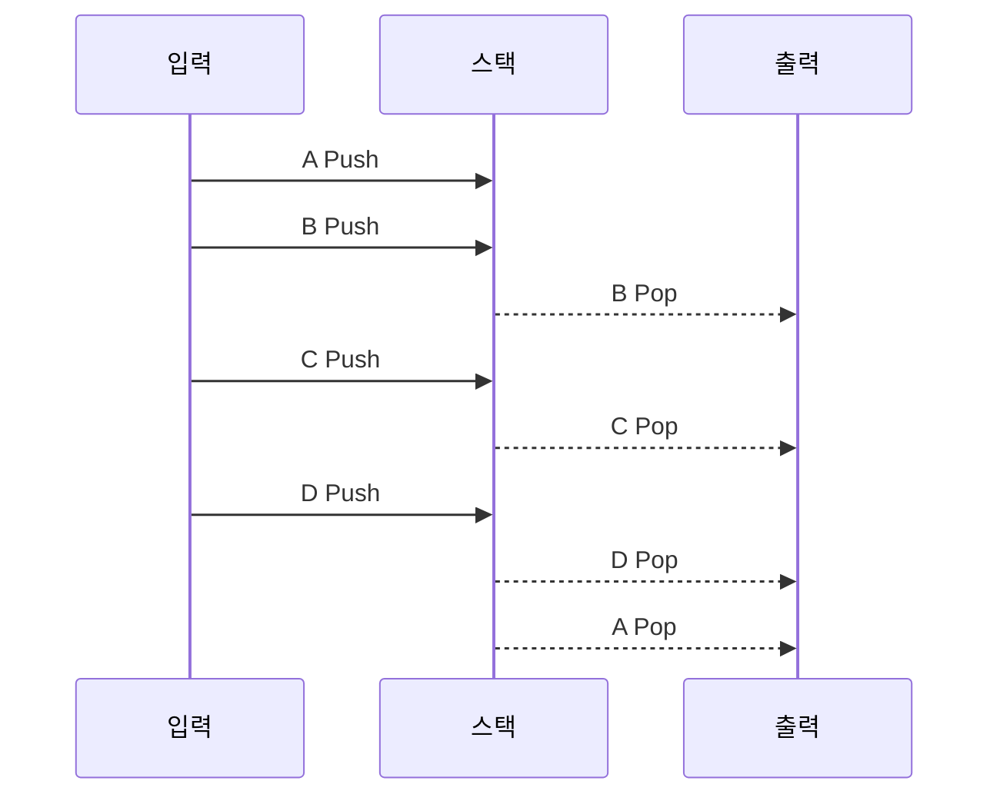

- 암기:
  - `Push = Put`
  - `Pop = Pull out`
  - `Top = 다음에 나갈 후보`
- PDF 예제 암기:
  - 입력 `A B C D`
  - 출력 `B C D A`
  - 작업 `PUSH A, PUSH B, POP B, PUSH C, POP C, PUSH D, POP D, POP A`
- 손으로 풀 때는 아래처럼 적는다.
  - `스택`: 현재 남아 있는 값
  - `출력`: Pop된 값
  - `다음 목표`: 목표 출력 순서에서 아직 나오지 않은 첫 값

---

## 9. 빠른 복습

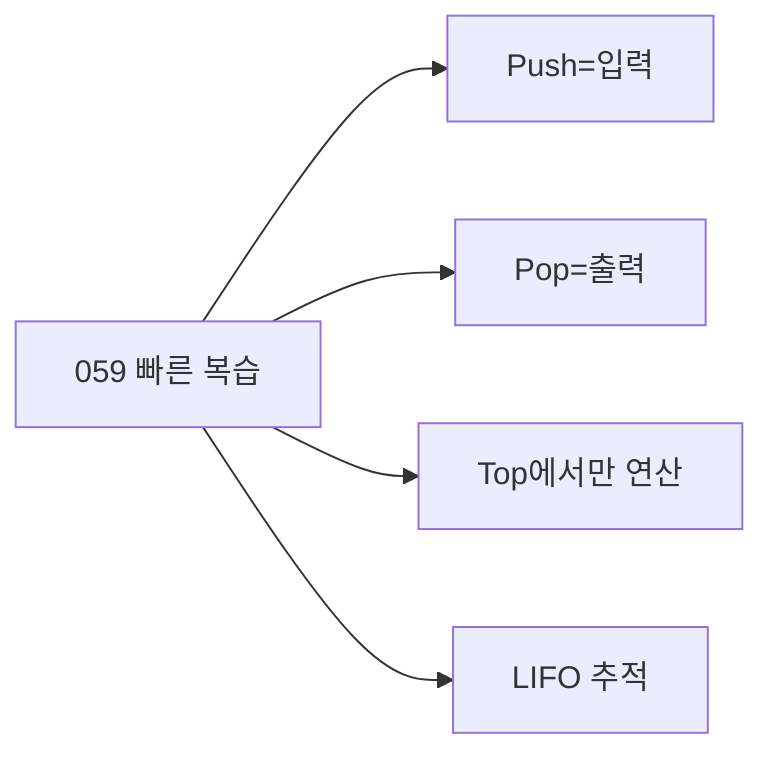

- 챕터명: `059 스택의 삽입(Push)과 삭제(Pop)`
- PDF 확인 위치: `9페이지`
- `PUSH`: 스택에 자료를 입력하는 명령
- `POP`: 스택에서 자료를 출력하는 명령
- Pop 결과는 항상 현재 Top 자료이다.
- PDF 예제의 출력 순서 `B, C, D, A`는 다음 순서로 가능하다.
  - `PUSH A -> PUSH B -> POP B -> PUSH C -> POP C -> PUSH D -> POP D -> POP A`
- 스택 추적 문제는 그림을 그려서 Top을 따라가면 실수가 줄어든다.

---

## 10. 참고 링크

- 기준 PDF: `/Users/nes0903/Documents/study/정보처리기사/핵심요약집_2026_정보처리기사필기핵심요약.pdf`
- [Q-Net - 정보처리기사 종목 정보](https://www.q-net.or.kr/crf005.do?gId=&gSite=Q&id=crf00503&jmCd=1320&tabGbn=1)
- [NIST DADS - stack](https://xlinux.nist.gov/dads/HTML/stack.html)
- [NIST DADS - LIFO](https://xlinux.nist.gov/dads/HTML/lifo.html)

