# 060 방향 무방향 그래프의 최대 간선 수

작성 기준일: 2026-06-01
검색/보강일: 2026-06-01
과목: `2과목 소프트웨어 개발`
기준 PDF: `/Users/nes0903/Documents/study/정보처리기사/핵심요약집_2026_정보처리기사필기핵심요약.pdf`
PDF 확인 위치: `9페이지`
검색 보강: NIST DADS의 complete graph, sparse graph 설명과 그래프 간선 수 공식 자료를 참고하여 시험 계산 중심으로 확장
주제별 검색 키워드: `undirected graph maximum edges n(n-1)/2`, `directed graph maximum edges n(n-1)`, `NIST complete graph sparse graph directed graph maximum edges`

---

## 1. 한 줄 요약

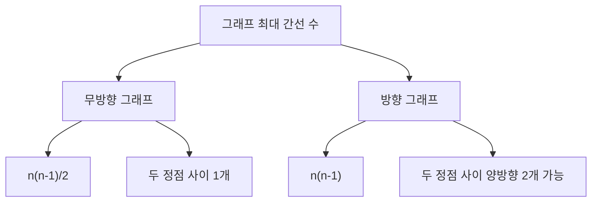

- 정점이 `n`개인 단순 무방향 그래프의 최대 간선 수는 `n(n-1)/2`이다.
- 정점이 `n`개인 단순 방향 그래프의 최대 간선 수는 `n(n-1)`이다.
- 무방향 그래프는 `A-B`와 `B-A`를 같은 간선으로 본다.
- 방향 그래프는 `A -> B`와 `B -> A`를 서로 다른 간선으로 볼 수 있다.
- 시험에서는 공식을 그대로 묻거나, `n` 값을 주고 계산하게 한다.

---

## 2. 한눈에 보는 구조

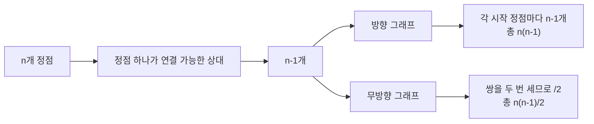

- 정점 하나는 자기 자신을 제외한 `n-1`개의 정점과 연결될 수 있다.
- 방향 그래프에서는 출발 정점과 도착 정점의 순서가 중요하므로 `n(n-1)`개가 가능하다.
- 무방향 그래프에서는 `{A, B}`와 `{B, A}`가 같은 간선이므로 두 번 센 값을 2로 나눈다.
- 따라서 무방향 그래프 공식은 `n(n-1)/2`이다.

---

## 3. PDF 기준 핵심

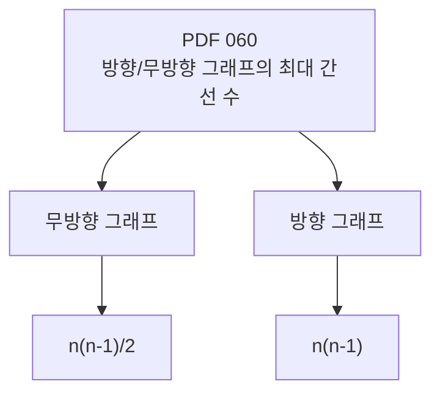

- 기준 PDF의 핵심 문장:
  - `무방향 그래프의 최대 간선 수: n(n-1)/2`
  - `방향 그래프의 최대 간선 수: n(n-1)`
- PDF는 증명보다 공식 암기를 요구한다.
- 시험에서는 `n=5`, `n=6`, `n=10`처럼 정점 수를 주고 빠르게 계산하게 할 수 있다.
- 공식의 전제는 일반적으로 자기 자신으로 가는 루프와 중복 간선을 제외한 단순 그래프 기준으로 이해한다.

---

## 4. 검색으로 보강한 관점

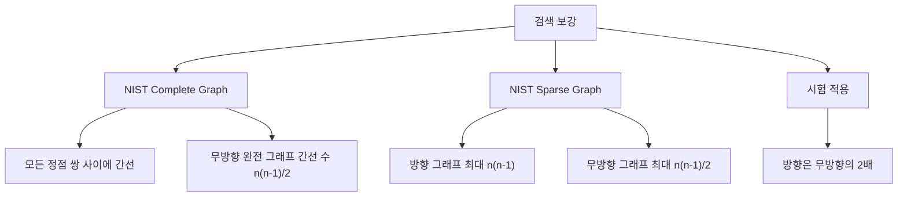

- NIST DADS의 complete graph 설명은 무방향 완전 그래프를 “모든 정점 쌍 사이에 간선이 있는 그래프”로 정의한다.
- NIST DADS는 완전 그래프의 간선 수를 `n(n-1)/2`로 제시한다.
- NIST DADS의 sparse graph 설명은 방향 그래프의 최대 간선 수가 `n(n-1)`, 무방향 그래프의 최대 간선 수가 `n(n-1)/2`임을 함께 제시한다.
- 시험에서는 완전 그래프라는 용어가 직접 나오지 않아도 “최대 간선 수”는 모든 가능한 정점 쌍을 연결한 경우로 생각하면 된다.

---

## 5. 개념 설명

### 5.1 무방향 그래프의 최대 간선 수

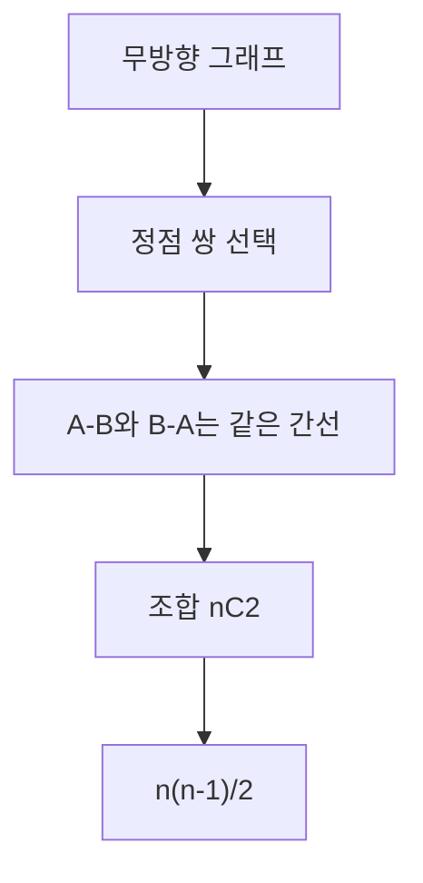

- 무방향 그래프에서는 간선에 방향이 없다.
- 두 정점 `A`, `B`가 연결되어 있으면 `A-B`와 `B-A`를 구분하지 않는다.
- 정점 `n`개 중 서로 다른 두 정점을 고르는 경우의 수가 최대 간선 수가 된다.
- 서로 다른 두 정점을 고르는 경우의 수는 조합 `nC2`이다.
- 계산하면 다음과 같다.
  - `nC2 = n(n-1)/2`
- 예를 들어 정점이 4개라면 가능한 무방향 간선은 다음 6개이다.
  - `A-B`
  - `A-C`
  - `A-D`
  - `B-C`
  - `B-D`
  - `C-D`
- 공식으로 계산해도 `4(4-1)/2 = 6`이다.

### 5.2 방향 그래프의 최대 간선 수

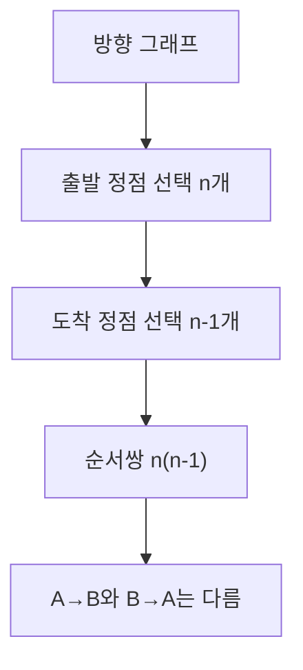

- 방향 그래프에서는 간선에 방향이 있다.
- `A -> B`와 `B -> A`는 서로 다른 간선이다.
- 출발 정점은 `n`가지로 고를 수 있다.
- 각 출발 정점에서 자기 자신을 제외한 도착 정점은 `n-1`가지이다.
- 따라서 가능한 방향 간선 수는 `n(n-1)`이다.
- 예를 들어 정점이 4개라면 최대 방향 간선 수는 `4(4-1) = 12`이다.
- 이는 무방향 최대 간선 수 6개의 2배이다.

### 5.3 왜 방향 그래프가 2배인가

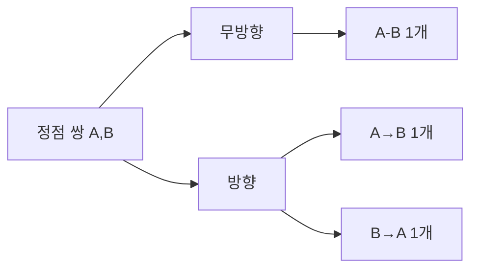

- 무방향 그래프에서 두 정점 사이에는 간선이 최대 1개이다.
- 방향 그래프에서는 같은 두 정점 사이에도 `A -> B`, `B -> A` 두 방향이 가능하다.
- 그래서 같은 정점 수라면 방향 그래프의 최대 간선 수가 무방향 그래프의 2배이다.
- 공식도 다음처럼 연결된다.
  - 무방향: `n(n-1)/2`
  - 방향: `2 x n(n-1)/2 = n(n-1)`

---

## 6. 시험 포인트

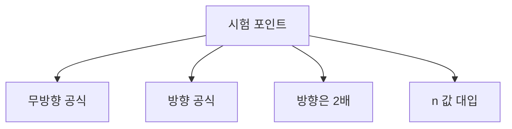

- 무방향 그래프의 최대 간선 수는 `n(n-1)/2`이다.
- 방향 그래프의 최대 간선 수는 `n(n-1)`이다.
- 방향 그래프는 무방향 그래프 최대 간선 수의 2배이다.
- `n`은 정점 또는 노드의 수이다.
- 자기 자신으로 가는 루프를 포함하지 않는 단순 그래프 기준으로 계산한다.
- `n=5`이면:
  - 무방향: `5 x 4 / 2 = 10`
  - 방향: `5 x 4 = 20`
- `n=10`이면:
  - 무방향: `10 x 9 / 2 = 45`
  - 방향: `10 x 9 = 90`

---

## 7. 헷갈리는 비교

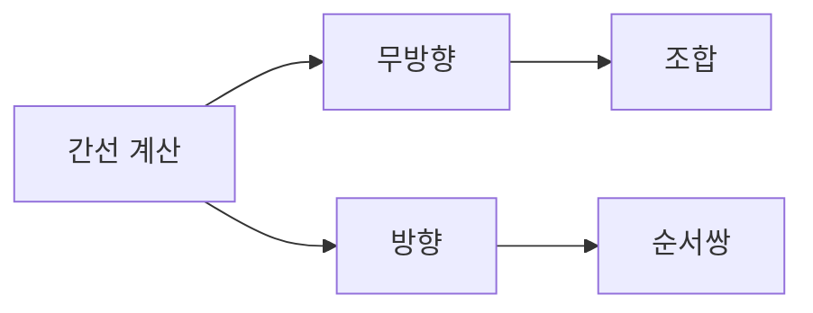

| 구분 | 무방향 그래프 | 방향 그래프 |
|---|---|---|
| 간선 방향 | 없음 | 있음 |
| `A-B`, `B-A` | 같은 간선 | 서로 다른 간선 |
| 계산 관점 | 서로 다른 두 정점 선택 | 출발 정점과 도착 정점 선택 |
| 공식 | `n(n-1)/2` | `n(n-1)` |
| `n=4`일 때 | 6개 | 12개 |
| 시험 단서 | 무방향, undirected | 방향, directed, arc |

- 무방향은 조합이다.
- 방향은 순서가 있는 선택이다.
- 방향 그래프에서 자기 자신으로 가는 루프를 허용하면 공식이 달라질 수 있지만, 정보처리기사 PDF 공식은 루프 없는 기준이다.
- 문제에서 별도 조건이 없다면 PDF 공식을 그대로 사용한다.

---

## 8. 예시 또는 암기 포인트

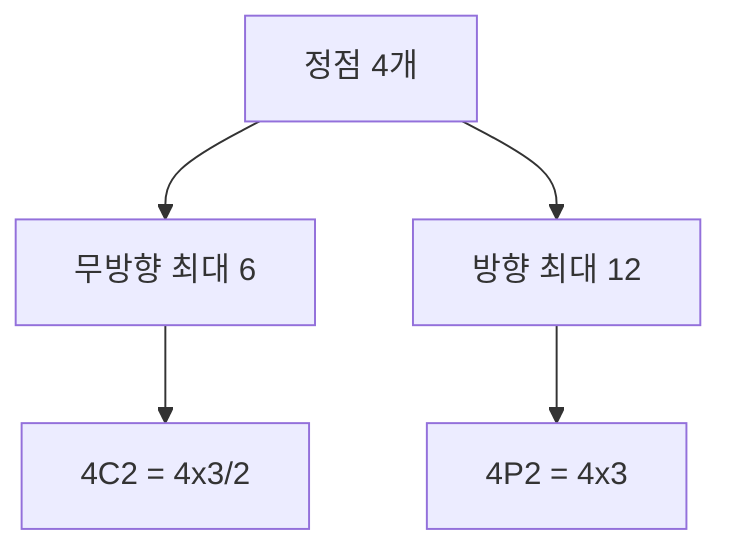

- 암기:
  - `무방향은 나누기 2`
  - `방향은 나누지 않음`
- 계산 감각:
  - 정점 3개: 무방향 3, 방향 6
  - 정점 4개: 무방향 6, 방향 12
  - 정점 5개: 무방향 10, 방향 20
  - 정점 6개: 무방향 15, 방향 30
- 빠른 판단:
  - “두 정점 사이에 선 하나”면 무방향이다.
  - “화살표가 양방향 각각 가능”하면 방향이다.

---

## 9. 빠른 복습

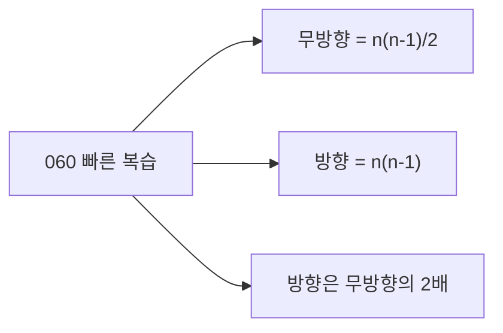

- 챕터명: `060 방향 무방향 그래프의 최대 간선 수`
- PDF 확인 위치: `9페이지`
- 무방향 그래프 최대 간선 수: `n(n-1)/2`
- 방향 그래프 최대 간선 수: `n(n-1)`
- `n`은 정점 수이다.
- 무방향은 `A-B`와 `B-A`가 같다.
- 방향은 `A -> B`와 `B -> A`가 다르다.
- 계산 문제는 먼저 방향/무방향을 확인하고 공식에 대입한다.

---

## 10. 참고 링크

- 기준 PDF: `/Users/nes0903/Documents/study/정보처리기사/핵심요약집_2026_정보처리기사필기핵심요약.pdf`
- [Q-Net - 정보처리기사 종목 정보](https://www.q-net.or.kr/crf005.do?gId=&gSite=Q&id=crf00503&jmCd=1320&tabGbn=1)
- [NIST DADS - complete graph](https://xlinux.nist.gov/dads/HTML/completeGraph.html)
- [NIST DADS - sparse graph](https://xlinux.nist.gov/dads/HTML/sparsegraph.html)
- [Baeldung - Determine Maximum Number of Edges in a Directed Graph](https://www.baeldung.com/cs/graphs-max-number-of-edges)
