# 061 트리(Tree)

작성 기준일: 2026-06-01
검색/보강일: 2026-06-01
과목: `2과목 소프트웨어 개발`
기준 PDF: `/Users/nes0903/Documents/study/정보처리기사/핵심요약집_2026_정보처리기사필기핵심요약.pdf`
PDF 확인 위치: `9페이지`
검색 보강: NIST DADS의 tree/root/leaf/parent/child 정의와 OpenDSA 트리 자료구조 설명을 참고하여 시험 중심으로 확장
주제별 검색 키워드: `NIST DADS tree root leaf parent child`, `tree data structure node edge no cycle`, `OpenDSA tree data structure traversal`

---

## 1. 한 줄 요약

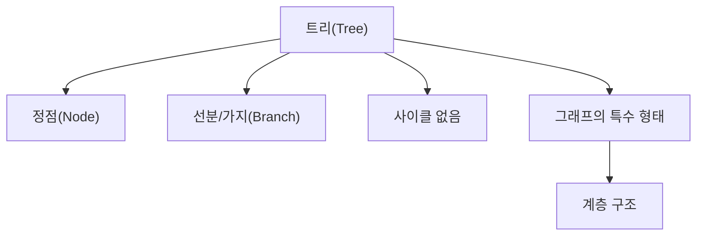

- 트리는 정점과 선분을 이용하여 사이클이 생기지 않도록 구성한 그래프의 특수한 형태이다.
- PDF 기준 핵심 단어는 `정점(Node)`, `선분(Branch)`, `사이클 없음`, `그래프의 특수한 형태`이다.
- 트리는 자료 구조 분류에서 비선형 구조에 속한다.
- 시험에서는 트리의 정의, 용어, 그래프와의 관계, 레벨/차수/리프 같은 기본 개념을 함께 묻기 쉽다.

---

## 2. 한눈에 보는 구조

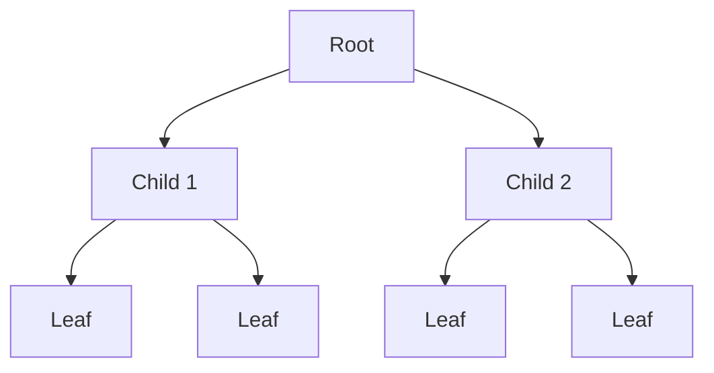

- 트리는 하나의 루트에서 시작해 하위 노드로 뻗어 나가는 계층 구조이다.
- 위쪽 노드는 부모, 아래쪽 노드는 자식이라고 부른다.
- 더 이상 자식이 없는 노드는 단말 노드 또는 리프라고 부른다.
- 트리는 사이클이 없어야 한다.
- 한 노드에서 출발해 간선을 따라 이동하다가 다시 자기 자신으로 돌아오는 구조가 있으면 트리라고 보기 어렵다.

---

## 3. PDF 기준 핵심

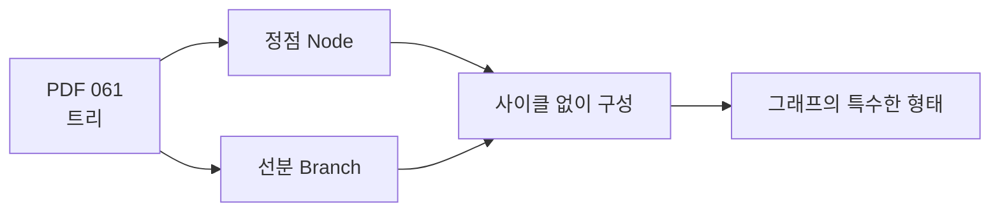

- 기준 PDF의 핵심 문장:
  - `정점(Node, 노드)과 선분(Branch, 가지)을 이용하여 사이클을 이루지 않도록 구성한 그래프(Graph)의 특수한 형태이다.`
- PDF 표현에서 `정점`과 `노드`는 같은 의미로 봐도 된다.
- PDF 표현에서 `선분`, `가지`, `Branch`는 노드와 노드를 연결하는 선이다.
- 트리는 그래프의 특수한 형태이지만, 자료 구조 분류에서는 비선형 구조로 외운다.

---

## 4. 검색으로 보강한 관점

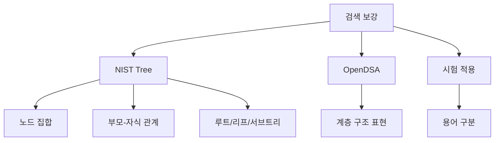

- NIST DADS는 트리를 노드와 부모-자식 관계로 구성된 구조로 설명한다.
- NIST DADS는 `root`, `leaf`, `child`, `parent`, `subtree` 같은 트리 용어를 함께 제시한다.
- OpenDSA도 트리를 계층 구조를 표현하는 자료 구조로 다룬다.
- 정보처리기사 시험에서는 이론적 정의보다 용어 단서와 운행법 문제로 이어지는 기본 구조 이해가 중요하다.

---

## 5. 개념 설명

### 5.1 트리의 구성 요소

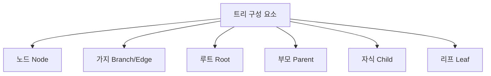

| 용어 | 의미 | 시험 단서 |
|---|---|---|
| 노드(Node) | 트리를 구성하는 데이터 요소 | 정점 |
| 가지(Branch) | 노드와 노드를 연결하는 선 | 간선, edge |
| 루트(Root) | 트리의 최상위 노드 | 부모가 없음 |
| 부모(Parent) | 하위 노드를 직접 연결한 상위 노드 | parent |
| 자식(Child) | 부모 아래에 직접 연결된 노드 | child |
| 형제(Sibling) | 같은 부모를 가진 노드들 | sibling |
| 리프(Leaf) | 자식이 없는 단말 노드 | terminal node |

- 트리는 그래프 용어와 자료구조 용어가 섞여 나온다.
- `정점`, `노드`, `Node`는 같은 계열로 묶는다.
- `선분`, `가지`, `간선`, `Branch`, `Edge`는 연결 관계로 묶는다.
- 리프는 더 이상 내려갈 자식이 없는 끝 노드이다.

### 5.2 트리의 특징

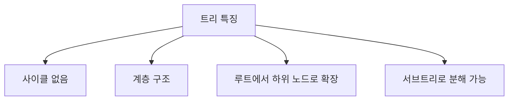

- 트리는 사이클이 없는 연결 구조이다.
- 일반적인 트리는 하나의 루트를 기준으로 계층을 형성한다.
- 루트 아래의 각 자식 노드는 다시 작은 트리, 즉 서브트리의 루트가 될 수 있다.
- 파일 시스템의 폴더 구조, 조직도, XML/HTML 문서 구조는 트리로 이해하기 쉽다.
- 그래프는 순환 구조가 가능하지만, 트리는 사이클이 없어야 한다는 점이 중요하다.

### 5.3 레벨과 차수

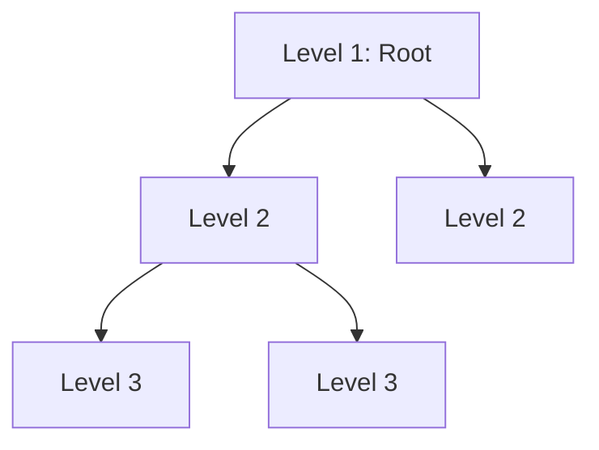

- `레벨(Level)`은 루트에서 얼마나 떨어져 있는지를 나타내는 계층 번호이다.
- PDF 그림처럼 루트를 Level 1로 두는 방식이 시험에서 자주 사용된다.
- `차수(Degree)`는 한 노드가 가진 자식 노드의 수이다.
- 트리의 차수는 트리에 있는 노드들의 차수 중 가장 큰 값으로 설명하는 경우가 많다.
- 이진 트리는 각 노드의 차수가 최대 2인 트리이다.

---

## 6. 시험 포인트

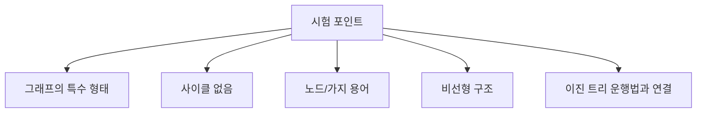

- 트리는 그래프의 특수한 형태이다.
- 트리는 사이클을 이루지 않는다.
- 트리는 정점과 선분으로 구성된다.
- 트리는 비선형 자료 구조이다.
- 루트, 부모, 자식, 리프, 레벨, 차수 같은 용어를 함께 익혀야 한다.
- 062의 이진 트리 운행법은 트리 구조를 알고 있어야 풀 수 있다.

---

## 7. 헷갈리는 비교

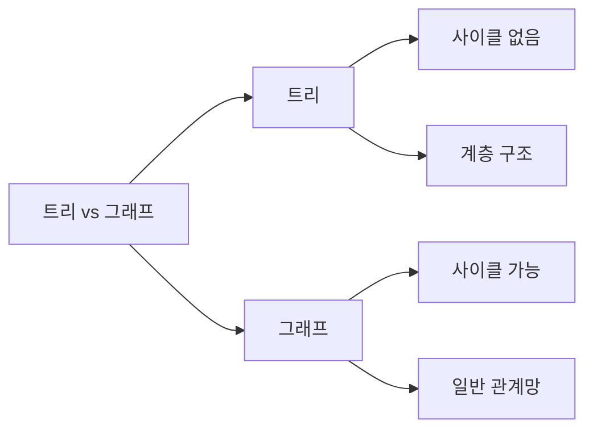

| 구분 | 트리 | 그래프 |
|---|---|---|
| 성격 | 그래프의 특수한 형태 | 더 일반적인 관계 구조 |
| 사이클 | 없음 | 있을 수 있음 |
| 계층 | 보통 루트 중심 계층 구조 | 계층이 아닐 수 있음 |
| 연결 | 부모-자식 관계가 중요 | 정점-간선 관계가 중요 |
| 시험 단서 | 루트, 부모, 자식, 리프, 레벨 | 정점, 간선, 방향/무방향, 최대 간선 수 |

- 모든 트리는 그래프 관점으로 볼 수 있지만, 모든 그래프가 트리는 아니다.
- 트리는 사이클이 없다는 조건이 매우 중요하다.
- 트리의 노드 간 관계는 대개 위아래 계층으로 해석한다.

---

## 8. 예시 또는 암기 포인트

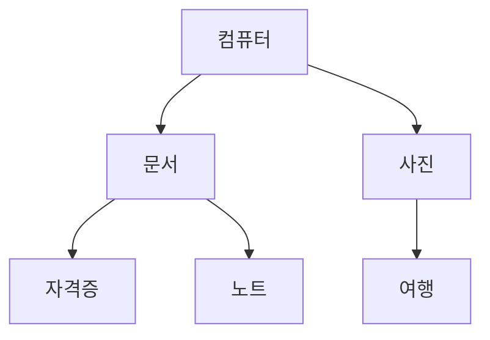

- 폴더 구조는 트리의 대표 예시이다.
- 최상위 폴더는 루트처럼 볼 수 있다.
- 하위 폴더는 자식 노드이다.
- 마지막 파일이나 더 이상 하위 항목이 없는 폴더는 리프처럼 볼 수 있다.
- 암기:
  - `트리 = 루트에서 가지가 뻗는 계층 구조`
  - `트리 = 사이클 없는 그래프`
  - `노드와 가지로 구성`

---

## 9. 빠른 복습

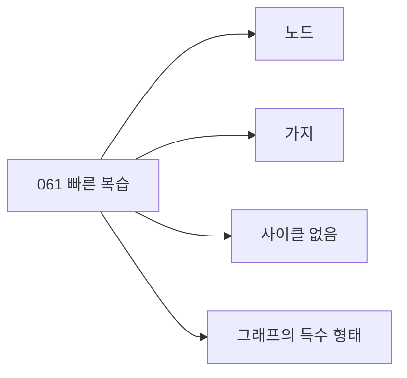

- 챕터명: `061 트리(Tree)`
- PDF 확인 위치: `9페이지`
- 트리는 정점과 선분으로 구성된다.
- 트리는 사이클을 이루지 않는다.
- 트리는 그래프의 특수한 형태이다.
- 트리는 비선형 구조이다.
- 핵심 용어는 루트, 부모, 자식, 리프, 레벨, 차수이다.

---

## 10. 참고 링크

- 기준 PDF: `/Users/nes0903/Documents/study/정보처리기사/핵심요약집_2026_정보처리기사필기핵심요약.pdf`
- [Q-Net - 정보처리기사 종목 정보](https://www.q-net.or.kr/crf005.do?gId=&gSite=Q&id=crf00503&jmCd=1320&tabGbn=1)
- [NIST DADS - tree](https://xlinux.nist.gov/dads/HTML/tree.html)
- [NIST DADS - root](https://xlinux.nist.gov/dads/HTML/root.html)
- [NIST DADS - leaf](https://xlinux.nist.gov/dads/HTML/leaf.html)
- [OpenDSA - Tree](https://opendsa-server.cs.vt.edu/ODSA/Books/CS3/html/TreeIntro.html)

