# 062 이진 트리의 운행법

작성 기준일: 2026-06-01
검색/보강일: 2026-06-01
과목: `2과목 소프트웨어 개발`
기준 PDF: `/Users/nes0903/Documents/study/정보처리기사/핵심요약집_2026_정보처리기사필기핵심요약.pdf`
PDF 확인 위치: `9~10페이지`
검색 보강: NIST DADS의 tree traversal, preorder, inorder, postorder 정의와 OpenDSA 순회 설명을 참고하여 시험 풀이 중심으로 확장
주제별 검색 키워드: `binary tree traversal preorder inorder postorder`, `NIST DADS preorder inorder postorder tree traversal`, `OpenDSA binary tree traversal`

---

## 1. 한 줄 요약

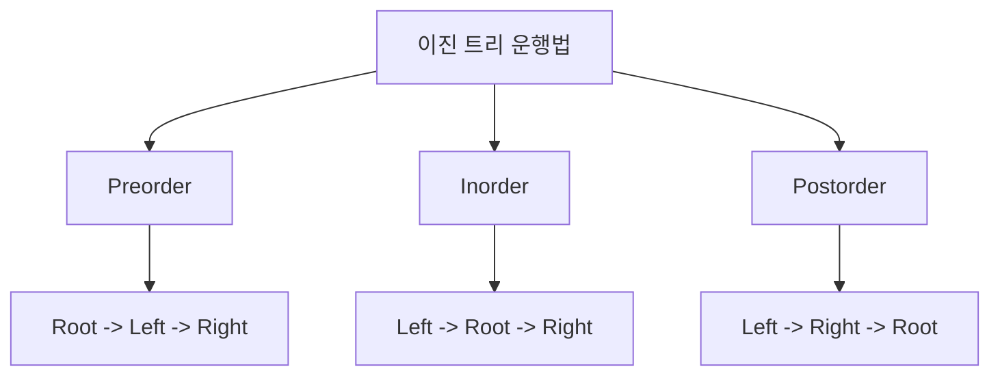

- 이진 트리의 대표 운행법은 `Preorder`, `Inorder`, `Postorder`이다.
- 핵심은 루트(Root)를 언제 방문하느냐이다.
- `Preorder`는 루트를 먼저 방문한다.
- `Inorder`는 왼쪽을 방문한 뒤 루트를 방문한다.
- `Postorder`는 루트를 마지막에 방문한다.
- 시험에서는 그림을 주고 방문 순서를 쓰게 하는 문제가 자주 나온다.

---

## 2. 한눈에 보는 구조

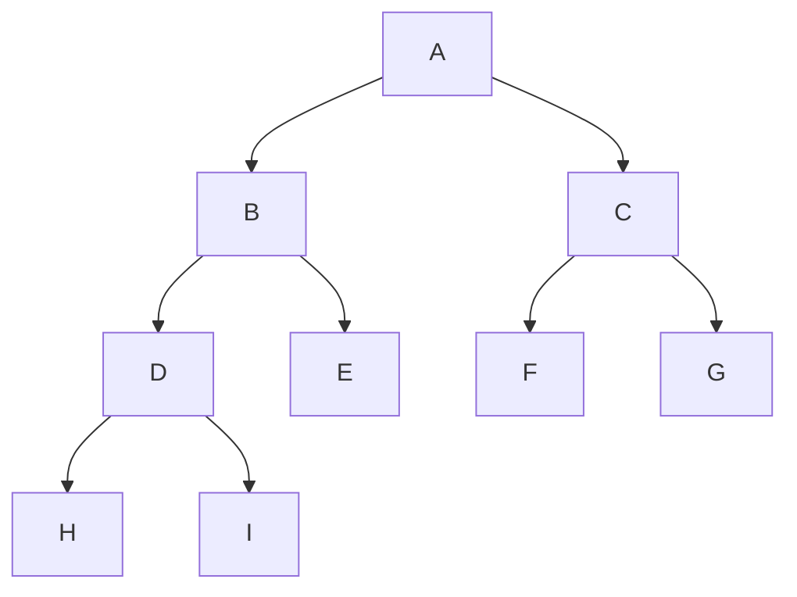

- PDF 예제 트리는 위 구조로 해석할 수 있다.
- 루트는 `A`이다.
- `A`의 왼쪽 서브트리는 `B`, 오른쪽 서브트리는 `C`이다.
- `B`의 왼쪽은 `D`, 오른쪽은 `E`이다.
- `D`의 왼쪽은 `H`, 오른쪽은 `I`이다.
- `C`의 왼쪽은 `F`, 오른쪽은 `G`이다.

---

## 3. PDF 기준 핵심

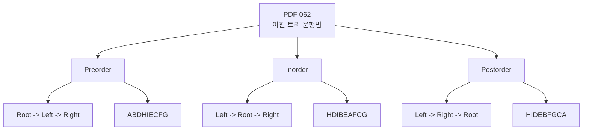

- 기준 PDF 예제의 방문 순서:
  - `Preorder`: `ABDHIECFG`
  - `Inorder`: `HDIBEAFCG`
  - `Postorder`: `HIDEBFGCA`
- 기준 PDF의 운행 규칙:
  - `Preorder`: `Root -> Left -> Right`
  - `Inorder`: `Left -> Root -> Right`
  - `Postorder`: `Left -> Right -> Root`
- 시험에서는 영어 이름과 방문 순서를 매칭하는 문제가 자주 나온다.

---

## 4. 검색으로 보강한 관점

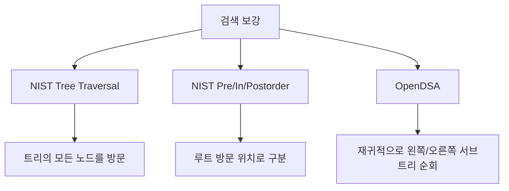

- NIST DADS는 tree traversal을 트리의 각 노드를 체계적으로 방문하는 과정으로 설명한다.
- Preorder, Inorder, Postorder는 루트 노드를 방문하는 위치에 따라 이름이 붙는다.
- OpenDSA도 이진 트리 순회를 왼쪽 서브트리, 루트, 오른쪽 서브트리의 재귀적 방문 순서로 설명한다.
- 정보처리기사 문제에서는 재귀 코드보다 방문 순서 산출이 중요하다.

---

## 5. 개념 설명

### 5.1 Preorder

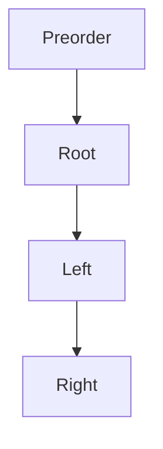

- Preorder는 `Root -> Left -> Right` 순서이다.
- 루트를 먼저 방문하기 때문에 전위 순회라고도 한다.
- PDF 예제에 적용하면 다음처럼 진행된다.
  - 전체 루트 `A` 방문
  - 왼쪽 서브트리 `B` 방문
  - `B`의 왼쪽 `D` 방문
  - `D`의 왼쪽 `H`, 오른쪽 `I` 방문
  - `B`의 오른쪽 `E` 방문
  - 오른쪽 서브트리 `C` 방문
  - `C`의 왼쪽 `F`, 오른쪽 `G` 방문
- 결과는 `ABDHIECFG`이다.

### 5.2 Inorder

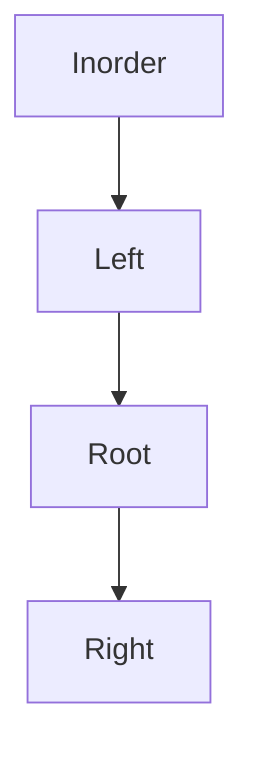

- Inorder는 `Left -> Root -> Right` 순서이다.
- 루트를 가운데 방문하기 때문에 중위 순회라고도 한다.
- PDF 예제에 적용하면 다음처럼 진행된다.
  - `A`의 왼쪽 서브트리부터 방문
  - `B`의 왼쪽인 `D` 서브트리 방문
  - `D`의 왼쪽 `H`, 루트 `D`, 오른쪽 `I` 방문
  - 루트 `B`, 오른쪽 `E` 방문
  - 전체 루트 `A` 방문
  - 오른쪽 서브트리 `C`에서 `F`, `C`, `G` 방문
- 결과는 `HDIBEAFCG`이다.

### 5.3 Postorder

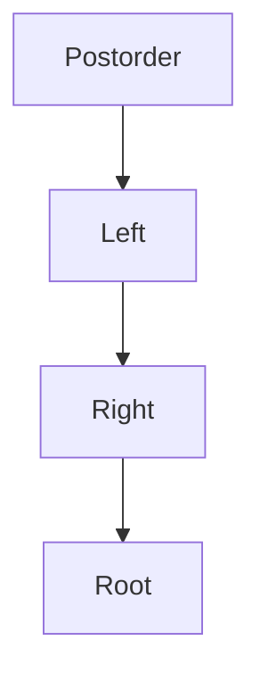

- Postorder는 `Left -> Right -> Root` 순서이다.
- 루트를 마지막에 방문하기 때문에 후위 순회라고도 한다.
- PDF 예제에 적용하면 다음처럼 진행된다.
  - `A`의 왼쪽 서브트리 `B`를 먼저 처리
  - `D`의 왼쪽 `H`, 오른쪽 `I`, 루트 `D` 방문
  - `B`의 오른쪽 `E`, 루트 `B` 방문
  - `A`의 오른쪽 서브트리 `C`에서 `F`, `G`, `C` 방문
  - 마지막으로 전체 루트 `A` 방문
- 결과는 `HIDEBFGCA`이다.

---

## 6. 시험 포인트

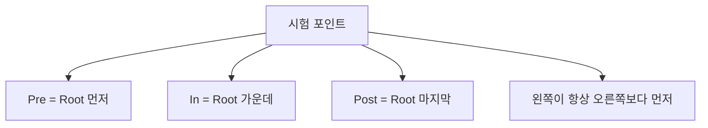

- `Preorder`는 루트를 먼저 방문한다.
- `Inorder`는 루트를 왼쪽과 오른쪽 사이에 방문한다.
- `Postorder`는 루트를 마지막에 방문한다.
- 세 운행법 모두 왼쪽 서브트리를 오른쪽 서브트리보다 먼저 방문한다.
- 이름만 보고 루트 위치를 판단한다.
  - `Pre`: 루트가 앞
  - `In`: 루트가 가운데
  - `Post`: 루트가 뒤
- 시험 풀이 시 큰 트리를 한 번에 보지 말고 작은 서브트리 단위로 나누어 푼다.

---

## 7. 헷갈리는 비교

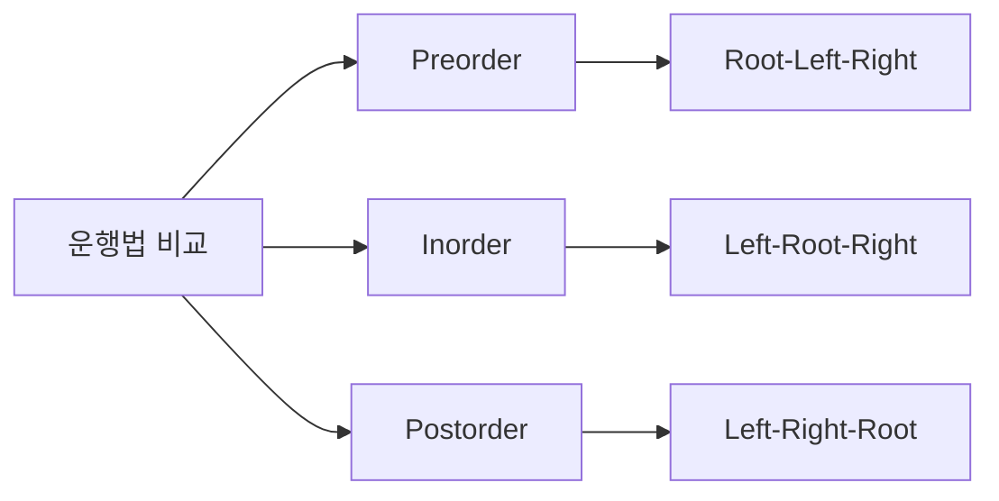

| 운행법 | 정확한 순서 | 한국어 이름 | 루트 방문 위치 | PDF 예제 결과 |
|---|---|---|---|---|
| Preorder | `Root -> Left -> Right` | 전위 순회 | 맨 앞 | `ABDHIECFG` |
| Inorder | `Left -> Root -> Right` | 중위 순회 | 가운데 | `HDIBEAFCG` |
| Postorder | `Left -> Right -> Root` | 후위 순회 | 맨 뒤 | `HIDEBFGCA` |

- `Pre`, `In`, `Post`는 “루트가 언제 나오느냐”를 뜻한다고 외운다.
- `Left`와 `Right`의 순서를 바꾸면 안 된다.
- Inorder를 `Root -> Left -> Right`로 착각하면 Preorder와 섞인다.
- Postorder는 전체 루트가 가장 마지막에 나온다.

---

## 8. 예시 또는 암기 포인트

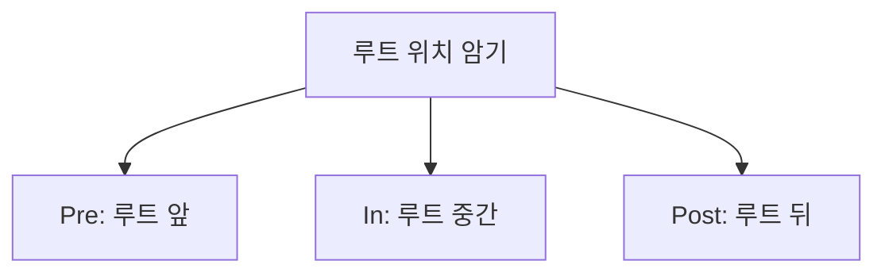

- 암기 문장:
  - `전위는 루트 먼저`
  - `중위는 루트 중간`
  - `후위는 루트 나중`
- 영어 암기:
  - `Pre = Before`
  - `In = In-between`
  - `Post = After`
- PDF 예제 암기:
  - `Preorder = ABDHIECFG`
  - `Inorder = HDIBEAFCG`
  - `Postorder = HIDEBFGCA`
- 풀이 요령:
  - 먼저 루트를 찾는다.
  - 왼쪽 서브트리와 오른쪽 서브트리를 나눈다.
  - 각 서브트리에 같은 규칙을 반복 적용한다.

---

## 9. 빠른 복습

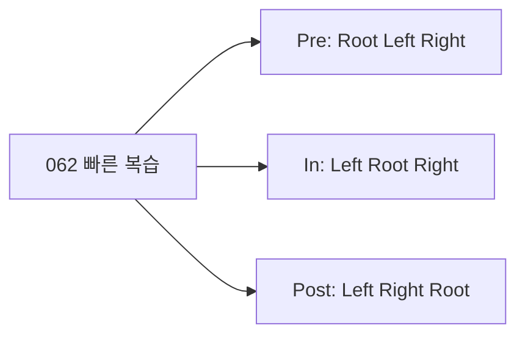

- 챕터명: `062 이진 트리의 운행법`
- PDF 확인 위치: `9~10페이지`
- Preorder: `Root -> Left -> Right`
- Inorder: `Left -> Root -> Right`
- Postorder: `Left -> Right -> Root`
- PDF 예제 결과:
  - `Preorder`: `ABDHIECFG`
  - `Inorder`: `HDIBEAFCG`
  - `Postorder`: `HIDEBFGCA`
- 모든 순회에서 왼쪽 서브트리를 오른쪽 서브트리보다 먼저 본다.

---

## 10. 참고 링크

- 기준 PDF: `/Users/nes0903/Documents/study/정보처리기사/핵심요약집_2026_정보처리기사필기핵심요약.pdf`
- [Q-Net - 정보처리기사 종목 정보](https://www.q-net.or.kr/crf005.do?gId=&gSite=Q&id=crf00503&jmCd=1320&tabGbn=1)
- [NIST DADS - tree traversal](https://xlinux.nist.gov/dads/HTML/treeTraversal.html)
- [NIST DADS - preorder traversal](https://xlinux.nist.gov/dads/HTML/preorderTraversal.html)
- [NIST DADS - in-order traversal](https://xlinux.nist.gov/dads/HTML/inorderTraversal.html)
- [NIST DADS - postorder traversal](https://xlinux.nist.gov/dads/HTML/postorderTraversal.html)
- [OpenDSA - Binary Tree Traversals](https://opendsa-server.cs.vt.edu/ODSA/Books/CS3/html/BinaryTreeTraversal.html)
