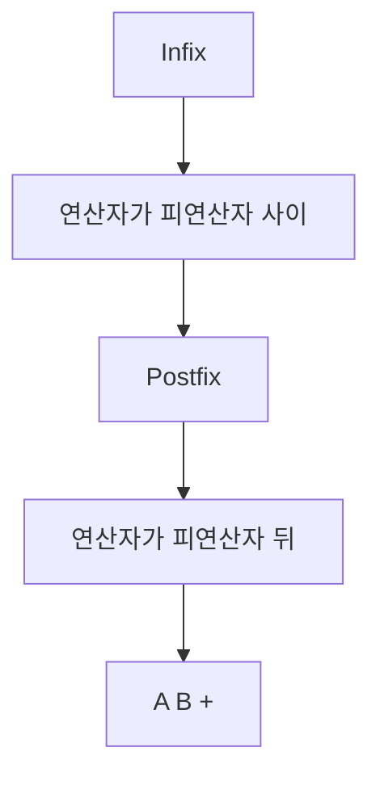
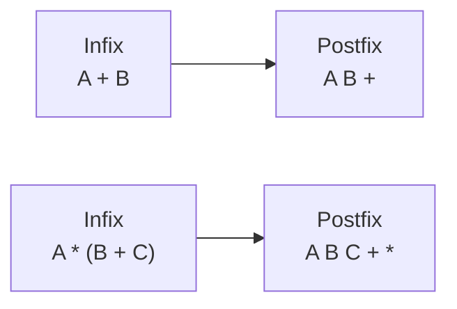
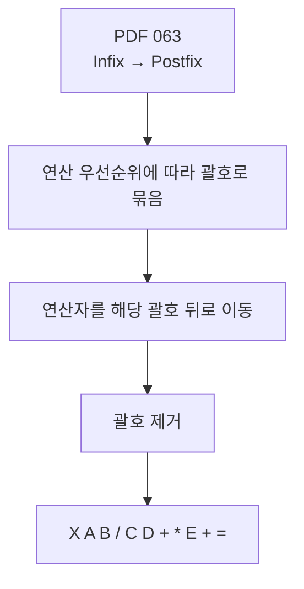
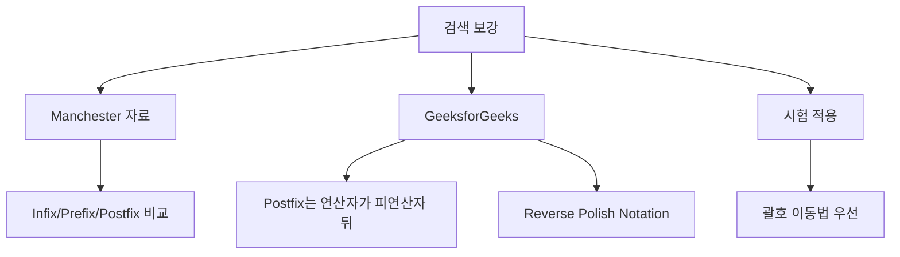
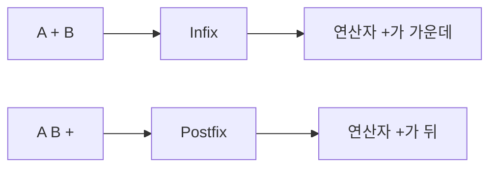
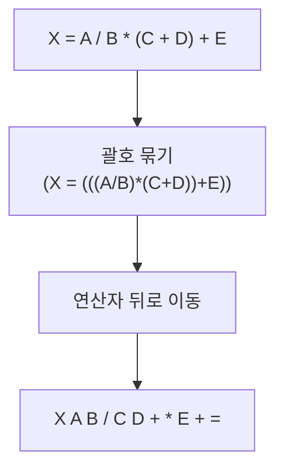
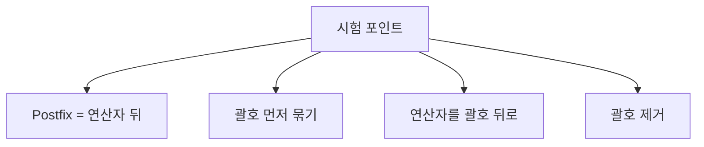
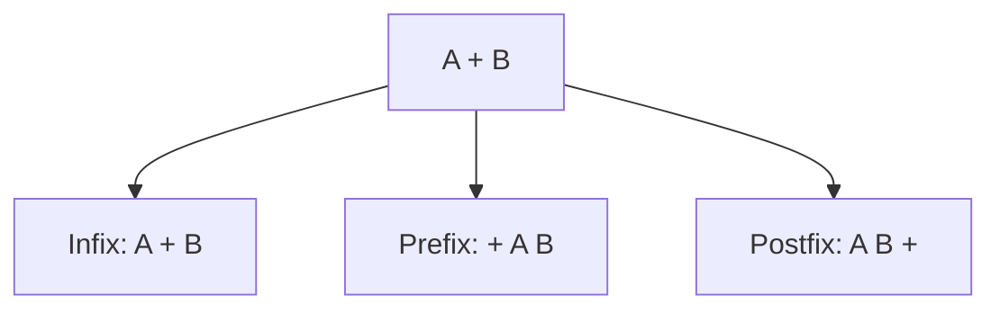
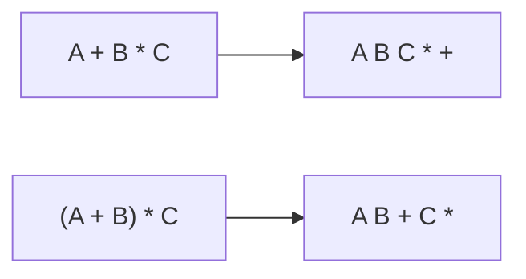
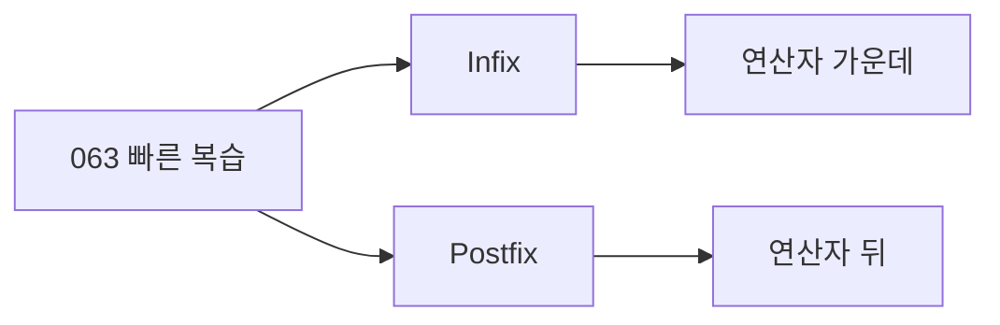

# 063 수식의 표기법(Infix → Postfix)

작성 기준일: 2026-06-01
검색/보강일: 2026-06-01
과목: `2과목 소프트웨어 개발`
기준 PDF: `/Users/nes0903/Documents/study/정보처리기사/핵심요약집_2026_정보처리기사필기핵심요약.pdf`
PDF 확인 위치: `10페이지`
검색 보강: Manchester와 GeeksforGeeks의 Infix/Prefix/Postfix 표기법 설명을 참고하여 PDF 예제 풀이 중심으로 확장
주제별 검색 키워드: `infix to postfix notation stack`, `postfix notation reverse polish notation NIST`, `infix postfix prefix expression notation`

---

## 1. 한 줄 요약

- `Infix`는 연산자가 피연산자 사이에 있는 일반적인 표기법이다.
- `Postfix`는 연산자가 해당 피연산자 두 개의 뒤에 오는 표기법이다.
- PDF 기준 변환 원리는 괄호로 연산 우선순위를 묶고, 연산자를 해당 괄호의 뒤로 옮긴 뒤 괄호를 제거하는 것이다.
- 시험에서는 `X = A / B * (C + D) + E`를 `X A B / C D + * E + =`로 바꾸는 흐름을 이해해야 한다.

---

## 2. 한눈에 보는 구조

- Infix는 사람이 읽기 쉬운 표기법이다.
- Postfix는 연산자가 뒤에 오므로 괄호 없이도 계산 순서를 표현하기 쉽다.
- 컴퓨터는 Postfix를 스택으로 계산하기 쉽다.
- 변환할 때는 연산자의 우선순위와 괄호를 먼저 고려해야 한다.

---

## 3. PDF 기준 핵심

- 기준 PDF 핵심:
  - `Infix로 표기된 수식에서 연산자를 해당 피연산자 두 개의 뒤(오른쪽)에 오도록 이동하면 Postfix가 된다.`
- PDF 예제:
  - Infix: `X = A / B * (C + D) + E`
  - Postfix: `X A B / C D + * E + =`
- PDF 풀이 절차:
  - 연산 우선순위에 따라 괄호로 묶는다.
  - 연산자를 해당 괄호의 뒤로 옮긴다.
  - 괄호를 제거한다.

---

## 4. 검색으로 보강한 관점

- Manchester 자료는 Infix, Prefix, Postfix가 같은 수식을 표현하는 서로 다른 방식이라고 설명한다.
- GeeksforGeeks는 Postfix를 연산자가 피연산자 뒤에 오는 표기법으로 설명하며 Reverse Polish Notation이라고도 부른다.
- 정보처리기사 PDF는 스택 알고리즘보다 괄호 이동법으로 풀이하므로, 시험에서는 PDF 방식이 가장 빠르다.

---

## 5. 개념 설명

### 5.1 Infix와 Postfix의 차이

- `A + B`에서 `+`가 `A`와 `B` 사이에 있으므로 Infix이다.
- `A B +`에서 `+`가 `A`와 `B` 뒤에 있으므로 Postfix이다.
- `A * (B + C)`는 괄호 때문에 `B + C`가 먼저 계산된다.
- Postfix로 쓰면 `A B C + *`가 된다.
- `B C +`가 먼저 계산되고, 그 결과와 `A`를 `*`로 계산한다.

### 5.2 PDF 예제 풀이

- Infix 원식:
  - `X = A / B * (C + D) + E`
- 연산 우선순위:
  - 괄호 안 `C + D`
  - `A / B`
  - `(A / B) * (C + D)`
  - 위 결과 `+ E`
  - 마지막 대입 `=`
- Postfix 변환:
  - `A / B` → `A B /`
  - `C + D` → `C D +`
  - `(A / B) * (C + D)` → `A B / C D + *`
  - `... + E` → `A B / C D + * E +`
  - `X = ...` → `X A B / C D + * E + =`

### 5.3 스택 관점

- Postfix는 괄호가 없어도 계산 순서를 알 수 있다.
- 왼쪽에서 오른쪽으로 읽으며 피연산자는 스택에 넣는다.
- 연산자를 만나면 최근 피연산자 2개를 꺼내 계산한다.
- 계산 결과를 다시 스택에 넣는다.
- 이 때문에 Postfix는 컴퓨터 처리에 유리한 표기법으로 설명된다.

---

## 6. 시험 포인트

- Postfix는 연산자가 피연산자 뒤에 온다.
- `A + B`의 Postfix는 `A B +`이다.
- `A * B + C`는 `(A * B) + C`이므로 `A B * C +`이다.
- 괄호가 있으면 괄호 안을 먼저 처리한다.
- PDF 예제 `X = A / B * (C + D) + E`의 결과는 `X A B / C D + * E + =`이다.
- Prefix와 헷갈리지 않도록 “Post = 뒤”라고 외운다.

---

## 7. 헷갈리는 비교

| 표기법 | 연산자 위치 | 예시 | 암기 |
|---|---|---|---|
| Infix | 피연산자 사이 | `A + B` | 일반 수식 |
| Prefix | 피연산자 앞 | `+ A B` | Pre = 앞 |
| Postfix | 피연산자 뒤 | `A B +` | Post = 뒤 |

- Prefix와 Postfix는 둘 다 괄호를 줄일 수 있지만, 연산자 위치가 반대이다.
- Infix는 사람이 읽기 쉽지만 우선순위와 괄호 처리가 필요하다.
- Postfix는 연산자가 뒤에 있으므로 `A B +`처럼 읽는다.

---

## 8. 예시 또는 암기 포인트

- 암기:
  - `Postfix = 연산자를 뒤로 보낸다`
  - `A + B -> A B +`
  - `A * B -> A B *`
- 예시:
  - `A + B * C`
    - 먼저 `B * C` → `B C *`
    - 그 다음 `A + ...` → `A B C * +`
  - `(A + B) * C`
    - 먼저 `A + B` → `A B +`
    - 그 다음 `... * C` → `A B + C *`

---

## 9. 빠른 복습

- 챕터명: `063 수식의 표기법(Infix → Postfix)`
- PDF 확인 위치: `10페이지`
- Postfix는 연산자를 피연산자 뒤로 보낸다.
- 변환 절차:
  - 우선순위대로 괄호 묶기
  - 연산자를 괄호 뒤로 이동
  - 괄호 제거
- PDF 예제 결과:
  - `X = A / B * (C + D) + E`
  - `X A B / C D + * E + =`

---

## 10. 참고 링크

- 기준 PDF: `/Users/nes0903/Documents/study/정보처리기사/핵심요약집_2026_정보처리기사필기핵심요약.pdf`
- [Q-Net - 정보처리기사 종목 정보](https://www.q-net.or.kr/crf005.do?gId=&gSite=Q&id=crf00503&jmCd=1320&tabGbn=1)
- [University of Manchester - Infix, Postfix and Prefix](https://www.cs.man.ac.uk/~pjj/cs212/fix.html)
- [GeeksforGeeks - Infix, Postfix and Prefix Expressions](https://www.geeksforgeeks.org/infix-postfix-prefix-notation/)
