# 064 수식의 표기법(Infix → Prefix)

작성 기준일: 2026-06-01
검색/보강일: 2026-06-01
과목: `2과목 소프트웨어 개발`
기준 PDF: `/Users/nes0903/Documents/study/정보처리기사/핵심요약집_2026_정보처리기사필기핵심요약.pdf`
PDF 확인 위치: `10페이지`
검색 보강: Manchester와 GeeksforGeeks의 Infix/Prefix/Postfix 표기법 설명을 참고하여 PDF 예제 풀이 중심으로 확장
주제별 검색 키워드: `infix to prefix notation`, `prefix notation Polish notation NIST`, `infix prefix postfix expression notation`

---

## 1. 한 줄 요약

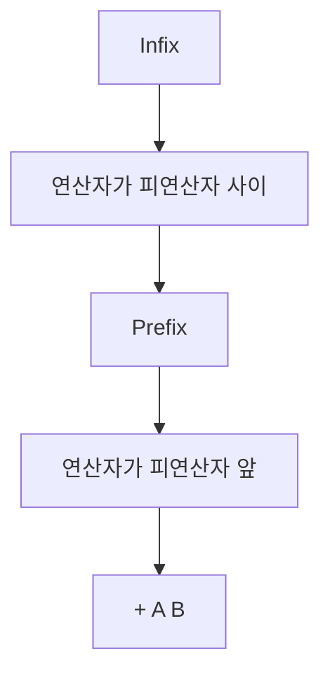

- `Prefix`는 연산자가 해당 피연산자 두 개의 앞에 오는 표기법이다.
- `A + B`의 Prefix는 `+ A B`이다.
- PDF 기준 변환 원리는 괄호로 우선순위를 묶고, 연산자를 해당 괄호의 앞으로 옮긴 뒤 괄호를 제거하는 것이다.
- 시험에서는 `X = A / B * (C + D) + E`를 `= X + * / A B + C D E` 형태로 바꾸는 흐름을 이해해야 한다.

---

## 2. 한눈에 보는 구조

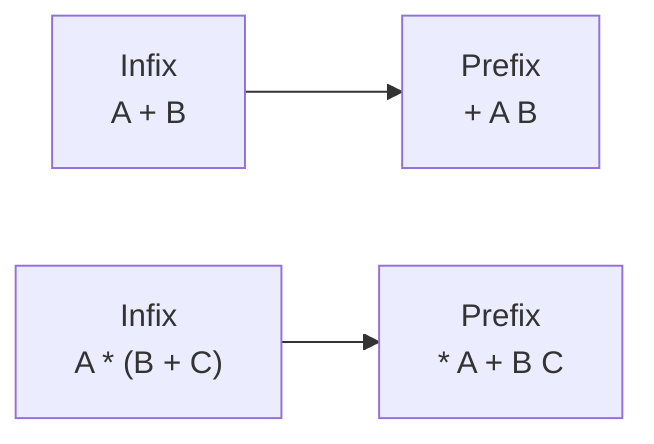

- Prefix는 연산자를 먼저 쓰고 그 뒤에 피연산자를 둔다.
- `Pre`는 “앞”이라는 감각으로 외우면 된다.
- Prefix는 Polish Notation이라고도 불린다.
- Infix와 달리 괄호 없이도 연산자와 피연산자의 결합 관계를 표현할 수 있다.

---

## 3. PDF 기준 핵심

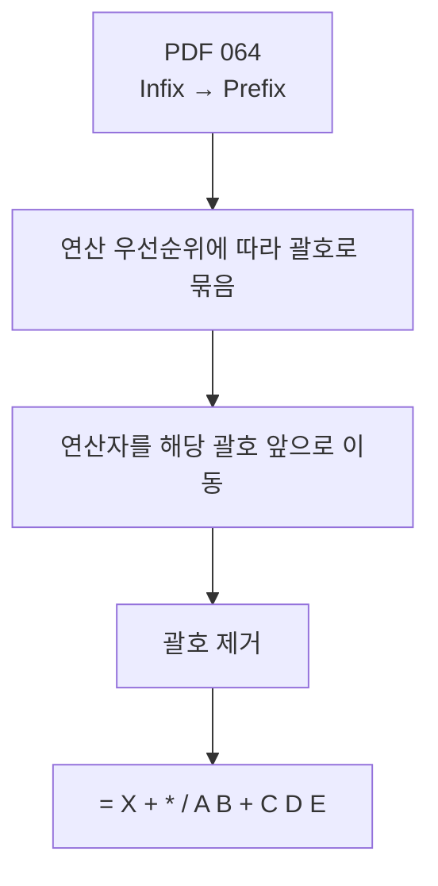

- 기준 PDF 핵심:
  - `Infix로 표기된 수식에서 연산자를 해당 피연산자 두 개의 앞(왼쪽)에 오도록 이동하면 Prefix가 된다.`
- PDF 예제:
  - Infix: `X = A / B * (C + D) + E`
  - Prefix: `= X + * / A B + C D E`
- PDF 풀이 절차:
  - 연산 우선순위에 따라 괄호로 묶는다.
  - 연산자를 해당 괄호의 앞으로 옮긴다.
  - 괄호를 제거한다.

---

## 4. 검색으로 보강한 관점

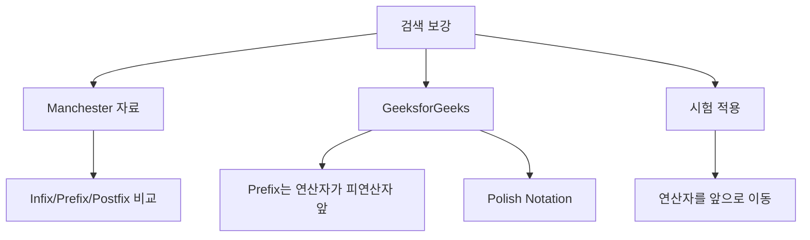

- Manchester 자료는 `X + Y`의 Prefix를 `+ X Y`, Postfix를 `X Y +`로 비교한다.
- GeeksforGeeks는 Prefix를 연산자가 피연산자 앞에 오는 표기법으로 설명하며 Polish Notation이라고도 부른다.
- 시험에서는 스택 알고리즘보다 PDF의 “괄호 묶기 → 연산자 앞으로 이동 → 괄호 제거” 방식이 빠르다.

---

## 5. 개념 설명

### 5.1 Infix와 Prefix의 차이

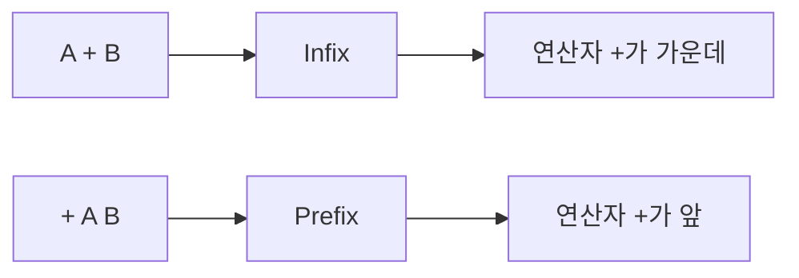

- `A + B`에서 `+`가 가운데 있으므로 Infix이다.
- `+ A B`에서 `+`가 앞에 있으므로 Prefix이다.
- `A * (B + C)`는 Prefix로 `* A + B C`가 된다.
- `+ B C`가 먼저 `B + C`를 의미하고, `* A ...`가 그 결과와 `A`의 곱을 의미한다.

### 5.2 PDF 예제 풀이

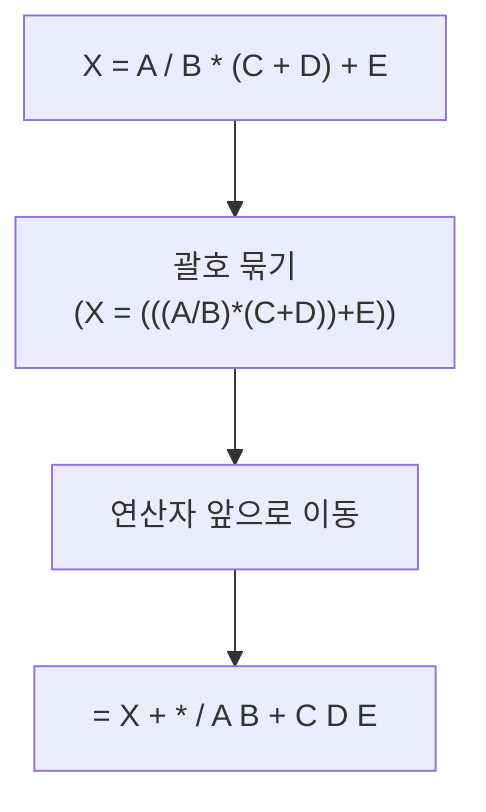

- Infix 원식:
  - `X = A / B * (C + D) + E`
- 부분 변환:
  - `A / B` → `/ A B`
  - `C + D` → `+ C D`
  - `(A / B) * (C + D)` → `* / A B + C D`
  - `... + E` → `+ * / A B + C D E`
  - `X = ...` → `= X + * / A B + C D E`
- Prefix는 가장 바깥 연산자가 가장 앞에 온다.
- PDF 예제에서 가장 바깥 연산은 대입 `=`이므로 결과가 `=`로 시작한다.

### 5.3 Prefix를 읽는 방법

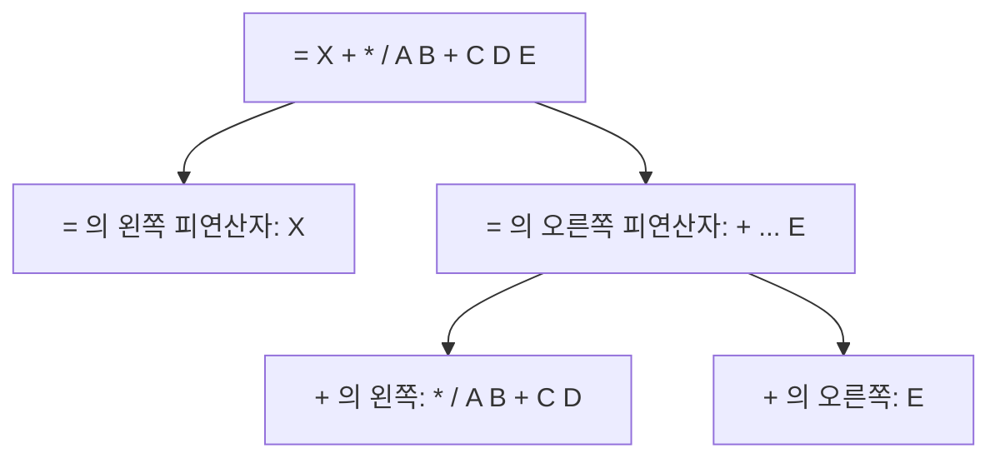

- Prefix는 왼쪽에서 오른쪽으로 읽을 때 연산자가 먼저 나온다.
- 연산자 뒤에는 그 연산자가 필요로 하는 피연산자가 따라온다.
- 이항 연산자는 피연산자 2개를 필요로 한다.
- 중첩된 연산식에서는 연산자 하나가 또 다른 부분 수식의 시작이 될 수 있다.
- 시험에서는 Prefix를 다시 Infix로 복원하는 문제보다 Infix를 Prefix로 변환하는 문제가 더 직접적이다.

---

## 6. 시험 포인트

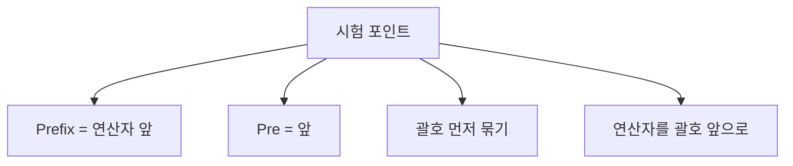

- Prefix는 연산자가 피연산자 앞에 온다.
- `A + B`의 Prefix는 `+ A B`이다.
- `A * B + C`는 `(A * B) + C`이므로 `+ * A B C`이다.
- 괄호가 있으면 괄호 안을 먼저 묶고 부분식 단위로 처리한다.
- PDF 예제 `X = A / B * (C + D) + E`의 Prefix 결과는 `= X + * / A B + C D E`이다.
- Postfix와 헷갈리지 않도록 “Pre = 앞, Post = 뒤”로 구분한다.

---

## 7. 헷갈리는 비교

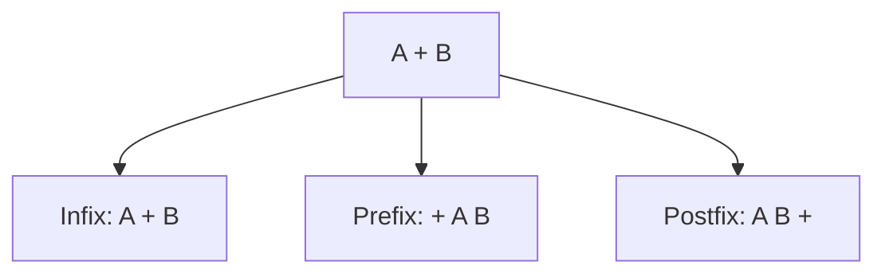

| 표기법 | 연산자 위치 | 예시 | 암기 |
|---|---|---|---|
| Infix | 피연산자 사이 | `A + B` | 일반 수식 |
| Prefix | 피연산자 앞 | `+ A B` | Pre = 앞 |
| Postfix | 피연산자 뒤 | `A B +` | Post = 뒤 |

- Prefix는 연산자가 앞에 있으므로 결과 문자열의 앞쪽에 연산자가 몰리는 느낌이 있다.
- Postfix는 연산자가 뒤에 있으므로 결과 문자열의 뒤쪽에 연산자가 나오는 느낌이 있다.
- 대입 연산자까지 포함하면 가장 바깥 연산자인 `=`의 위치도 이동해야 한다.

---

## 8. 예시 또는 암기 포인트

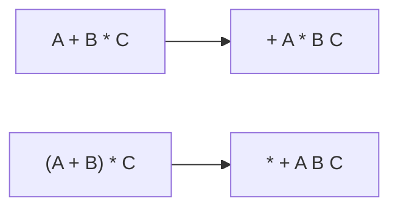

- 암기:
  - `Prefix = 연산자를 앞으로 보낸다`
  - `A + B -> + A B`
  - `A * B -> * A B`
- 예시:
  - `A + B * C`
    - 먼저 `B * C` → `* B C`
    - 그 다음 `A + ...` → `+ A * B C`
  - `(A + B) * C`
    - 먼저 `A + B` → `+ A B`
    - 그 다음 `... * C` → `* + A B C`

---

## 9. 빠른 복습

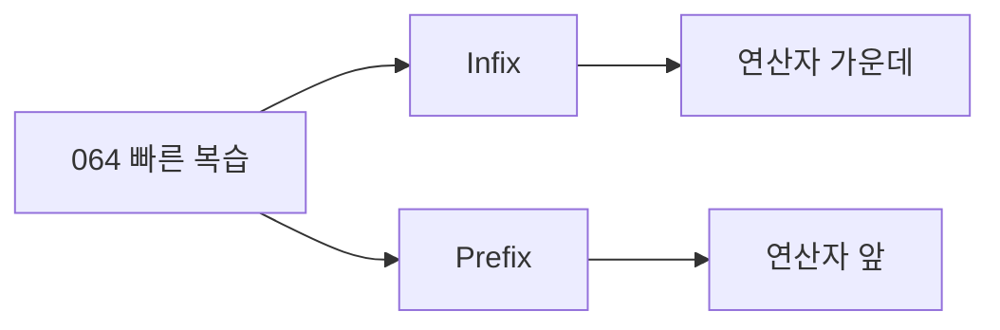

- 챕터명: `064 수식의 표기법(Infix → Prefix)`
- PDF 확인 위치: `10페이지`
- Prefix는 연산자를 피연산자 앞에 둔다.
- 변환 절차:
  - 우선순위대로 괄호 묶기
  - 연산자를 괄호 앞으로 이동
  - 괄호 제거
- PDF 예제 결과:
  - `X = A / B * (C + D) + E`
  - `= X + * / A B + C D E`

---

## 10. 참고 링크

- 기준 PDF: `/Users/nes0903/Documents/study/정보처리기사/핵심요약집_2026_정보처리기사필기핵심요약.pdf`
- [Q-Net - 정보처리기사 종목 정보](https://www.q-net.or.kr/crf005.do?gId=&gSite=Q&id=crf00503&jmCd=1320&tabGbn=1)
- [University of Manchester - Infix, Postfix and Prefix](https://www.cs.man.ac.uk/~pjj/cs212/fix.html)
- [GeeksforGeeks - Infix, Postfix and Prefix Expressions](https://www.geeksforgeeks.org/infix-postfix-prefix-notation/)

<!-- study-links:start -->
## 관련 문서

- `수식의 표기법`: [[정보처리기사/2과목 소프트웨어 개발/063 수식의 표기법(Infix → Postfix)/063 수식의 표기법(Infix → Postfix)|063 수식의 표기법(Infix → Postfix)]]
- `스택`: [[정보처리기사/2과목 소프트웨어 개발/057 스택(Stack)/057 스택(Stack)|057 스택(Stack)]]
<!-- study-links:end -->
