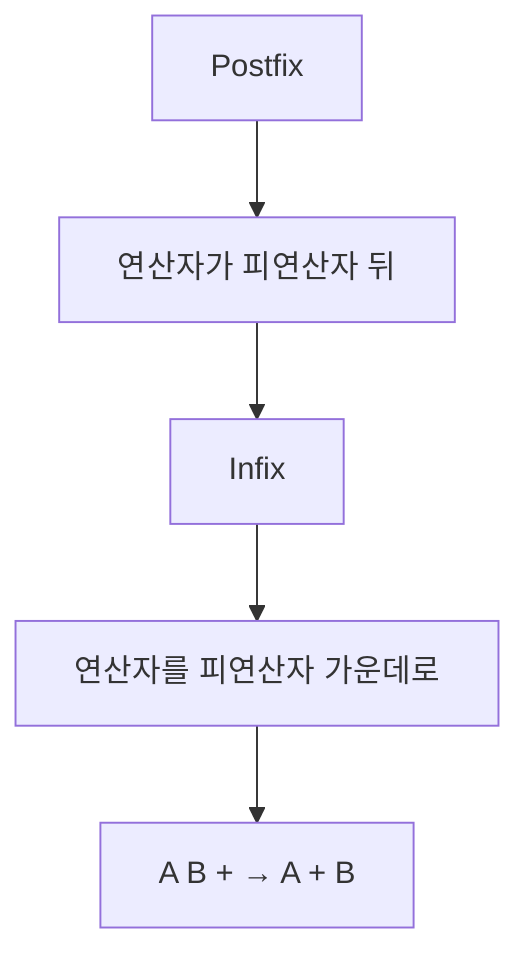
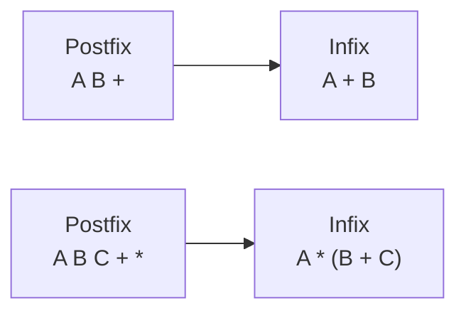
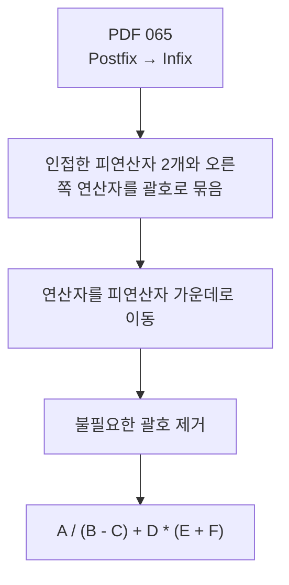
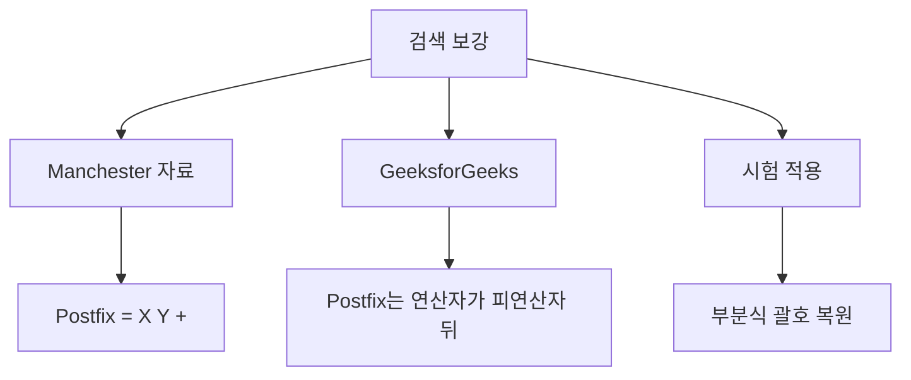
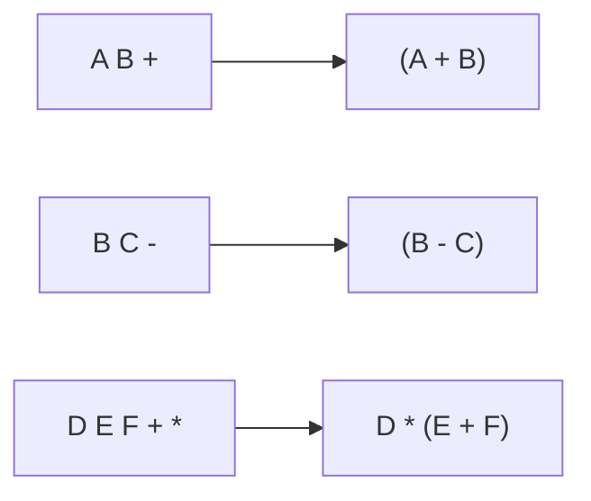
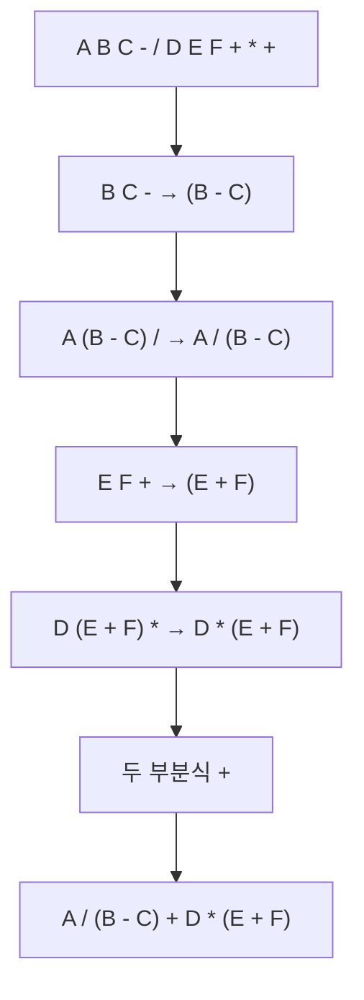
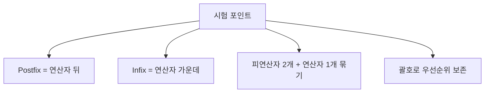
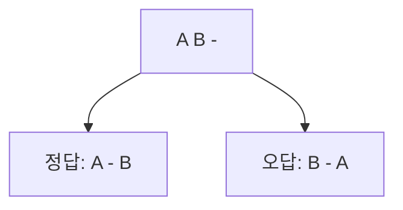
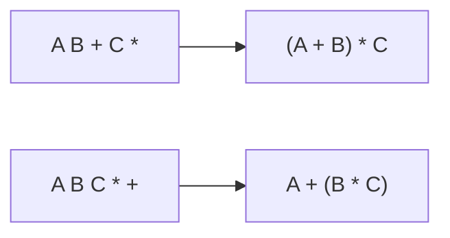
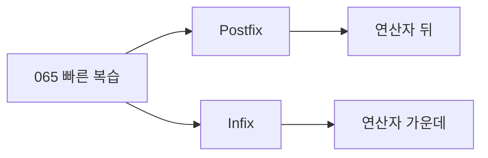

# 065 수식의 표기법(Postfix → Infix)

작성 기준일: 2026-06-01
검색/보강일: 2026-06-01
과목: `2과목 소프트웨어 개발`
기준 PDF: `/Users/nes0903/Documents/study/정보처리기사/핵심요약집_2026_정보처리기사필기핵심요약.pdf`
PDF 확인 위치: `10페이지`
검색 보강: Manchester와 GeeksforGeeks의 Infix/Prefix/Postfix 표기법 설명을 참고하여 PDF 예제 풀이 중심으로 확장
주제별 검색 키워드: `postfix to infix notation`, `reverse polish notation postfix infix`, `postfix expression operator follows operands`

---

## 1. 한 줄 요약

- `Postfix → Infix` 변환은 뒤에 있는 연산자를 해당 피연산자 두 개의 가운데로 옮기는 과정이다.
- PDF 기준 핵심은 인접한 피연산자 2개와 오른쪽 연산자를 괄호로 묶고, 연산자를 가운데로 이동한 뒤 불필요한 괄호를 제거하는 것이다.
- 시험에서는 `A B C - / D E F + * +`를 `A / (B - C) + D * (E + F)`로 바꾸는 흐름을 이해해야 한다.

---

## 2. 한눈에 보는 구조

- Postfix는 연산자가 뒤에 있다.
- Infix는 연산자가 가운데 있다.
- Postfix를 Infix로 바꿀 때는 연산자가 적용되는 피연산자 묶음을 정확히 잡아야 한다.
- 부분식을 괄호로 묶으면 연산 순서를 잃지 않고 Infix로 복원할 수 있다.

---

## 3. PDF 기준 핵심

- 기준 PDF 핵심:
  - `Postfix는 Infix 표기법에서 연산자를 해당 피연산자 2개의 뒤(오른쪽)로 이동한 것이다.`
  - `연산자를 다시 해당 피연산자 2개의 가운데로 옮기면 된다.`
- PDF 예제:
  - Postfix: `A B C - / D E F + * +`
  - Infix: `A / (B - C) + D * (E + F)`
- PDF 풀이 절차:
  - 인접한 피연산자 2개와 오른쪽 연산자를 괄호로 묶는다.
  - 연산자를 해당 피연산자의 가운데로 이동한다.
  - 필요 없는 괄호를 제거한다.

---

## 4. 검색으로 보강한 관점

- Manchester 자료는 Postfix 예시를 `X Y +`처럼 설명한다.
- GeeksforGeeks는 Postfix를 연산자가 피연산자 뒤에 오는 표기법으로 설명한다.
- Postfix를 Infix로 복원할 때는 피연산자 2개와 연산자 1개가 하나의 부분식을 만든다고 보면 된다.
- 시험에서는 스택으로 복원해도 되지만, PDF처럼 괄호를 잡아 연산자를 가운데로 옮기는 방식이 직관적이다.

---

## 5. 개념 설명

### 5.1 Postfix에서 Infix로 바꾸는 기본 원리

- Postfix에서 연산자는 자신보다 앞에 나온 피연산자 또는 부분식 2개에 적용된다.
- `A B +`는 `A + B`이다.
- `B C -`는 `B - C`이다.
- `D E F + *`는 먼저 `E F +`가 `E + F`가 되고, 그 결과와 `D`를 곱하므로 `D * (E + F)`가 된다.
- 괄호는 연산 순서를 보존하기 위해 사용한다.

### 5.2 PDF 예제 풀이

- 원식:
  - `A B C - / D E F + * +`
- 왼쪽 부분:
  - `B C -` → `(B - C)`
  - `A (B - C) /` → `A / (B - C)`
- 오른쪽 부분:
  - `E F +` → `(E + F)`
  - `D (E + F) *` → `D * (E + F)`
- 마지막:
  - `A / (B - C)`와 `D * (E + F)`를 `+`로 연결한다.
- 최종 결과:
  - `A / (B - C) + D * (E + F)`

### 5.3 스택으로 복원하는 관점

- Postfix를 Infix로 바꿀 때도 스택을 사용할 수 있다.
- 피연산자를 만나면 스택에 넣는다.
- 연산자를 만나면 피연산자 또는 부분식 2개를 꺼낸다.
- 먼저 꺼낸 값이 오른쪽 피연산자, 나중에 꺼낸 값이 왼쪽 피연산자가 된다.
- `(왼쪽 연산자 오른쪽)` 형태로 묶은 뒤 다시 스택에 넣는다.
- 마지막에 스택에 남은 하나의 식이 Infix 결과이다.

---

## 6. 시험 포인트

- Postfix를 Infix로 바꿀 때는 연산자를 피연산자 가운데로 옮긴다.
- `A B +`는 `A + B`이다.
- `A B C - /`는 `A / (B - C)`이다.
- 뺄셈과 나눗셈은 피연산자 순서를 바꾸면 값이 달라지므로 특히 주의한다.
- PDF 예제 `A B C - / D E F + * +`의 결과는 `A / (B - C) + D * (E + F)`이다.
- 불필요한 괄호는 최종 답에서 제거할 수 있지만, 풀이 중에는 괄호를 충분히 써서 실수를 막는다.

---

## 7. 헷갈리는 비교

| 실수 | 왜 틀리는가 | 올바른 판단 |
|---|---|---|
| `A B -`를 `B - A`로 해석 | 스택에서 꺼내는 순서를 뒤집음 | 먼저 나온 A가 왼쪽, B가 오른쪽 |
| 괄호를 너무 빨리 제거 | 우선순위가 달라질 수 있음 | 풀이 중에는 괄호 유지 |
| `D E F + *`를 `(D * E) + F`로 해석 | `E F +`가 먼저 묶이는 것을 놓침 | `D * (E + F)` |
| Prefix와 혼동 | Prefix는 연산자가 앞 | Postfix는 연산자가 뒤 |

- Postfix 복원에서는 연산자 앞의 두 항목이 중요하다.
- 그 두 항목은 단순 피연산자일 수도 있고 이미 만들어진 부분식일 수도 있다.
- 뺄셈과 나눗셈은 순서가 바뀌면 안 된다.

---

## 8. 예시 또는 암기 포인트

- 암기:
  - `Postfix → Infix = 연산자를 가운데로 복귀`
  - `A B + -> A + B`
- 예시:
  - `A B + C *`
    - `A B +` → `(A + B)`
    - `(A + B) C *` → `(A + B) * C`
  - `A B C * +`
    - `B C *` → `(B * C)`
    - `A (B * C) +` → `A + (B * C)`
- PDF 예제는 `-`, `/`, `+`, `*`가 섞여 있으므로 괄호를 끝까지 유지하는 연습이 좋다.

---

## 9. 빠른 복습

- 챕터명: `065 수식의 표기법(Postfix → Infix)`
- PDF 확인 위치: `10페이지`
- Postfix에서 연산자를 피연산자 가운데로 옮기면 Infix가 된다.
- 변환 절차:
  - 피연산자 2개와 오른쪽 연산자를 괄호로 묶기
  - 연산자를 가운데로 이동
  - 불필요한 괄호 제거
- PDF 예제 결과:
  - `A B C - / D E F + * +`
  - `A / (B - C) + D * (E + F)`

---

## 10. 참고 링크

- 기준 PDF: `/Users/nes0903/Documents/study/정보처리기사/핵심요약집_2026_정보처리기사필기핵심요약.pdf`
- [Q-Net - 정보처리기사 종목 정보](https://www.q-net.or.kr/crf005.do?gId=&gSite=Q&id=crf00503&jmCd=1320&tabGbn=1)
- [University of Manchester - Infix, Postfix and Prefix](https://www.cs.man.ac.uk/~pjj/cs212/fix.html)
- [GeeksforGeeks - Infix, Postfix and Prefix Expressions](https://www.geeksforgeeks.org/infix-postfix-prefix-notation/)

<!-- study-links:start -->
## 관련 문서

- `수식의 표기법`: [[정보처리기사/2과목 소프트웨어 개발/063 수식의 표기법(Infix → Postfix)/063 수식의 표기법(Infix → Postfix)|063 수식의 표기법(Infix → Postfix)]]
- `스택`: [[정보처리기사/2과목 소프트웨어 개발/057 스택(Stack)/057 스택(Stack)|057 스택(Stack)]]
<!-- study-links:end -->
