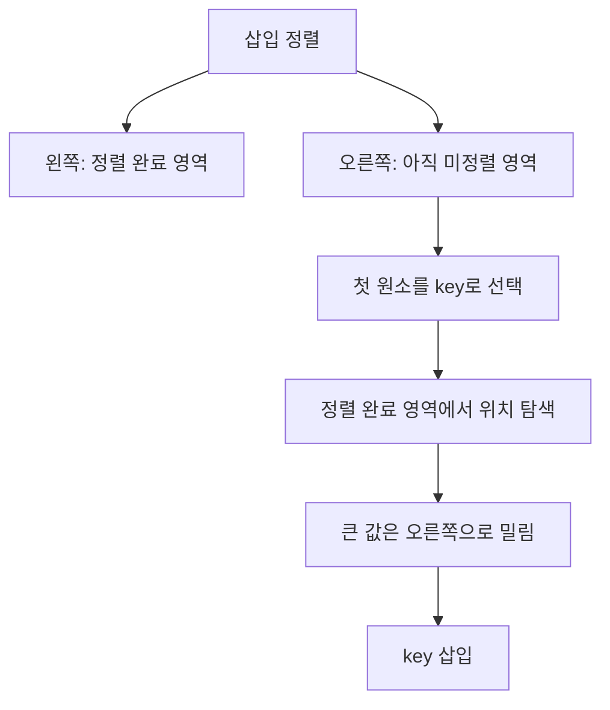
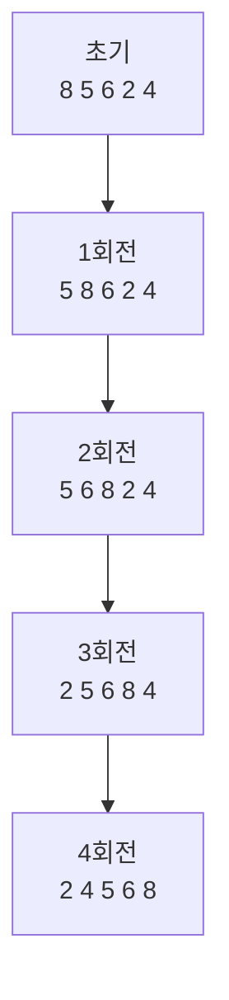
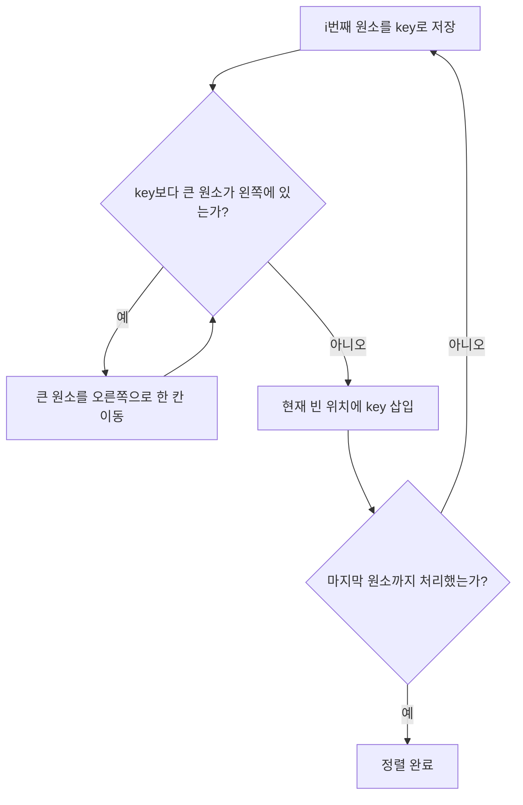
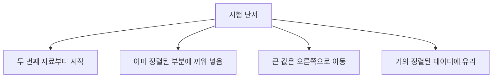
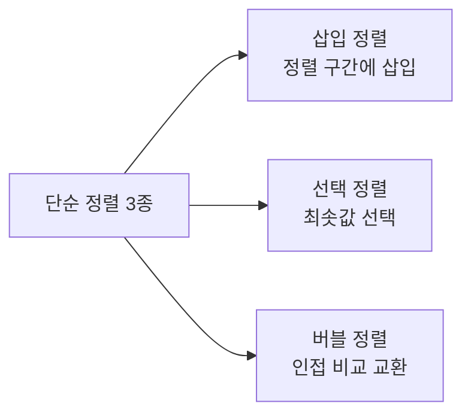
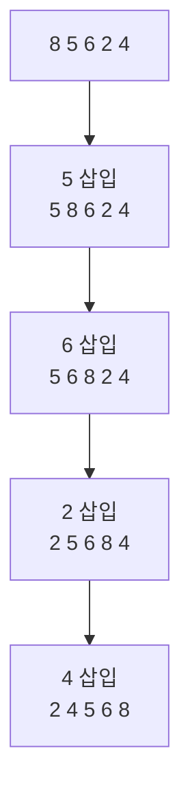
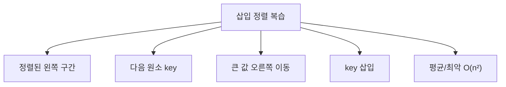

# 066 삽입 정렬(Insertion Sort)

작성 기준일: 2026-06-01
검색/보강일: 2026-06-01
과목: `2과목 소프트웨어 개발`
기준 PDF: `/Users/nes0903/Documents/study/정보처리기사/핵심요약집_2026_정보처리기사필기핵심요약.pdf`
PDF 확인 위치: `11페이지`
검색 보강: NIST DADS의 insertion sort 정의와 정렬 알고리즘 비교 자료를 참고하여 PDF 회전 예제를 시험 풀이 중심으로 확장
주제별 검색 키워드: `insertion sort NIST DADS`, `insertion sort algorithm`, `bubble selection insertion comparison`

---

## 1. 한 줄 요약

- 삽입 정렬은 이미 정렬된 왼쪽 부분에 새 원소를 하나씩 끼워 넣어 전체를 정렬하는 방식이다.
- PDF 기준 핵심은 `8, 5, 6, 2, 4`를 대상으로 각 회전마다 현재 원소가 앞쪽의 정렬된 부분에서 제자리를 찾아 들어가는 과정을 추적하는 것이다.
- 시험에서는 `두 번째 원소부터 시작`, `앞쪽 정렬 구간과 비교`, `삽입 위치까지 원소 이동`을 단서로 잡으면 된다.

---

## 2. 한눈에 보는 구조

- 삽입 정렬의 핵심 사고:
  - 왼쪽 부분은 항상 정렬되어 있다고 가정한다.
  - 오른쪽에서 하나를 꺼내 왼쪽 정렬 구간에 넣는다.
  - 넣을 자리를 만들기 위해 더 큰 원소들을 한 칸씩 오른쪽으로 이동한다.
- 사람이 손에 든 카드를 정렬할 때와 비슷하다.
  - 새 카드를 뽑는다.
  - 이미 정렬된 카드 사이에서 맞는 위치를 찾는다.
  - 그 위치에 끼워 넣는다.
- 배열 내부에서 처리하면 별도 자료구조가 거의 필요 없으므로 보조 공간은 작다.

---

## 3. PDF 기준 핵심

- PDF의 정렬 대상:

| 구분 | 상태 | 해석 |
|---|---|---|
| 초기 상태 | `8 5 6 2 4` | 첫 번째 원소 `8`은 정렬된 부분으로 본다. |
| 1회전 | `5 8 6 2 4` | 두 번째 원소 `5`를 앞의 `8`과 비교해 앞에 삽입한다. |
| 2회전 | `5 6 8 2 4` | 세 번째 원소 `6`을 `5`와 `8` 사이에 삽입한다. |
| 3회전 | `2 5 6 8 4` | 네 번째 원소 `2`를 정렬된 구간의 맨 앞에 삽입한다. |
| 4회전 | `2 4 5 6 8` | 다섯 번째 원소 `4`를 `2`와 `5` 사이에 삽입한다. |

- PDF 표현에서 꼭 잡아야 할 흐름:
  - 두 번째 원소부터 앞쪽 원소들과 비교한다.
  - 현재 원소보다 큰 앞쪽 원소는 오른쪽으로 이동한다.
  - 빈 위치가 생기면 현재 원소를 삽입한다.
  - 한 회전이 끝날 때마다 왼쪽 정렬 구간의 길이가 1씩 늘어난다.

---

## 4. 검색으로 보강한 관점

- NIST DADS는 삽입 정렬을 `다음 항목을 가져와 이미 삽입된 항목들 사이의 올바른 위치에 넣는 정렬`로 설명한다.
- 정렬된 부분을 유지하면서 진행하기 때문에 다음 특징이 시험 확장 지식으로 유용하다.
  - 거의 정렬된 자료에서는 비교와 이동이 적다.
  - 역순에 가까운 자료에서는 앞쪽 원소를 많이 밀어야 하므로 오래 걸린다.
  - 구현 방식에 따라 안정 정렬로 만들 수 있다.
- 정보처리기사 필기에서는 복잡한 시간 복잡도 증명보다 `정렬 과정 추적`과 `다른 단순 정렬과의 구분`이 더 중요하다.

---

## 5. 개념 설명

- 동작 방식:
  - 배열의 첫 원소는 혼자 있으므로 이미 정렬된 상태로 본다.
  - 두 번째 원소를 `key`로 잡고 왼쪽 정렬 구간과 비교한다.
  - `key`보다 큰 값들은 오른쪽으로 한 칸씩 이동한다.
  - 더 이상 큰 값이 없거나 맨 앞에 도달하면 `key`를 삽입한다.
  - 같은 과정을 끝 원소까지 반복한다.
- 예시로 `5 8 6`에서 `6`을 삽입할 때:
  - `6`과 `8` 비교: `8`이 크므로 오른쪽으로 이동한다.
  - `6`과 `5` 비교: `5`는 작으므로 이동을 멈춘다.
  - `5`와 `8` 사이에 `6`을 넣는다.
- 구현 관점:
  - `key`를 보조 변수에 보관한다.
  - 앞쪽 원소를 뒤로 밀다가 삽입 위치를 찾는다.
  - 단순 교환을 반복하는 방식으로 설명되기도 하지만, 시험에서는 `삽입`이라는 핵심 동작을 우선 기억한다.

---

## 6. 시험 포인트

- 자주 묻는 단서:
  - `삽입`, `끼워 넣기`, `이미 정렬된 부분`, `카드 정렬`이 나오면 삽입 정렬을 의심한다.
  - 회전별 결과를 물으면 왼쪽부터 정렬 구간이 확장된다고 생각한다.
  - 1회전 후에는 앞의 2개가 정렬된다.
  - 2회전 후에는 앞의 3개가 정렬된다.
- 시간 복잡도 암기:
  - 평균: `O(n²)`
  - 최악: `O(n²)`
  - 이미 정렬된 자료에서 이동이 거의 없으면 `O(n)`에 가까워질 수 있다.
- 함정:
  - 매 회전마다 최솟값을 선택하는 것은 선택 정렬이다.
  - 인접한 두 원소만 계속 교환해서 큰 값이 끝으로 가는 것은 버블 정렬이다.
  - 삽입 정렬은 현재 원소가 정렬된 왼쪽 구간 안으로 들어간다는 점이 핵심이다.

---

## 7. 헷갈리는 비교

| 구분 | 삽입 정렬 | 선택 정렬 | 버블 정렬 |
|---|---|---|---|
| 핵심 동작 | 현재 원소를 정렬된 부분에 삽입 | 남은 원소 중 최솟값 선택 | 인접 원소를 비교·교환 |
| 정렬 확정 위치 | 왼쪽 정렬 구간이 커짐 | 왼쪽부터 최솟값이 확정 | 오른쪽부터 큰 값이 확정 |
| 시험 단서 | 끼워 넣기, 카드 정렬 | 최소값, 선택 | 이웃한 원소, 교환, 거품 |
| 거의 정렬된 자료 | 비교·이동이 줄어 유리 | 비교 횟수는 크게 줄지 않음 | 개선형이면 유리할 수 있음 |
| PDF 예제 1회전 | `5 8 6 2 4` | `2 8 6 5 4` | `5 6 2 4 8` |

- 세 알고리즘 모두 단순 정렬로 묶이지만 회전의 의미가 다르다.
- PDF 예제에서 같은 입력 `8 5 6 2 4`를 쓰므로 각 회전 결과 차이를 비교해서 외우면 좋다.

---

## 8. 예시 또는 암기 포인트

- 암기 문장:
  - `삽입 정렬은 앞쪽 정렬 구간에 새 값을 끼워 넣는다.`
  - `i회전 후에는 앞쪽 i+1개가 정렬되어 있다.`
- 손풀이 요령:
  - 현재 삽입할 값에 밑줄을 긋는다.
  - 왼쪽 정렬 구간에서 그 값보다 큰 값만 오른쪽으로 민다.
  - 빈 자리에 현재 값을 넣는다.
- PDF 예제 빠른 복원:
  - `8 5`에서 `5`가 앞에 들어가 `5 8`
  - `5 8 6`에서 `6`이 가운데 들어가 `5 6 8`
  - `5 6 8 2`에서 `2`가 맨 앞에 들어가 `2 5 6 8`
  - `2 5 6 8 4`에서 `4`가 `2` 뒤에 들어가 `2 4 5 6 8`

---

## 9. 빠른 복습

- 삽입 정렬은 왼쪽 정렬 구간에 오른쪽 원소를 하나씩 삽입한다.
- 첫 번째 원소는 이미 정렬된 것으로 보고 두 번째 원소부터 시작한다.
- 큰 원소를 오른쪽으로 이동시키고 빈 자리에 현재 원소를 넣는다.
- PDF 예제의 최종 결과는 `2 4 5 6 8`이다.
- `삽입`, `정렬된 부분`, `카드 정렬`이 보이면 삽입 정렬을 고른다.

---

## 10. 참고 링크

- [기준 PDF: 핵심요약집_2026_정보처리기사필기핵심요약](/Users/nes0903/Documents/study/정보처리기사/핵심요약집_2026_정보처리기사필기핵심요약.pdf)
- [Q-Net 정보처리기사 종목별 상세정보](https://www.q-net.or.kr/crf005.do?id=crf00503&jmCd=1320)
- [NIST DADS - insertion sort](https://xlinux.nist.gov/dads/HTML/insertionSort.html)
- [GeeksforGeeks - Insertion Sort Algorithm](https://www.geeksforgeeks.org/insertion-sort-algorithm/)
- [GeeksforGeeks - Comparison among Bubble Sort, Selection Sort and Insertion Sort](https://www.geeksforgeeks.org/dsa/comparison-among-bubble-sort-selection-sort-and-insertion-sort/)

<!-- study-links:start -->
## 관련 문서

- `comparison`: [[각종 논리 연산 논법/comparison|비교 로직과 정렬 관련 문법 정리]]
- `선택 정렬`: [[정보처리기사/2과목 소프트웨어 개발/067 선택 정렬(Selection Sort)/067 선택 정렬(Selection Sort)|067 선택 정렬(Selection Sort)]]
- `버블 정렬`: [[정보처리기사/2과목 소프트웨어 개발/068 버블 정렬(Bubble Sort)/068 버블 정렬(Bubble Sort)|068 버블 정렬(Bubble Sort)]]
<!-- study-links:end -->
