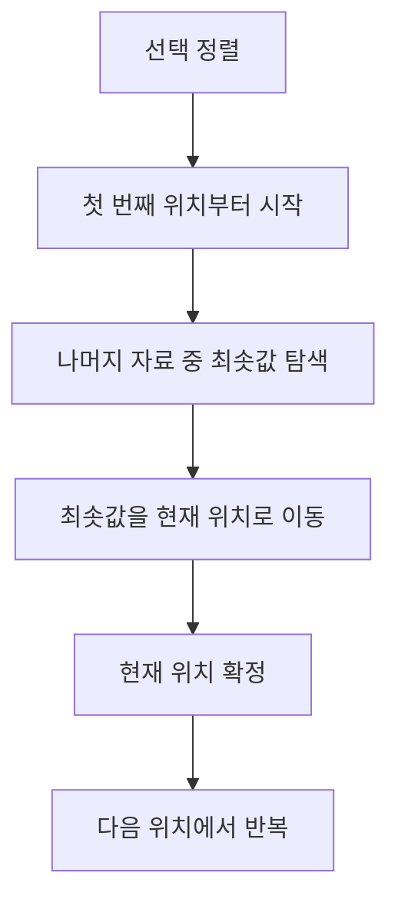
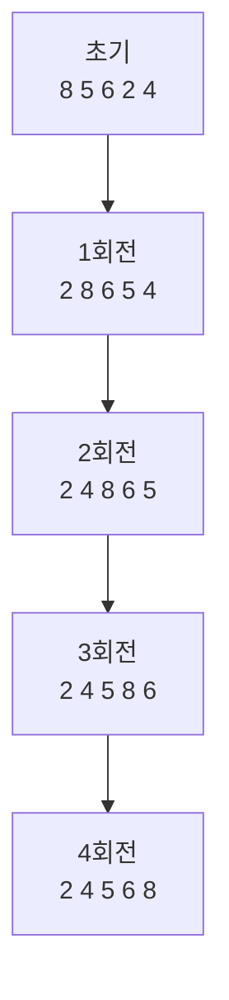
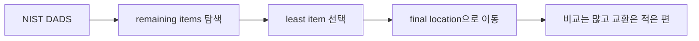
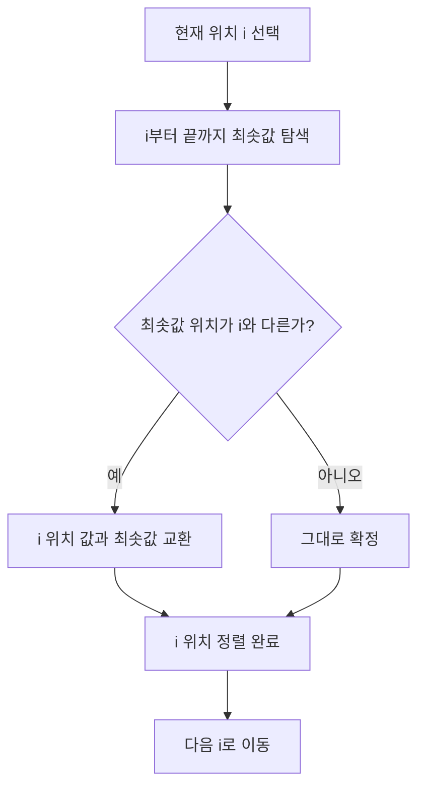
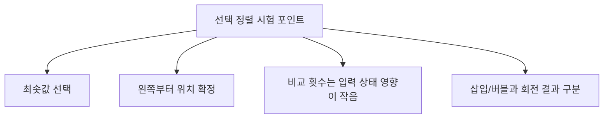
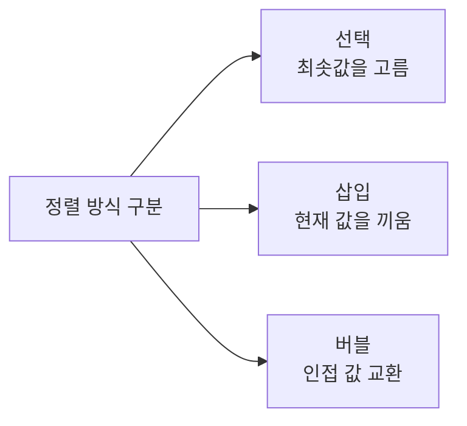
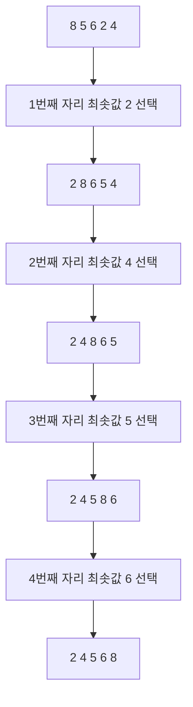
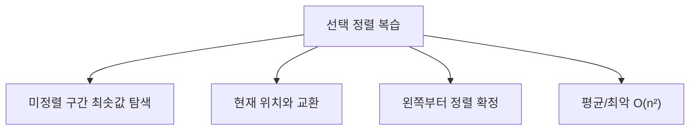

# 067 선택 정렬(Selection Sort)

작성 기준일: 2026-06-01
검색/보강일: 2026-06-01
과목: `2과목 소프트웨어 개발`
기준 PDF: `/Users/nes0903/Documents/study/정보처리기사/핵심요약집_2026_정보처리기사필기핵심요약.pdf`
PDF 확인 위치: `11페이지`
검색 보강: NIST DADS의 selection sort 정의와 단순 정렬 비교 자료를 참고하여 PDF의 회전별 교환 과정을 시험용으로 확장
주제별 검색 키워드: `selection sort NIST DADS`, `selection sort algorithm`, `selection sort bubble insertion comparison`

---

## 1. 한 줄 요약

- 선택 정렬은 아직 정렬되지 않은 구간에서 가장 작은 값을 골라 앞쪽 확정 위치로 보내는 정렬 방식이다.
- PDF 예제는 일반 교과서식 `최솟값 찾고 한 번 교환` 설명보다 더 세밀하게, 더 작은 값이 발견될 때마다 현재 위치와 교환되는 흐름으로 제시되어 있다.
- 시험에서는 `최솟값`, `선택`, `앞자리 확정`이라는 단서를 중심으로 삽입 정렬·버블 정렬과 구분해야 한다.

---

## 2. 한눈에 보는 구조

- 선택 정렬의 기본 관점:
  - 첫 번째 위치에는 전체 중 가장 작은 값이 와야 한다.
  - 두 번째 위치에는 남은 값 중 가장 작은 값이 와야 한다.
  - 이런 식으로 왼쪽부터 정렬 결과를 확정한다.
- 정렬된 부분과 미정렬 부분이 나뉜다는 점은 삽입 정렬과 비슷하지만, 처리 방식은 다르다.
  - 삽입 정렬: 현재 값을 정렬된 구간에 끼워 넣는다.
  - 선택 정렬: 미정렬 구간에서 최솟값을 골라 앞으로 보낸다.
- NIST DADS의 설명처럼 남은 항목 중 가장 작은 항목을 찾아 최종 위치로 이동시키는 구조로 이해하면 된다.

---

## 3. PDF 기준 핵심

- PDF의 정렬 대상:
  - 초기 상태: `8 5 6 2 4`
- PDF 회전 결과:

| 구분 | PDF 중간 흐름 | 회전 종료 상태 | 해석 |
|---|---|---|---|
| 1회전 | `5 8 6 2 4` → `2 8 6 5 4` | `2 8 6 5 4` | 첫 위치에 전체 최솟값 `2`가 온다. |
| 2회전 | `2 6 8 5 4` → `2 5 8 6 4` → `2 4 8 6 5` | `2 4 8 6 5` | 두 번째 위치에 남은 값 중 최솟값 `4`가 온다. |
| 3회전 | `2 4 6 8 5` → `2 4 5 8 6` | `2 4 5 8 6` | 세 번째 위치에 남은 값 중 최솟값 `5`가 온다. |
| 4회전 | `2 4 5 6 8` | `2 4 5 6 8` | 마지막 두 값이 정렬된다. |

- PDF 풀이상 주의점:
  - 일반적인 선택 정렬은 한 회전에서 최솟값 위치를 끝까지 찾은 뒤 한 번만 교환한다고 설명되는 경우가 많다.
  - PDF 예제는 더 작은 값이 발견될 때마다 현재 기준 위치와 교환하는 형태로 중간 상태를 보여준다.
  - 문제에서 PDF와 같은 중간 과정이 나오면 PDF 추적 방식을 우선한다.

---

## 4. 검색으로 보강한 관점

- NIST DADS는 선택 정렬을 남은 항목에서 가장 작은 항목을 반복적으로 찾아 최종 위치로 옮기는 정렬로 설명한다.
- 선택 정렬의 보강 특징:
  - 비교 횟수는 입력 상태와 관계없이 대체로 많이 발생한다.
  - 교환 횟수는 버블 정렬보다 적은 편이다.
  - 배열에서 단순 구현할 경우 일반적으로 안정 정렬로 보기 어렵다.
- 시험 관점에서는 성능 세부보다 `최솟값 선택`과 `왼쪽부터 확정`을 우선 암기한다.

---

## 5. 개념 설명

- 단계별 설명:
  - 첫 번째 위치를 기준으로 잡는다.
  - 나머지 자료를 훑으며 가장 작은 값을 찾는다.
  - 가장 작은 값을 첫 번째 위치에 둔다.
  - 두 번째 위치부터 같은 일을 반복한다.
- 예시:
  - `8 5 6 2 4`에서 첫 위치에는 전체 최솟값 `2`가 와야 한다.
  - 첫 회전이 끝나면 `2`는 더 이상 움직이지 않는 확정 값이다.
  - 다음 회전에서는 `8 6 5 4` 중 최솟값 `4`를 두 번째 위치로 보낸다.
- 선택 정렬의 이름이 붙은 이유:
  - 매 회전에서 `어떤 값을 현재 위치에 둘지 선택`하기 때문이다.
  - 선택 기준은 오름차순에서는 최솟값, 내림차순에서는 최댓값이다.

---

## 6. 시험 포인트

- 자주 나오는 단서:
  - `가장 작은 자료를 선택`
  - `선택한 자료와 첫 번째 자료를 교환`
  - `정렬되지 않은 부분에서 최솟값 탐색`
- 회전별 판단:
  - 1회전 후 첫 번째 자리는 최솟값이다.
  - 2회전 후 두 번째 자리까지 정렬 확정이다.
  - 마지막 회전 전에는 대부분 마지막 두 값만 남는다.
- 시간 복잡도:
  - 평균: `O(n²)`
  - 최악: `O(n²)`
  - 이미 정렬되어 있어도 최솟값 탐색을 위해 비교는 수행된다.
- 함정:
  - 인접한 원소끼리만 비교하는 알고리즘이 아니다.
  - 새 원소를 왼쪽 정렬 구간에 삽입하는 알고리즘도 아니다.
  - `선택 정렬 = 최솟값을 선택해서 앞으로 보낸다`로 정리한다.

---

## 7. 헷갈리는 비교

| 구분 | 선택 정렬 | 삽입 정렬 | 버블 정렬 |
|---|---|---|---|
| 한 회전의 목표 | 현재 위치에 올 최솟값 선택 | 현재 원소를 왼쪽 정렬 구간에 삽입 | 큰 값을 오른쪽 끝으로 이동 |
| 비교 대상 | 현재 위치 이후 전체 | 현재 위치 이전 정렬 구간 | 서로 이웃한 두 원소 |
| 확정 방향 | 왼쪽 → 오른쪽 | 왼쪽 정렬 구간 확장 | 오른쪽 → 왼쪽 |
| PDF 1회전 결과 | `2 8 6 5 4` | `5 8 6 2 4` | `5 6 2 4 8` |
| 단서어 | 선택, 최솟값 | 삽입, 끼워넣기 | 버블, 인접 교환 |

- 같은 입력값이라도 1회전 결과가 확실히 다르다.
- 객관식에서 중간 결과를 제시하면 정렬 방식의 `확정 위치`를 먼저 본다.

---

## 8. 예시 또는 암기 포인트

- 암기 문장:
  - `선택 정렬은 남은 값 중 최솟값을 선택한다.`
  - `선택된 값은 왼쪽 확정 구간의 다음 자리에 놓인다.`
- 손풀이 요령:
  - 아직 정렬되지 않은 구간에 괄호를 친다.
  - 그 구간에서 최솟값을 찾는다.
  - 현재 위치와 최솟값의 위치를 바꾼다.
- PDF형 중간 교환 풀이:
  - 기준 위치보다 작은 값을 만나면 교환된 중간 상태가 나타날 수 있다.
  - 그래도 회전 종료 시점에는 현재 위치가 해당 미정렬 구간의 최솟값으로 확정된다.

---

## 9. 빠른 복습

- 선택 정렬은 최솟값을 선택해 앞쪽으로 이동시키는 정렬이다.
- 1회전 후 첫 번째 값은 전체 최솟값이다.
- PDF 예제의 1회전 종료 상태는 `2 8 6 5 4`이다.
- 삽입 정렬은 `끼워 넣기`, 버블 정렬은 `인접 교환`, 선택 정렬은 `최솟값 선택`이다.
- PDF와 일반 알고리즘 설명의 중간 교환 방식이 다를 수 있으므로, 시험 예제 추적은 PDF 흐름을 우선한다.

---

## 10. 참고 링크

- [기준 PDF: 핵심요약집_2026_정보처리기사필기핵심요약](/Users/nes0903/Documents/study/정보처리기사/핵심요약집_2026_정보처리기사필기핵심요약.pdf)
- [Q-Net 정보처리기사 종목별 상세정보](https://www.q-net.or.kr/crf005.do?id=crf00503&jmCd=1320)
- [NIST DADS - selection sort](https://xlinux.nist.gov/dads/HTML/selectionSort.html)
- [GeeksforGeeks - Comparison among Bubble Sort, Selection Sort and Insertion Sort](https://www.geeksforgeeks.org/dsa/comparison-among-bubble-sort-selection-sort-and-insertion-sort/)

<!-- study-links:start -->
## 관련 문서

- `comparison`: [[각종 논리 연산 논법/comparison|비교 로직과 정렬 관련 문법 정리]]
- `삽입 정렬`: [[정보처리기사/2과목 소프트웨어 개발/066 삽입 정렬(Insertion Sort)/066 삽입 정렬(Insertion Sort)|066 삽입 정렬(Insertion Sort)]]
- `버블 정렬`: [[정보처리기사/2과목 소프트웨어 개발/068 버블 정렬(Bubble Sort)/068 버블 정렬(Bubble Sort)|068 버블 정렬(Bubble Sort)]]
<!-- study-links:end -->
