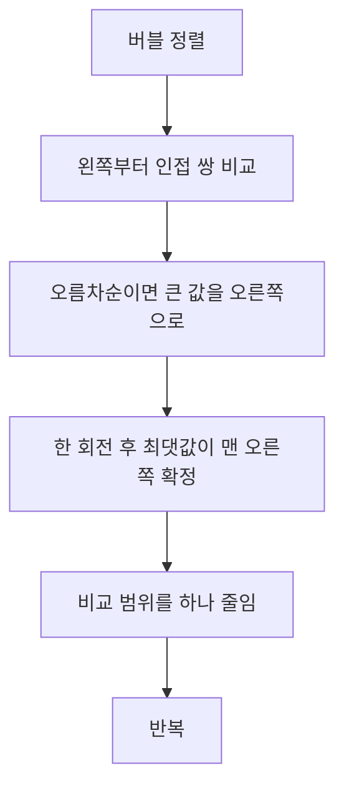
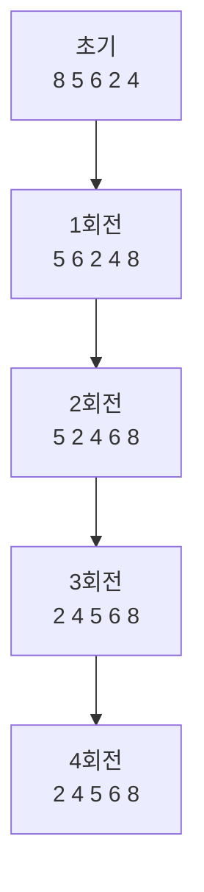
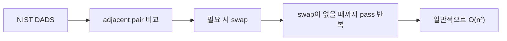
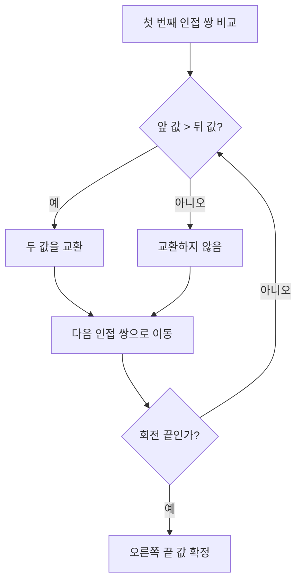
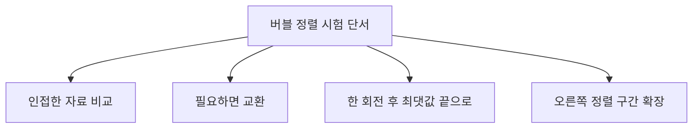
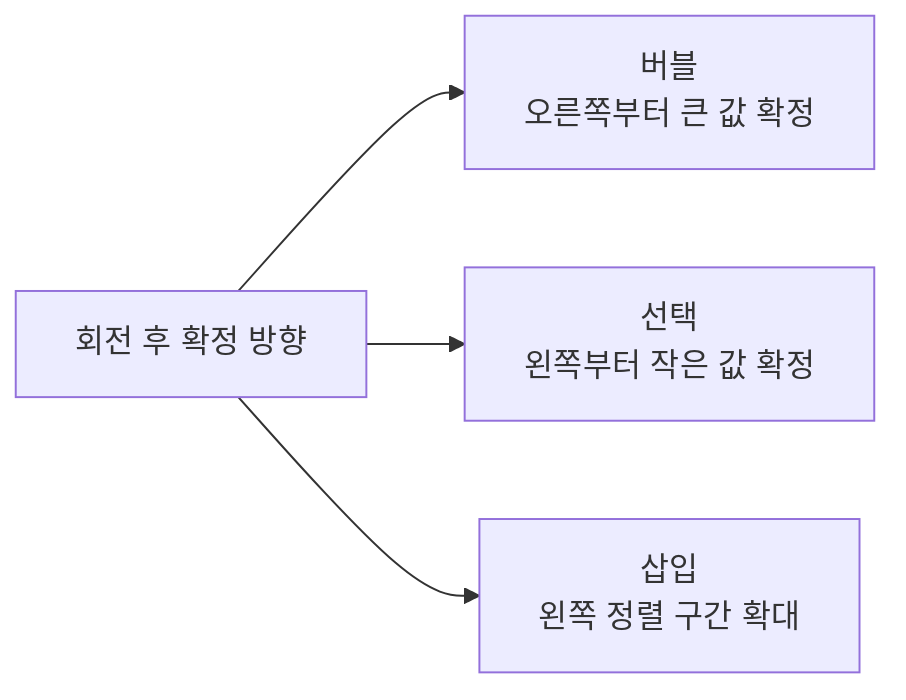
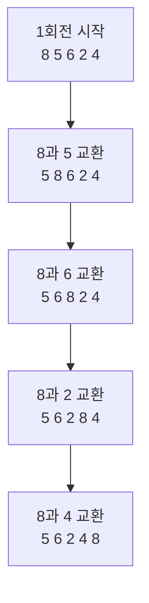
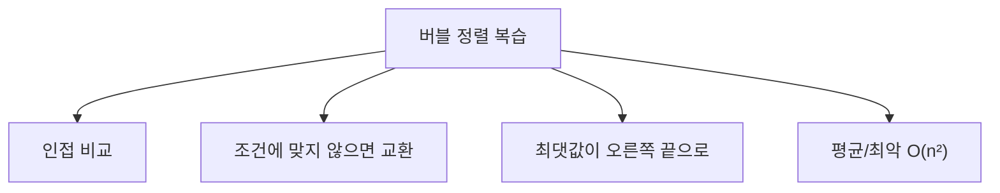

# 068 버블 정렬(Bubble Sort)

작성 기준일: 2026-06-01
검색/보강일: 2026-06-01
과목: `2과목 소프트웨어 개발`
기준 PDF: `/Users/nes0903/Documents/study/정보처리기사/핵심요약집_2026_정보처리기사필기핵심요약.pdf`
PDF 확인 위치: `11페이지`
검색 보강: NIST DADS의 bubble sort 정의와 단순 정렬 비교 자료를 참고하여 PDF의 인접 비교·교환 흐름을 확장
주제별 검색 키워드: `bubble sort NIST DADS`, `bubble sort adjacent swap`, `bubble selection insertion comparison`

---

## 1. 한 줄 요약

- 버블 정렬은 서로 이웃한 원소를 비교해 필요하면 교환하고, 한 회전이 끝날 때마다 큰 값이 오른쪽 끝으로 밀려나는 정렬 방식이다.
- PDF 기준 핵심은 `8, 5, 6, 2, 4`에서 1회전 후 `8`이 맨 오른쪽으로 가고, 이후 오른쪽부터 정렬이 확정되는 과정을 추적하는 것이다.
- 시험 단서는 `인접 비교`, `교환`, `큰 값이 끝으로 이동`, `거품처럼 올라감`이다.

---

## 2. 한눈에 보는 구조

- 버블 정렬의 핵심:
  - `A[i]`와 `A[i+1]`을 비교한다.
  - 앞의 값이 더 크면 두 값을 바꾼다.
  - 이 과정을 끝까지 반복하면 가장 큰 값이 오른쪽 끝에 도착한다.
- 이름이 버블인 이유:
  - 큰 값이 비교와 교환을 거치며 점점 오른쪽 끝으로 이동한다.
  - 물속의 거품이 위로 올라가듯 값이 한쪽 끝으로 이동한다고 이해하면 된다.
- 한 회전이 끝나면 오른쪽 끝 값은 더 이상 비교할 필요가 없다.

---

## 3. PDF 기준 핵심

- PDF의 정렬 대상:
  - 초기 상태: `8 5 6 2 4`
- PDF 회전 결과:

| 구분 | PDF 중간 흐름 | 회전 종료 상태 | 확정되는 값 |
|---|---|---|---|
| 1회전 | `5 8 6 2 4` → `5 6 8 2 4` → `5 6 2 8 4` → `5 6 2 4 8` | `5 6 2 4 8` | 최댓값 `8` |
| 2회전 | `5 2 6 4 8` → `5 2 4 6 8` | `5 2 4 6 8` | `6` |
| 3회전 | `2 5 4 6 8` → `2 4 5 6 8` | `2 4 5 6 8` | `5` |
| 4회전 | `2 4 5 6 8` | `2 4 5 6 8` | 전체 정렬 완료 |

- PDF 풀이에서 꼭 볼 부분:
  - 1회전 동안 `8`은 이웃 원소와 계속 교환되며 오른쪽 끝까지 이동한다.
  - 2회전은 이미 확정된 `8`을 제외하고 진행한다.
  - 3회전은 `6, 8`을 제외하고 진행한다.
  - 오른쪽에서부터 정렬 완료 구간이 늘어난다.

---

## 4. 검색으로 보강한 관점

- NIST DADS는 버블 정렬을 인접한 쌍을 차례로 비교하고 필요할 때 교환하며, 교환이 없을 때까지 반복하는 정렬로 설명한다.
- 보강 특징:
  - 단순하고 이해하기 쉽다.
  - 일반적인 자료에서는 효율이 낮아 평균·최악 시간이 `O(n²)`이다.
  - 한 회전에서 교환이 한 번도 없으면 이미 정렬된 상태임을 알 수 있으므로 개선형 구현이 가능하다.
- 시험에서는 개선형 구현보다 기본 원리인 `인접 비교와 교환`을 우선한다.

---

## 5. 개념 설명

- 동작 방식:
  - 왼쪽에서 오른쪽으로 진행하며 이웃한 두 값을 비교한다.
  - 오름차순 정렬에서는 앞 값이 뒤 값보다 크면 교환한다.
  - 큰 값은 한 번의 회전 동안 여러 번 교환되어 오른쪽으로 이동한다.
  - 다음 회전에서는 이미 확정된 오른쪽 끝을 제외하고 다시 비교한다.
- 예시:
  - `8 5 6 2 4`에서 첫 비교는 `8`과 `5`이다.
  - `8`이 크므로 `5 8 6 2 4`가 된다.
  - 다시 `8`과 `6`, `8`과 `2`, `8`과 `4`를 비교하며 `8`이 끝으로 간다.
- 버블 정렬은 교환 과정이 많이 보이므로 중간 상태 추적 문제가 자주 나온다.

---

## 6. 시험 포인트

- 자주 나오는 단서:
  - `인접한 두 개의 자료를 비교`
  - `교환`
  - `가장 큰 값이 맨 뒤로 이동`
  - `거품 정렬`
- 회전 결과 판단:
  - 오름차순 버블 정렬의 1회전 후 맨 오른쪽은 최댓값이다.
  - 2회전 후 오른쪽 두 칸은 정렬 확정이다.
  - 비교 범위는 매 회전마다 줄어든다.
- 시간 복잡도:
  - 평균: `O(n²)`
  - 최악: `O(n²)`
  - 이미 정렬된 자료에서 교환 여부를 확인해 조기 종료하는 구현은 더 빨라질 수 있다.
- 함정:
  - 미정렬 구간 최솟값을 찾아 앞에 두는 것은 선택 정렬이다.
  - 현재 원소를 정렬된 구간에 끼워 넣는 것은 삽입 정렬이다.
  - 버블 정렬은 항상 `이웃끼리`라는 조건을 놓치지 말아야 한다.

---

## 7. 헷갈리는 비교

| 구분 | 버블 정렬 | 선택 정렬 | 삽입 정렬 |
|---|---|---|---|
| 비교 방식 | 인접한 두 원소 | 미정렬 구간 전체에서 최솟값 탐색 | 왼쪽 정렬 구간과 현재 원소 비교 |
| 이동 방식 | 필요할 때마다 교환 | 선택한 값을 현재 위치로 이동 | 큰 값을 밀고 현재 값을 삽입 |
| 회전 후 확정 | 오른쪽 끝부터 | 왼쪽 앞부터 | 왼쪽 정렬 구간 확대 |
| PDF 1회전 결과 | `5 6 2 4 8` | `2 8 6 5 4` | `5 8 6 2 4` |
| 대표 단서 | 인접 교환 | 최솟값 선택 | 삽입 |

- PDF의 세 정렬 예제는 모두 입력값이 같아서 비교 암기에 좋다.
- `1회전 뒤 어느 위치가 확정되는가`를 보면 알고리즘을 빠르게 구분할 수 있다.

---

## 8. 예시 또는 암기 포인트

- 암기 문장:
  - `버블 정렬은 이웃끼리 비교해서 큰 값을 뒤로 보낸다.`
  - `한 회전마다 오른쪽 끝에서 하나씩 자리가 확정된다.`
- 손풀이 요령:
  - 비교하는 두 원소에 괄호를 친다.
  - 앞의 값이 크면 교환한다.
  - 회전 끝에서는 맨 오른쪽 값에 확정 표시를 한다.
- PDF 예제 핵심:
  - 1회전에서 `8`이 끝까지 이동한다.
  - 2회전에서 `6`이 `8` 앞에 확정된다.
  - 3회전에서 `5`가 `6` 앞에 확정된다.

---

## 9. 빠른 복습

- 버블 정렬은 이웃한 두 원소를 비교하고 교환한다.
- 오름차순에서는 큰 값이 오른쪽으로 이동한다.
- PDF 예제의 1회전 종료 상태는 `5 6 2 4 8`이다.
- 회전이 끝날 때마다 오른쪽부터 확정된다.
- `인접`, `교환`, `오른쪽 끝 최댓값`이 보이면 버블 정렬이다.

---

## 10. 참고 링크

- [기준 PDF: 핵심요약집_2026_정보처리기사필기핵심요약](/Users/nes0903/Documents/study/정보처리기사/핵심요약집_2026_정보처리기사필기핵심요약.pdf)
- [Q-Net 정보처리기사 종목별 상세정보](https://www.q-net.or.kr/crf005.do?id=crf00503&jmCd=1320)
- [NIST DADS - bubble sort](https://xlinux.nist.gov/dads/HTML/bubblesort.html)
- [GeeksforGeeks - Comparison among Bubble Sort, Selection Sort and Insertion Sort](https://www.geeksforgeeks.org/dsa/comparison-among-bubble-sort-selection-sort-and-insertion-sort/)
