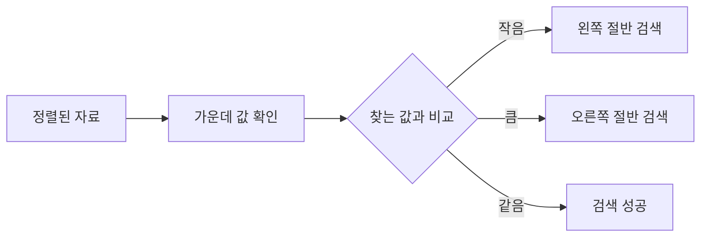
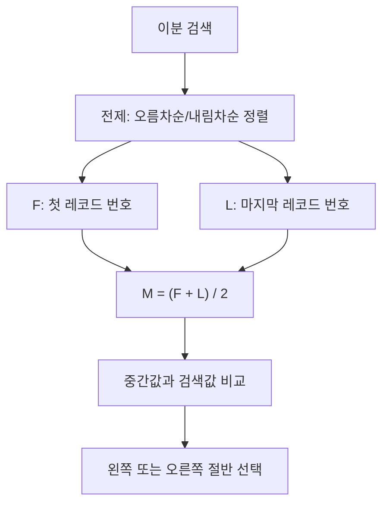
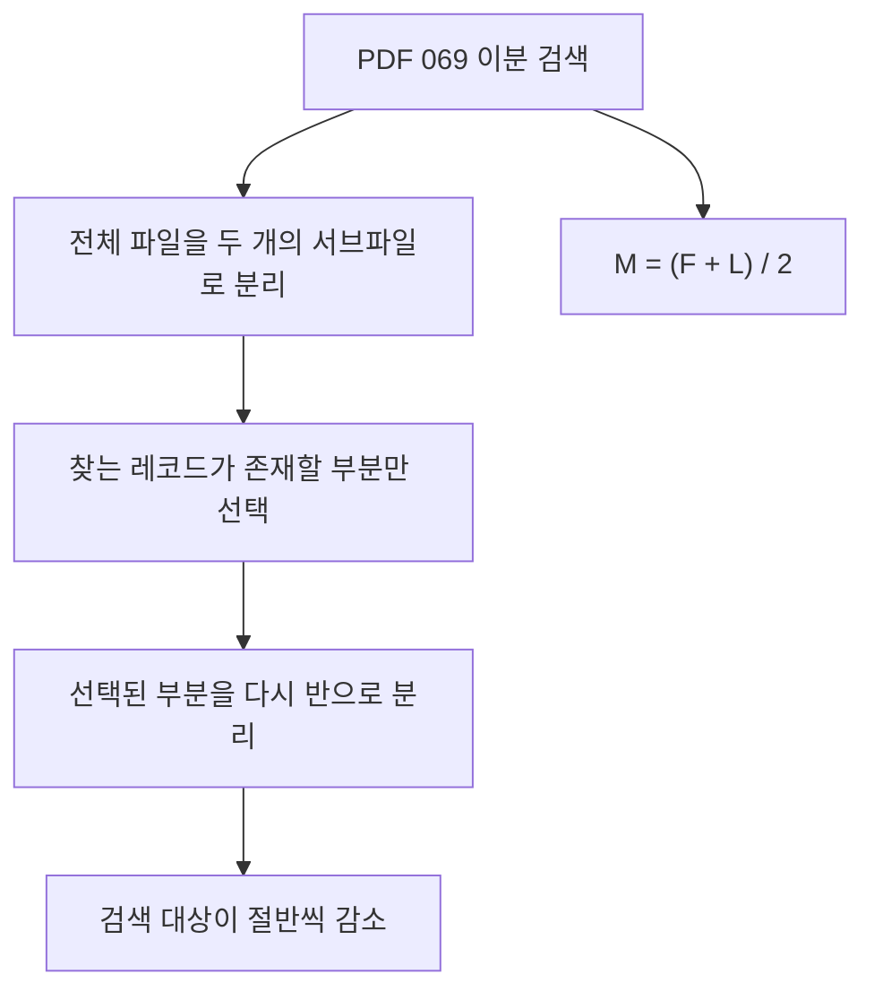
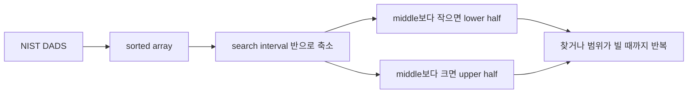
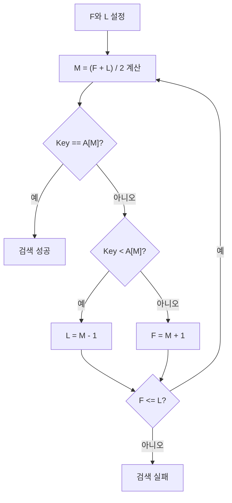
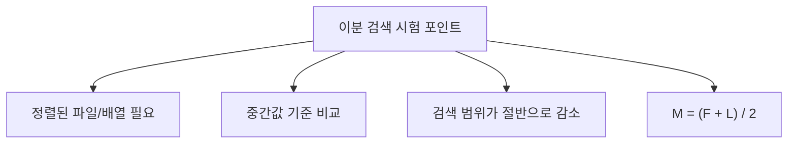
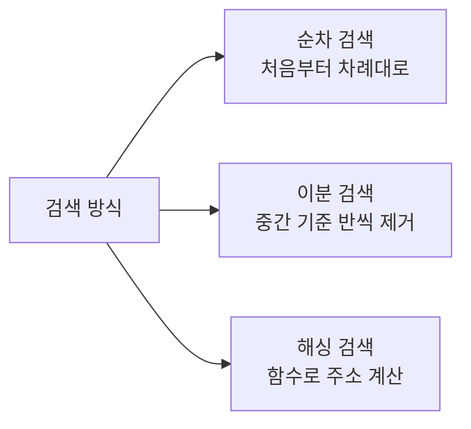
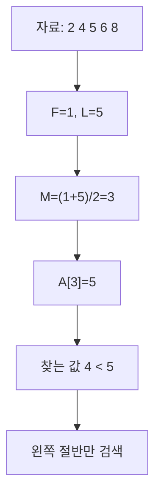
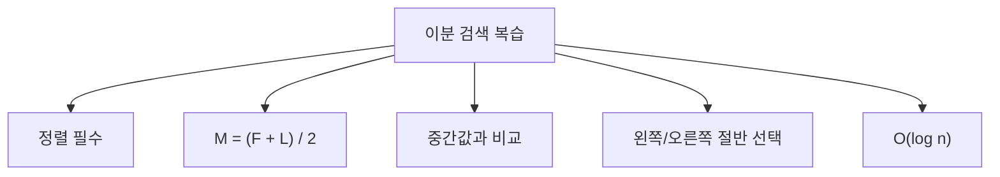

# 069 이분 검색(이진 검색)

작성 기준일: 2026-06-01
검색/보강일: 2026-06-01
과목: `2과목 소프트웨어 개발`
기준 PDF: `/Users/nes0903/Documents/study/정보처리기사/핵심요약집_2026_정보처리기사필기핵심요약.pdf`
PDF 확인 위치: `11페이지`
검색 보강: NIST DADS의 binary search 정의와 중간값 계산 주의점을 참고하여 PDF의 검색 범위 반감 원리를 확장
주제별 검색 키워드: `binary search NIST DADS`, `binary search sorted array`, `binary search mid formula`

---

## 1. 한 줄 요약

- 이분 검색은 정렬된 자료에서 가운데 값을 기준으로 검색 범위를 절반씩 줄여 가는 검색 방법이다.
- PDF 기준 핵심은 `검색 대상이 정렬되어 있어야 한다`, `비교할 때마다 검색 대상이 절반으로 줄어든다`, `M = (F + L) / 2`로 중간 레코드 번호를 계산한다는 것이다.
- 시험에서는 정렬 여부와 중간값 계산식이 가장 자주 걸리는 포인트다.

---

## 2. 한눈에 보는 구조

- 이분 검색의 기본 요소:
  - `F`: 검색 범위의 첫 번째 위치
  - `L`: 검색 범위의 마지막 위치
  - `M`: 중간 위치
  - `Key`: 찾고자 하는 값
- 정렬된 자료에서만 가능하다.
  - 정렬되지 않은 자료는 가운데 값과 비교해도 왼쪽·오른쪽 중 어느 쪽에 값이 있는지 판단할 수 없다.
- 한 번 비교할 때마다 남은 후보가 절반으로 줄어든다.
  - 그래서 순차 검색보다 검색 시간이 짧다.

---

## 3. PDF 기준 핵심

- PDF 핵심 문장 정리:
  - 이분 검색은 전체 파일을 두 개의 서브파일로 분리하면서 검색한다.
  - 반드시 순서화된 파일이어야 한다.
  - 검색할 때마다 검색 대상이 절반으로 줄어든다.
  - 검색 시간이 적게 걸리므로 효율이 좋다.
  - 중간 레코드 번호는 `M = (F + L) / 2`로 계산한다.
- PDF 기호:
  - `F`: 첫 번째 레코드 번호
  - `L`: 마지막 레코드 번호
  - `M`: 중간 레코드 번호
- 시험식 표현:
  - `M = (F + L) / 2`
  - 실제 인덱스 문제에서는 소수점이 나오면 보통 정수 위치로 처리한다.
  - 프로그래밍 구현에서는 오버플로 방지를 위해 `F + (L - F) / 2` 형태도 쓰이지만, 필기 PDF 공식은 `M = (F + L) / 2`가 기준이다.

---

## 4. 검색으로 보강한 관점

- NIST DADS는 이분 검색을 정렬된 배열에서 검색 구간을 반복적으로 반으로 나누는 알고리즘으로 설명한다.
- 보강 관점:
  - 가운데 값보다 검색 키가 작으면 왼쪽 절반만 남긴다.
  - 가운데 값보다 검색 키가 크면 오른쪽 절반만 남긴다.
  - 값이 같으면 검색 성공이다.
  - 범위가 비면 검색 실패다.
- 시간 복잡도:
  - 비교 횟수가 `n → n/2 → n/4 → ...`로 줄어든다.
  - 따라서 일반적으로 `O(log n)` 검색으로 설명된다.

---

## 5. 개념 설명

- 오름차순 자료 기준 동작:
  - 처음에는 전체 범위를 검색 범위로 잡는다.
  - 중간 위치 `M`의 값과 찾는 값을 비교한다.
  - 찾는 값이 중간값보다 작으면 오른쪽 절반은 버린다.
  - 찾는 값이 중간값보다 크면 왼쪽 절반은 버린다.
  - 같은 값이면 검색을 종료한다.
- 예시:
  - 자료: `2 4 5 6 8`
  - 찾는 값: `4`
  - 처음 중간값이 `5`라면 `4`는 왼쪽에 있어야 한다.
  - 오른쪽 `6 8`은 버리고 `2 4` 범위에서 다시 찾는다.
- 내림차순 자료에서는 비교 방향이 반대로 적용된다.
  - 다만 정보처리기사 기본 설명은 보통 오름차순 정렬을 기준으로 이해하면 된다.

---

## 6. 시험 포인트

- 반드시 기억할 조건:
  - 정렬되어 있지 않으면 이분 검색을 적용할 수 없다.
  - 정렬 조건이 빠지면 순차 검색과 비교하는 함정 문제가 된다.
- 공식:
  - `M = (F + L) / 2`
  - `F`는 시작 위치, `L`은 끝 위치다.
- 범위 갱신:
  - 찾는 값이 중간값보다 작으면 `L = M - 1`
  - 찾는 값이 중간값보다 크면 `F = M + 1`
  - 찾는 값이 중간값과 같으면 성공
- 장점:
  - 검색 대상이 매번 절반으로 줄어든다.
  - 큰 정렬 자료에서 순차 검색보다 효율적이다.
- 함정:
  - 이분 검색은 정렬 비용까지 포함한 전체 작업 비용과 구분해야 한다.
  - 이미 정렬된 자료를 검색할 때 빠른 것이지, 아무 자료에나 바로 빠른 것은 아니다.

---

## 7. 헷갈리는 비교

| 구분 | 순차 검색 | 이분 검색 | 해싱 |
|---|---|---|---|
| 전제 조건 | 특별한 정렬 불필요 | 정렬 필요 | 해시 함수와 해시 테이블 필요 |
| 검색 방식 | 처음부터 끝까지 비교 | 중간값 기준으로 절반씩 감소 | 키를 주소로 변환 |
| 대표 단서 | 순서대로, 차례로 | 중간값, 절반, 정렬 | 해시 함수, 홈 주소 |
| 평균적 특징 | 단순하지만 느릴 수 있음 | 정렬 자료에서 빠름 | 충돌 처리에 따라 성능 달라짐 |
| PDF 연결 | 이전 자료구조 기초 | 069 이분 검색 | 070 주요 해싱 함수 |

- 이분 검색과 해싱은 모두 검색 효율을 높이지만 접근 방식이 다르다.
- 이분 검색은 `정렬된 순서`를 이용하고, 해싱은 `주소 계산 함수`를 이용한다.

---

## 8. 예시 또는 암기 포인트

- 암기 문장:
  - `이분 검색은 정렬된 자료를 반씩 줄인다.`
  - `중간 레코드 번호는 M = (F + L) / 2`
- 손풀이 요령:
  - 먼저 자료가 정렬되어 있는지 확인한다.
  - 첫 위치와 끝 위치를 표시한다.
  - 중간 위치를 계산한다.
  - 찾는 값이 중간값보다 작은지 큰지 비교해 한쪽 절반을 버린다.
- 문제에서 `검색 대상이 절반으로 감소`라는 표현이 나오면 거의 이분 검색이다.

---

## 9. 빠른 복습

- 이분 검색은 정렬된 자료에서만 사용할 수 있다.
- 가운데 값과 비교해 검색 범위를 절반씩 줄인다.
- PDF 공식은 `M = (F + L) / 2`이다.
- `F`는 첫 레코드 번호, `L`은 마지막 레코드 번호, `M`은 중간 레코드 번호다.
- 정렬되지 않은 자료에 이분 검색을 적용하는 선택지는 틀린 설명이다.

---

## 10. 참고 링크

- [기준 PDF: 핵심요약집_2026_정보처리기사필기핵심요약](/Users/nes0903/Documents/study/정보처리기사/핵심요약집_2026_정보처리기사필기핵심요약.pdf)
- [Q-Net 정보처리기사 종목별 상세정보](https://www.q-net.or.kr/crf005.do?id=crf00503&jmCd=1320)
- [NIST DADS - binary search](https://xlinux.nist.gov/dads/HTML/binarySearch.html)
