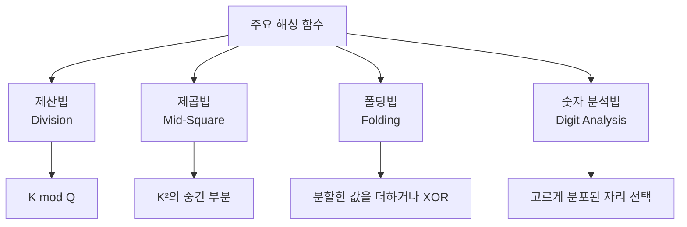
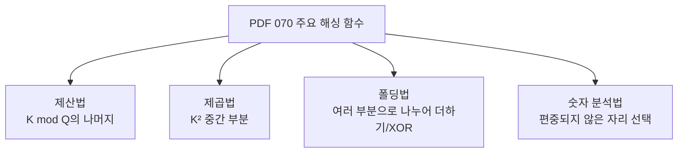
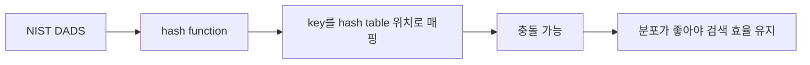
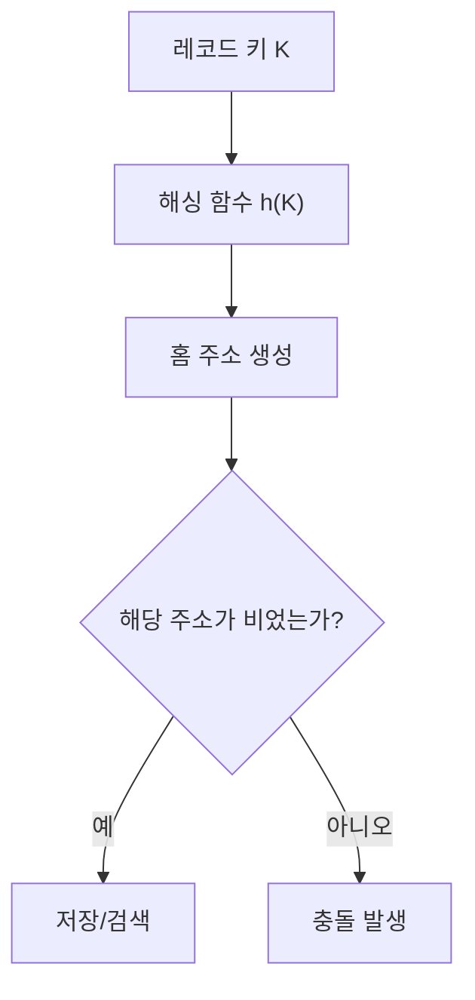
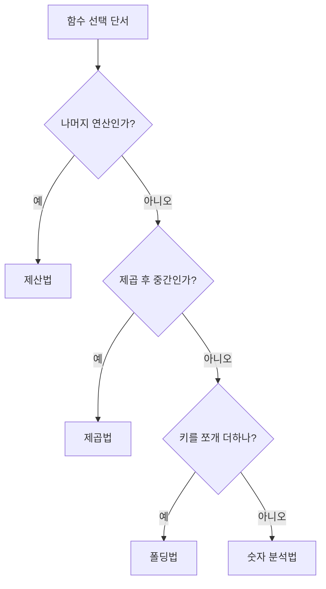
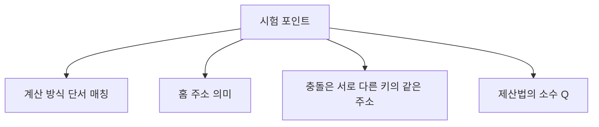
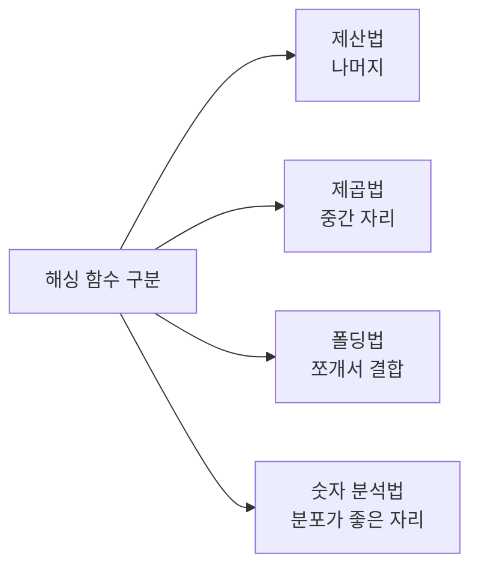
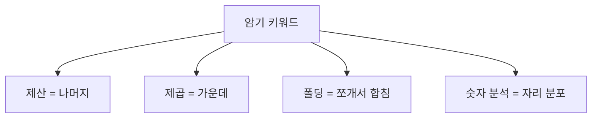
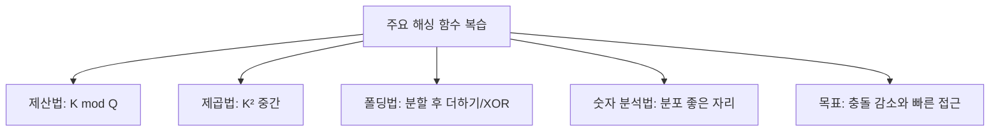

# 070 주요 해싱 함수

작성 기준일: 2026-06-01
검색/보강일: 2026-06-01
과목: `2과목 소프트웨어 개발`
기준 PDF: `/Users/nes0903/Documents/study/정보처리기사/핵심요약집_2026_정보처리기사필기핵심요약.pdf`
PDF 확인 위치: `11페이지`
검색 보강: NIST DADS의 hash/hash table 설명과 해싱 함수 종류 자료를 참고하여 제산법·제곱법·폴딩법·숫자 분석법을 시험 단서 중심으로 확장
주제별 검색 키워드: `hash function division mid-square folding digit analysis`, `hash table NIST DADS`, `hashing methods division folding mid-square digit analysis`

---

## 1. 한 줄 요약

- 해싱 함수는 레코드의 키 값을 해시 테이블의 주소로 변환하는 함수이다.
- PDF 기준 주요 해싱 함수는 `제산법`, `제곱법`, `폴딩법`, `숫자 분석법`이다.
- 시험에서는 각 방법의 계산 단서가 중요하다.
  - 나머지 → 제산법
  - 제곱 후 중간 부분 → 제곱법
  - 분할 후 더하기/XOR → 폴딩법
  - 자릿수 분포 분석 → 숫자 분석법

---

## 2. 한눈에 보는 구조

- 해싱은 키를 직접 비교해 찾는 방식이 아니라, 키로부터 저장 위치를 계산하는 방식이다.
- 해싱 함수의 결과로 얻은 주소를 흔히 `홈 주소`라고 한다.
- 좋은 해싱 함수는 키를 테이블 전체에 고르게 분산시켜 충돌을 줄여야 한다.
- 정보처리기사 필기에서는 충돌 해결 방식보다, 이 장에서는 해싱 함수 종류와 계산 방식을 먼저 구분한다.

---

## 3. PDF 기준 핵심

- PDF 기준 핵심 정리:

| 해싱 함수 | PDF 기준 정의 | 시험 핵심 단서 |
|---|---|---|
| 제산법 | 키 `K`를 해시 테이블 크기보다 큰 수 중 가장 작은 소수 `Q`로 나눈 나머지를 홈 주소로 삼음 | `나머지`, `소수`, `mod` |
| 제곱법 | 키 `K`를 제곱한 뒤 중간 부분의 값을 홈 주소로 삼음 | `제곱`, `중간 부분` |
| 폴딩법 | 키 `K`를 여러 부분으로 나누고 각 부분을 더하거나 XOR한 값을 홈 주소로 삼음 | `분할`, `더하기`, `XOR` |
| 숫자 분석법 | 키를 구성하는 각 자리의 분포를 분석해 비교적 고른 자리를 선택하여 홈 주소로 삼음 | `자리 분포`, `편중되지 않은 자리` |

- PDF 표현에서 특히 중요한 부분:
  - 제산법은 단순히 아무 수로 나누는 것이 아니라, 해시 테이블 크기보다 큰 수 중 가장 작은 소수 `Q`를 사용한다고 설명한다.
  - 제곱법은 제곱 결과 전체가 아니라 `중간 부분`을 사용한다.
  - 폴딩법은 `더하기`뿐 아니라 `XOR`도 함께 언급된다.
  - 숫자 분석법은 각 자리의 분포를 보고 치우침이 적은 자리를 고른다.

---

## 4. 검색으로 보강한 관점

- NIST DADS의 hash/hash table 설명은 해싱을 키를 테이블 위치로 매핑하는 구조로 이해하게 해 준다.
- 보강 자료에서 공통으로 강조하는 좋은 해싱 함수의 성질:
  - 계산이 빨라야 한다.
  - 결과가 테이블 전체에 고르게 분포해야 한다.
  - 같은 키는 항상 같은 주소를 만들어야 한다.
  - 충돌이 적어야 한다.
- 정보처리기사 시험에서는 암호학적 해시의 보안 성질보다 자료구조의 해시 테이블 주소 계산을 우선한다.

---

## 5. 개념 설명

- 해싱의 기본 용어:
  - `키`: 레코드를 식별하는 값이다.
  - `해싱 함수`: 키를 주소로 바꾸는 함수이다.
  - `홈 주소`: 해싱 함수가 산출한 기본 저장 위치이다.
  - `해시 테이블`: 홈 주소를 인덱스로 사용하는 저장 공간이다.
  - `충돌`: 서로 다른 키가 같은 홈 주소를 갖는 현상이다.
- 070의 범위는 충돌 해결보다 `어떤 방식으로 홈 주소를 계산하는가`에 있다.
- 같은 데이터라도 해싱 함수 선택이 좋지 않으면 특정 주소에 데이터가 몰린다.
  - 이 경우 검색·삽입 성능이 떨어진다.
  - 그래서 해싱 함수는 균등 분포를 목표로 한다.

---

## 6. 함수별 상세 정리

| 구분 | 계산 방식 | 예시 감각 | 장점 | 주의점 |
|---|---|---|---|---|
| 제산법 | `K mod Q`의 나머지를 주소로 사용 | `K=1234`, `Q=13`이면 나머지 계산 | 단순하고 빠름 | `Q` 선택이 나쁘면 충돌이 늘 수 있음 |
| 제곱법 | `K²`을 구한 뒤 중간 자리 사용 | `K=123`, `K²=15129`, 중간 `51` 사용 | 키의 여러 자릿수 영향이 섞임 | 중간 몇 자리를 쓸지 테이블 크기와 맞춰야 함 |
| 폴딩법 | 키를 여러 부분으로 나누어 더하거나 XOR | `123456` → `123 + 456` | 긴 키에 적용하기 쉬움 | 분할 방식에 따라 분포가 달라짐 |
| 숫자 분석법 | 각 자리의 분포를 분석해 고른 자리 선택 | 학번·사번처럼 자리별 의미가 있는 키 | 키 구조를 활용 가능 | 키 분포를 미리 알아야 효과적 |

### 6.1 제산법

- 제산법은 가장 직관적인 해싱 함수다.
- 키를 특정 수로 나누고 나머지를 주소로 사용한다.
- PDF에서는 `해시 테이블 크기보다 큰 수 중 가장 작은 소수 Q`를 기준으로 설명한다.
- 단서어:
  - `나머지`
  - `mod`
  - `소수`
  - `Division`

### 6.2 제곱법

- 제곱법은 키를 제곱한 뒤 가운데에 있는 일부 숫자를 주소로 사용한다.
- 제곱 과정에서 키의 여러 자릿수가 결과에 영향을 주므로 단순한 일부 자리 선택보다 분포가 나아질 수 있다.
- 단서어:
  - `제곱`
  - `중간 자리`
  - `Mid-Square`

### 6.3 폴딩법

- 폴딩법은 긴 키를 여러 조각으로 접듯이 나누고, 각 조각을 결합해 주소를 만든다.
- 결합 방법은 더하기가 대표적이고, PDF처럼 XOR을 사용하는 설명도 나온다.
- 단서어:
  - `분할`
  - `접기`
  - `더하기`
  - `XOR`
  - `Folding`

### 6.4 숫자 분석법

- 숫자 분석법은 키의 각 자리 값이 얼마나 고르게 분포되어 있는지 분석한다.
- 특정 자리가 대부분 같은 값이면 주소로 쓰기 좋지 않다.
- 다양한 값이 고르게 나타나는 자리를 선택해야 충돌을 줄일 수 있다.
- 단서어:
  - `자릿수 분석`
  - `분포`
  - `편중`
  - `Digit Analysis`

---

## 7. 시험 포인트

- 가장 중요한 암기:
  - 제산법: `키를 소수로 나눈 나머지`
  - 제곱법: `키를 제곱한 후 중간 부분`
  - 폴딩법: `키를 여러 부분으로 나누어 더하거나 XOR`
  - 숫자 분석법: `각 자리의 분포를 분석해 고른 자리 선택`
- 객관식 함정:
  - `제곱 결과의 끝자리`가 아니라 `중간 부분`이다.
  - `폴딩법`은 키를 접듯이 나누어 합치므로 단순 나머지 연산과 다르다.
  - `숫자 분석법`은 무작위로 자리수를 고르는 것이 아니라 분포를 분석한다.
  - `제산법`의 핵심은 나머지를 홈 주소로 사용하는 것이다.
- 용어 함정:
  - `홈 주소`는 해싱 함수로 계산한 기본 주소이다.
  - `충돌`은 홈 주소가 같은 경우이지, 키가 같은 경우가 아니다.
  - `해싱 함수`와 `해시 테이블`을 구분한다.

---

## 8. 헷갈리는 비교

| 비교 항목 | 제산법 | 제곱법 | 폴딩법 | 숫자 분석법 |
|---|---|---|---|---|
| 핵심 연산 | 나눗셈 | 제곱 | 분할 후 결합 | 자리별 통계 분석 |
| PDF 단어 | 소수 `Q`, 나머지 | 중간 부분 | 더하거나 XOR | 분포 |
| 적합한 단서 | `K mod Q` | `K²` | 긴 키를 나눔 | 학번·사번 등 자리 의미가 있는 키 |
| 실수 포인트 | 테이블 크기와 소수 선택 혼동 | 앞/뒤가 아닌 중간 | 단순 연결이 아니라 결합 | 아무 자리나 고르는 것 아님 |

- 문제에서 계산 예시가 나오면 먼저 어떤 연산이 보이는지 확인한다.
- `나머지`, `제곱`, `분할`, `분포` 네 단어만 정확히 잡아도 대부분의 기본 문제를 풀 수 있다.

---

## 9. 예시 또는 암기 포인트

- 암기 문장:
  - `제산은 나머지, 제곱은 가운데, 폴딩은 쪼개서 합치기, 숫자 분석은 자리 분포.`
- 예시 감각:
  - 제산법: `1234 mod 13`의 나머지를 주소로 쓴다.
  - 제곱법: `1234²`을 계산하고 가운데 몇 자리를 주소로 쓴다.
  - 폴딩법: `12345678`을 `1234`와 `5678`로 나누어 더하거나 XOR한다.
  - 숫자 분석법: 여러 키에서 특정 자리의 값이 고르게 퍼져 있는지 본다.
- 시험에서 `홈 주소`라는 표현이 나오면 해싱 함수의 결과 주소를 떠올린다.

---

## 10. 빠른 복습

- 해싱 함수는 키를 홈 주소로 바꾼다.
- 제산법은 나머지를 사용한다.
- 제곱법은 키를 제곱한 결과의 중간 부분을 사용한다.
- 폴딩법은 키를 여러 부분으로 나누어 더하거나 XOR한다.
- 숫자 분석법은 자리별 분포를 분석해 고르게 분포된 자리를 사용한다.
- 해싱 함수의 품질은 주소 분포와 충돌 가능성에 영향을 준다.

---

## 11. 참고 링크

- [기준 PDF: 핵심요약집_2026_정보처리기사필기핵심요약](/Users/nes0903/Documents/study/정보처리기사/핵심요약집_2026_정보처리기사필기핵심요약.pdf)
- [Q-Net 정보처리기사 종목별 상세정보](https://www.q-net.or.kr/crf005.do?id=crf00503&jmCd=1320)
- [NIST DADS - hash](https://xlinux.nist.gov/dads/HTML/hash.html)
- [NIST DADS - hash table](https://xlinux.nist.gov/dads/HTML/hashtab.html)
- [GeeksforGeeks - Hash Functions](https://www.geeksforgeeks.org/dsa/hash-functions-and-list-types-of-hash-functions/)
- [OpenGenus - Hashing: Complete Guide](https://iq.opengenus.org/hashing/)
