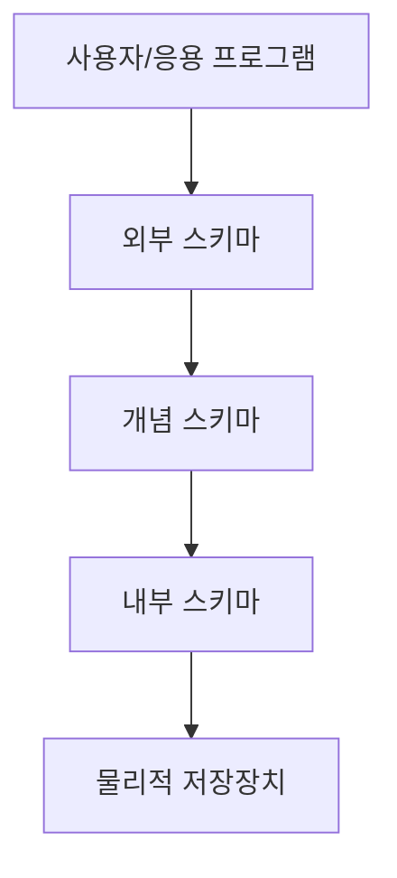
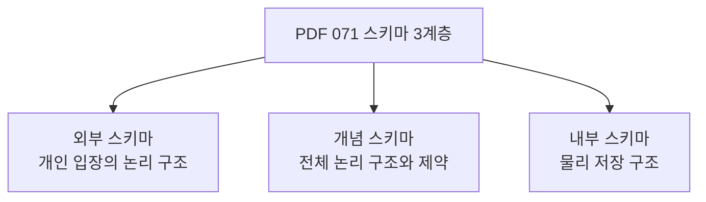
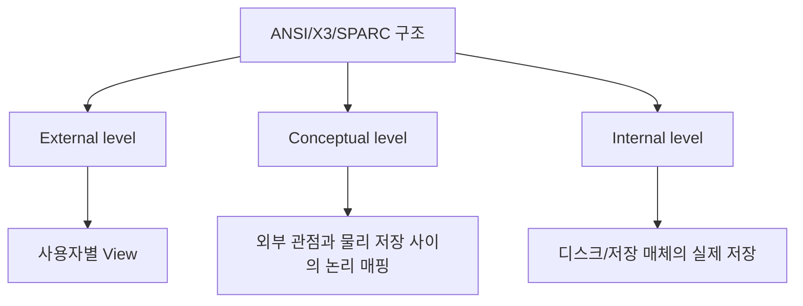
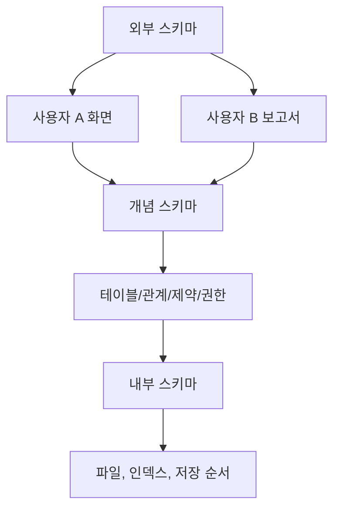
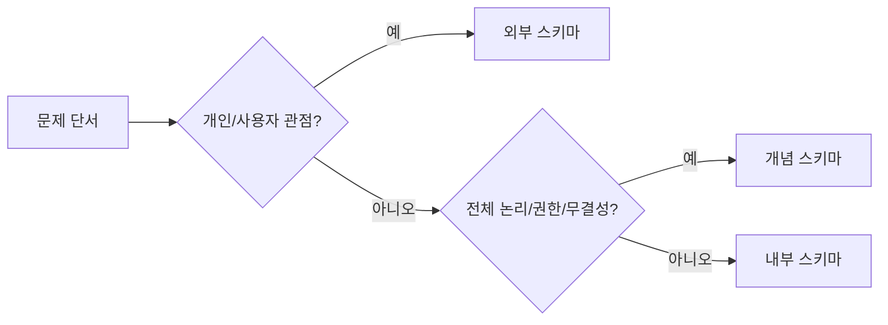
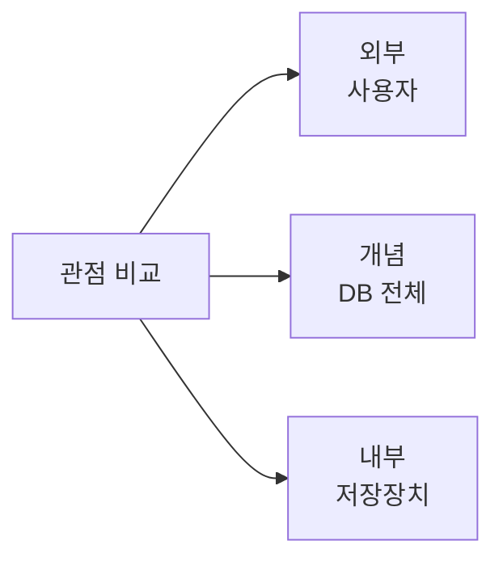
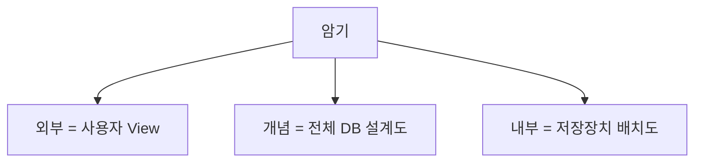
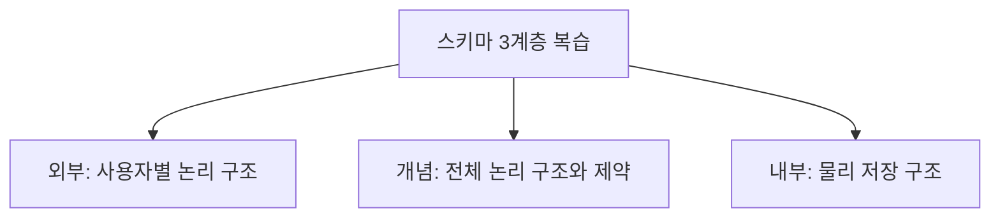

# 071 스키마 3계층

작성 기준일: 2026-06-01
검색/보강일: 2026-06-01
과목: `2과목 소프트웨어 개발`
기준 PDF: `/Users/nes0903/Documents/study/정보처리기사/핵심요약집_2026_정보처리기사필기핵심요약.pdf`
PDF 확인 위치: `12페이지`
검색 보강: ANSI/X3/SPARC 3계층 구조 설명과 DB 설계 자료를 참고하여 외부·개념·내부 스키마의 역할 차이를 확장
주제별 검색 키워드: `ANSI SPARC three schema architecture external conceptual internal schema`, `database three schema architecture`

---

## 1. 한 줄 요약

- 스키마 3계층은 데이터베이스 구조를 `사용자 관점`, `전체 논리 관점`, `물리 저장 관점`으로 나누어 설명하는 구조이다.
- PDF 기준 핵심은 `외부 스키마`, `개념 스키마`, `내부 스키마` 각각의 정의와 관점 차이를 정확히 구분하는 것이다.
- 시험에서는 `개인별 필요한 논리 구조 = 외부`, `전체 논리 구조와 제약/권한/보안/무결성 = 개념`, `저장 레코드 형식과 물리 순서 = 내부`로 암기한다.

---

## 2. 한눈에 보는 구조

- 외부 스키마:
  - 사용자나 응용 프로그램이 보는 데이터베이스의 일부분이다.
  - 사용자별 관점이 다르므로 여러 개 존재할 수 있다.
- 개념 스키마:
  - 데이터베이스 전체의 논리적 구조이다.
  - 개체, 관계, 제약 조건, 접근 권한, 보안, 무결성 규칙을 포함한다.
- 내부 스키마:
  - 물리 저장장치 입장에서 본 데이터베이스 구조이다.
  - 레코드 형식, 저장 항목 표현 방법, 물리적 순서 등을 포함한다.
- 3계층을 나누는 이유:
  - 사용자 관점과 저장 구조를 분리한다.
  - 저장 방식이 바뀌어도 사용자 프로그램 영향을 줄인다.
  - 사용자별로 필요한 데이터만 보여 줄 수 있다.

---

## 3. PDF 기준 핵심

| 계층 | PDF 기준 정의 | 시험 핵심 |
|---|---|---|
| 외부 스키마 | 사용자나 응용 프로그래머가 각 개인의 입장에서 필요로 하는 데이터베이스의 논리적 구조 | 사용자별 관점, View, 여러 개 가능 |
| 개념 스키마 | 데이터베이스의 전체적인 논리적 구조로 개체 간 관계와 제약 조건을 나타내고 접근 권한, 보안, 무결성 규칙을 정의 | 전체 DB 논리 구조, 하나의 중심 구조 |
| 내부 스키마 | 물리적 저장장치 입장에서 본 데이터베이스 구조로 실제 저장될 레코드 형식, 표현 방법, 내부 레코드 물리 순서 등을 나타냄 | 물리 저장, 레코드 형식, 저장 순서 |

- PDF에서 특히 중요한 표현:
  - 외부 스키마는 `각 개인의 입장`이다.
  - 개념 스키마는 `전체적인 논리적 구조`이다.
  - 내부 스키마는 `물리적 저장장치의 입장`이다.
- 개념 스키마는 단순 테이블 목록이 아니라 권한, 보안, 무결성 규칙까지 포함한다는 점이 함정이다.

---

## 4. 검색으로 보강한 관점

- ANSI/X3/SPARC 3계층 구조도 `External`, `Conceptual`, `Internal` 세 수준을 둔다.
- Teradata 자료는 외부 수준을 여러 사용자 관점, 내부 수준을 물리 저장 수준으로 설명한다.
- 3계층 구조는 `데이터 독립성`을 이해하기 위한 기반이다.
  - 논리적 데이터 독립성: 개념 스키마 변화가 외부 스키마에 주는 영향을 줄인다.
  - 물리적 데이터 독립성: 내부 스키마 변화가 개념/외부 스키마에 주는 영향을 줄인다.
- 정보처리기사 필기에서는 데이터 독립성 용어가 직접 나오지 않아도, 스키마 분리가 왜 필요한지 이해하면 오답을 줄일 수 있다.

---

## 5. 개념 설명

- 외부 스키마 예시:
  - 학생은 본인 성적만 조회한다.
  - 교수는 담당 과목의 수강생 성적을 조회한다.
  - 행정 담당자는 전체 학적 정보를 조회한다.
  - 같은 데이터베이스라도 사용자별로 보이는 구조가 다르다.
- 개념 스키마 예시:
  - 학생, 과목, 수강, 교수 개체를 정의한다.
  - 학생과 수강 사이의 관계를 정의한다.
  - 학번은 중복될 수 없다는 제약 조건을 둔다.
  - 누가 어떤 데이터를 볼 수 있는지 권한을 정의한다.
- 내부 스키마 예시:
  - 레코드를 어떤 파일에 저장할지 정한다.
  - 인덱스 구조를 어떻게 둘지 정한다.
  - 데이터 항목을 저장장치에서 어떤 형식으로 표현할지 정한다.

---

## 6. 시험 포인트

- 외부 스키마 단서:
  - 사용자
  - 응용 프로그래머
  - 개인 입장
  - 필요한 데이터만 보는 논리 구조
- 개념 스키마 단서:
  - 전체 데이터베이스
  - 개체 간 관계
  - 제약 조건
  - 접근 권한, 보안, 무결성
- 내부 스키마 단서:
  - 물리적 저장장치
  - 실제 저장 레코드 형식
  - 저장 데이터 항목의 표현 방법
  - 내부 레코드의 물리적 순서
- 함정:
  - 외부 스키마도 `논리적 구조`라는 표현을 쓴다.
  - 하지만 전체 논리 구조가 아니라 사용자별 논리 구조다.
  - 개념 스키마는 물리 저장 방법을 직접 다루지 않는다.
  - 내부 스키마는 사용자 화면이나 업무 View가 아니다.

---

## 7. 헷갈리는 비교

| 비교 항목 | 외부 스키마 | 개념 스키마 | 내부 스키마 |
|---|---|---|---|
| 관점 | 사용자/응용 프로그램 | 조직 전체 데이터베이스 | 물리 저장장치 |
| 개수 | 여러 개 가능 | 보통 하나 | 보통 하나 |
| 핵심 단어 | 개인 입장, View | 전체 논리 구조, 관계, 제약 | 저장 형식, 물리 순서 |
| 다루는 내용 | 필요한 데이터만 표현 | 개체, 관계, 권한, 보안, 무결성 | 레코드 형식, 저장 표현 |
| 시험 함정 | 개념 스키마와 둘 다 논리 구조 | 보안/무결성 포함 | 논리 구조가 아니라 물리 구조 |

- `논리적 구조`라는 말만 보고 무조건 개념 스키마를 고르면 틀릴 수 있다.
- 사용자별 필요한 논리 구조는 외부 스키마이고, 전체 논리 구조는 개념 스키마다.

---

## 8. 예시 또는 암기 포인트

- 암기 문장:
  - `외부는 사용자, 개념은 전체 논리, 내부는 물리 저장.`
- 예시:
  - 외부: `학생 조회 화면`, `교수 성적 입력 화면`
  - 개념: `학생-수강-과목 관계와 제약 조건`
  - 내부: `인덱스, 파일 저장 형식, 레코드 저장 순서`
- 문제풀이 순서:
  - 먼저 관점의 주체를 찾는다.
  - 사용자면 외부, 전체 DB면 개념, 저장장치면 내부로 분류한다.

---

## 9. 빠른 복습

- 외부 스키마는 사용자나 응용 프로그래머 개인 입장의 논리 구조다.
- 개념 스키마는 데이터베이스 전체의 논리 구조와 관계, 제약, 권한, 보안, 무결성을 정의한다.
- 내부 스키마는 실제 저장 레코드 형식과 물리적 저장 순서 등을 정의한다.
- 시험에서는 `개인`, `전체`, `물리` 세 단어로 빠르게 분류한다.

---

## 10. 참고 링크

- [기준 PDF: 핵심요약집_2026_정보처리기사필기핵심요약](/Users/nes0903/Documents/study/정보처리기사/핵심요약집_2026_정보처리기사필기핵심요약.pdf)
- [Q-Net 정보처리기사 종목별 상세정보](https://www.q-net.or.kr/crf005.do?id=crf00503&jmCd=1320)
- [Teradata Docs - ANSI/X3/SPARC Three Schema Architecture](https://docs.teradata.com/r/Enterprise_IntelliFlex_VMware/Database-Design/Database-Design-for-Vantage/ANSI/X3/SPARC-Three-Schema-Architecture)

<!-- study-links:start -->
## 관련 문서

- `무결성`: [[정보처리기사/3과목 데이터베이스 구축/115 무결성/115 무결성|115 무결성]]
- `물리적`: [[정보처리기사/5과목 정보시스템 구축 관리/320 관리적 물리적 기술적 보안/320 관리적 물리적 기술적 보안|320 관리적/물리적/기술적 보안]]
<!-- study-links:end -->
