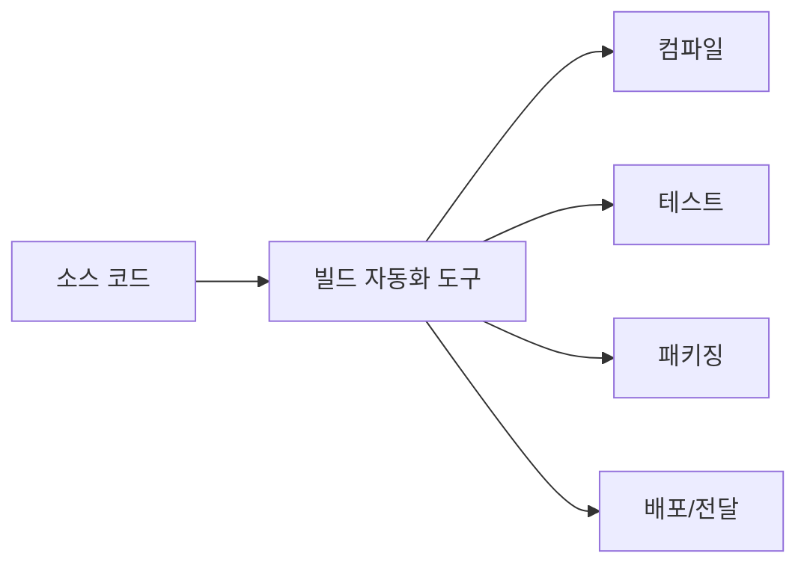
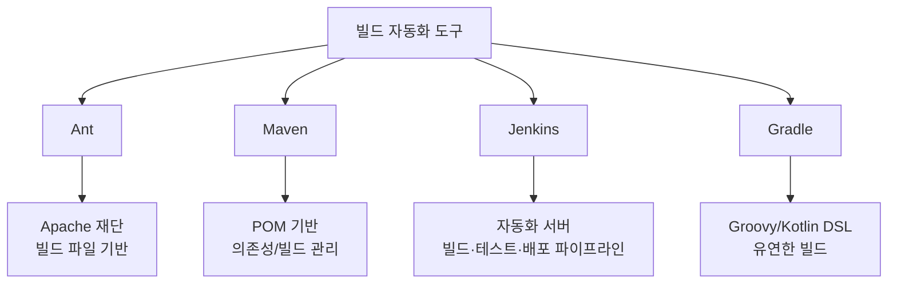
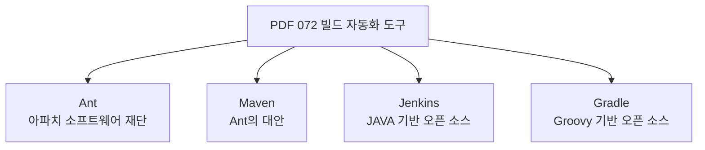
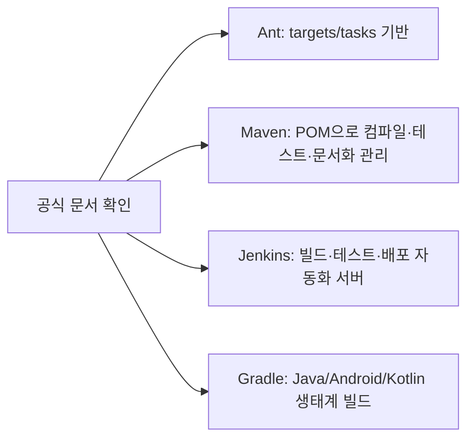
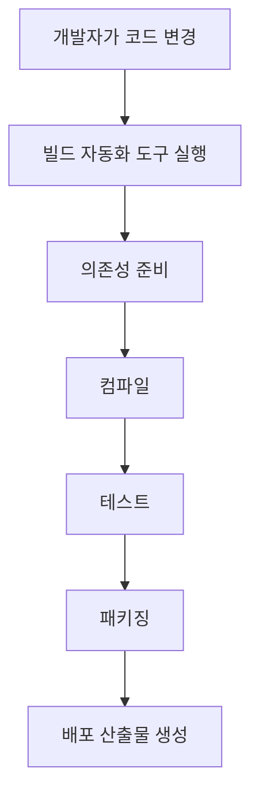
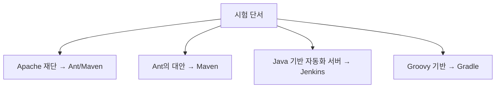
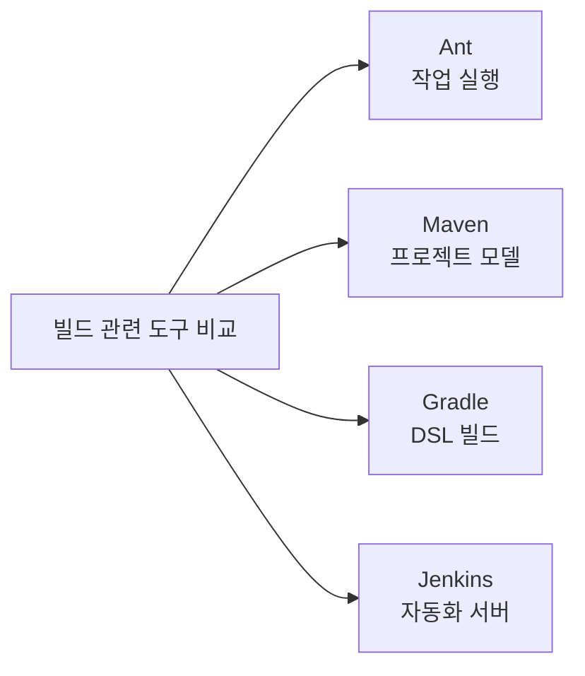
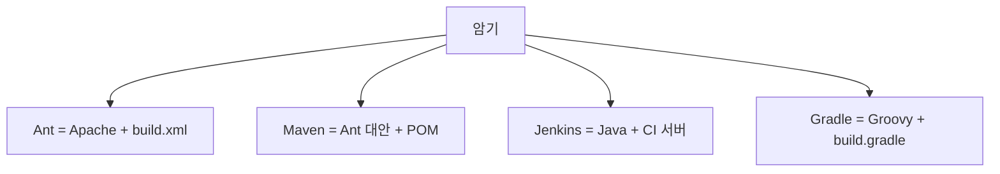
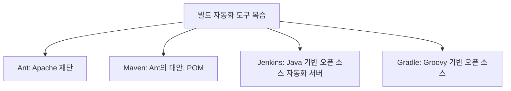

# 072 빌드 자동화 도구

작성 기준일: 2026-06-01
검색/보강일: 2026-06-01
과목: `2과목 소프트웨어 개발`
기준 PDF: `/Users/nes0903/Documents/study/정보처리기사/핵심요약집_2026_정보처리기사필기핵심요약.pdf`
PDF 확인 위치: `12페이지`
검색 보강: Apache Ant, Apache Maven, Jenkins, Gradle 공식 문서를 확인하여 각 도구의 역할과 시험 구분 단서를 확장
주제별 검색 키워드: `Apache Ant official build tool`, `Apache Maven official build tool`, `Jenkins open source automation server`, `Gradle official build tool`

---

## 1. 한 줄 요약

- 빌드 자동화 도구는 소스 코드를 컴파일하고 테스트하며 실행 파일이나 배포 산출물을 만드는 과정을 자동화하는 도구이다.
- PDF 기준 주요 도구는 `Ant`, `Maven`, `Jenkins`, `Gradle`이다.
- 시험에서는 각 도구의 대표 단서를 묻는다.
  - Ant: Apache, Java 기반, build file
  - Maven: Ant의 대안, POM, Java 프로젝트 빌드
  - Jenkins: Java 기반 오픈 소스 빌드 자동화/자동화 서버
  - Gradle: Groovy 기반 오픈 소스 빌드 자동화 도구

---

## 2. 한눈에 보는 구조

- 빌드는 단순 컴파일만 의미하지 않는다.
  - 컴파일
  - 테스트 실행
  - 라이브러리 의존성 처리
  - 실행 파일 생성
  - 배포 패키지 생성
  - 산출물 보관
- 도구별 범위가 조금 다르다.
  - Ant, Maven, Gradle은 프로젝트 빌드 도구 성격이 강하다.
  - Jenkins는 빌드 도구를 실행하고 전체 자동화 흐름을 연결하는 서버 성격이 강하다.
- 정보처리기사 PDF는 도구 이름과 대표 설명을 짧게 묻는 편이므로 단서 매칭이 중요하다.

---

## 3. PDF 기준 핵심

| 도구 | PDF 기준 설명 | 시험 단서 |
|---|---|---|
| Ant | 아파치 소프트웨어 재단에서 개발한 소프트웨어 | Apache, Java, build.xml |
| Maven | Ant의 대안으로 개발한 소프트웨어 | POM, 의존성 관리, Java 프로젝트 |
| Jenkins | JAVA 기반의 오픈 소스 형태의 빌드 자동화 도구 | 자동화 서버, CI/CD, 빌드·테스트·배포 |
| Gradle | Groovy를 기반으로 한 오픈 소스 형태의 빌드 자동화 도구 | Groovy, Kotlin DSL, Maven/Ant 개념 계승 |

- PDF 표현에서는 `JAVA`, `Groovy`, `오픈 소스`, `Ant의 대안` 같은 키워드가 중요하다.
- `Jenkins`는 다른 빌드 도구와 함께 쓰이며, 실제 시험에서는 CI 도구로도 자주 연결된다.

---

## 4. 검색으로 보강한 관점

- Apache Ant 공식 문서는 Ant를 Java 라이브러리이자 명령행 도구로 설명하며, build file의 target/task 기반 프로세스를 실행한다고 설명한다.
- Apache Maven 공식 문서는 Maven을 Java 프로젝트용 빌드 도구로 설명하고, POM을 통해 컴파일, 테스트, 문서화 등을 관리한다고 설명한다.
- Jenkins 공식 문서는 Jenkins를 빌드, 테스트, 전달, 배포 작업을 자동화할 수 있는 오픈 소스 자동화 서버로 설명한다.
- Gradle 공식 문서는 Gradle을 Java, Android, Kotlin 개발자에게 널리 쓰이는 오픈 소스 빌드 시스템으로 설명한다.
- 시험 확장 관점:
  - Jenkins는 Maven이나 Gradle을 실행하는 파이프라인 도구로 함께 쓰일 수 있다.
  - Maven과 Gradle은 의존성 관리와 빌드 생명주기를 다룬다.
  - Ant는 더 절차적이고 유연하지만, 의존성 관리는 Ivy 같은 별도 도구와 조합하는 경우가 있다.

---

## 5. 개념 설명

- 빌드 자동화가 필요한 이유:
  - 사람이 매번 같은 명령을 반복하면 실수하기 쉽다.
  - 개발자마다 다른 방식으로 빌드하면 결과가 달라질 수 있다.
  - CI 환경에서는 코드가 변경될 때마다 자동으로 빌드와 테스트가 돌아가야 한다.
- Ant:
  - `build.xml` 같은 빌드 파일에 작업을 적는다.
  - 컴파일, 압축, 복사, 테스트 실행 같은 작업을 target 단위로 실행한다.
- Maven:
  - `pom.xml`을 중심으로 프로젝트 구조와 의존성을 관리한다.
  - 표준 생명주기와 규칙을 제공한다.
- Jenkins:
  - 소스 저장소 변경을 감지해 빌드 작업을 실행할 수 있다.
  - 빌드, 테스트, 배포 단계를 파이프라인으로 연결한다.
- Gradle:
  - Groovy 또는 Kotlin DSL을 사용해 빌드 스크립트를 작성한다.
  - 유연한 빌드 로직과 플러그인 생태계를 제공한다.

---

## 6. 시험 포인트

- 도구별 매칭:
  - `아파치 소프트웨어 재단`, `build.xml`, `target/task` → Ant
  - `Ant의 대안`, `POM`, `pom.xml`, `의존성 관리` → Maven
  - `JAVA 기반`, `오픈 소스`, `빌드 자동화 서버`, `CI/CD` → Jenkins
  - `Groovy 기반`, `Kotlin DSL`, `오픈 소스 빌드 도구` → Gradle
- 함정:
  - Jenkins는 프로젝트 빌드 스크립트 자체라기보다 자동화 서버 성격이 강하다.
  - Maven은 Ant의 대안으로 등장했지만, 현재는 의존성 관리와 생명주기 관리 단서가 더 자주 붙는다.
  - Gradle은 Groovy 기반이라고 외우되, 실제 최신 생태계에서는 Kotlin DSL도 함께 쓰인다. PDF 기준 단서는 `Groovy`다.
- 객관식 팁:
  - `Groovy`가 나오면 Gradle을 먼저 고른다.
  - `POM`이 나오면 Maven이다.
  - `CI`, `Pipeline`, `자동화 서버`가 나오면 Jenkins다.

---

## 7. 헷갈리는 비교

| 구분 | Ant | Maven | Gradle | Jenkins |
|---|---|---|---|---|
| 주된 성격 | 빌드 작업 실행 도구 | 프로젝트 빌드/의존성 관리 | 유연한 빌드 자동화 도구 | 자동화 서버 |
| 대표 파일/방식 | `build.xml` | `pom.xml` | `build.gradle` | Jenkinsfile, Job |
| PDF 단서 | Apache 재단 | Ant의 대안 | Groovy 기반 | Java 기반 오픈 소스 |
| 강점 | 유연한 작업 정의 | 표준 생명주기와 의존성 | 확장성과 DSL | CI/CD 파이프라인 |
| 헷갈림 | Maven도 Apache | Ant도 Java 생태계 | Maven과 비교됨 | 빌드 도구를 실행하는 쪽 |

- `빌드 자동화 도구`라는 큰 범주 안에 있지만 사용 위치가 다르다.
- Jenkins는 Maven/Gradle을 호출해 빌드를 수행하는 파이프라인의 실행 관리자로 많이 사용된다.

---

## 8. 예시 또는 암기 포인트

- 암기 문장:
  - `Ant는 Apache, Maven은 POM, Jenkins는 Java 자동화 서버, Gradle은 Groovy.`
- 개발 흐름 예시:
  - 개발자가 Git에 코드를 올린다.
  - Jenkins가 변경을 감지한다.
  - Jenkins가 Maven 또는 Gradle 빌드를 실행한다.
  - 테스트가 통과하면 패키지를 만들고 배포한다.
- 시험에서는 도구를 실제로 사용할 줄 아는지보다, 도구별 대표 특징을 구분하는 문제가 많다.

---

## 9. 빠른 복습

- Ant는 Apache 소프트웨어 재단에서 개발한 Java 기반 빌드 도구다.
- Maven은 Ant의 대안으로 개발되었고 POM 중심으로 프로젝트 빌드를 관리한다.
- Jenkins는 Java 기반 오픈 소스 자동화 서버로 빌드, 테스트, 배포 자동화에 쓰인다.
- Gradle은 Groovy 기반 오픈 소스 빌드 자동화 도구로, PDF에서는 Groovy 단서가 중요하다.

---

## 10. 참고 링크

- [기준 PDF: 핵심요약집_2026_정보처리기사필기핵심요약](/Users/nes0903/Documents/study/정보처리기사/핵심요약집_2026_정보처리기사필기핵심요약.pdf)
- [Q-Net 정보처리기사 종목별 상세정보](https://www.q-net.or.kr/crf005.do?id=crf00503&jmCd=1320)
- [Apache Ant 공식 문서](https://ant.apache.org/)
- [Apache Maven 공식 문서](https://maven.apache.org/)
- [Jenkins 공식 문서](https://www.jenkins.io/doc/)
- [Gradle 공식 사이트](https://gradle.org/)
