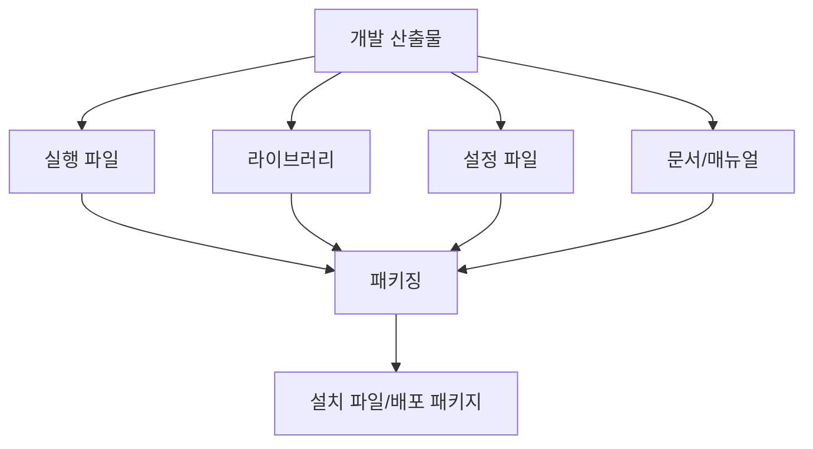
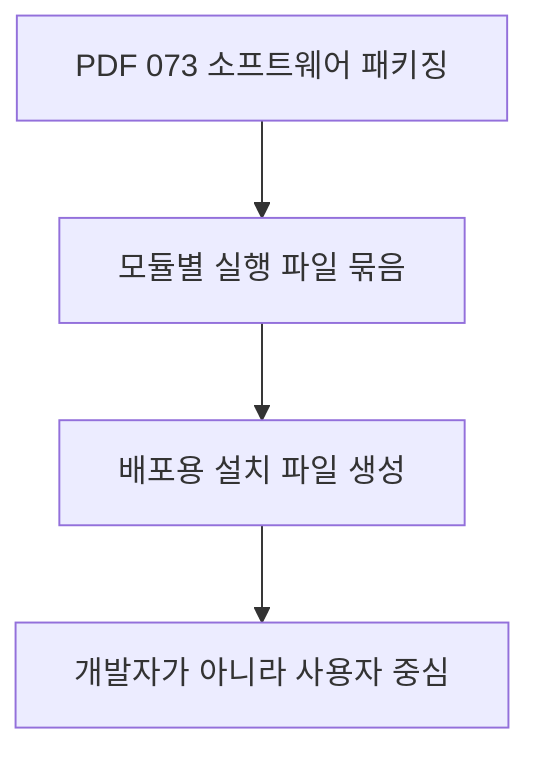
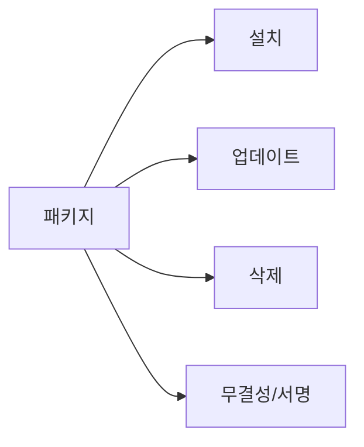
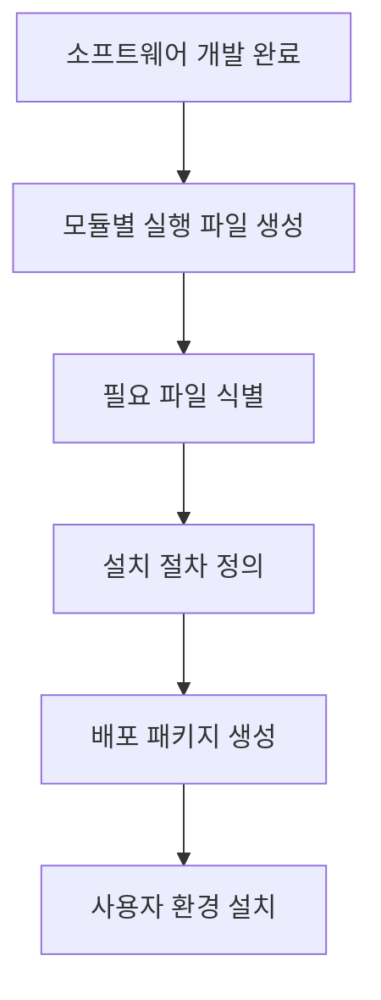
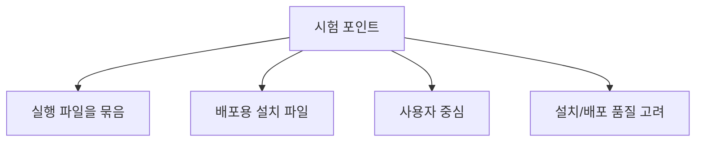
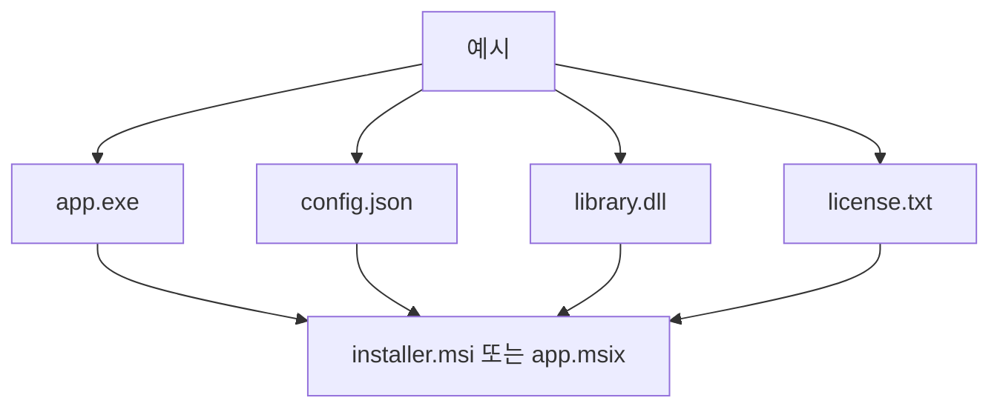
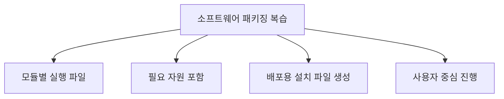

# 073 소프트웨어 패키징

작성 기준일: 2026-06-01
검색/보강일: 2026-06-01
과목: `2과목 소프트웨어 개발`
기준 PDF: `/Users/nes0903/Documents/study/정보처리기사/핵심요약집_2026_정보처리기사필기핵심요약.pdf`
PDF 확인 위치: `12페이지`
검색 보강: Microsoft MSIX와 Red Hat RPM 문서를 참고하여 패키징의 목적, 산출물, 사용자 중심 관점을 확장
주제별 검색 키워드: `software packaging MSIX package overview`, `Red Hat RPM packaging distributing software`, `software package install update uninstall`

---

## 1. 한 줄 요약

- 소프트웨어 패키징은 모듈별로 만든 실행 파일과 필요한 자원을 묶어 사용자가 설치할 수 있는 배포용 설치 파일을 만드는 작업이다.
- PDF 기준 핵심은 `개발자 중심이 아니라 사용자 중심으로 진행한다`는 점이다.
- 시험에서는 패키징을 단순 압축이 아니라 설치·배포·실행 환경을 고려한 배포 산출물 구성 작업으로 이해해야 한다.

---

## 2. 한눈에 보는 구조

- 패키징 대상:
  - 실행 파일
  - 라이브러리
  - 설정 파일
  - 리소스 파일
  - 설치 스크립트
  - 사용자 매뉴얼
  - 라이선스 정보
- 패키징 결과:
  - 설치 파일
  - 압축 배포본
  - 운영체제용 패키지
  - 앱 패키지
- 사용자 중심이라는 뜻:
  - 사용자가 설치 방법을 쉽게 이해해야 한다.
  - 사용자 환경에서 실행 가능해야 한다.
  - 삭제, 업데이트, 복구 같은 운영 흐름도 고려해야 한다.

---

## 3. PDF 기준 핵심

- PDF 핵심:
  - 모듈별로 생성한 실행 파일들을 묶어 배포용 설치 파일을 만드는 것이다.
  - 개발자가 아니라 사용자를 중심으로 진행한다.
- PDF 표현에서 중요한 단어:
  - `모듈별`
  - `실행 파일`
  - `묶어`
  - `배포용 설치 파일`
  - `사용자 중심`
- 시험에서 틀리기 쉬운 설명:
  - 패키징은 개발자가 보기 편하게 소스 코드를 묶는 작업이라는 설명은 부정확하다.
  - 패키징은 배포와 설치를 고려한 사용자 관점의 산출물 구성이다.

---

## 4. 검색으로 보강한 관점

- Microsoft MSIX 문서는 앱 패키징이 안정적인 설치와 삭제, 업데이트, 패키지 식별성, 서명 같은 요소와 연결된다고 설명한다.
- Red Hat RPM 문서는 패키지가 소프트웨어를 설치, 업데이트, 제거할 수 있는 독립 단위로 관리되도록 한다는 점을 보여 준다.
- 시험 확장 관점:
  - 패키징은 `실행 파일을 모으는 작업`에서 끝나지 않는다.
  - 설치 성공률, 삭제 후 잔여 파일, 업데이트 방식, 보안 서명, 의존성 확인까지 실제 배포 품질과 연결된다.
  - 정보처리기사 PDF에서는 이 중 사용자 중심과 배포용 설치 파일이라는 핵심만 간단히 제시한다.

---

## 5. 개념 설명

- 패키징 절차:
  - 개발된 모듈의 실행 파일을 확인한다.
  - 실행에 필요한 라이브러리와 환경 설정을 확인한다.
  - 사용자가 설치할 때 필요한 절차를 정리한다.
  - 설치 프로그램 또는 배포 패키지를 만든다.
  - 설치 후 정상 실행 여부를 검증한다.
- 패키징에서 사용자 중심이 중요한 이유:
  - 개발자는 내부 구조를 알고 있지만 사용자는 모른다.
  - 사용자는 복잡한 빌드 절차가 아니라 설치 파일과 안내 절차를 기대한다.
  - 사용자 환경은 개발 환경과 다를 수 있으므로 호환성 확인이 필요하다.
- 패키징 산출물에는 보통 다음 정보가 포함된다.
  - 제품명과 버전
  - 설치 경로
  - 실행 파일 위치
  - 필요 권한
  - 설치/삭제 방법
  - 라이선스 또는 사용 조건

---

## 6. 시험 포인트

- 반드시 기억할 것:
  - 패키징은 배포용 설치 파일을 만드는 작업이다.
  - 모듈별 실행 파일을 묶는다.
  - 개발자가 아니라 사용자를 중심으로 진행한다.
- 오답 단서:
  - 소스 코드만 압축한다.
  - 개발자 편의만 고려한다.
  - 설치 파일이 아니라 설계 문서만 만든다.
  - 사용자 환경을 고려하지 않는다.
- 연결 개념:
  - 빌드 자동화 도구가 실행 파일을 만들 수 있다.
  - 패키징은 그 실행 파일을 사용자에게 배포 가능한 형태로 묶는다.
  - 설치 매뉴얼은 사용자가 패키지를 설치할 수 있도록 안내한다.

---

## 7. 헷갈리는 비교

| 구분 | 빌드 | 패키징 | 배포 | 설치 |
|---|---|---|---|---|
| 목적 | 소스 코드를 실행 가능한 산출물로 변환 | 실행 파일과 필요 자원을 묶음 | 사용자/운영 환경에 전달 | 사용자 환경에 반영 |
| 산출물 | 실행 파일, 라이브러리 | 설치 파일, 패키지 | 배포 파일, 릴리스 | 설치된 프로그램 |
| 관점 | 개발/통합 | 사용자 배포 | 운영 전달 | 사용자 사용 |
| 시험 단서 | 컴파일, 테스트 | 묶어 배포용 설치 파일 | 릴리스, 전달 | 설치 절차 |

- 빌드와 패키징을 구분해야 한다.
- 빌드는 만들고, 패키징은 묶고, 배포는 전달하고, 설치는 사용자 환경에 적용한다.

---

## 8. 예시 또는 암기 포인트

- 암기 문장:
  - `패키징은 실행 파일을 사용자 설치 파일로 묶는 일이다.`
- 예시:
  - Windows 앱을 MSIX나 MSI로 만든다.
  - Linux 앱을 RPM 패키지로 만든다.
  - Java 앱을 JAR/WAR와 설치 스크립트로 묶는다.
- 사용자 중심 체크:
  - 설치가 가능한가?
  - 삭제가 가능한가?
  - 업데이트가 가능한가?
  - 필요한 파일이 모두 포함되어 있는가?
  - 설치 안내가 충분한가?

---

## 9. 빠른 복습

- 소프트웨어 패키징은 실행 파일들을 묶어 배포용 설치 파일을 만드는 것이다.
- 패키징은 개발자 중심이 아니라 사용자 중심으로 진행한다.
- 단순 압축보다 설치, 삭제, 업데이트, 보안, 사용 환경을 고려하는 작업이다.
- 빌드는 실행 파일 생성, 패키징은 설치 파일 구성으로 구분한다.

---

## 10. 참고 링크

- [기준 PDF: 핵심요약집_2026_정보처리기사필기핵심요약](/Users/nes0903/Documents/study/정보처리기사/핵심요약집_2026_정보처리기사필기핵심요약.pdf)
- [Q-Net 정보처리기사 종목별 상세정보](https://www.q-net.or.kr/crf005.do?id=crf00503&jmCd=1320)
- [Microsoft Learn - What is MSIX?](https://learn.microsoft.com/en-us/windows/msix/overview)
- [Red Hat Documentation - Introduction to RPM](https://docs.redhat.com/en/documentation/red_hat_enterprise_linux/8/html/packaging_and_distributing_software/introduction-to-rpm_packaging-and-distributing-software)
