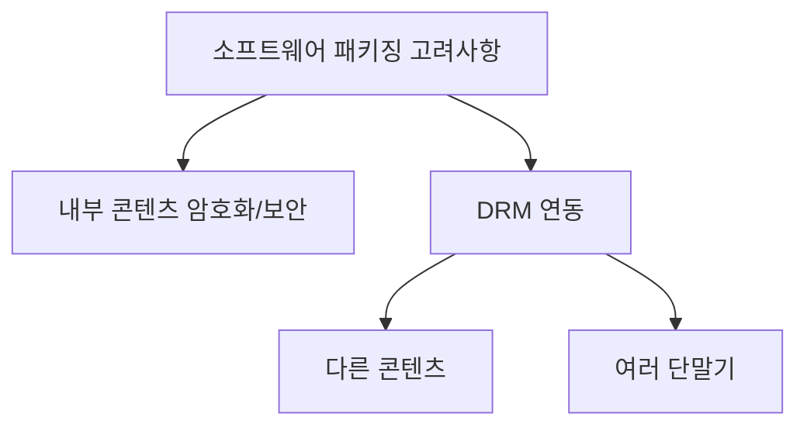
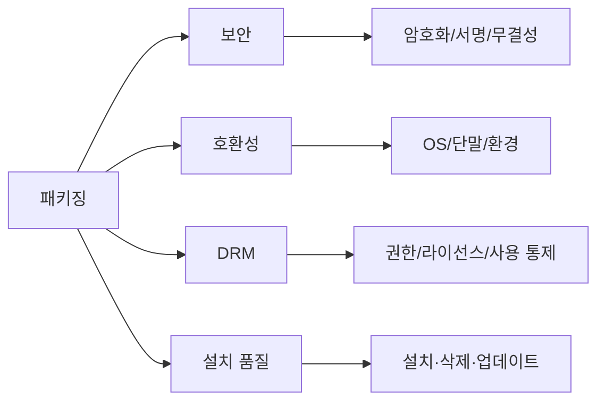
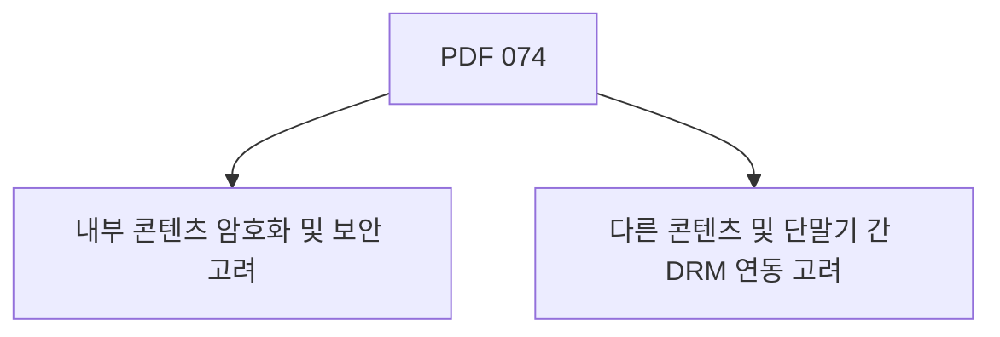
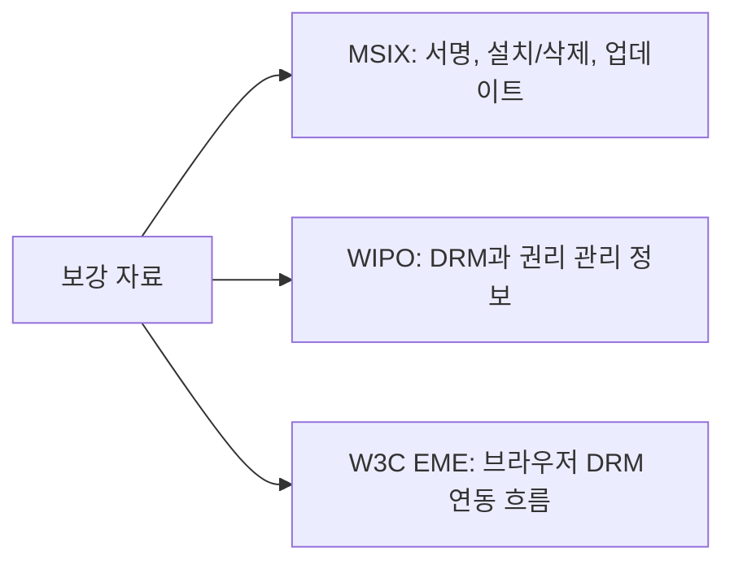
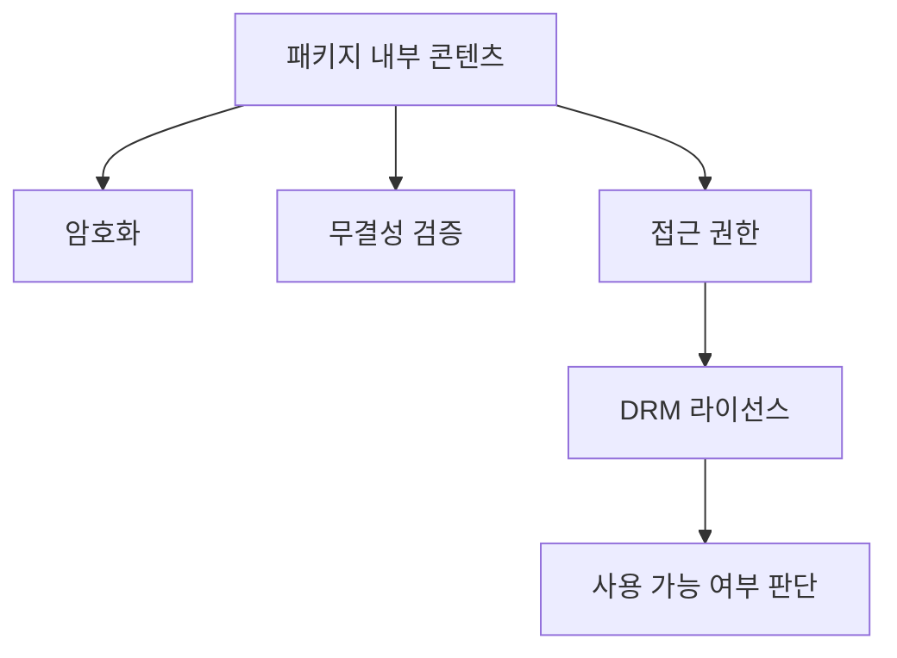
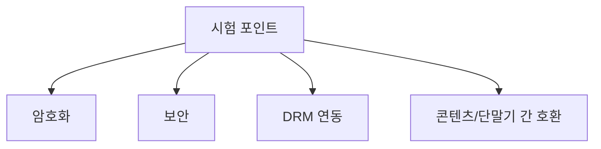
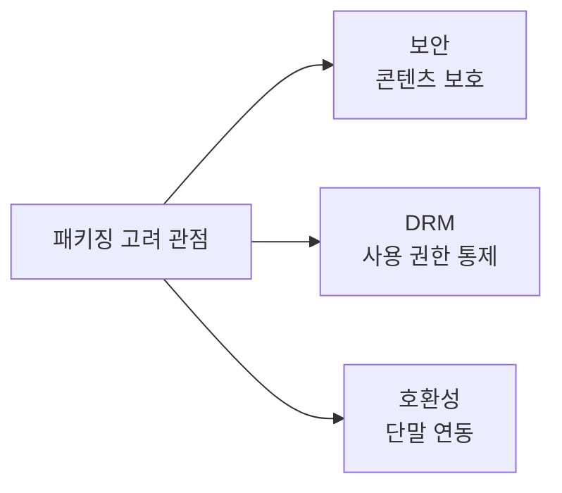
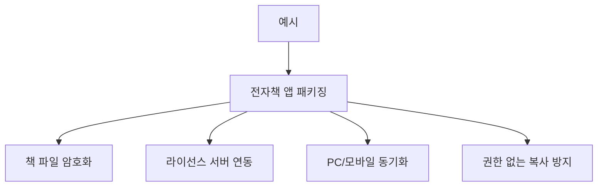
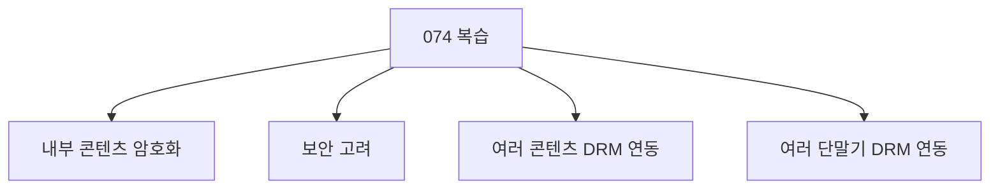

# 074 소프트웨어 패키징 시 고려사항

작성 기준일: 2026-06-01
검색/보강일: 2026-06-01
과목: `2과목 소프트웨어 개발`
기준 PDF: `/Users/nes0903/Documents/study/정보처리기사/핵심요약집_2026_정보처리기사필기핵심요약.pdf`
PDF 확인 위치: `12페이지`
검색 보강: Microsoft MSIX, WIPO DRM, W3C EME 자료를 참고하여 보안·DRM·단말 연동 고려사항을 확장
주제별 검색 키워드: `software packaging security encryption DRM considerations`, `MSIX package signing integrity`, `DRM WIPO rights management information`

---

## 1. 한 줄 요약

- 소프트웨어 패키징 시에는 배포 파일을 만드는 것뿐 아니라 내부 콘텐츠 보호와 DRM 연동을 함께 고려해야 한다.
- PDF 기준 핵심은 `내부 콘텐츠에 대한 암호화 및 보안`과 `다른 콘텐츠 및 단말기 간 DRM 연동`이다.
- 시험에서는 패키징 고려사항을 사용자 편의뿐 아니라 보안·저작권 보호·단말 호환까지 포함하는 개념으로 본다.

---

## 2. 한눈에 보는 구조

- 패키징 고려사항은 크게 다음 범주로 확장해 이해할 수 있다.
  - 보안: 콘텐츠 암호화, 패키지 무결성, 변조 방지
  - 저작권 보호: DRM, 라이선스, 사용 권한 통제
  - 호환성: 단말기, 운영체제, 다른 콘텐츠와의 연동
  - 사용자 경험: 설치 절차, 삭제, 업데이트, 오류 안내
- PDF는 이 중 보안과 DRM 연동을 핵심 항목으로 제시한다.

---

## 3. PDF 기준 핵심

- PDF 핵심 항목:
  - 내부 콘텐츠에 대한 암호화 및 보안을 고려한다.
  - 다른 여러 콘텐츠 및 단말기 간 DRM 연동을 고려한다.
- 문장별 해석:
  - `내부 콘텐츠`는 패키지 안에 포함된 실행 파일, 데이터, 이미지, 문서, 미디어, 설정 파일 등을 포함할 수 있다.
  - `암호화 및 보안`은 무단 열람, 변조, 복제, 악성 변경을 줄이기 위한 조치다.
  - `DRM 연동`은 콘텐츠 사용 권한과 라이선스를 여러 환경에서 일관되게 적용하는 것이다.
  - `여러 단말기 간`이라는 표현은 PC, 모바일, 태블릿, 전용 기기 등 다양한 사용 환경을 의미한다.

---

## 4. 검색으로 보강한 관점

- Microsoft MSIX 자료는 패키지가 서명, 설치/삭제 안정성, 업데이트와 연결된다는 점을 보여 준다.
- WIPO 자료는 디지털 저작물 보호에서 DRM 도구와 권리 관리 정보가 사용된다는 점을 설명한다.
- W3C EME 자료는 보호 콘텐츠 재생 시 콘텐츠 보호 시스템, 라이선스 서버, CDM 같은 구성요소 사이의 메시지 흐름을 표준화 관점에서 보여 준다.
- 시험 확장 이해:
  - 패키징 보안은 배포 파일 자체의 무결성과 콘텐츠 보호를 함께 본다.
  - DRM 연동은 패키지 내부 콘텐츠가 다른 단말기에서도 권한 정책에 맞게 사용되도록 하는 문제다.

---

## 5. 개념 설명

- 내부 콘텐츠 보안:
  - 패키지 안의 콘텐츠가 무단으로 열람되거나 복사되지 않도록 보호한다.
  - 패키지가 변조되었는지 확인할 수 있어야 한다.
  - 설치 과정에서 악성 파일이 섞이지 않도록 서명과 검증을 고려한다.
- DRM 연동:
  - 콘텐츠 제공자가 정한 권한에 따라 사용 가능 여부를 판단한다.
  - 라이선스 발급과 사용량 관리가 연결될 수 있다.
  - 단말기마다 같은 사용 권한이 일관되게 적용되어야 한다.
- 콘텐츠 간 연동:
  - 여러 콘텐츠가 하나의 패키지나 서비스 안에서 함께 동작할 수 있다.
  - 각 콘텐츠의 라이선스 조건이 다를 수 있으므로 정책 충돌을 고려해야 한다.
- 단말기 간 연동:
  - 사용자가 여러 기기에서 콘텐츠를 사용할 수 있다.
  - 기기별 DRM 지원 여부와 보안 수준이 다를 수 있다.

---

## 6. 시험 포인트

- PDF 그대로 암기할 항목:
  - `내부 콘텐츠에 대한 암호화 및 보안`
  - `다른 여러 콘텐츠 및 단말기 간 DRM 연동`
- 오답 단서:
  - 패키징은 보안을 고려하지 않아도 된다는 설명
  - DRM은 패키징과 무관하다는 설명
  - 한 단말기에서만 동작하면 되므로 다른 단말 연동은 고려하지 않는다는 설명
  - 내부 콘텐츠는 암호화 대상이 아니라는 설명
- 연결 문제:
  - 073 소프트웨어 패키징: 배포용 설치 파일 생성
  - 074 패키징 고려사항: 암호화·보안·DRM 연동 고려
  - 075 DRM 구성 요소: DRM을 구성하는 주체와 프로그램
  - 076 DRM 기술 요소: DRM 구현에 필요한 기술

---

## 7. 헷갈리는 비교

| 구분 | 암호화/보안 | DRM 연동 | 설치 편의 |
|---|---|---|---|
| 초점 | 패키지 내부 콘텐츠 보호 | 저작권과 사용 권한 통제 | 사용자가 쉽게 설치 |
| 대표 단서 | 암호화, 무결성, 서명 | 라이선스, 권한, 사용량 | 설치 절차, 삭제, 업데이트 |
| PDF 포함 여부 | 명시됨 | 명시됨 | 073·077과 연결해 이해 |
| 시험 함정 | 단순 압축과 혼동 | 보안과 완전히 동일시 | 보안 고려를 누락 |

- 암호화는 콘텐츠를 보호하는 기술적 수단이고, DRM은 권한과 라이선스 정책까지 포함하는 관리 체계다.
- 설치 편의성도 중요하지만 PDF 074의 직접 항목은 보안과 DRM 연동이다.

---

## 8. 예시 또는 암기 포인트

- 암기 문장:
  - `패키징 고려사항은 콘텐츠 보안과 DRM 연동이다.`
- 예시:
  - 교육 콘텐츠 앱을 배포할 때 강의 파일을 암호화한다.
  - 사용자가 구매한 강의만 재생되도록 라이선스를 확인한다.
  - PC와 모바일에서 같은 계정 권한이 적용되도록 DRM을 연동한다.
- 문제풀이 팁:
  - `암호화`, `보안`, `DRM`, `단말기`가 보이면 074의 고려사항으로 연결한다.

---

## 9. 빠른 복습

- 소프트웨어 패키징 시 내부 콘텐츠의 암호화와 보안을 고려한다.
- 여러 콘텐츠와 여러 단말기 간 DRM 연동도 고려한다.
- 보안은 콘텐츠 보호 관점이고, DRM은 권한·라이선스·사용 통제 관점이다.
- 패키징은 사용자 설치 파일 생성뿐 아니라 안전한 배포를 포함한다.

---

## 10. 참고 링크

- [기준 PDF: 핵심요약집_2026_정보처리기사필기핵심요약](/Users/nes0903/Documents/study/정보처리기사/핵심요약집_2026_정보처리기사필기핵심요약.pdf)
- [Q-Net 정보처리기사 종목별 상세정보](https://www.q-net.or.kr/crf005.do?id=crf00503&jmCd=1320)
- [Microsoft Learn - What is MSIX?](https://learn.microsoft.com/en-us/windows/msix/overview)
- [WIPO - Copyright Protection and DRM](https://www.wipo.int/en/web/copyright/protection)
- [W3C - Encrypted Media Extensions](https://www.w3.org/TR/encrypted-media-2/)
