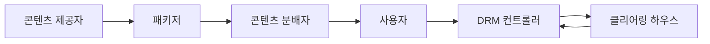
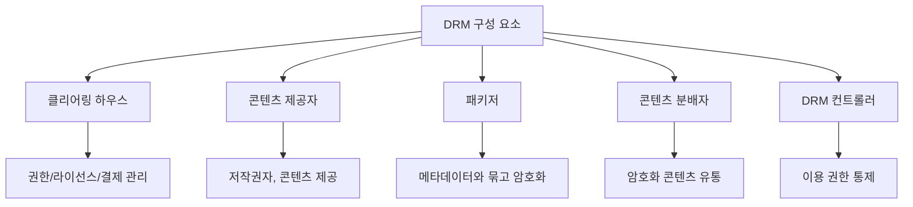
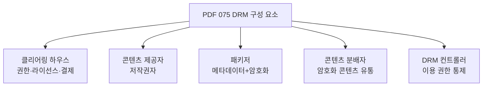
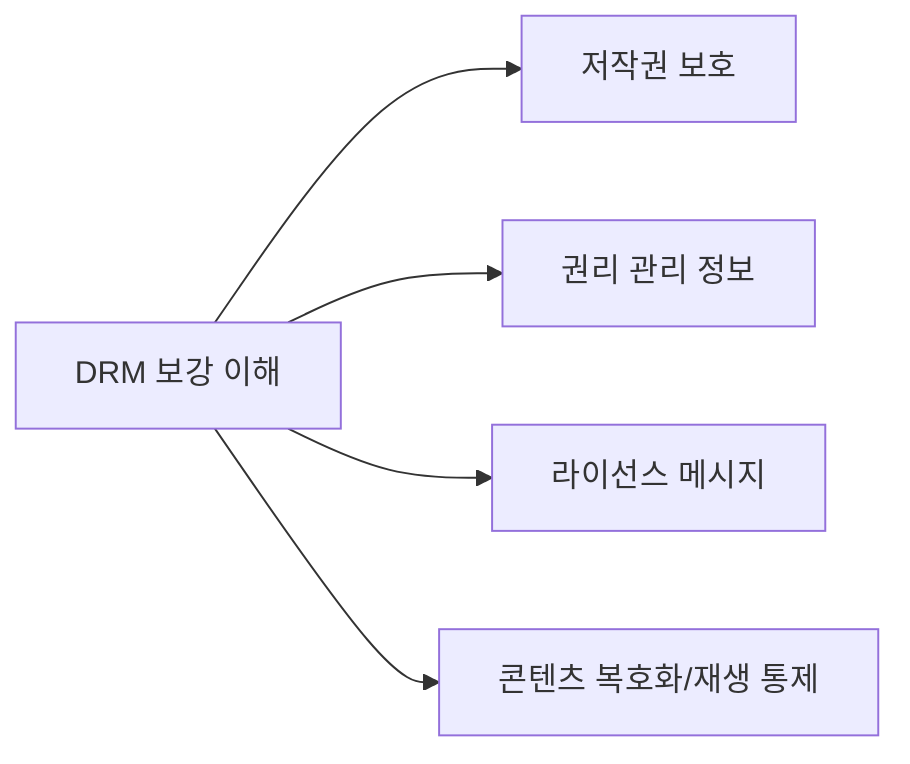
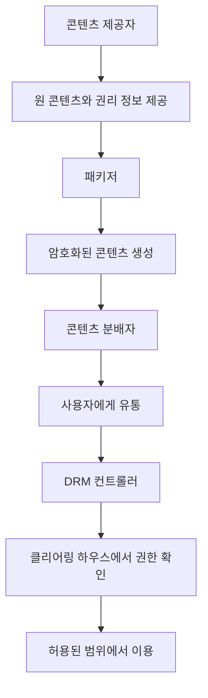
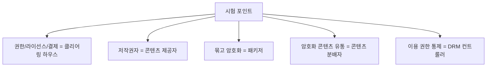
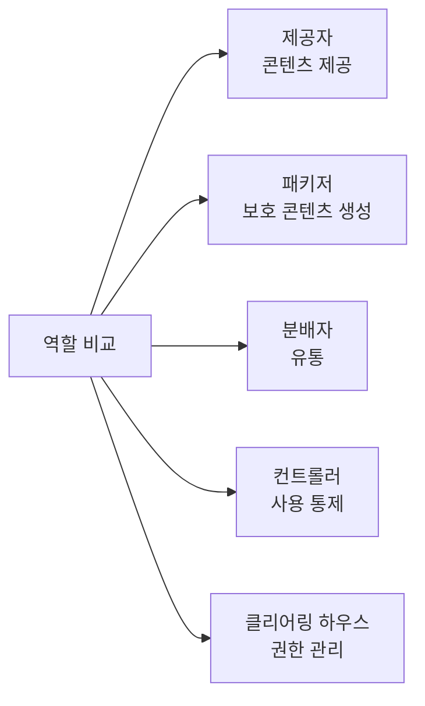
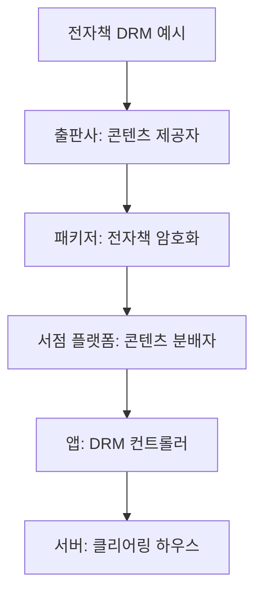
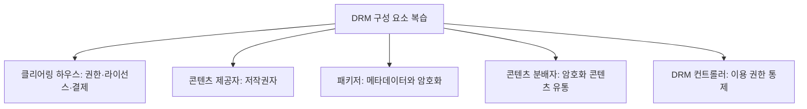

# 075 DRM(디지털 저작권 관리)의 구성 요소

작성 기준일: 2026-06-01
검색/보강일: 2026-06-01
과목: `2과목 소프트웨어 개발`
기준 PDF: `/Users/nes0903/Documents/study/정보처리기사/핵심요약집_2026_정보처리기사필기핵심요약.pdf`
PDF 확인 위치: `12페이지`
검색 보강: WIPO DRM 설명과 W3C EME의 라이선스/콘텐츠 보호 흐름을 참고하여 PDF 구성 요소 간 역할을 확장
주제별 검색 키워드: `DRM components clearing house packager distributor controller`, `digital rights management license server content protection`, `WIPO DRM rights management information`

---

## 1. 한 줄 요약

- DRM 구성 요소는 디지털 콘텐츠의 제공, 암호화, 유통, 권한 통제, 라이선스 발급과 결제 관리를 담당하는 구성 주체와 프로그램을 말한다.
- PDF 기준 구성 요소는 `클리어링 하우스`, `콘텐츠 제공자`, `패키저`, `콘텐츠 분배자`, `DRM 컨트롤러`이다.
- 시험에서는 각 구성 요소의 역할을 정확히 매칭하는 문제가 자주 나온다.

---

## 2. 한눈에 보는 구조

- DRM은 기술 하나가 아니라 역할들이 연결된 관리 체계다.
- 콘텐츠 제공자는 원 콘텐츠와 권리의 출발점이다.
- 패키저는 콘텐츠를 배포 가능한 보호 콘텐츠로 만든다.
- 콘텐츠 분배자는 보호된 콘텐츠를 사용자에게 전달한다.
- DRM 컨트롤러는 사용자의 이용 권한을 확인하고 통제한다.
- 클리어링 하우스는 권한, 라이선스, 결제 같은 관리 기능을 담당한다.

---

## 3. PDF 기준 핵심

| 구성 요소 | PDF 기준 역할 | 시험 단서 |
|---|---|---|
| 클리어링 하우스 | 저작권에 대한 사용 권한, 라이선스 발급, 사용량에 따른 결제 관리 등을 수행하는 곳 | 권한, 라이선스, 결제 |
| 콘텐츠 제공자 | 콘텐츠를 제공하는 저작권자 | 저작권자, 원 콘텐츠 제공 |
| 패키저 | 콘텐츠를 메타데이터와 함께 배포 가능한 형태로 묶어 암호화하는 프로그램 | 묶기, 메타데이터, 암호화 |
| 콘텐츠 분배자 | 암호화된 콘텐츠를 유통하는 곳이나 사람 | 유통, 배포 |
| DRM 컨트롤러 | 배포된 콘텐츠의 이용 권한을 통제하는 프로그램 | 이용 권한 통제 |

- PDF에서 누락하면 안 되는 표현:
  - 클리어링 하우스는 `사용량에 따른 결제 관리`까지 수행한다.
  - 패키저는 단순 압축이 아니라 `메타데이터와 함께 묶고 암호화`한다.
  - 콘텐츠 분배자는 원본 콘텐츠가 아니라 `암호화된 콘텐츠`를 유통한다.
  - DRM 컨트롤러는 콘텐츠 자체를 만드는 것이 아니라 `이용 권한`을 통제한다.

---

## 4. 검색으로 보강한 관점

- WIPO는 디지털 저작물 보호에서 DRM 도구와 권리 관리 정보가 사용될 수 있음을 설명한다.
- W3C EME는 보호 콘텐츠 재생에서 콘텐츠 보호 시스템과 라이선스 서버 사이의 메시지 처리를 설명한다.
- PDF 구성 요소와 연결하면 다음처럼 이해할 수 있다.
  - 라이선스 서버/권한 관리 기능은 클리어링 하우스와 연결된다.
  - 콘텐츠 보호와 메타데이터 결합은 패키저와 연결된다.
  - 재생 시 권한 확인과 통제는 DRM 컨트롤러와 연결된다.
- 단, 시험 답안은 PDF 용어를 우선한다.

---

## 5. 개념 설명

- 콘텐츠 제공자:
  - 콘텐츠를 만든 저작권자 또는 권리 보유자다.
  - 원 콘텐츠와 권리 조건을 제공한다.
- 패키저:
  - 콘텐츠를 배포 가능한 형태로 묶는다.
  - 메타데이터를 포함한다.
  - 콘텐츠를 암호화해 무단 이용을 어렵게 만든다.
- 콘텐츠 분배자:
  - 암호화된 콘텐츠를 사용자에게 전달한다.
  - 온라인 마켓, 콘텐츠 플랫폼, 배포 서버 등이 해당될 수 있다.
- DRM 컨트롤러:
  - 사용자가 콘텐츠를 열거나 재생할 때 권한을 확인한다.
  - 허용된 기간, 횟수, 기기, 계정 범위 등을 적용할 수 있다.
- 클리어링 하우스:
  - 라이선스를 발급한다.
  - 사용 권한을 관리한다.
  - 사용량 기반 결제 정보를 처리할 수 있다.

---

## 6. 시험 포인트

- 구성 요소 매칭을 외운다.
  - 클리어링 하우스: 사용 권한, 라이선스 발급, 결제 관리
  - 콘텐츠 제공자: 저작권자
  - 패키저: 메타데이터와 함께 묶고 암호화
  - 콘텐츠 분배자: 암호화 콘텐츠 유통
  - DRM 컨트롤러: 이용 권한 통제
- 함정:
  - 패키저와 콘텐츠 분배자를 혼동하지 않는다.
  - 콘텐츠 제공자는 유통자가 아니라 저작권자다.
  - 클리어링 하우스는 단순 저장소가 아니라 권한/라이선스/결제 관리 주체다.
  - DRM 컨트롤러는 라이선스를 직접 발급하는 곳이라기보다 이용 권한을 통제하는 프로그램으로 본다.

---

## 7. 헷갈리는 비교

| 비교 항목 | 콘텐츠 제공자 | 패키저 | 콘텐츠 분배자 | DRM 컨트롤러 | 클리어링 하우스 |
|---|---|---|---|---|---|
| 주 역할 | 콘텐츠 제공 | 암호화 패키징 | 유통 | 이용 통제 | 권한/라이선스/결제 |
| 주체/형태 | 저작권자 | 프로그램 | 플랫폼/사람 | 프로그램 | 관리 기관/서버 성격 |
| PDF 단서 | 저작권자 | 메타데이터, 암호화 | 암호화 콘텐츠 유통 | 이용 권한 통제 | 라이선스 발급 |
| 헷갈림 | 분배자와 혼동 | 단순 압축으로 오해 | 제공자와 혼동 | 라이선스 발급 주체와 혼동 | DRM 컨트롤러와 혼동 |

- `제공`, `패키징`, `분배`, `통제`, `정산/권한 관리` 순서로 역할을 나누면 외우기 쉽다.

---

## 8. 예시 또는 암기 포인트

- 암기 문장:
  - `클하는 권한·라이선스·결제, 패키저는 묶고 암호화, 컨트롤러는 사용 통제.`
- 전자책 예시:
  - 출판사가 전자책 원본을 제공한다.
  - 패키저가 전자책 파일을 메타데이터와 묶고 암호화한다.
  - 온라인 서점이 암호화된 전자책을 유통한다.
  - 독서 앱의 DRM 컨트롤러가 사용자의 열람 권한을 확인한다.
  - 클리어링 하우스가 라이선스와 결제를 관리한다.

---

## 9. 빠른 복습

- DRM 구성 요소는 역할 매칭 문제가 핵심이다.
- 클리어링 하우스는 사용 권한, 라이선스 발급, 결제 관리를 담당한다.
- 콘텐츠 제공자는 콘텐츠를 제공하는 저작권자다.
- 패키저는 콘텐츠를 메타데이터와 묶어 암호화한다.
- 콘텐츠 분배자는 암호화된 콘텐츠를 유통한다.
- DRM 컨트롤러는 배포된 콘텐츠의 이용 권한을 통제한다.

---

## 10. 참고 링크

- [기준 PDF: 핵심요약집_2026_정보처리기사필기핵심요약](/Users/nes0903/Documents/study/정보처리기사/핵심요약집_2026_정보처리기사필기핵심요약.pdf)
- [Q-Net 정보처리기사 종목별 상세정보](https://www.q-net.or.kr/crf005.do?id=crf00503&jmCd=1320)
- [WIPO - Copyright Protection and DRM](https://www.wipo.int/en/web/copyright/protection)
- [W3C - Encrypted Media Extensions](https://www.w3.org/TR/encrypted-media-2/)

<!-- study-links:start -->
## 관련 문서

- `drm`: [[정보처리기사/2과목 소프트웨어 개발/076 DRM(디지털 저작권 관리)의 기술 요소/076 DRM(디지털 저작권 관리)의 기술 요소|076 DRM(디지털 저작권 관리)의 기술 요소]]
<!-- study-links:end -->
