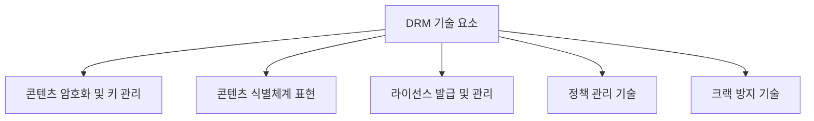
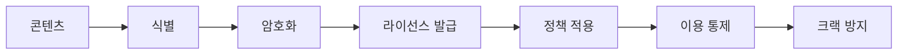
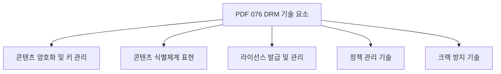
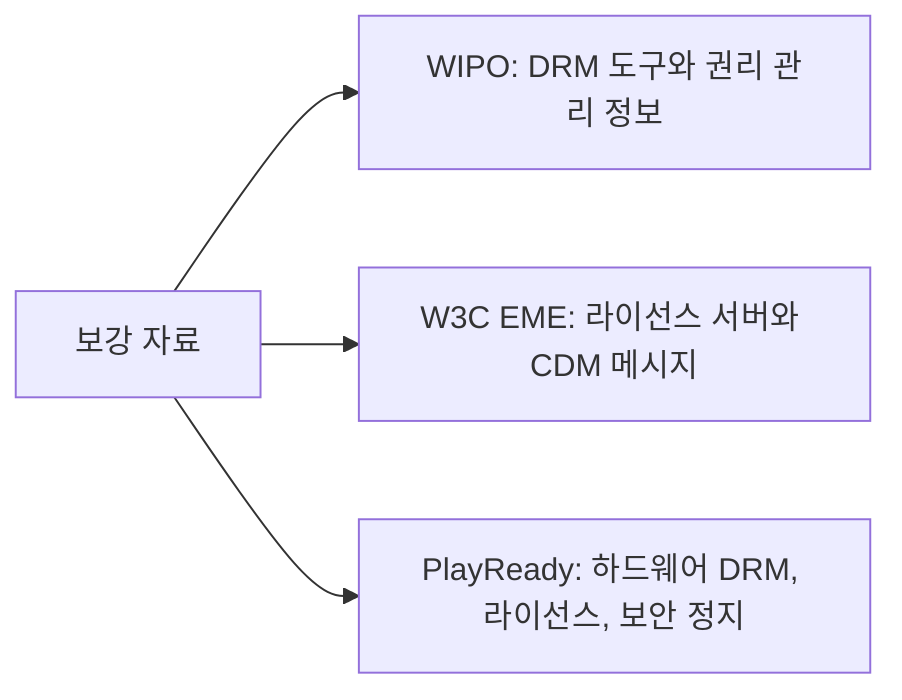
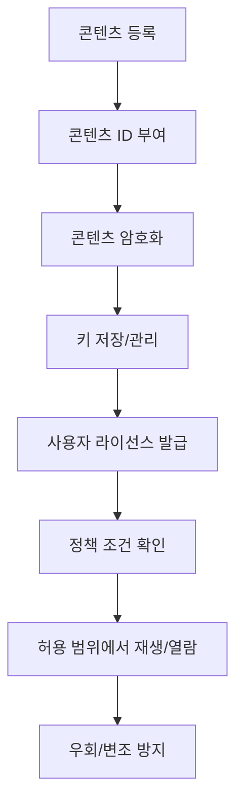
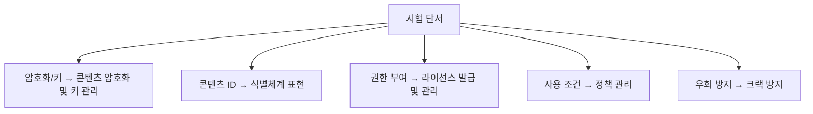
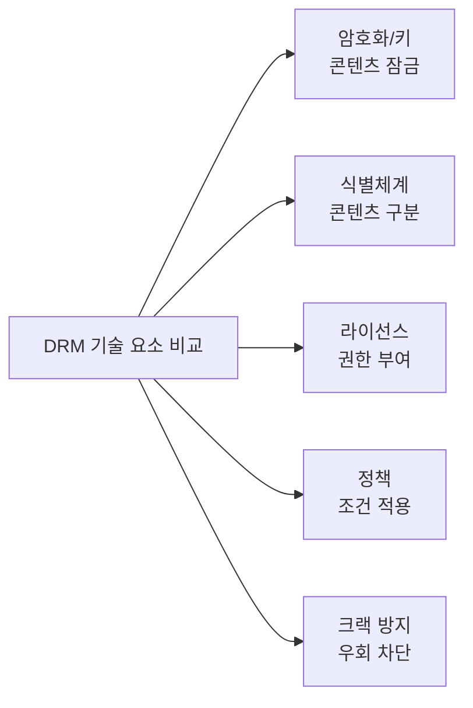
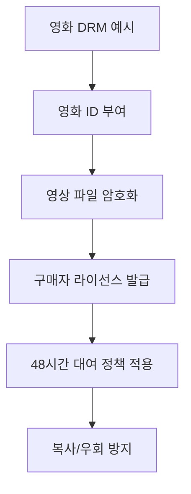
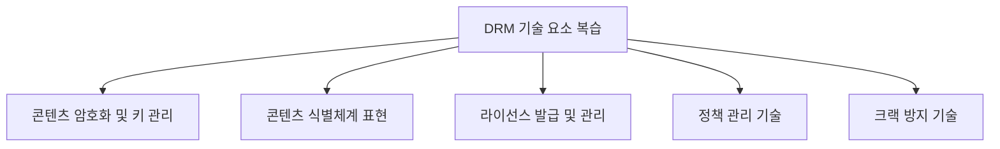

# 076 DRM(디지털 저작권 관리)의 기술 요소

작성 기준일: 2026-06-01
검색/보강일: 2026-06-01
과목: `2과목 소프트웨어 개발`
기준 PDF: `/Users/nes0903/Documents/study/정보처리기사/핵심요약집_2026_정보처리기사필기핵심요약.pdf`
PDF 확인 위치: `12페이지`
검색 보강: WIPO DRM, W3C EME, Microsoft PlayReady 자료를 참고하여 콘텐츠 암호화, 라이선스, 정책, 크랙 방지의 역할을 확장
주제별 검색 키워드: `DRM technical elements content encryption key management license policy anti tamper`, `W3C EME license server content decryption module`, `Microsoft PlayReady hardware DRM license secure stop`

---

## 1. 한 줄 요약

- DRM 기술 요소는 디지털 콘텐츠를 식별하고 암호화하며, 라이선스와 정책에 따라 사용을 통제하고 우회 시도를 막기 위한 기술 묶음이다.
- PDF 기준 항목은 `콘텐츠 암호화 및 키 관리`, `콘텐츠 식별체계 표현`, `라이선스 발급 및 관리`, `정책 관리 기술`, `크랙 방지 기술`이다.
- 시험에서는 각 기술 요소가 어떤 보호 목적을 갖는지 연결해야 한다.

---

## 2. 한눈에 보는 구조

- DRM 기술 요소는 단계별로 연결된다.
  - 콘텐츠가 무엇인지 식별한다.
  - 콘텐츠를 암호화한다.
  - 복호화에 필요한 키와 라이선스를 관리한다.
  - 사용 기간, 횟수, 기기 같은 정책을 적용한다.
  - 불법 복제나 우회 시도를 방지한다.
- DRM은 단순히 파일을 암호화하는 것만이 아니다.
  - 권리 정보 표현
  - 라이선스 발급
  - 정책 집행
  - 우회 방지까지 포함한다.

---

## 3. PDF 기준 핵심

| 기술 요소 | 의미 | 시험 단서 |
|---|---|---|
| 콘텐츠 암호화 및 키 관리 | 콘텐츠를 암호화하고 복호화 키를 안전하게 관리 | 암호화, 키, 복호화 |
| 콘텐츠 식별체계 표현 | 콘텐츠를 고유하게 식별할 수 있는 체계 표현 | 식별자, 메타데이터, 콘텐츠 ID |
| 라이선스 발급 및 관리 | 사용 권한을 부여하고 라이선스를 관리 | 라이선스, 권한, 발급 |
| 정책 관리 기술 | 사용 조건과 제한 정책을 관리 | 사용 기간, 횟수, 기기, 권한 |
| 크랙 방지 기술 | 불법 복제, 변조, 우회 시도를 방지 | 우회 방지, 변조 방지 |

- PDF는 항목을 짧게 나열하므로, 각 항목이 수행하는 보호 역할까지 연결해 외워야 한다.
- `키 관리`는 암호화와 함께 묶여 나온다.
- `식별체계`는 콘텐츠가 무엇인지 알아야 라이선스와 정책을 적용할 수 있다는 의미다.

---

## 4. 검색으로 보강한 관점

- WIPO 자료는 DRM이 저작권 보호와 권리 관리 정보와 연결된다는 점을 보여 준다.
- W3C EME는 브라우저에서 보호 콘텐츠를 재생할 때 라이선스 서버와 콘텐츠 복호화 모듈 사이의 메시지가 중요하다는 점을 보여 준다.
- Microsoft PlayReady 자료는 하드웨어 DRM, 라이선스, 키 보호, 재생 중지 확인 같은 실제 DRM 기능을 설명한다.
- 시험 적용:
  - PDF의 `콘텐츠 암호화 및 키 관리`는 보호 콘텐츠 복호화와 직접 연결된다.
  - `라이선스 발급 및 관리`는 사용 권한 확인과 연결된다.
  - `정책 관리 기술`은 사용 기간, 해상도, 기기 제한 같은 조건 적용과 연결된다.

---

## 5. 개념 설명

- 콘텐츠 암호화 및 키 관리:
  - 콘텐츠를 암호화해 권한 없는 사용자가 바로 열람하지 못하게 한다.
  - 복호화 키를 안전하게 저장하고 전달한다.
  - 키가 유출되면 콘텐츠 보호가 약해지므로 키 관리가 중요하다.
- 콘텐츠 식별체계 표현:
  - 콘텐츠마다 고유 ID나 메타데이터를 부여한다.
  - 어떤 콘텐츠에 어떤 라이선스와 정책이 적용되는지 연결한다.
- 라이선스 발급 및 관리:
  - 사용자가 콘텐츠를 이용할 권한이 있는지 확인한다.
  - 구매, 대여, 구독, 기기 등록 같은 조건에 따라 라이선스를 발급한다.
- 정책 관리 기술:
  - 이용 기간, 재생 횟수, 출력 제한, 기기 수 제한 등을 관리한다.
  - 라이선스 정책과 실제 사용 통제를 연결한다.
- 크랙 방지 기술:
  - 보호 로직을 우회하거나 파일을 변조하는 시도를 막는다.
  - 난독화, 무결성 검사, 디버깅 방지, 보안 실행 환경 등이 연결될 수 있다.

---

## 6. 시험 포인트

- 항목별 키워드:
  - `키`, `복호화`, `암호화` → 콘텐츠 암호화 및 키 관리
  - `콘텐츠 ID`, `식별자`, `메타데이터` → 콘텐츠 식별체계 표현
  - `라이선스`, `발급`, `권한` → 라이선스 발급 및 관리
  - `사용 기간`, `횟수`, `기기 제한`, `정책` → 정책 관리 기술
  - `크랙`, `우회`, `변조`, `불법 복제` → 크랙 방지 기술
- 함정:
  - 암호화만으로 DRM 전체가 완성되는 것은 아니다.
  - 라이선스는 콘텐츠 자체가 아니라 사용 권한을 다룬다.
  - 정책 관리는 라이선스 조건을 실제 사용 제한으로 적용하는 기술이다.
  - 식별체계가 없으면 어떤 콘텐츠에 어떤 권한이 적용되는지 추적하기 어렵다.

---

## 7. 헷갈리는 비교

| 구분 | 암호화 및 키 관리 | 식별체계 표현 | 라이선스 관리 | 정책 관리 | 크랙 방지 |
|---|---|---|---|---|---|
| 목적 | 콘텐츠 보호 | 콘텐츠 구분 | 이용 권한 부여 | 사용 조건 적용 | 우회/변조 차단 |
| 대표 단서 | 키, 복호화 | ID, 메타데이터 | 라이선스, 발급 | 기간, 횟수, 기기 | 크랙, 변조 |
| 적용 시점 | 패키징/재생 | 등록/관리 | 구매/대여/인증 | 이용 중 | 전체 보호 흐름 |
| 헷갈림 | DRM 전체로 오해 | 단순 파일명과 혼동 | 정책과 혼동 | 라이선스와 혼동 | 보안 일반과 혼동 |

- 라이선스는 `권한을 부여`하는 쪽이고, 정책은 `권한의 조건을 관리`하는 쪽이다.
- 암호화는 콘텐츠를 잠그는 기술이고, 크랙 방지는 잠금을 우회하려는 시도를 막는 기술이다.

---

## 8. 예시 또는 암기 포인트

- 암기 문장:
  - `DRM 기술은 식별하고, 암호화하고, 라이선스 주고, 정책 적용하고, 크랙을 막는다.`
- 예시:
  - 영화 콘텐츠에 고유 ID를 부여한다.
  - 영상 파일을 암호화한다.
  - 구매자에게 라이선스를 발급한다.
  - 대여 기간 48시간 정책을 적용한다.
  - 화면 캡처나 파일 변조 같은 우회 시도를 방지한다.

---

## 9. 빠른 복습

- DRM 기술 요소는 PDF에 나온 다섯 항목을 그대로 암기해야 한다.
- 암호화와 키 관리는 콘텐츠 보호의 기본이다.
- 식별체계는 콘텐츠를 구분하고 권리 정보를 연결한다.
- 라이선스 발급 및 관리는 사용 권한을 다룬다.
- 정책 관리는 사용 조건을 적용한다.
- 크랙 방지는 우회와 변조를 막는다.

---

## 10. 참고 링크

- [기준 PDF: 핵심요약집_2026_정보처리기사필기핵심요약](/Users/nes0903/Documents/study/정보처리기사/핵심요약집_2026_정보처리기사필기핵심요약.pdf)
- [Q-Net 정보처리기사 종목별 상세정보](https://www.q-net.or.kr/crf005.do?id=crf00503&jmCd=1320)
- [WIPO - Copyright Protection and DRM](https://www.wipo.int/en/web/copyright/protection)
- [W3C - Encrypted Media Extensions](https://www.w3.org/TR/encrypted-media-2/)
- [Microsoft Learn - PlayReady Encrypted Media Extension](https://learn.microsoft.com/en-us/windows/uwp/audio-video-camera/playready-encrypted-media-extension)
