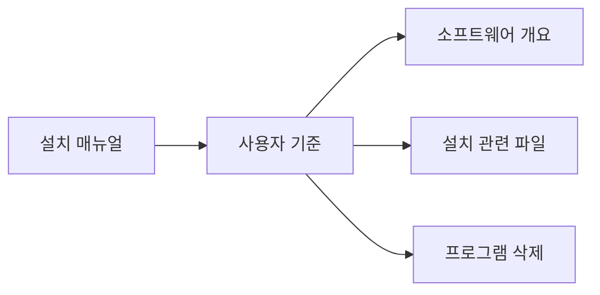
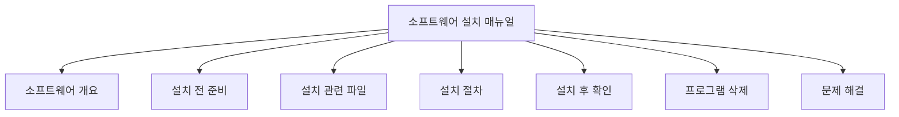
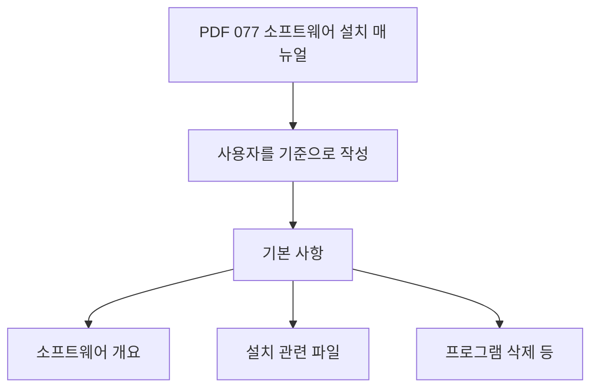
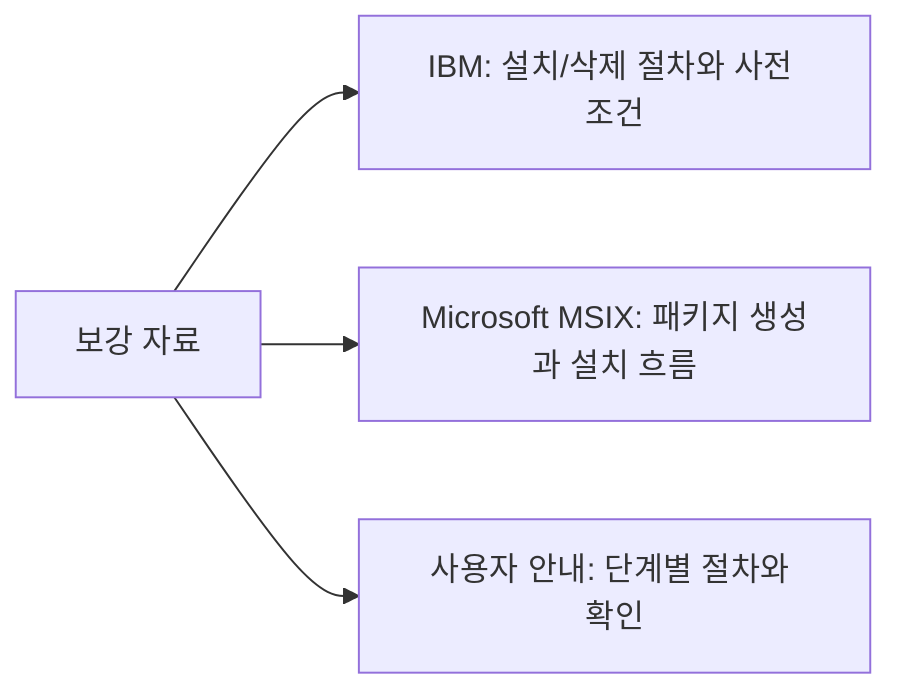
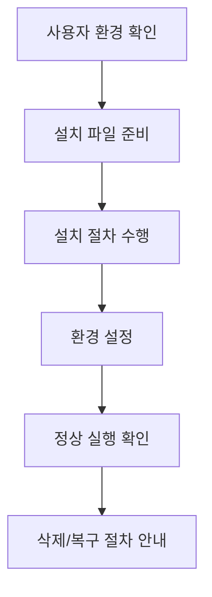
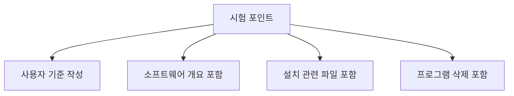
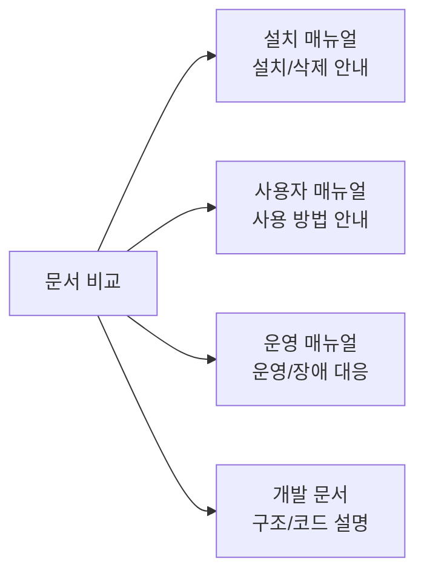
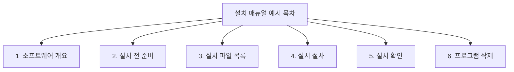
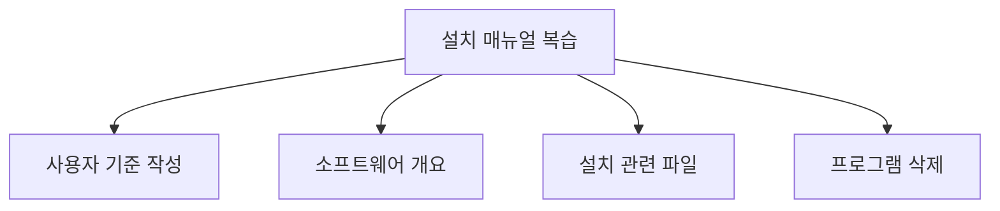

# 077 소프트웨어 설치 매뉴얼

작성 기준일: 2026-06-01
검색/보강일: 2026-06-01
과목: `2과목 소프트웨어 개발`
기준 PDF: `/Users/nes0903/Documents/study/정보처리기사/핵심요약집_2026_정보처리기사필기핵심요약.pdf`
PDF 확인 위치: `12페이지`
검색 보강: IBM 설치/삭제 문서와 Microsoft 패키징 도구 자료를 참고하여 사용자 기준 설치 매뉴얼의 구성 요소를 확장
주제별 검색 키워드: `software installation manual user guide prerequisites uninstall troubleshooting`, `IBM installing uninstalling product software installation guide`, `MSIX packaging tool install package`

---

## 1. 한 줄 요약

- 소프트웨어 설치 매뉴얼은 사용자가 소프트웨어를 설치, 실행, 삭제할 수 있도록 사용자 관점에서 작성한 안내 문서이다.
- PDF 기준 핵심은 `설치 매뉴얼은 사용자를 기준으로 작성한다`는 점과 기본 사항인 `소프트웨어 개요`, `설치 관련 파일`, `프로그램 삭제 등`이다.
- 시험에서는 개발자 내부 문서가 아니라 사용자 설치 안내 문서라는 관점을 잡아야 한다.

---

## 2. 한눈에 보는 구조

- 설치 매뉴얼은 사용자가 순서대로 따라 할 수 있어야 한다.
- 기본 구성:
  - 제품 소개와 용도
  - 지원 운영체제와 요구 사양
  - 설치 파일 목록
  - 설치 절차
  - 설치 후 실행 확인
  - 삭제 또는 재설치 절차
  - 자주 발생하는 오류와 해결 방법
- PDF는 기본 사항을 짧게 제시하지만, 실제 문서에서는 사전 준비와 문제 해결까지 포함하는 것이 좋다.

---

## 3. PDF 기준 핵심

- PDF 핵심:
  - 설치 매뉴얼은 사용자를 기준으로 작성한다.
  - 기본 사항에는 다음이 포함된다.
    - 소프트웨어 개요
    - 설치 관련 파일
    - 프로그램 삭제 등
- 시험에서 주의할 표현:
  - `사용자 기준`이 가장 중요하다.
  - 설치 매뉴얼은 개발자의 코드 설명서가 아니다.
  - 설치 관련 파일뿐 아니라 삭제 절차도 포함될 수 있다.

---

## 4. 검색으로 보강한 관점

- IBM 설치 문서는 제품 설치와 삭제 절차, 사전 조건, 설치 관리자 사용 흐름을 문서화한다.
- Microsoft MSIX 패키징 도구 문서는 설치 패키지를 만들고 기존 설치 파일을 패키지로 변환하는 흐름을 설명한다.
- 설치 매뉴얼은 사용자가 실제로 수행할 작업을 기준으로 작성되어야 한다.
  - 무엇을 내려받아야 하는지
  - 어떤 권한이 필요한지
  - 어떤 순서로 설치해야 하는지
  - 설치가 끝난 후 무엇을 확인해야 하는지
  - 삭제는 어떻게 하는지

---

## 5. 개념 설명

- 설치 매뉴얼의 목적:
  - 사용자가 스스로 설치할 수 있게 한다.
  - 설치 중 오류를 줄인다.
  - 설치 후 정상 실행 여부를 확인하게 한다.
  - 삭제와 재설치 방법을 제공한다.
- 작성 기준:
  - 사용자 언어로 쓴다.
  - 단계별 순서를 분명히 한다.
  - 화면 이름, 버튼 이름, 파일 이름을 정확히 쓴다.
  - 관리자 권한, 네트워크 연결, 디스크 용량 같은 사전 조건을 안내한다.
  - 설치 실패 시 확인할 항목을 제공한다.
- 포함하면 좋은 항목:
  - 소프트웨어 개요
  - 설치 대상 운영체제
  - 하드웨어/소프트웨어 요구사항
  - 설치 파일 목록과 용도
  - 설치 절차
  - 설정 파일 또는 환경 변수
  - 설치 후 확인 방법
  - 삭제 방법
  - 오류 메시지와 해결 방법

---

## 6. 시험 포인트

- 반드시 외울 내용:
  - 설치 매뉴얼은 사용자를 기준으로 작성한다.
  - 기본 사항에는 소프트웨어 개요, 설치 관련 파일, 프로그램 삭제 등이 있다.
- 오답 단서:
  - 개발자만 이해할 수 있게 내부 함수 구조 위주로 작성한다.
  - 삭제 방법은 설치 매뉴얼에 포함하지 않는다.
  - 설치 파일 목록을 제공하지 않는다.
  - 사용자 환경과 요구사항을 고려하지 않는다.
- 연결 개념:
  - 패키징은 설치 파일을 만든다.
  - 설치 매뉴얼은 그 설치 파일을 사용자가 설치하도록 안내한다.
  - 사용자 중심이라는 점은 073 소프트웨어 패키징과 077 설치 매뉴얼 모두에서 중요하다.

---

## 7. 헷갈리는 비교

| 구분 | 설치 매뉴얼 | 사용자 매뉴얼 | 운영 매뉴얼 | 개발 문서 |
|---|---|---|---|---|
| 대상 | 설치하는 사용자 | 기능을 사용하는 사용자 | 운영자/관리자 | 개발자 |
| 핵심 내용 | 설치 파일, 절차, 삭제 | 기능 사용법 | 운영 절차, 장애 대응 | 설계, 코드, API |
| PDF 단서 | 사용자 기준, 설치 관련 파일 | 사용 방법 | 운영/관리 | 개발 내부 |
| 함정 | 개발자 기준으로 쓰면 안 됨 | 설치 절차와 다름 | 사용자 설치와 다름 | 설치 매뉴얼 아님 |

- 설치 매뉴얼은 사용법 전체보다 설치와 삭제 절차에 초점이 있다.
- 하지만 사용자가 설치 후 정상 실행을 확인할 수 있도록 최소한의 실행 확인 절차는 포함될 수 있다.

---

## 8. 예시 또는 암기 포인트

- 암기 문장:
  - `설치 매뉴얼은 사용자 기준, 개요·설치 파일·삭제를 포함한다.`
- 간단 목차 예시:
  - 소프트웨어 개요
  - 시스템 요구사항
  - 설치 관련 파일
  - 설치 절차
  - 설치 후 실행 확인
  - 프로그램 삭제
  - 문제 해결
- 문제풀이 팁:
  - `개발자 기준`이라는 선택지는 설치 매뉴얼 정의와 반대다.
  - `프로그램 삭제`가 포함된다는 점을 놓치지 않는다.

---

## 9. 빠른 복습

- 소프트웨어 설치 매뉴얼은 사용자를 기준으로 작성한다.
- 기본 사항에는 소프트웨어 개요, 설치 관련 파일, 프로그램 삭제 등이 있다.
- 설치 매뉴얼은 개발 내부 구조 설명서가 아니다.
- 사용자가 설치 절차를 따라 하고, 설치 후 확인하고, 삭제까지 할 수 있어야 한다.

---

## 10. 참고 링크

- [기준 PDF: 핵심요약집_2026_정보처리기사필기핵심요약](/Users/nes0903/Documents/study/정보처리기사/핵심요약집_2026_정보처리기사필기핵심요약.pdf)
- [Q-Net 정보처리기사 종목별 상세정보](https://www.q-net.or.kr/crf005.do?id=crf00503&jmCd=1320)
- [IBM Docs - Installing and uninstalling the product](https://www.ibm.com/docs/en/was-nd/8.5.5?topic=systems-installing-uninstalling-product-i-operating)
- [Microsoft Learn - MSIX Packaging Tool Overview](https://learn.microsoft.com/en-us/windows/msix/packaging-tool/tool-overview)
