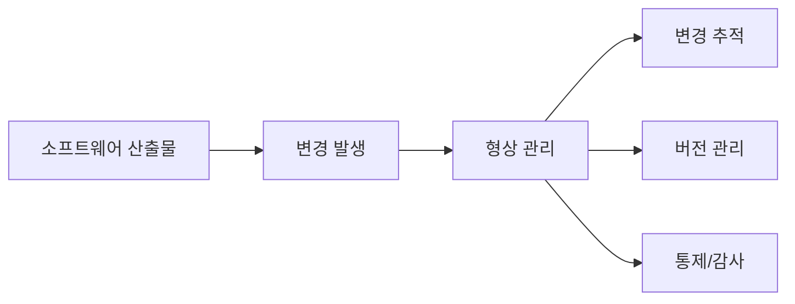
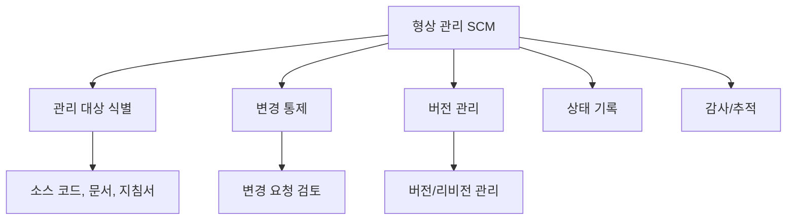
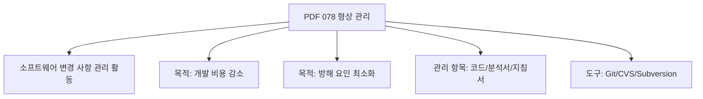
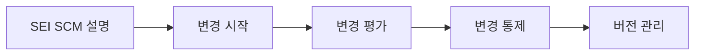
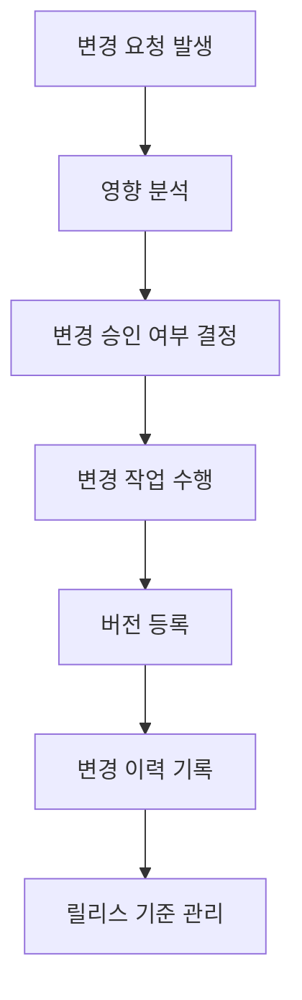
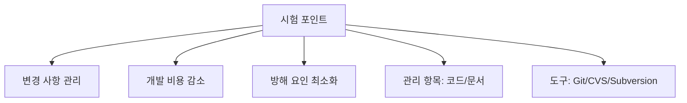
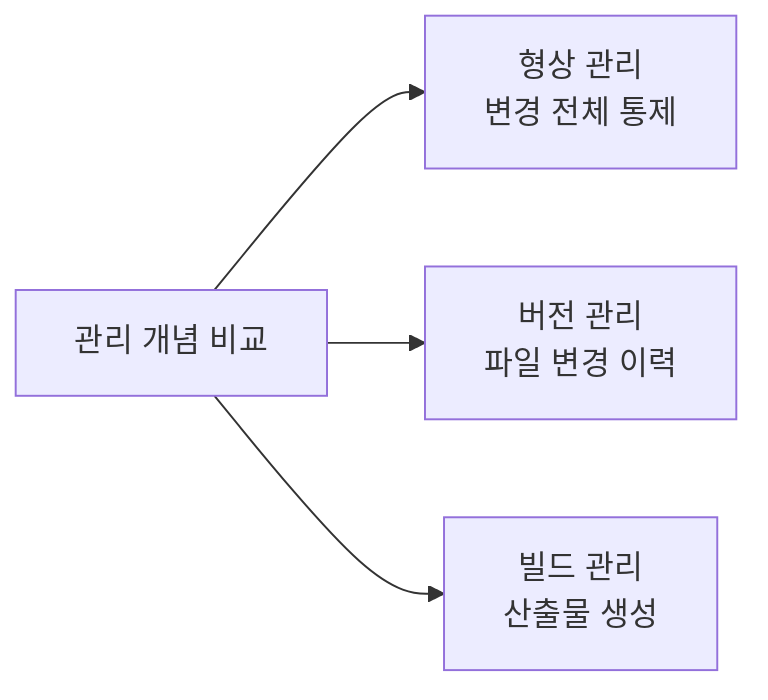
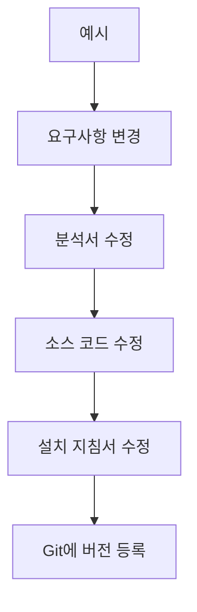
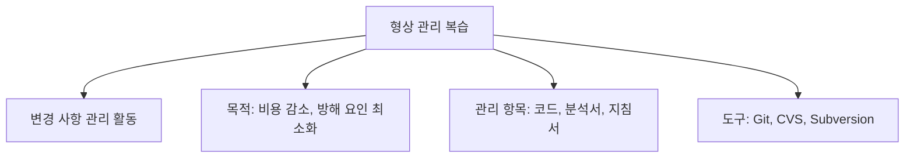

# 078 형상 관리(SCM)

작성 기준일: 2026-06-01
검색/보강일: 2026-06-01
과목: `2과목 소프트웨어 개발`
기준 PDF: `/Users/nes0903/Documents/study/정보처리기사/핵심요약집_2026_정보처리기사필기핵심요약.pdf`
PDF 확인 위치: `13페이지`
검색 보강: SEI의 Software Configuration Management 설명과 버전 관리 도구 자료를 참고하여 변경 관리 범위를 확장
주제별 검색 키워드: `software configuration management SEI`, `SCM configuration item version control baseline`, `Git CVS Subversion configuration management`

---

## 1. 한 줄 요약

- 형상 관리는 소프트웨어 개발 과정에서 발생하는 변경 사항을 체계적으로 식별, 통제, 기록, 추적하는 활동이다.
- PDF 기준 핵심은 `소프트웨어 변경 사항을 관리하기 위한 일련의 활동`, 목적은 `개발 비용 감소`와 `방해 요인 최소화`이다.
- 시험에서는 관리 항목과 도구를 함께 묻기 때문에 `소스 코드, 분석서, 운영 및 설치 지침서`, `Git, CVS, Subversion`을 함께 외운다.

---

## 2. 한눈에 보는 구조

- 형상 관리의 대상은 코드만이 아니다.
  - 소스 코드
  - 프로젝트 분석서
  - 설계 문서
  - 운영 지침서
  - 설치 지침서
  - 테스트 산출물
- 형상 관리의 핵심 목적:
  - 변경 이력을 남긴다.
  - 누구의 변경인지 추적한다.
  - 잘못된 변경을 되돌릴 수 있게 한다.
  - 여러 사람이 동시에 작업할 때 충돌을 관리한다.
  - 릴리스 기준이 되는 산출물 상태를 관리한다.

---

## 3. PDF 기준 핵심

- PDF 핵심:
  - 소프트웨어의 개발 과정에서 소프트웨어의 변경 사항을 관리하기 위해 개발된 일련의 활동이다.
  - 목적:
    - 개발 비용 감소
    - 방해 요인 최소화
  - 관리 항목:
    - 소스 코드
    - 프로젝트 분석서
    - 운영 및 설치 지침서 등
  - 형상 관리 도구:
    - Git
    - CVS
    - Subversion 등
- PDF에서 특히 중요한 점:
  - 형상 관리는 개발 이후 운영 단계까지 이어질 수 있다.
  - 관리 항목에 문서가 포함된다는 점을 놓치면 안 된다.
  - 도구 이름과 개념을 연결해서 외워야 한다.

---

## 4. 검색으로 보강한 관점

- SEI 자료는 SCM을 소프트웨어 제품에 대한 변경을 시작, 평가, 통제하는 기법과 원칙으로 설명한다.
- 보강해서 이해할 주요 활동:
  - 형상 식별: 무엇을 관리할지 정한다.
  - 형상 통제: 변경을 승인하고 반영한다.
  - 형상 상태 보고: 현재 버전과 변경 상태를 기록한다.
  - 형상 감사: 산출물이 기준과 일치하는지 확인한다.
- 정보처리기사 PDF는 위 활동을 모두 길게 나열하지 않지만, `변경 사항 관리`라는 정의 안에 이 흐름이 포함된다.

---

## 5. 개념 설명

- 형상 관리가 필요한 상황:
  - 여러 개발자가 같은 파일을 수정한다.
  - 요구사항 변경으로 설계 문서가 바뀐다.
  - 배포 버전과 개발 버전이 달라진다.
  - 장애가 발생해 이전 버전으로 되돌려야 한다.
- 형상 항목:
  - 형상 관리 대상이 되는 산출물이다.
  - 코드뿐 아니라 문서, 설정, 빌드 스크립트, 설치 지침서도 포함될 수 있다.
- 베이스라인:
  - 특정 시점에 승인된 산출물의 기준 상태다.
  - 이후 변경은 통제 절차를 거쳐야 한다.
- 버전 관리:
  - 파일의 변경 이력을 관리한다.
  - 체크아웃, 체크인, 커밋 같은 기능과 연결된다.

---

## 6. 시험 포인트

- 반드시 암기:
  - 형상 관리 = 소프트웨어 변경 사항 관리 활동
  - 목적 = 개발 비용 감소, 방해 요인 최소화
  - 관리 항목 = 소스 코드, 프로젝트 분석서, 운영 및 설치 지침서
  - 도구 = Git, CVS, Subversion
- 오답 단서:
  - 형상 관리는 소스 코드만 관리한다.
  - 형상 관리는 테스트 단계에서만 수행한다.
  - 형상 관리는 변경 이력을 남기지 않는다.
  - 형상 관리 도구가 아닌 일반 문서 편집기를 SCM 도구로 제시한다.
- 연결 문제:
  - 079의 체크아웃, 체크인, 커밋은 형상 관리 도구의 버전 등록 기능이다.

---

## 7. 헷갈리는 비교

| 구분 | 형상 관리 | 버전 관리 | 빌드 관리 |
|---|---|---|---|
| 범위 | 변경 사항과 산출물 전체 관리 | 파일/소스의 버전 이력 관리 | 실행 산출물 생성 자동화 |
| 대상 | 코드, 문서, 지침서, 설정 | 주로 소스 파일과 문서 | 소스, 의존성, 빌드 스크립트 |
| 대표 도구 | Git, CVS, Subversion | Git, SVN | Ant, Maven, Jenkins, Gradle |
| 시험 단서 | 변경 사항 관리 | 체크아웃, 체크인, 커밋 | 컴파일, 테스트, 패키징 |

- 버전 관리는 형상 관리의 중요한 일부지만 형상 관리 전체와 동일하지는 않다.
- 형상 관리는 변경 승인, 상태 보고, 감사까지 포함하는 더 넓은 개념이다.

---

## 8. 예시 또는 암기 포인트

- 암기 문장:
  - `형상 관리는 코드와 문서의 변경을 관리해서 비용과 혼선을 줄인다.`
- 예시:
  - 로그인 기능 요구사항이 바뀐다.
  - 분석서와 설계서가 바뀐다.
  - 소스 코드가 바뀐다.
  - 설치 지침서도 바뀐다.
  - 이 변경들을 Git 같은 도구로 추적하고 기준 버전을 관리한다.

---

## 9. 빠른 복습

- 형상 관리는 소프트웨어 변경 사항을 관리하는 일련의 활동이다.
- 목적은 개발 비용 감소와 방해 요인 최소화다.
- 관리 항목은 소스 코드뿐 아니라 프로젝트 분석서, 운영 및 설치 지침서까지 포함한다.
- 대표 도구는 Git, CVS, Subversion이다.

---

## 10. 참고 링크

- [기준 PDF: 핵심요약집_2026_정보처리기사필기핵심요약](/Users/nes0903/Documents/study/정보처리기사/핵심요약집_2026_정보처리기사필기핵심요약.pdf)
- [Q-Net 정보처리기사 종목별 상세정보](https://www.q-net.or.kr/crf005.do?id=crf00503&jmCd=1320)
- [SEI - Software Configuration Management](https://insights.sei.cmu.edu/library/software-configuration-management/)
