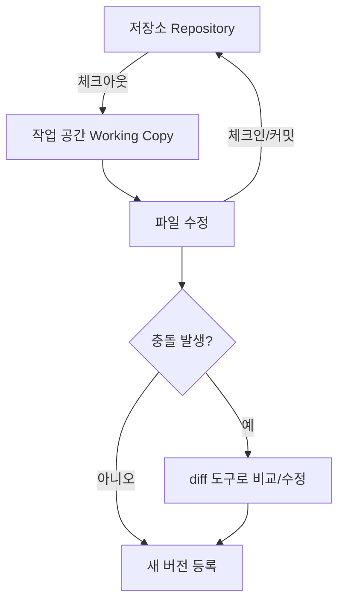
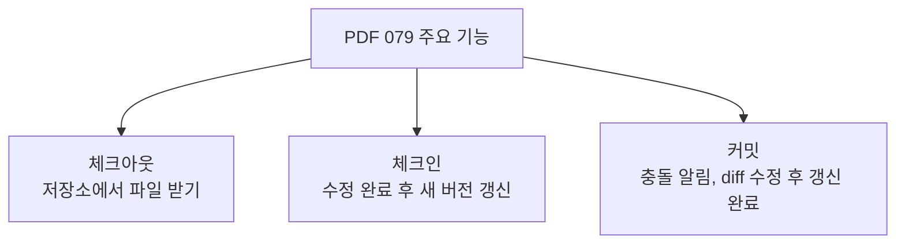
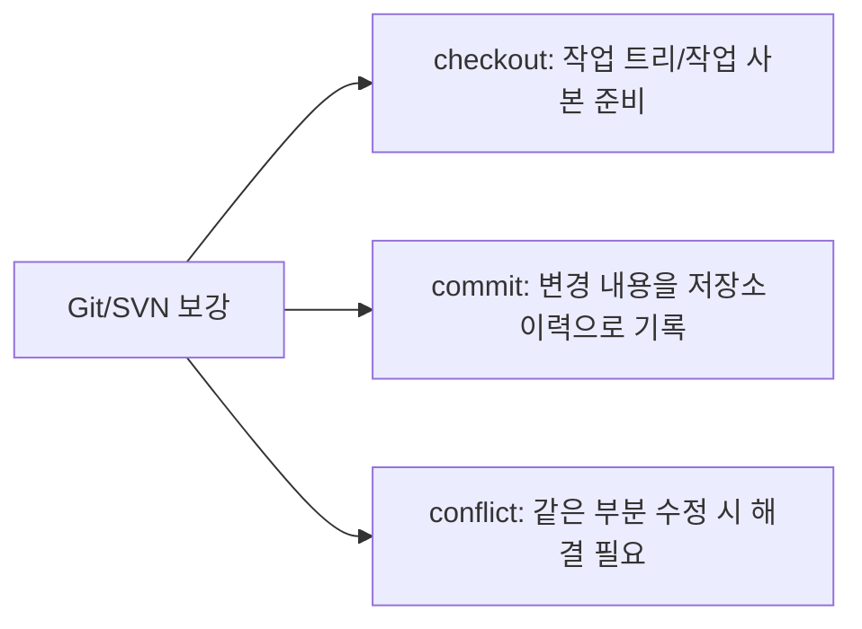
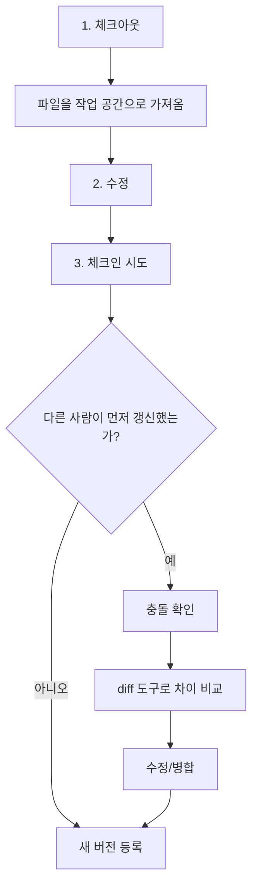
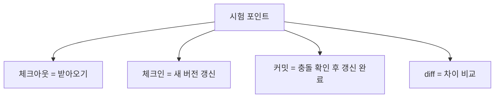
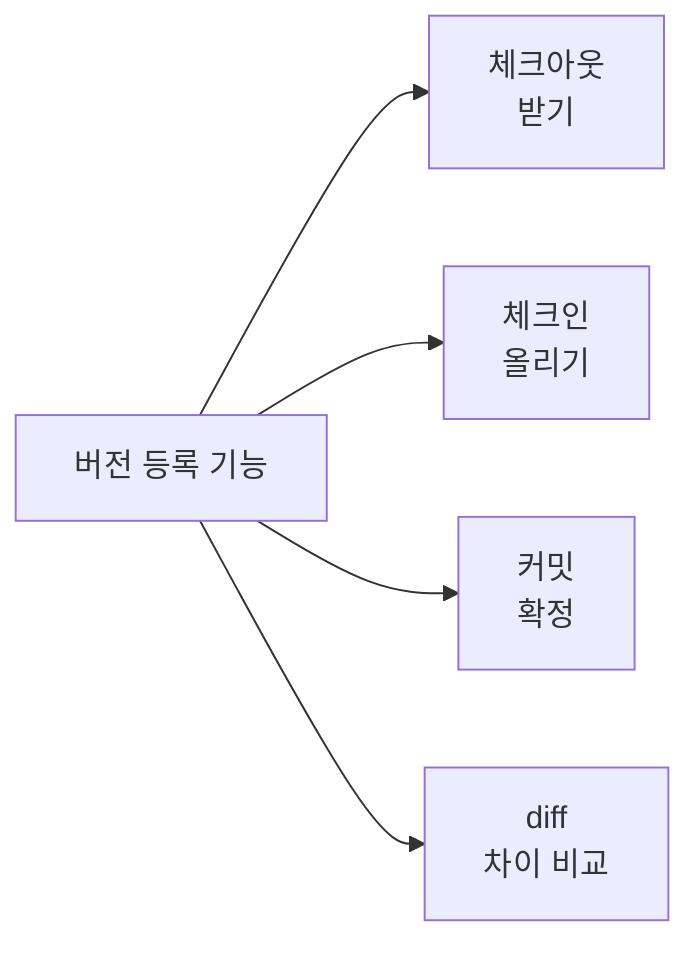
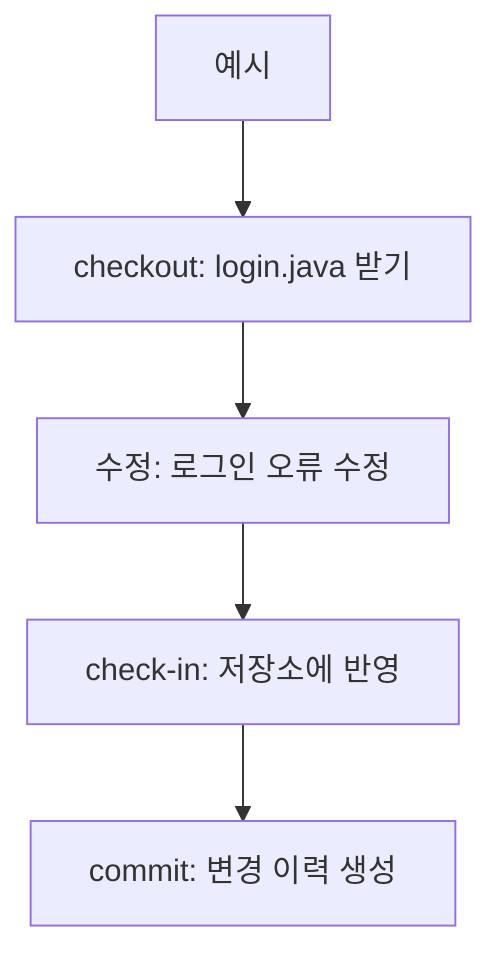
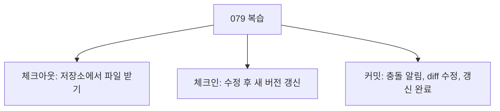

# 079 소프트웨어의 버전 등록 관련 주요 기능

작성 기준일: 2026-06-01
검색/보강일: 2026-06-01
과목: `2과목 소프트웨어 개발`
기준 PDF: `/Users/nes0903/Documents/study/정보처리기사/핵심요약집_2026_정보처리기사필기핵심요약.pdf`
PDF 확인 위치: `13페이지`
검색 보강: Git 공식 문서와 Apache Subversion Quick Start를 참고하여 체크아웃, 체크인, 커밋의 방향과 차이를 확장
주제별 검색 키워드: `checkout commit check in version control`, `Git checkout commit documentation`, `Apache Subversion checkout commit working copy`

---

## 1. 한 줄 요약

- 버전 등록 관련 기능은 저장소와 작업 공간 사이에서 파일을 가져오고, 수정하고, 변경 내용을 다시 반영하는 기능이다.
- PDF 기준 주요 기능은 `체크아웃`, `체크인`, `커밋`이다.
- 시험에서는 방향을 구분한다.
  - 체크아웃: 저장소에서 파일을 받아옴
  - 체크인: 수정 완료 후 저장소 파일을 새 버전으로 갱신
  - 커밋: 갱신 시 충돌이 있으면 알리고 diff 도구로 수정한 후 갱신 완료

---

## 2. 한눈에 보는 구조

- 저장소:
  - 버전 관리 대상 파일과 변경 이력이 저장되는 곳이다.
- 작업 공간:
  - 개발자가 실제로 파일을 수정하는 로컬 공간이다.
- 체크아웃:
  - 저장소의 파일을 작업 공간으로 가져온다.
- 체크인:
  - 작업 공간에서 수정한 내용을 저장소에 반영한다.
- 커밋:
  - 변경 내용을 하나의 버전 기록으로 확정한다.
  - 충돌이 있으면 비교와 병합이 필요하다.

---

## 3. PDF 기준 핵심

| 기능 | PDF 기준 설명 | 방향/핵심 |
|---|---|---|
| 체크아웃(Check-Out) | 프로그램을 수정하기 위해 저장소에서 파일을 받아옴 | 저장소 → 작업 공간 |
| 체크인(Check-In) | 체크아웃한 파일의 수정을 완료한 후 저장소의 파일을 새로운 버전으로 갱신함 | 작업 공간 → 저장소 |
| 커밋(Commit) | 체크인을 수행할 때 이전에 갱신된 내용이 있는 경우 충돌을 알리고 diff 도구를 이용해 수정한 후 갱신을 완료함 | 변경 확정, 충돌 처리 |

- PDF에서 `체크인`과 `커밋`의 설명이 연결되어 있다.
- 일반 도구에서는 commit이 체크인과 거의 같은 의미로 쓰이기도 하지만, PDF는 커밋을 충돌 확인과 갱신 완료 흐름까지 포함해 설명한다.
- 시험에서는 PDF 표현을 우선한다.

---

## 4. 검색으로 보강한 관점

- Git 공식 문서에서 `checkout`은 브랜치를 전환하거나 작업 트리 파일을 특정 버전으로 복원하는 기능으로 설명된다.
- Git 공식 문서에서 `commit`은 인덱스의 현재 내용을 변경 설명과 함께 새 커밋으로 만드는 기능이다.
- Apache Subversion Quick Start는 `svn checkout`으로 작업 사본을 만들고, `svn commit`으로 변경 내용을 저장소에 반영하는 흐름을 보여 준다.
- 도구마다 세부 용어는 다르지만 시험용 핵심은 다음이다.
  - 저장소에서 받으면 체크아웃
  - 수정 내용을 저장소에 반영하면 체크인/커밋
  - 동시 수정이 있으면 충돌을 해결해야 함

---

## 5. 개념 설명

- 체크아웃:
  - 개발을 시작하기 위해 저장소의 파일을 가져온다.
  - 중앙 집중형 도구에서는 작업 사본을 만드는 의미가 강하다.
  - Git에서는 브랜치 전환 또는 특정 버전 파일 복원 의미도 가진다.
- 체크인:
  - 수정한 파일을 저장소에 반영한다.
  - 저장소 파일이 새 버전으로 갱신된다.
- 커밋:
  - 변경 내용을 버전 이력에 기록한다.
  - 메시지를 남겨 변경 이유를 설명한다.
  - 충돌이 있으면 해결한 뒤 완료한다.
- diff 도구:
  - 두 버전의 차이를 보여 준다.
  - 충돌 위치를 확인하고 어느 내용을 유지할지 판단하는 데 사용된다.

---

## 6. 시험 포인트

- 체크아웃 단서:
  - 저장소에서 파일을 받는다.
  - 프로그램을 수정하기 위해 가져온다.
- 체크인 단서:
  - 수정 완료 후 저장소를 갱신한다.
  - 새 버전으로 반영한다.
- 커밋 단서:
  - 이전에 갱신된 내용이 있으면 충돌을 알린다.
  - diff 도구로 수정한다.
  - 갱신을 완료한다.
- 함정:
  - 체크아웃과 체크인을 방향으로 반대로 외우면 틀린다.
  - 커밋을 단순 저장 버튼으로만 이해하면 충돌 처리 설명을 놓친다.
  - diff는 파일 삭제 도구가 아니라 차이 비교 도구다.

---

## 7. 헷갈리는 비교

| 기능 | 방향 | 핵심 행동 | 시험 단서 |
|---|---|---|---|
| 체크아웃 | 저장소 → 작업 공간 | 파일을 받아옴 | 수정하기 위해 가져옴 |
| 체크인 | 작업 공간 → 저장소 | 새 버전으로 갱신 | 수정 완료 후 반영 |
| 커밋 | 변경 내용 → 이력 | 변경 확정, 충돌 처리 | 충돌, diff, 갱신 완료 |
| diff | 버전 ↔ 버전 | 차이 비교 | 수정 전후 비교 |

- 체크아웃은 `대출`, 체크인은 `반납`, 커밋은 `반납 기록 확정`으로 비유할 수 있다.
- 단, Git에서는 checkout의 의미가 넓으므로 시험에서는 PDF의 저장소-작업공간 방향을 우선한다.

---

## 8. 예시 또는 암기 포인트

- 암기 문장:
  - `체크아웃은 받고, 체크인은 올리고, 커밋은 확정한다.`
- 충돌 예시:
  - A와 B가 같은 파일의 같은 줄을 수정한다.
  - A가 먼저 체크인한다.
  - B가 체크인하려고 하면 충돌이 발생한다.
  - diff 도구로 A 변경과 B 변경을 비교하고 병합한 뒤 갱신한다.

---

## 9. 빠른 복습

- 체크아웃은 프로그램 수정을 위해 저장소에서 파일을 받아오는 것이다.
- 체크인은 체크아웃한 파일의 수정을 완료한 뒤 저장소 파일을 새 버전으로 갱신하는 것이다.
- 커밋은 체크인 중 충돌이 있으면 알리고 diff 도구로 수정한 뒤 갱신을 완료하는 기능으로 정리한다.

---

## 10. 참고 링크

- [기준 PDF: 핵심요약집_2026_정보처리기사필기핵심요약](/Users/nes0903/Documents/study/정보처리기사/핵심요약집_2026_정보처리기사필기핵심요약.pdf)
- [Q-Net 정보처리기사 종목별 상세정보](https://www.q-net.or.kr/crf005.do?id=crf00503&jmCd=1320)
- [Git Documentation - git checkout](https://git-scm.com/docs/git-checkout)
- [Git Documentation - git commit](https://git-scm.com/docs/git-commit)
- [Apache Subversion - Quick Start](https://subversion.apache.org/quick-start)
