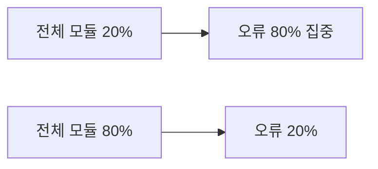
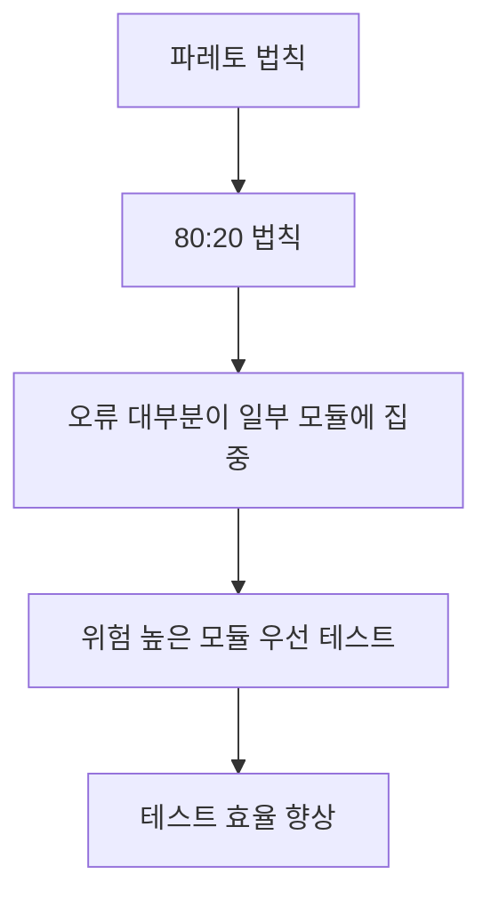
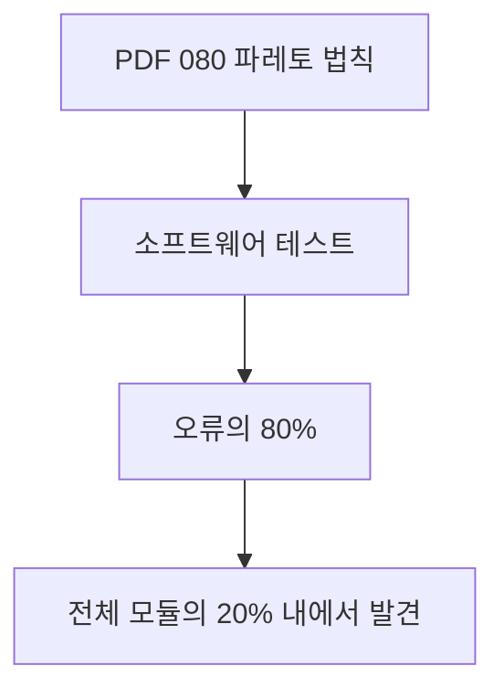
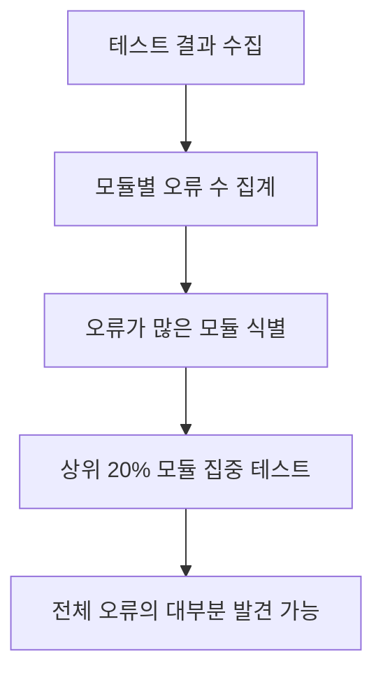
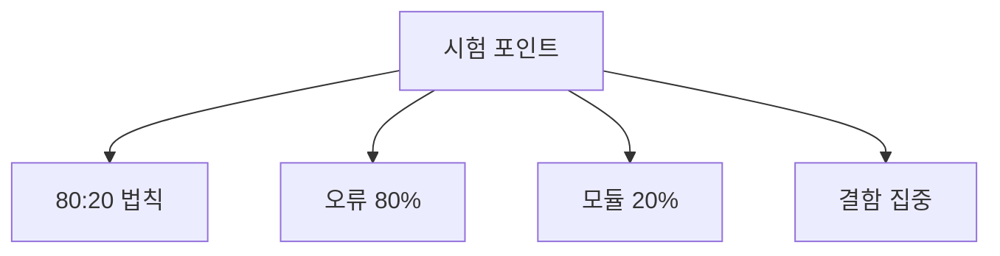
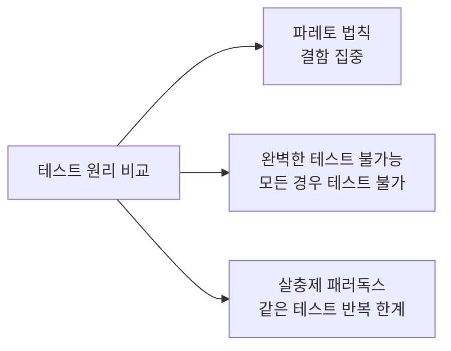
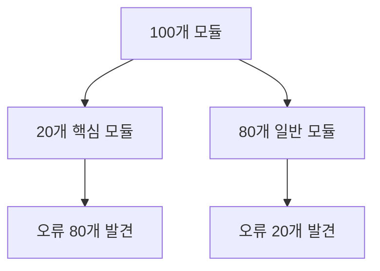
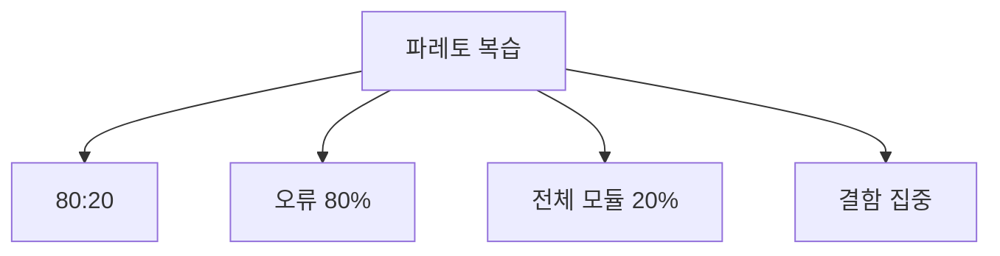

# 080 파레토 법칙(Pareto Principle)

작성 기준일: 2026-06-01
검색/보강일: 2026-06-01
과목: `2과목 소프트웨어 개발`
기준 PDF: `/Users/nes0903/Documents/study/정보처리기사/핵심요약집_2026_정보처리기사필기핵심요약.pdf`
PDF 확인 위치: `13페이지`
검색 보강: 소프트웨어 테스트의 결함 집중 원리와 80/20 규칙 설명을 참고하여 테스트 우선순위 관점으로 확장
주제별 검색 키워드: `Pareto principle software testing 80 percent defects 20 percent modules`, `defect clustering Pareto principle software testing`

---

## 1. 한 줄 요약

- 파레토 법칙은 소프트웨어 테스트에서 오류의 대부분이 일부 모듈에 집중된다는 원리로 이해한다.
- PDF 기준 핵심은 `오류의 80%는 전체 모듈의 20% 내에서 발견된다`는 것이다.
- 시험에서는 `80:20`, `결함 집중`, `소수 모듈에 오류 집중`을 연결하면 된다.

---

## 2. 한눈에 보는 구조

- 일반 의미:
  - 많은 결과가 적은 원인에서 나온다는 경험 법칙이다.
- 소프트웨어 테스트 의미:
  - 모든 모듈이 같은 정도로 오류를 포함하지 않는다.
  - 오류가 자주 발생하는 핵심 모듈이나 복잡한 모듈이 있다.
  - 테스트 자원이 제한되어 있으면 오류가 집중될 가능성이 높은 모듈을 우선 점검한다.
- 정보처리기사에서는 수학적 법칙이라기보다 테스트 전략의 원리로 출제된다.

---

## 3. PDF 기준 핵심

- PDF 핵심:
  - 소프트웨어 테스트에서 오류의 80%는 전체 모듈의 20% 내에서 발견된다는 법칙이다.
- 반드시 암기할 수치:
  - 오류: `80%`
  - 모듈: `20%`
- 표현 변형:
  - 결함의 대부분은 일부 모듈에 집중된다.
  - 소수의 모듈이 다수의 오류를 포함한다.
  - 결함 집중 원리와 연결된다.

---

## 4. 검색으로 보강한 관점

- 테스트 분야에서는 파레토 법칙이 `결함 클러스터링` 또는 `결함 집중` 원리와 연결된다.
- 결함이 많이 발생한 모듈은 다음 릴리스에서도 다시 결함이 나타날 가능성이 높다.
- 그래서 다음과 같은 모듈을 우선 테스트한다.
  - 변경이 잦은 모듈
  - 복잡도가 높은 모듈
  - 장애 이력이 많은 모듈
  - 핵심 업무 로직 모듈
- 시험에서는 실무적 적용보다 PDF의 `80% 오류 / 20% 모듈` 문장을 우선한다.

---

## 5. 개념 설명

- 예시:
  - 모듈이 100개 있다.
  - 그중 20개 모듈에서 전체 오류의 80%가 발견된다.
  - 나머지 80개 모듈에서는 오류의 20%만 발견된다.
- 의미:
  - 모든 모듈을 같은 비중으로 테스트하는 것이 항상 효율적이지 않다.
  - 결함이 집중된 모듈을 식별하면 테스트 효율이 높아진다.
- 적용:
  - 결함 이력을 분석한다.
  - 복잡한 모듈을 우선 검토한다.
  - 변경이 많은 모듈을 회귀 테스트 대상으로 잡는다.
  - 장애 영향도가 큰 모듈에 테스트 자원을 더 배분한다.

---

## 6. 시험 포인트

- 숫자 매칭:
  - `80% 오류`
  - `20% 모듈`
- 용어 매칭:
  - 파레토 법칙
  - 80:20 법칙
  - 결함 집중
- 오답 단서:
  - 오류의 20%가 모듈의 80%에서 발견된다는 식으로 비율이 뒤바뀐 설명
  - 모든 모듈에 오류가 균등하게 분포한다는 설명
  - 파레토 법칙을 블랙박스 테스트 기법의 한 종류로 보는 설명
- 연결:
  - 테스트 우선순위
  - 위험 기반 테스트
  - 회귀 테스트 대상 선정

---

## 7. 헷갈리는 비교

| 구분 | 핵심 의미 | 숫자/단서 | 시험 포인트 |
|---|---|---|---|
| 파레토 법칙 | 오류가 일부 모듈에 집중 | 80:20 | 오류 80%, 모듈 20% |
| 완벽한 테스트 불가능 | 모든 입력 조합 테스트 불가 | 전체 경우의 수 | 전수 테스트 한계 |
| 살충제 패러독스 | 같은 테스트 반복 시 새 결함 발견 감소 | 테스트 케이스 갱신 | 테스트 개선 필요 |

- 파레토 법칙은 테스트 설계 기법이 아니라 결함 분포에 대한 원리다.
- 비율 자체를 묻는 문제가 많으므로 숫자 순서를 정확히 외운다.

---

## 8. 예시 또는 암기 포인트

- 암기 문장:
  - `파레토는 20% 모듈에서 80% 오류.`
- 예시:
  - 결제, 로그인, 권한 관리처럼 복잡하고 변경이 많은 모듈에서 결함이 집중될 수 있다.
  - 단순 조회 모듈은 상대적으로 결함 수가 적을 수 있다.
- 실전 풀이:
  - 보기에서 `80%`, `20%`, `오류`, `모듈`이 보이면 파레토 법칙을 찾는다.

---

## 9. 빠른 복습

- 파레토 법칙은 오류의 80%가 전체 모듈의 20% 안에서 발견된다는 법칙이다.
- 결함은 모든 모듈에 균등하게 퍼져 있지 않고 일부 모듈에 집중될 수 있다.
- 테스트 자원이 제한될 때 결함 집중 모듈을 우선 테스트하는 근거가 된다.

---

## 10. 참고 링크

- [기준 PDF: 핵심요약집_2026_정보처리기사필기핵심요약](/Users/nes0903/Documents/study/정보처리기사/핵심요약집_2026_정보처리기사필기핵심요약.pdf)
- [Q-Net 정보처리기사 종목별 상세정보](https://www.q-net.or.kr/crf005.do?id=crf00503&jmCd=1320)
- [Ministry of Testing - Bug clustering](https://www.ministryoftesting.com/software-testing-glossary/bug-clustering)
- [Wikipedia - Pareto principle](https://en.wikipedia.org/wiki/Pareto_principle)
