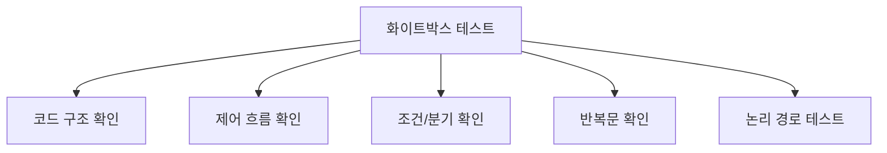
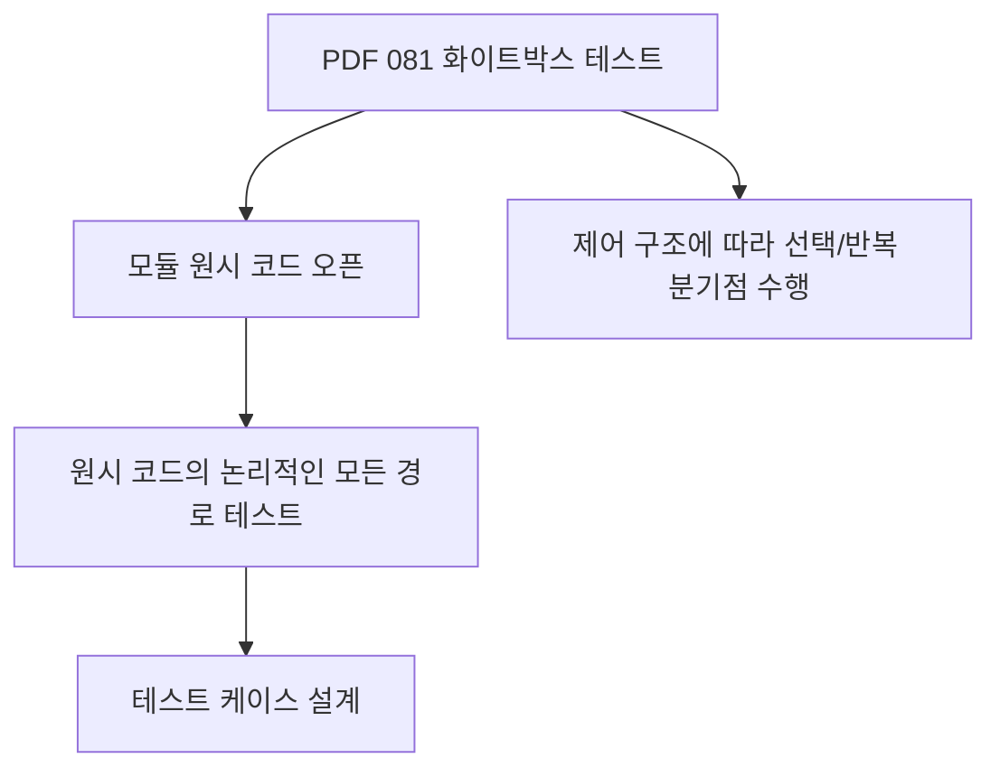
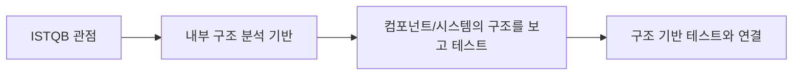
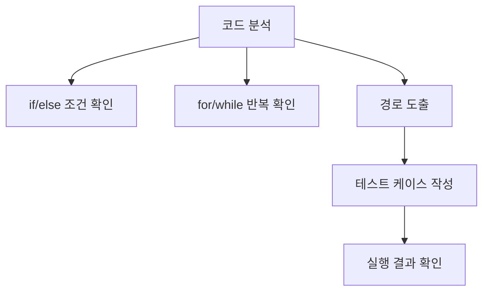
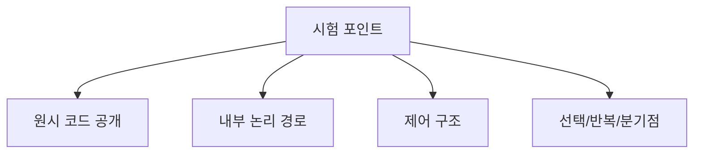
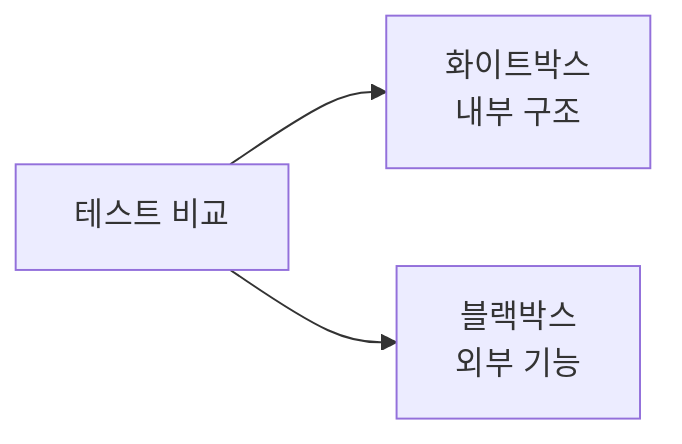
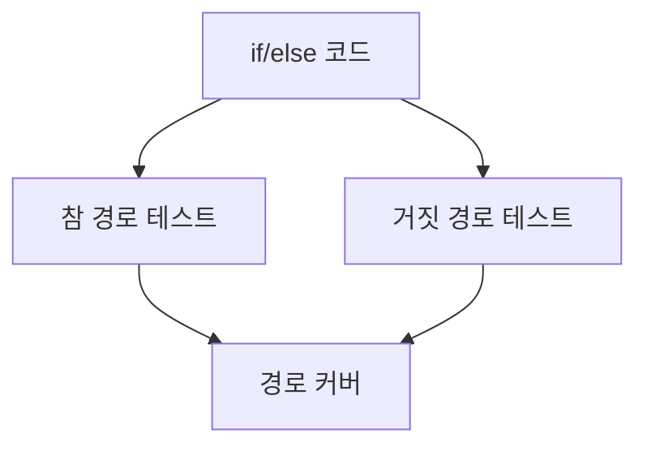
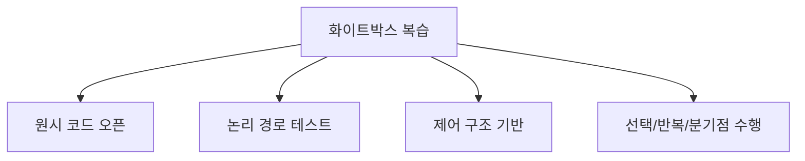

# 081 화이트박스 테스트(White Box Test)

작성 기준일: 2026-06-01
검색/보강일: 2026-06-01
과목: `2과목 소프트웨어 개발`
기준 PDF: `/Users/nes0903/Documents/study/정보처리기사/핵심요약집_2026_정보처리기사필기핵심요약.pdf`
PDF 확인 위치: `13페이지`
검색 보강: ISTQB 화이트박스 테스트 정의를 참고하여 원시 코드, 논리 경로, 제어 구조 중심으로 확장
주제별 검색 키워드: `ISTQB white-box testing internal structure`, `white box testing code path control structure`

---

## 1. 한 줄 요약

- 화이트박스 테스트는 프로그램 내부 구조와 원시 코드의 논리 경로를 기준으로 테스트 케이스를 설계하는 테스트 방법이다.
- PDF 기준 핵심은 `원시 코드를 오픈한 상태`, `논리적인 모든 경로 테스트`, `제어 구조의 선택·반복 분기점 수행`이다.
- 시험에서는 블랙박스 테스트와 반대로 `내부 코드/구조를 본다`는 점을 가장 먼저 잡는다.

---

## 2. 한눈에 보는 구조

- 화이트박스 테스트는 내부를 보는 테스트다.
  - 코드
  - 제어 흐름
  - 조건문
  - 반복문
  - 데이터 흐름
  - 논리 경로
- 목적:
  - 실행되지 않는 코드 경로를 줄인다.
  - 조건과 반복문이 의도대로 동작하는지 확인한다.
  - 내부 로직의 오류를 찾는다.
- 주로 개발자 또는 코드 구조를 이해하는 테스터가 수행한다.

---

## 3. PDF 기준 핵심

- PDF 핵심:
  - 모듈의 원시 코드를 오픈시킨 상태에서 원시 코드의 논리적인 모든 경로를 테스트하여 테스트 케이스를 설계하는 방법이다.
  - 프로그램의 제어 구조에 따라 선택, 반복 등의 분기점 부분들을 수행함으로써 논리적 경로를 제어한다.
- PDF 표현에서 중요한 단서:
  - 원시 코드
  - 오픈
  - 논리적인 모든 경로
  - 제어 구조
  - 선택, 반복
  - 분기점

---

## 4. 검색으로 보강한 관점

- ISTQB는 화이트박스 테스트를 컴포넌트나 시스템의 내부 구조 분석에 기반한 테스트로 설명한다.
- 보강해서 이해할 수 있는 동의어:
  - 구조 기반 테스트
  - 코드 기반 테스트
  - 로직 기반 테스트
  - 글래스박스 테스트
- 정보처리기사에서는 ISTQB식 용어보다 PDF의 `원시 코드`, `논리 경로`, `제어 구조` 표현이 더 직접적으로 중요하다.

---

## 5. 개념 설명

- 화이트박스 테스트의 사고 방식:
  - 입력과 출력만 보는 것이 아니라 내부 로직을 본다.
  - 코드의 분기와 반복을 추적한다.
  - 가능한 실행 경로를 도출한다.
  - 각 경로가 적어도 한 번은 수행되도록 테스트 케이스를 만든다.
- 예시:
  - `if (score >= 60)` 조건이 있다.
  - 참 경로와 거짓 경로를 모두 테스트해야 한다.
  - 반복문이 있으면 0회, 1회, 여러 회 반복 상황을 점검할 수 있다.
- 발견하기 좋은 오류:
  - 실행되지 않는 코드
  - 조건식 오류
  - 반복문 종료 조건 오류
  - 데이터 흐름 오류
  - 잘못된 계산 로직

---

## 6. 시험 포인트

- 반드시 외울 설명:
  - 원시 코드를 오픈한 상태에서 테스트한다.
  - 논리적인 모든 경로를 테스트한다.
  - 제어 구조의 선택, 반복, 분기점 부분을 수행한다.
- 오답 단서:
  - 내부 구조를 모른 채 입력과 출력만 검사한다.
  - 사용자 요구사항 명세만 보고 테스트한다.
  - 동치 분할과 경계값 분석만 사용한다고 설명한다.
- 연결:
  - 082 화이트박스 테스트 종류
    - 기초 경로 검사
    - 제어 구조 검사
    - 조건 검사
    - 루프 검사
    - 데이터 흐름 검사

---

## 7. 헷갈리는 비교

| 구분 | 화이트박스 테스트 | 블랙박스 테스트 |
|---|---|---|
| 기준 | 코드 내부 구조 | 요구사항/기능 명세 |
| 관점 | 개발자/구조 관점 | 사용자/외부 관점 |
| 주요 대상 | 논리 경로, 조건, 반복, 데이터 흐름 | 입력과 출력, 기능 동작 |
| 대표 기법 | 기초 경로 검사, 제어 구조 검사 | 동치 분할, 경계값 분석 |
| 시험 단서 | 원시 코드 오픈 | 내부 구조를 보지 않음 |

- `코드를 본다`는 말이 있으면 화이트박스다.
- `입력과 출력만 본다`는 말이 있으면 블랙박스다.

---

## 8. 예시 또는 암기 포인트

- 암기 문장:
  - `화이트박스는 코드를 열고 논리 경로를 테스트한다.`
- 예시:
  - 로그인 코드에서 비밀번호가 맞는 경로와 틀린 경로를 모두 테스트한다.
  - 반복문이 한 번도 실행되지 않는 경우와 여러 번 실행되는 경우를 테스트한다.
- 문제풀이 팁:
  - `원시 코드`, `논리 경로`, `제어 구조`, `분기점`이 보이면 화이트박스 테스트다.

---

## 9. 빠른 복습

- 화이트박스 테스트는 원시 코드를 열어 내부 구조를 기준으로 테스트한다.
- 논리적인 모든 경로를 테스트해 테스트 케이스를 설계한다.
- 선택, 반복 등 제어 구조의 분기점을 수행한다.
- 블랙박스 테스트와 달리 내부 구조를 알고 테스트한다.

---

## 10. 참고 링크

- [기준 PDF: 핵심요약집_2026_정보처리기사필기핵심요약](/Users/nes0903/Documents/study/정보처리기사/핵심요약집_2026_정보처리기사필기핵심요약.pdf)
- [Q-Net 정보처리기사 종목별 상세정보](https://www.q-net.or.kr/crf005.do?id=crf00503&jmCd=1320)
- [ISTQB Glossary - White-Box Testing](https://istqb-glossary.page/white-box-testing/)
