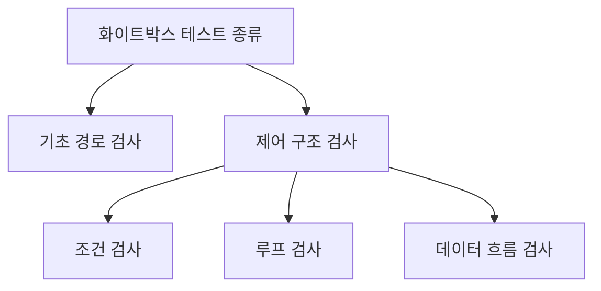
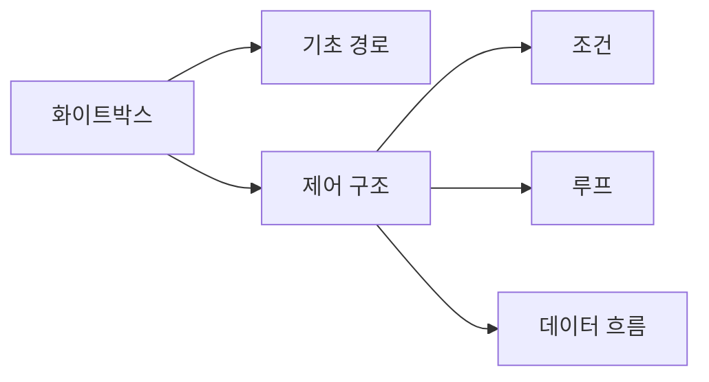
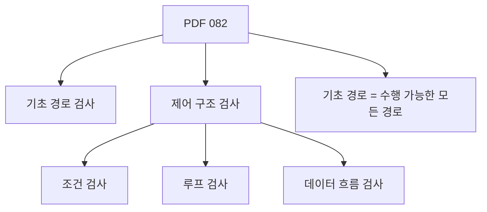
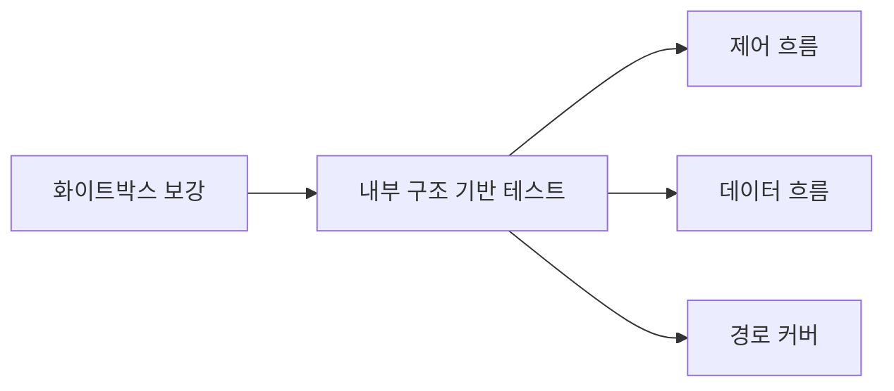
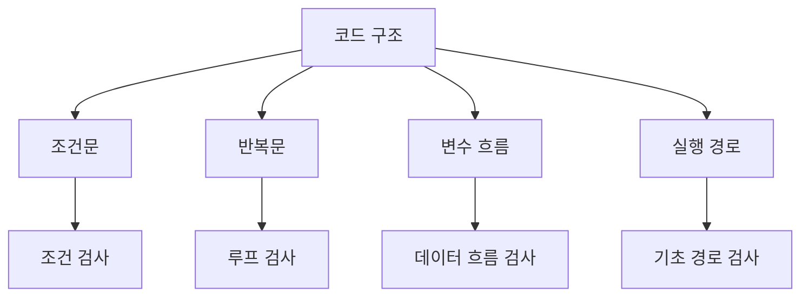
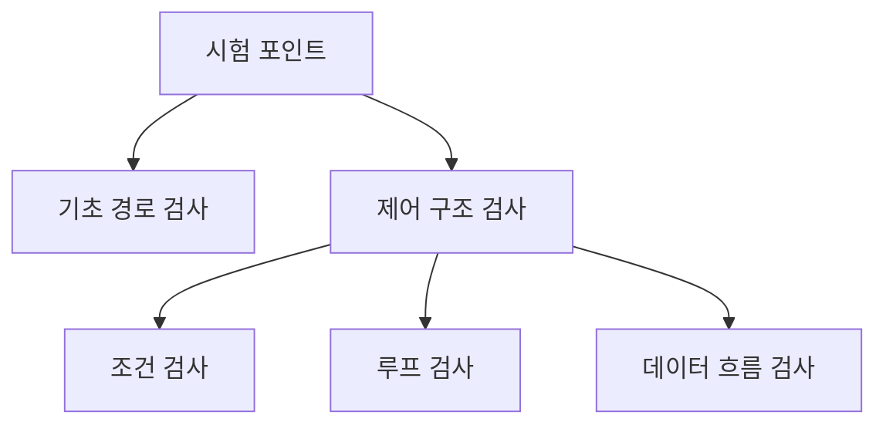
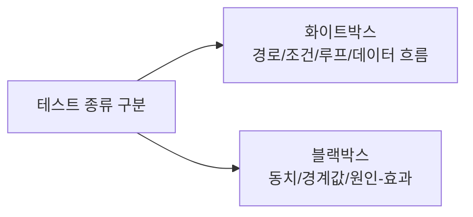
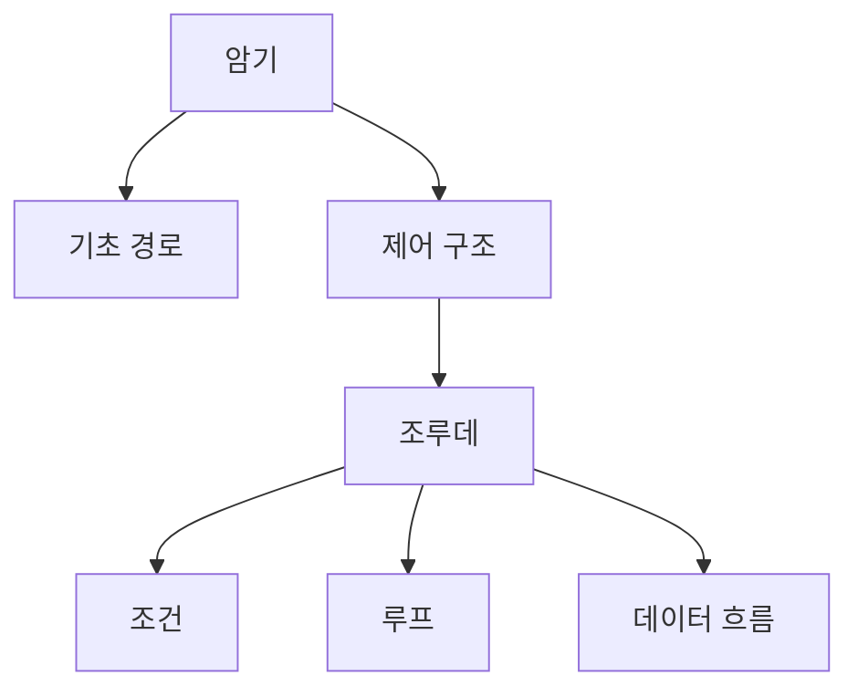
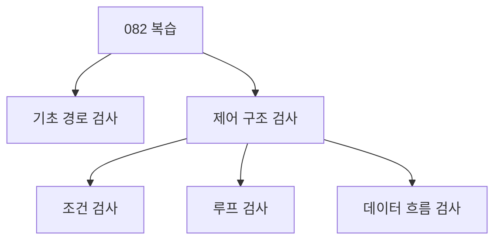

# 082 화이트박스 테스트의 종류

작성 기준일: 2026-06-01
검색/보강일: 2026-06-01
과목: `2과목 소프트웨어 개발`
기준 PDF: `/Users/nes0903/Documents/study/정보처리기사/핵심요약집_2026_정보처리기사필기핵심요약.pdf`
PDF 확인 위치: `13페이지`
검색 보강: ISTQB 화이트박스 테스트와 테스트 기법 용어를 참고하여 기초 경로 검사와 제어 구조 검사의 하위 종류를 확장
주제별 검색 키워드: `basis path testing control structure testing condition loop data flow`, `ISTQB white-box testing data flow path testing`

---

## 1. 한 줄 요약

- 화이트박스 테스트의 대표 종류는 `기초 경로 검사`와 `제어 구조 검사`이며, 제어 구조 검사는 조건·루프·데이터 흐름 검사로 나뉜다.
- PDF 기준 핵심은 이 목록과 `기초 경로(Base Path = Basis Path)는 수행 가능한 모든 경로`라는 주석이다.
- 시험에서는 종류를 그대로 외우고, 블랙박스 테스트 종류와 섞지 않는 것이 중요하다.

---

## 2. 한눈에 보는 구조

- 기초 경로 검사:
  - 프로그램의 독립적인 실행 경로를 찾아 테스트한다.
  - 논리 경로를 빠뜨리지 않도록 한다.
- 제어 구조 검사:
  - 프로그램의 제어 흐름을 이루는 조건, 반복, 데이터 사용 흐름을 검사한다.
- 하위 검사:
  - 조건 검사: 조건식의 참/거짓, 복합 조건을 점검한다.
  - 루프 검사: 반복문의 시작, 반복, 종료 조건을 점검한다.
  - 데이터 흐름 검사: 변수의 정의, 사용, 소멸 흐름을 점검한다.

---

## 3. PDF 기준 핵심

- PDF 핵심 목록:
  - 기초 경로 검사
  - 제어 구조 검사
    - 조건 검사
    - 루프 검사
    - 데이터 흐름 검사
- PDF 주석:
  - `기초 경로(Base Path = Basis Path): 수행 가능한 모든 경로를 의미함`
- 시험에서는 다음처럼 매칭한다.
  - 조건/루프/데이터 흐름은 제어 구조 검사에 속한다.
  - 기초 경로 검사는 수행 가능한 경로와 연결된다.

---

## 4. 검색으로 보강한 관점

- ISTQB는 화이트박스 테스트를 내부 구조 분석 기반 테스트로 설명한다.
- 기초 경로 검사는 프로그램의 흐름 그래프와 경로를 이해하는 데 연결된다.
- 데이터 흐름 검사는 변수가 정의되고 사용되는 흐름을 기준으로 오류를 찾는다.
- 정보처리기사에서는 세부 커버리지 계산보다 PDF의 종류 목록을 정확히 외우는 것이 우선이다.

---

## 5. 개념 설명

- 기초 경로 검사:
  - 프로그램에서 실행 가능한 경로를 식별한다.
  - 각 경로를 테스트할 수 있는 테스트 케이스를 설계한다.
  - 복잡한 분기 구조에서 테스트 누락을 줄인다.
- 조건 검사:
  - 단순 조건과 복합 조건을 검사한다.
  - 예: `age >= 20 && paid == true`
- 루프 검사:
  - 반복문의 경계와 종료 조건을 검사한다.
  - 예: 0회 반복, 1회 반복, 여러 회 반복, 최대 반복
- 데이터 흐름 검사:
  - 변수가 정의된 뒤 올바르게 사용되는지 본다.
  - 정의되지 않은 변수 사용, 사용되지 않는 값, 잘못된 재정의 등을 찾을 수 있다.

---

## 6. 시험 포인트

- 그대로 암기할 목록:
  - 기초 경로 검사
  - 제어 구조 검사
    - 조건 검사
    - 루프 검사
    - 데이터 흐름 검사
- 함정:
  - 동치 분할, 경계값 분석, 원인-효과 그래프 검사는 블랙박스 테스트 종류다.
  - 조건 검사와 루프 검사는 화이트박스의 제어 구조 검사에 속한다.
  - 기초 경로는 `Base Path` 또는 `Basis Path`로 표현될 수 있다.
- 문제 풀이:
  - 보기 중 `조건`, `루프`, `데이터 흐름`이 나오면 화이트박스 쪽으로 분류한다.
  - 보기 중 `동치`, `경계값`, `원인-효과`가 나오면 블랙박스 쪽으로 분류한다.

---

## 7. 헷갈리는 비교

| 구분 | 화이트박스 테스트 종류 | 블랙박스 테스트 종류 |
|---|---|---|
| 대표 | 기초 경로 검사 | 동치 분할 검사 |
| 하위 | 조건 검사, 루프 검사, 데이터 흐름 검사 | 경계값 분석, 원인-효과 그래프 |
| 기준 | 내부 구조, 코드 경로 | 명세, 입력과 출력 |
| 시험 단서 | 제어 구조 | 기능 명세 |

- `경로`, `조건`, `루프`, `데이터 흐름`은 내부 구조가 있어야 판단할 수 있으므로 화이트박스다.
- `동치 분할`, `경계값`은 입력값 범위를 보고 테스트하므로 블랙박스다.

---

## 8. 예시 또는 암기 포인트

- 암기 문장:
  - `화이트박스는 기초 경로와 제어 구조, 제어 구조는 조건·루프·데이터 흐름.`
- 약식 암기:
  - `기제조루데`
    - 기: 기초 경로 검사
    - 제: 제어 구조 검사
    - 조: 조건 검사
    - 루: 루프 검사
    - 데: 데이터 흐름 검사
- 기초 경로는 `Base Path`와 `Basis Path`가 같은 뜻으로 쓰일 수 있음을 기억한다.

---

## 9. 빠른 복습

- 화이트박스 테스트 종류에는 기초 경로 검사와 제어 구조 검사가 있다.
- 제어 구조 검사에는 조건 검사, 루프 검사, 데이터 흐름 검사가 있다.
- 기초 경로는 수행 가능한 모든 경로를 의미한다.
- 동치 분할과 경계값 분석은 블랙박스 테스트 종류이므로 섞지 않는다.

---

## 10. 참고 링크

- [기준 PDF: 핵심요약집_2026_정보처리기사필기핵심요약](/Users/nes0903/Documents/study/정보처리기사/핵심요약집_2026_정보처리기사필기핵심요약.pdf)
- [Q-Net 정보처리기사 종목별 상세정보](https://www.q-net.or.kr/crf005.do?id=crf00503&jmCd=1320)
- [ISTQB Glossary - White-Box Testing](https://istqb-glossary.page/white-box-testing/)
- [Wikipedia - Basis path testing](https://en.wikipedia.org/wiki/Basis_path_testing)
