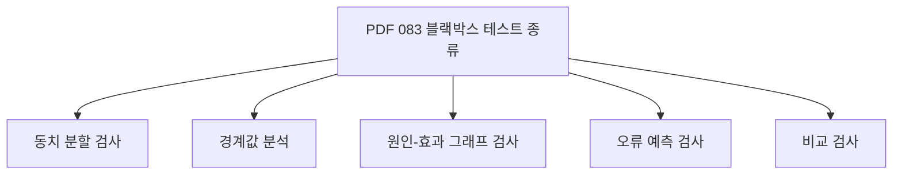
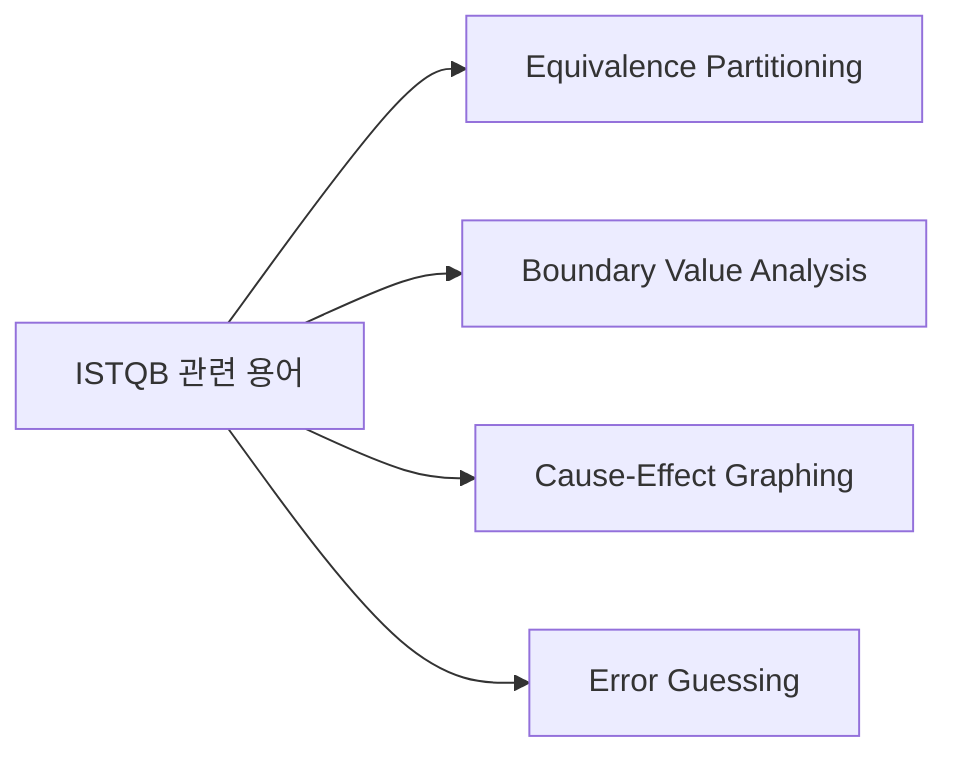
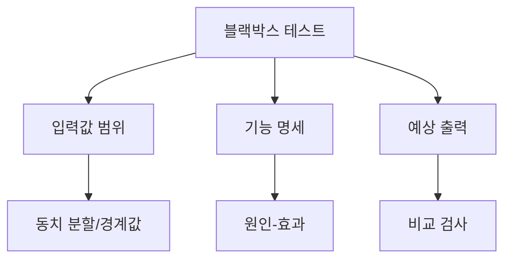
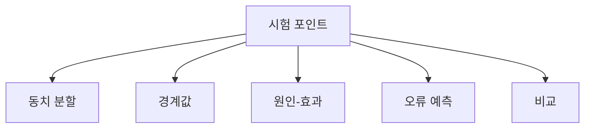
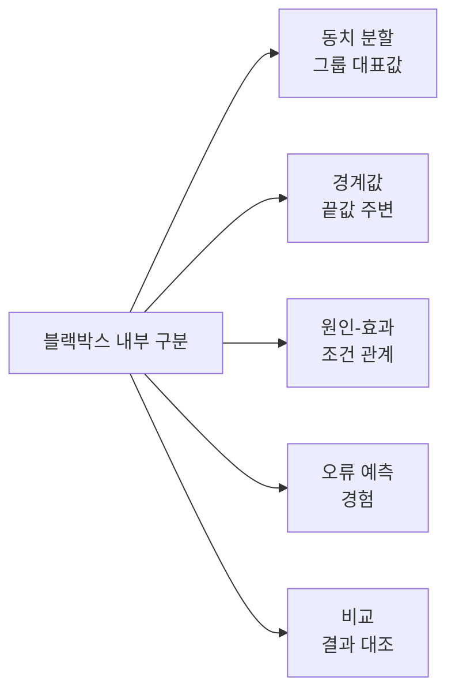
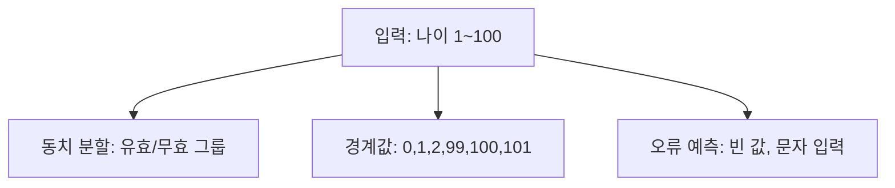
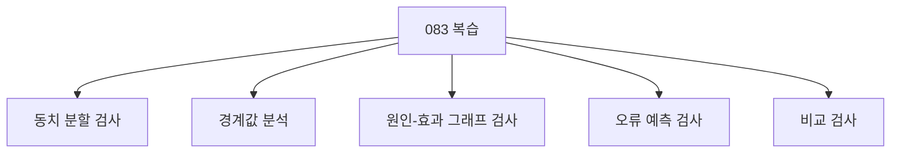

# 083 블랙박스 테스트 종류

작성 기준일: 2026-06-01
검색/보강일: 2026-06-01
과목: `2과목 소프트웨어 개발`
기준 PDF: `/Users/nes0903/Documents/study/정보처리기사/핵심요약집_2026_정보처리기사필기핵심요약.pdf`
PDF 확인 위치: `13페이지`
검색 보강: ISTQB의 블랙박스 관련 용어와 대표 기법 설명을 참고하여 동치 분할, 경계값, 원인-효과, 오류 예측, 비교 검사를 확장
주제별 검색 키워드: `ISTQB black-box testing equivalence partitioning boundary value analysis error guessing`, `cause-effect graphing black box test technique`

---

## 1. 한 줄 요약

- 블랙박스 테스트는 내부 코드를 보지 않고 요구사항, 입력, 출력, 기능 동작을 기준으로 테스트하는 방식이다.
- PDF 기준 블랙박스 테스트 종류는 `동치 분할 검사`, `경계값 분석`, `원인-효과 그래프 검사`, `오류 예측 검사`, `비교 검사`이다.
- 시험에서는 화이트박스 테스트 종류와 섞어 내는 문제가 많으므로 목록 구분이 핵심이다.

---

## 2. 한눈에 보는 구조

- 블랙박스 테스트의 기준:
  - 요구사항 명세
  - 기능 설명
  - 입력값 범위
  - 출력 결과
  - 사용자 관점 동작
- 내부 코드 구조는 고려하지 않는다.
- 대표 종류:
  - 동치 분할 검사: 입력 영역을 동등한 그룹으로 나눈다.
  - 경계값 분석: 경계 부근 값을 테스트한다.
  - 원인-효과 그래프 검사: 입력 조건과 출력 결과의 관계를 그래프로 표현한다.
  - 오류 예측 검사: 경험으로 오류 가능성이 높은 부분을 추정한다.
  - 비교 검사: 여러 버전이나 유사 시스템 결과를 비교한다.

---

## 3. PDF 기준 핵심

- PDF 핵심 목록:
  - 동치 분할 검사
  - 경계값 분석
  - 원인-효과 그래프 검사
  - 오류 예측 검사
  - 비교 검사
- PDF에서는 정의를 길게 설명하지 않으므로, 이름별 핵심 단서를 보강해 외운다.

| 종류 | 핵심 의미 | 시험 단서 |
|---|---|---|
| 동치 분할 검사 | 입력 조건을 같은 결과가 예상되는 그룹으로 나눔 | 동등 클래스, 유효/무효 분할 |
| 경계값 분석 | 입력 범위의 경계와 경계 근처 값 테스트 | 최소, 최대, 바로 안/밖 |
| 원인-효과 그래프 검사 | 입력 원인과 출력 효과의 관계를 그래프로 분석 | 원인, 결과, 그래프 |
| 오류 예측 검사 | 경험과 직관으로 오류 가능성이 높은 값을 선택 | 경험, 예측, 직감 |
| 비교 검사 | 여러 버전/시스템의 결과를 비교 | 비교, 동일 결과 확인 |

---

## 4. 검색으로 보강한 관점

- ISTQB 계열 용어에서 동치 분할, 경계값 분석, 원인-효과 그래프, 오류 추정은 대표적인 명세 기반/블랙박스 테스트 기법으로 설명된다.
- 보강 관점:
  - 동치 분할은 모든 입력값을 테스트하지 않고 대표값을 고르는 데 유용하다.
  - 경계값 분석은 오류가 경계에서 자주 발생한다는 경험에 기반한다.
  - 원인-효과 그래프는 여러 입력 조건 조합과 출력 결과의 관계를 정리한다.
  - 오류 예측은 테스터의 경험을 활용한다.
- 시험에서는 공식 용어보다 PDF 용어인 `오류 예측 검사`를 우선한다.

---

## 5. 개념 설명

- 동치 분할 검사:
  - 입력 범위를 같은 결과가 예상되는 그룹으로 나눈다.
  - 각 그룹에서 대표값만 테스트해도 비슷한 오류를 찾을 수 있다고 본다.
  - 예: 나이 입력이 1~100이면 유효 그룹과 무효 그룹으로 나눈다.
- 경계값 분석:
  - 범위의 경계에서 오류가 자주 발생한다고 보고 경계 주변을 테스트한다.
  - 예: 1~100이면 0, 1, 2, 99, 100, 101 등을 확인한다.
- 원인-효과 그래프 검사:
  - 입력 조건을 원인, 출력 결과를 효과로 보고 관계를 그래프로 만든다.
  - 복잡한 조건 조합 테스트에 유용하다.
- 오류 예측 검사:
  - 과거 결함 경험, 도메인 지식, 직관을 바탕으로 오류 가능성이 높은 케이스를 고른다.
- 비교 검사:
  - 동일 기능을 수행하는 여러 시스템, 버전, 구현 결과를 비교한다.
  - 결과가 다르면 결함 가능성을 의심한다.

---

## 6. 시험 포인트

- PDF 목록을 그대로 외운다.
- 블랙박스 단서:
  - 내부 구조를 보지 않는다.
  - 입력과 출력, 기능 명세를 기준으로 한다.
  - 사용자 관점 테스트와 연결된다.
- 오답 단서:
  - 기초 경로 검사
  - 조건 검사
  - 루프 검사
  - 데이터 흐름 검사
  - 위 항목들은 화이트박스 테스트 종류다.
- 자주 나오는 매칭:
  - 입력 범위 분할 → 동치 분할 검사
  - 최소/최대 주변 → 경계값 분석
  - 원인과 결과 관계 → 원인-효과 그래프 검사
  - 경험 기반 오류 추정 → 오류 예측 검사
  - 여러 결과 비교 → 비교 검사

---

## 7. 헷갈리는 비교

| 구분 | 핵심 질문 | 예시 |
|---|---|---|
| 동치 분할 | 같은 결과가 예상되는 입력 그룹은 무엇인가? | 유효 나이, 무효 나이 |
| 경계값 분석 | 범위의 경계와 주변 값은 무엇인가? | 0, 1, 100, 101 |
| 원인-효과 그래프 | 어떤 입력 조건이 어떤 결과를 만드는가? | 할인 조건 조합 |
| 오류 예측 검사 | 경험상 어디서 오류가 날 가능성이 높은가? | 빈 값, 특수문자 |
| 비교 검사 | 다른 버전/시스템 결과와 같은가? | 구버전과 신버전 결과 비교 |

- 동치 분할과 경계값 분석은 함께 출제될 수 있다.
- 동치 분할은 그룹 대표값, 경계값 분석은 그룹의 경계 부근 값이 핵심이다.

---

## 8. 예시 또는 암기 포인트

- 암기 문장:
  - `블랙박스는 동경원오비`
    - 동: 동치 분할
    - 경: 경계값
    - 원: 원인-효과
    - 오: 오류 예측
    - 비: 비교
- 문제풀이 팁:
  - `경계`라는 말이 있으면 경계값 분석이다.
  - `동등`, `동치`, `그룹`이라는 말이 있으면 동치 분할이다.
  - `원인과 결과`라는 말이 있으면 원인-효과 그래프다.

---

## 9. 빠른 복습

- 블랙박스 테스트는 내부 코드를 보지 않고 명세와 입출력 기준으로 테스트한다.
- 종류는 동치 분할 검사, 경계값 분석, 원인-효과 그래프 검사, 오류 예측 검사, 비교 검사다.
- 기초 경로, 조건, 루프, 데이터 흐름 검사는 화이트박스 쪽이다.

---

## 10. 참고 링크

- [기준 PDF: 핵심요약집_2026_정보처리기사필기핵심요약](/Users/nes0903/Documents/study/정보처리기사/핵심요약집_2026_정보처리기사필기핵심요약.pdf)
- [Q-Net 정보처리기사 종목별 상세정보](https://www.q-net.or.kr/crf005.do?id=crf00503&jmCd=1320)
- [Lexicon for ISTQB - Black-box testing](https://istqb.missionwares.com/glossary/black-box-testing.html)
- [ISTQB Glossary - Equivalence Partitioning](https://istqb-glossary.page/equivalence-partitioning/)
- [ISTQB Glossary - Boundary Value Analysis](https://istqb-glossary.page/boundary-value-analysis/)
- [ISTQB Glossary - Cause-Effect Graphing](https://istqb-glossary.page/cause-effect-graphing/)
- [ISTQB Glossary - Error Guessing](https://istqb-glossary.page/error-guessing/)

<!-- study-links:start -->
## 관련 문서

- `화이트박스 테스트`: [[정보처리기사/2과목 소프트웨어 개발/081 화이트박스 테스트(White Box Test)/081 화이트박스 테스트(White Box Test)|081 화이트박스 테스트(White Box Test)]]
<!-- study-links:end -->
