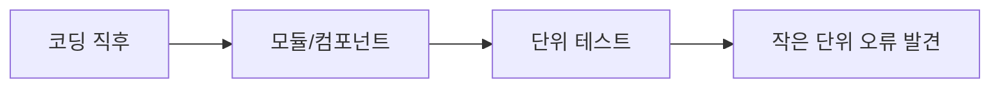
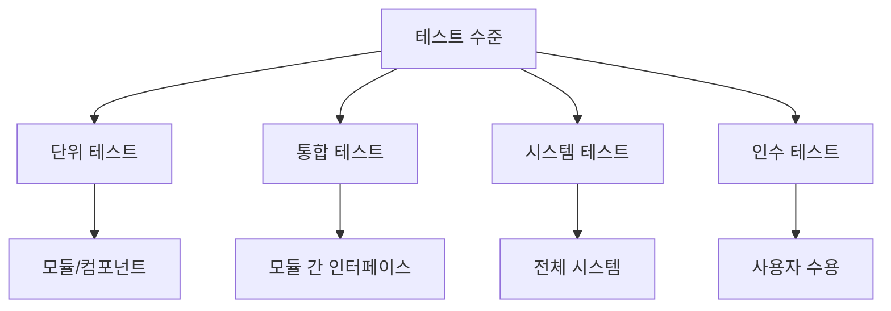
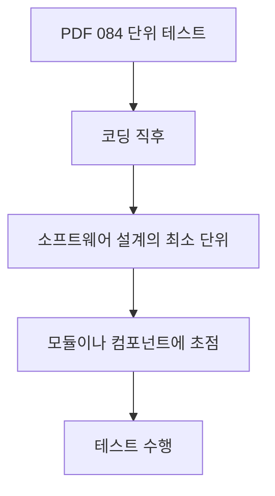
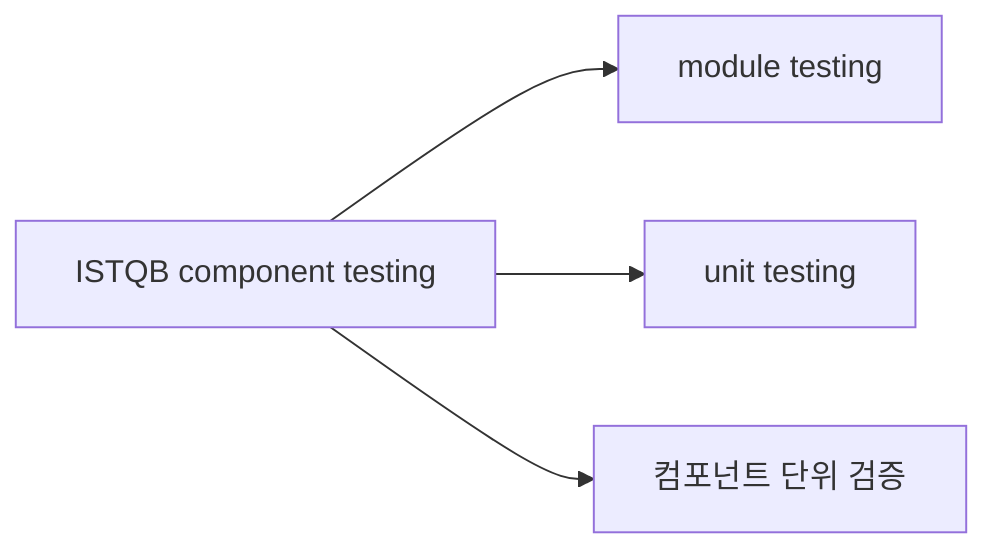
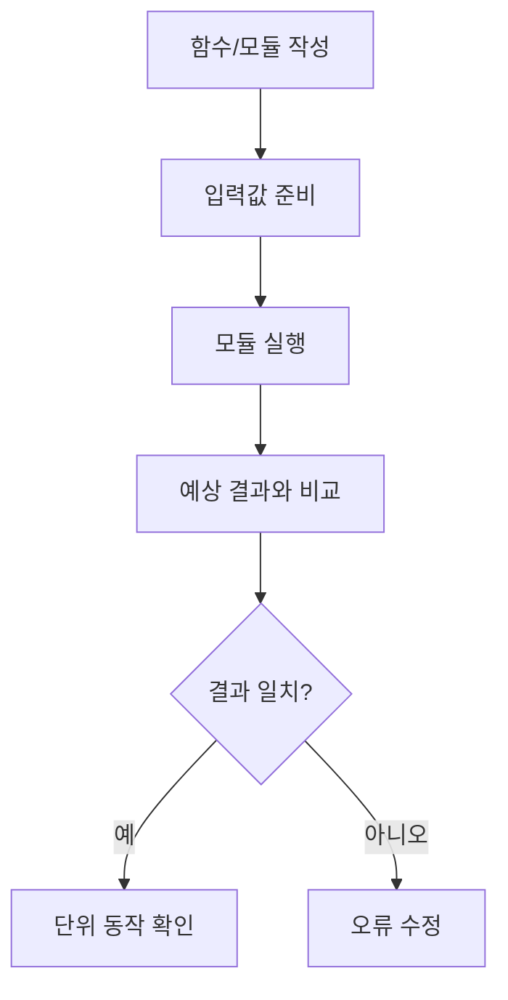
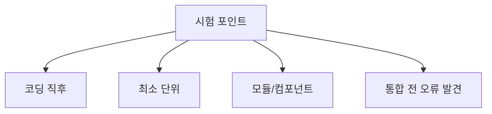
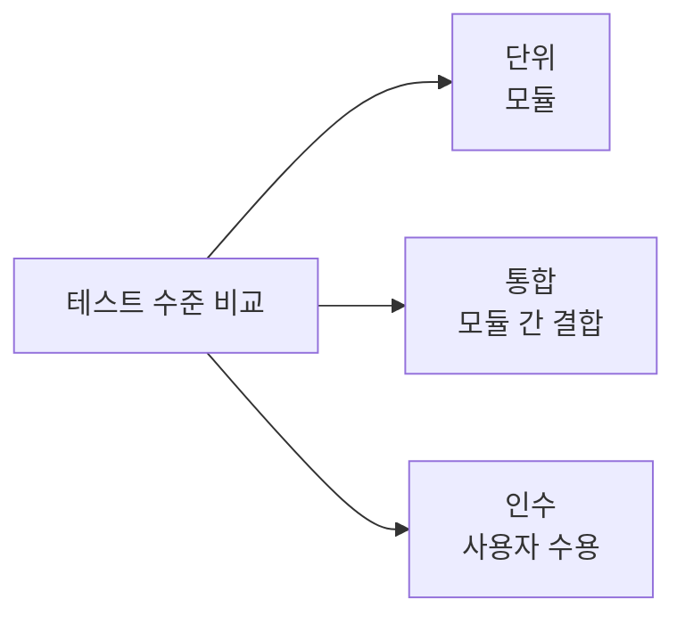
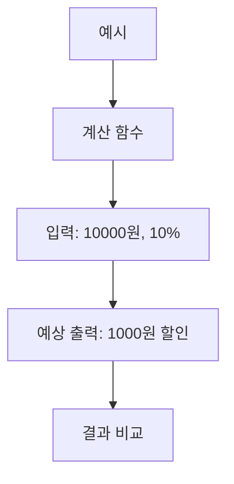
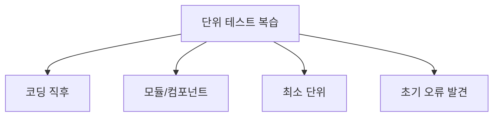

# 084 단위 테스트(Unit Test)

작성 기준일: 2026-06-01
검색/보강일: 2026-06-01
과목: `2과목 소프트웨어 개발`
기준 PDF: `/Users/nes0903/Documents/study/정보처리기사/핵심요약집_2026_정보처리기사필기핵심요약.pdf`
PDF 확인 위치: `13페이지`
검색 보강: ISTQB의 component testing/unit testing 용어를 참고하여 모듈·컴포넌트 단위 테스트의 범위를 확장
주제별 검색 키워드: `ISTQB component testing unit testing module testing`, `unit test module component software testing`

---

## 1. 한 줄 요약

- 단위 테스트는 코딩 직후 소프트웨어 설계의 최소 단위인 모듈이나 컴포넌트를 대상으로 수행하는 테스트이다.
- PDF 기준 핵심은 `코딩 직후`, `최소 단위`, `모듈이나 컴포넌트에 초점`이다.
- 시험에서는 통합 테스트, 인수 테스트와 구분해 가장 작은 단위의 테스트라는 점을 잡는다.

---

## 2. 한눈에 보는 구조

- 단위 테스트의 위치:
  - 코딩 직후 가장 먼저 수행되는 테스트 수준이다.
  - 개별 함수, 메서드, 클래스, 모듈, 컴포넌트를 대상으로 한다.
- 목적:
  - 작은 단위에서 오류를 빠르게 찾는다.
  - 통합 전에 개별 모듈의 로직을 확인한다.
  - 결함이 커지기 전에 조기에 발견한다.
- 수행 주체:
  - 보통 개발자가 수행한다.
  - 테스트 자동화 도구를 사용하기도 한다.

---

## 3. PDF 기준 핵심

- PDF 핵심:
  - 코딩 직후 소프트웨어 설계의 최소 단위인 모듈이나 컴포넌트에 초점을 맞춰 테스트하는 것이다.
- 중요한 표현:
  - 코딩 직후
  - 최소 단위
  - 모듈
  - 컴포넌트
- 단위 테스트는 전체 시스템이 완성된 뒤 사용자 요구사항을 확인하는 테스트가 아니다.

---

## 4. 검색으로 보강한 관점

- ISTQB 용어에서 component testing은 module testing, unit testing과 동의어로 연결된다.
- 보강 관점:
  - 단위 테스트는 개별 컴포넌트가 의도대로 동작하는지 확인한다.
  - 외부 의존성이 있으면 테스트 더블, 드라이버, 스텁 같은 보조 구조가 사용될 수 있다.
  - 정보처리기사에서는 세부 테스트 더블보다 `모듈/컴포넌트 최소 단위`가 핵심이다.

---

## 5. 개념 설명

- 단위 테스트 예시:
  - `calculateDiscount()` 함수가 올바른 할인 금액을 반환하는지 확인한다.
  - `LoginService`가 올바른 비밀번호와 틀린 비밀번호를 구분하는지 확인한다.
  - `Stack.push()`와 `Stack.pop()`이 의도대로 동작하는지 확인한다.
- 장점:
  - 오류 위치를 좁히기 쉽다.
  - 수정 비용이 낮다.
  - 반복 실행이 쉬워 회귀 테스트에 도움이 된다.
- 한계:
  - 모듈 간 인터페이스 문제는 통합 테스트에서 더 잘 드러난다.
  - 전체 사용자 흐름 문제는 시스템/인수 테스트에서 확인해야 한다.

---

## 6. 시험 포인트

- 반드시 외울 문장:
  - 단위 테스트는 코딩 직후 모듈이나 컴포넌트에 초점을 맞춰 테스트한다.
- 오답 단서:
  - 여러 모듈을 결합한 뒤 인터페이스를 테스트한다.
  - 사용자가 개발자 앞에서 수행한다.
  - 전체 시스템이 요구사항을 만족하는지 확인한다.
- 연결:
  - 085 단위 테스트로 발견 가능한 오류
    - 알고리즘 오류
    - 탈출구 없는 반복문
    - 잘못된 계산 수식

---

## 7. 헷갈리는 비교

| 구분 | 단위 테스트 | 통합 테스트 | 인수 테스트 |
|---|---|---|---|
| 시점 | 코딩 직후 | 단위 테스트 후 | 시스템 완성 후 |
| 대상 | 모듈/컴포넌트 | 모듈 간 인터페이스 | 사용자 요구/수용 |
| 목적 | 작은 단위 오류 발견 | 결합 오류 발견 | 인수 가능 여부 확인 |
| 시험 단서 | 최소 단위 | 상향식/하향식 | 알파/베타 |

- `최소 단위`가 나오면 단위 테스트다.
- `상위 모듈에서 하위 모듈 방향` 또는 `하위에서 상위 방향`은 통합 테스트다.
- `사용자가 개발자 앞에서` 또는 `필드 테스팅`은 인수 테스트다.

---

## 8. 예시 또는 암기 포인트

- 암기 문장:
  - `단위 테스트는 코딩 직후 최소 단위 모듈을 테스트한다.`
- 예시:
  - 할인 계산 함수의 결과를 확인한다.
  - 비밀번호 검증 메서드가 참/거짓을 제대로 반환하는지 확인한다.
  - 스택의 push/pop 함수가 정상 동작하는지 확인한다.

---

## 9. 빠른 복습

- 단위 테스트는 코딩 직후 수행한다.
- 대상은 소프트웨어 설계의 최소 단위인 모듈이나 컴포넌트다.
- 작은 단위 오류를 조기에 찾는 데 적합하다.
- 모듈 결합 오류는 통합 테스트에서 더 직접적으로 확인한다.

---

## 10. 참고 링크

- [기준 PDF: 핵심요약집_2026_정보처리기사필기핵심요약](/Users/nes0903/Documents/study/정보처리기사/핵심요약집_2026_정보처리기사필기핵심요약.pdf)
- [Q-Net 정보처리기사 종목별 상세정보](https://www.q-net.or.kr/crf005.do?id=crf00503&jmCd=1320)
- [ISTQB Glossary - Component Testing](https://istqb-glossary.page/component-testing/)
