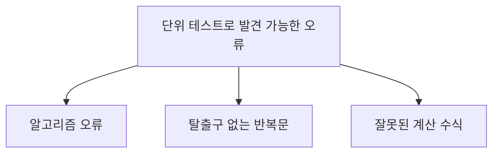
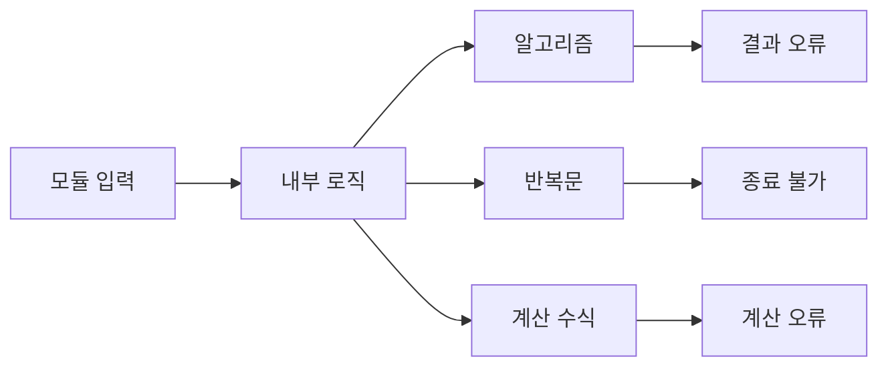
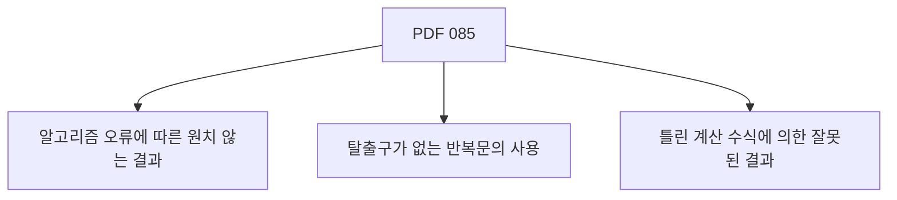
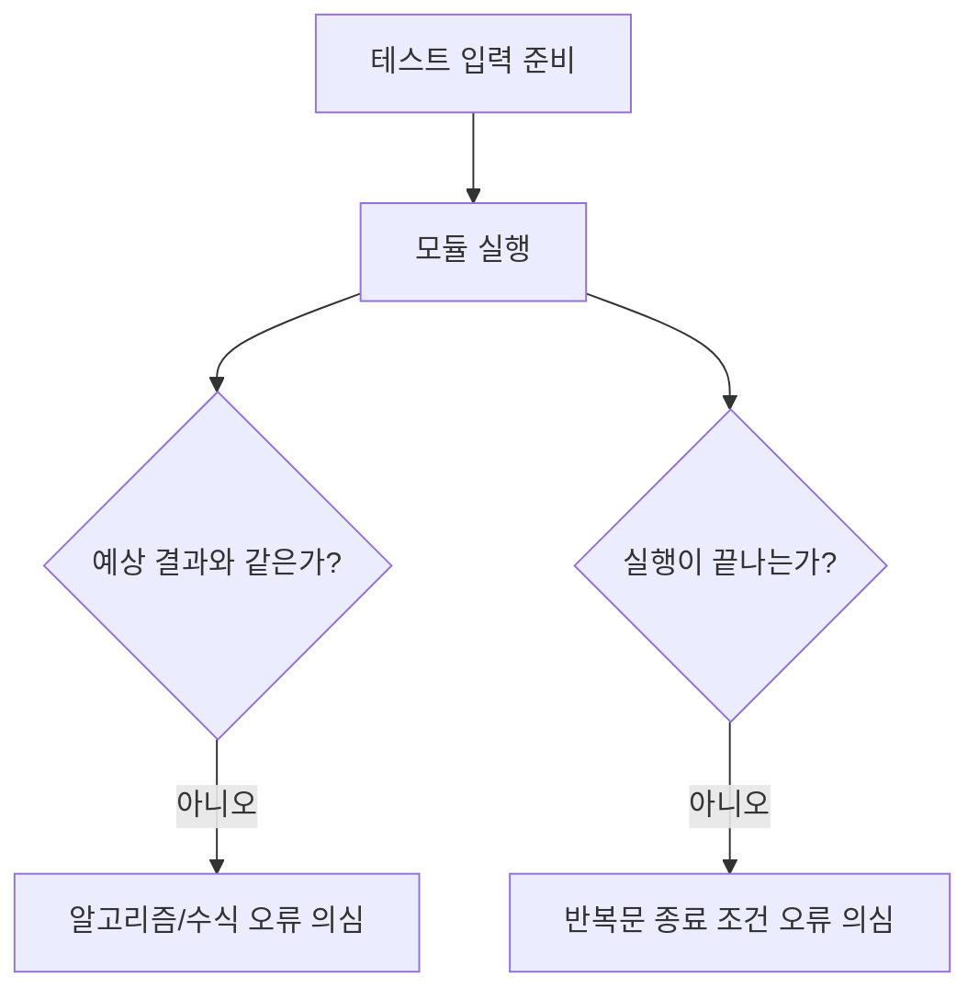
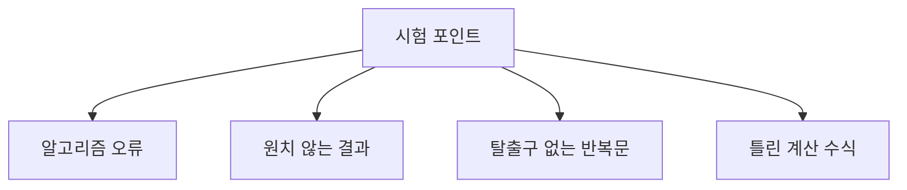
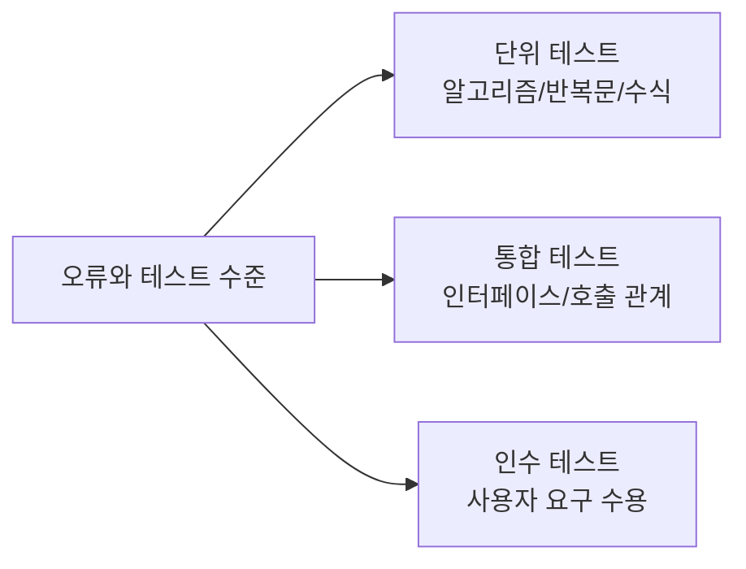
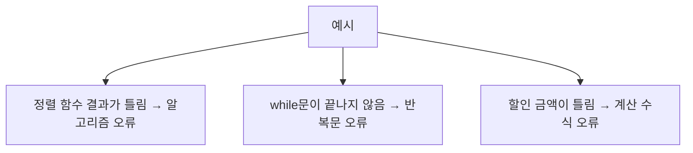
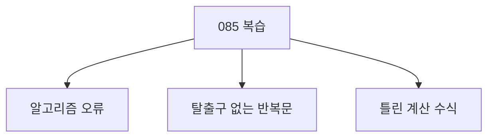

# 085 단위 테스트로 발견 가능한 오류

작성 기준일: 2026-06-01
검색/보강일: 2026-06-01
과목: `2과목 소프트웨어 개발`
기준 PDF: `/Users/nes0903/Documents/study/정보처리기사/핵심요약집_2026_정보처리기사필기핵심요약.pdf`
PDF 확인 위치: `13페이지`
검색 보강: 단위 테스트와 화이트박스 테스트 용어를 참고하여 알고리즘, 반복문, 계산 수식 오류를 모듈 수준 결함으로 확장
주제별 검색 키워드: `unit testing algorithm error infinite loop wrong calculation`, `component testing unit testing module errors`

---

## 1. 한 줄 요약

- 단위 테스트는 모듈 내부 로직을 작은 단위로 확인하므로 알고리즘 오류, 종료되지 않는 반복문, 잘못된 계산 수식 같은 오류를 발견하는 데 적합하다.
- PDF 기준 핵심 항목은 `알고리즘 오류에 따른 원치 않는 결과`, `탈출구가 없는 반복문의 사용`, `틀린 계산 수식에 의한 잘못된 결과`이다.
- 시험에서는 단위 테스트가 모듈 내부의 논리 오류를 조기에 잡는다는 점과 연결한다.

---

## 2. 한눈에 보는 구조

- 단위 테스트는 작은 단위의 내부 동작을 확인한다.
- 발견하기 쉬운 오류:
  - 알고리즘 설계가 잘못되어 결과가 틀리는 오류
  - 반복문 종료 조건이 없어 프로그램이 끝나지 않는 오류
  - 계산식이 잘못되어 수치 결과가 틀리는 오류
- 반대로 다음은 단위 테스트만으로 충분하지 않을 수 있다.
  - 모듈 간 인터페이스 오류
  - 실제 운영 환경 설정 문제
  - 사용자 수용성 문제

---

## 3. PDF 기준 핵심

- PDF 기준 발견 가능한 오류:
  - 알고리즘 오류에 따른 원치 않는 결과
  - 탈출구가 없는 반복문의 사용
  - 틀린 계산 수식에 의한 잘못된 결과
- 표현별 의미:
  - 알고리즘 오류: 절차나 조건 판단이 잘못되어 결과가 의도와 다르게 나오는 오류
  - 탈출구 없는 반복문: 종료 조건이 없거나 잘못되어 반복이 끝나지 않는 오류
  - 틀린 계산 수식: 수식, 연산자, 우선순위, 단위 변환 등이 잘못된 오류

---

## 4. 검색으로 보강한 관점

- ISTQB의 component testing/unit testing 관점에서는 작은 컴포넌트나 모듈의 동작을 확인하는 것이 핵심이다.
- 작은 단위에서 테스트하면 다음 장점이 있다.
  - 오류 위치를 빨리 찾을 수 있다.
  - 알고리즘 결과를 예상값과 비교하기 쉽다.
  - 반복문과 조건문의 경계 상황을 확인하기 쉽다.
- PDF 항목은 단위 테스트에서 특히 잘 드러나는 내부 로직 오류를 대표로 제시한 것이다.

---

## 5. 개념 설명

- 알고리즘 오류:
  - 정렬 결과가 오름차순이 아닌 경우
  - 할인 계산 로직이 잘못된 조건을 적용하는 경우
  - 검색 로직이 존재하는 값을 찾지 못하는 경우
- 탈출구가 없는 반복문:
  - 반복 조건이 항상 참이다.
  - 반복문 내부에서 종료 조건에 영향을 주는 값이 갱신되지 않는다.
  - 특정 입력에서만 종료 조건에 도달하지 못한다.
- 틀린 계산 수식:
  - 곱셈과 덧셈 우선순위를 잘못 적용한다.
  - 퍼센트 계산에서 `10%`를 `10`으로 처리한다.
  - 평균 계산에서 분모를 잘못 사용한다.
  - 반올림, 절사, 단위 변환을 잘못 처리한다.

---

## 6. 시험 포인트

- PDF 항목을 그대로 외운다.
  - 알고리즘 오류에 따른 원치 않는 결과
  - 탈출구가 없는 반복문의 사용
  - 틀린 계산 수식에 의한 잘못된 결과
- 오답 단서:
  - 사용자 요구사항 수용 여부
  - 모듈 간 인터페이스 불일치
  - 시스템 전체 성능 병목
  - 운영 환경 배포 실패
  - 이런 항목은 다른 테스트 수준과 더 직접적으로 연결된다.
- 연결:
  - 084 단위 테스트는 모듈/컴포넌트에 초점을 맞춘다.
  - 085는 그 단위에서 발견 가능한 내부 로직 오류를 제시한다.

---

## 7. 헷갈리는 비교

| 오류 유형 | 가장 직접적인 테스트 수준 | 이유 |
|---|---|---|
| 알고리즘 오류 | 단위 테스트 | 모듈 내부 로직 문제 |
| 탈출구 없는 반복문 | 단위 테스트 | 코드의 반복 구조 문제 |
| 틀린 계산 수식 | 단위 테스트 | 함수/모듈 계산 결과 문제 |
| 모듈 간 데이터 전달 오류 | 통합 테스트 | 모듈 결합부 문제 |
| 사용자 요구 미충족 | 인수 테스트 | 사용자 수용 관점 문제 |

- 단위 테스트는 작은 단위의 내부 오류에 강하다.
- 통합 테스트는 모듈과 모듈이 만나는 부분의 오류에 강하다.

---

## 8. 예시 또는 암기 포인트

- 암기 문장:
  - `단위 테스트 오류는 알고리즘, 무한 반복, 계산 수식.`
- 예시:
  - 정렬 함수가 `2 4 5`가 아니라 `2 5 4`를 반환한다.
  - 반복문에서 카운터가 증가하지 않아 종료되지 않는다.
  - `price * discount / 100`을 잘못 작성해 할인 금액이 틀린다.
- 문제풀이 팁:
  - 보기에서 `알고리즘`, `반복문`, `계산 수식`이 나오면 단위 테스트 오류로 연결한다.

---

## 9. 빠른 복습

- 단위 테스트로 알고리즘 오류에 따른 원치 않는 결과를 찾을 수 있다.
- 탈출구가 없는 반복문 사용도 단위 테스트로 발견할 수 있다.
- 틀린 계산 수식에 의한 잘못된 결과도 단위 테스트 대상이다.
- 이 항목들은 모듈 내부 로직 오류라는 공통점이 있다.

---

## 10. 참고 링크

- [기준 PDF: 핵심요약집_2026_정보처리기사필기핵심요약](/Users/nes0903/Documents/study/정보처리기사/핵심요약집_2026_정보처리기사필기핵심요약.pdf)
- [Q-Net 정보처리기사 종목별 상세정보](https://www.q-net.or.kr/crf005.do?id=crf00503&jmCd=1320)
- [ISTQB Glossary - Component Testing](https://istqb-glossary.page/component-testing/)
- [ISTQB Glossary - White-Box Testing](https://istqb-glossary.page/white-box-testing/)
