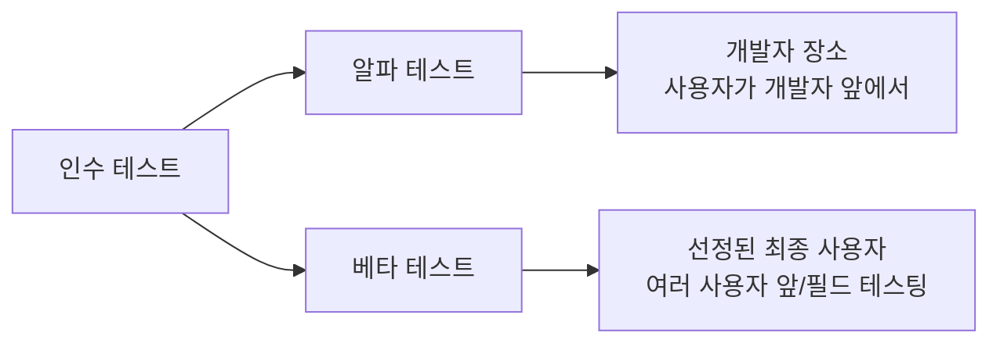
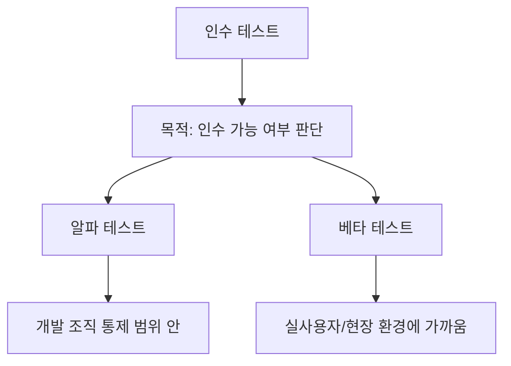
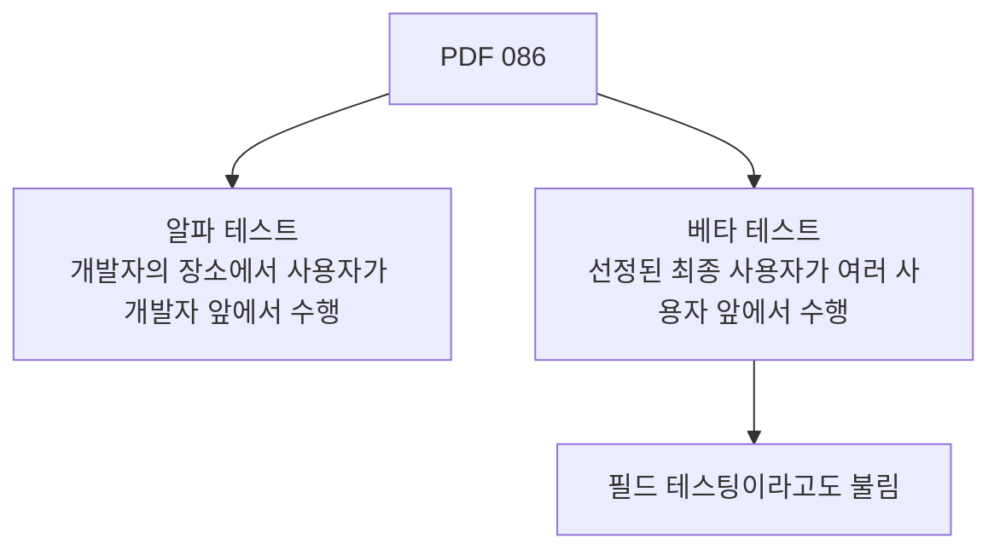
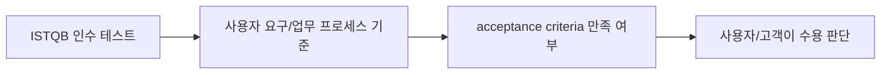
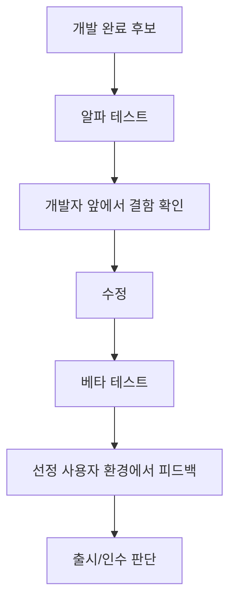
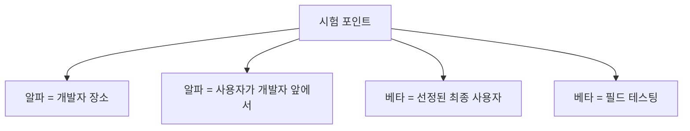
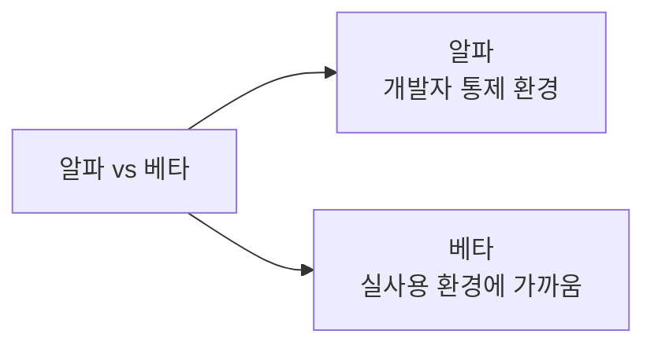
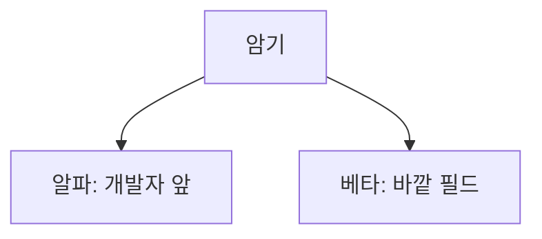
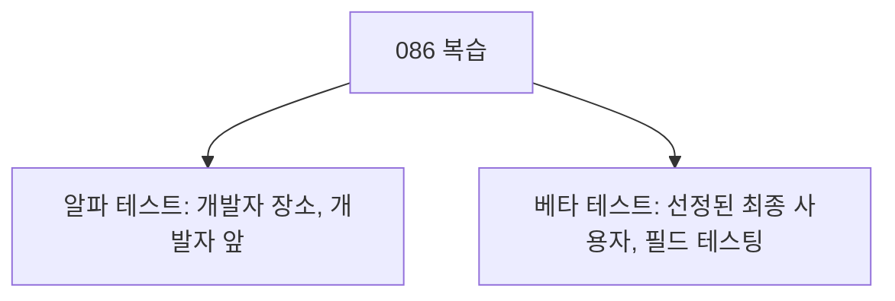

# 086 인수 테스트의 종류

작성 기준일: 2026-06-01
검색/보강일: 2026-06-01
과목: `2과목 소프트웨어 개발`
기준 PDF: `/Users/nes0903/Documents/study/정보처리기사/핵심요약집_2026_정보처리기사필기핵심요약.pdf`
PDF 확인 위치: `14페이지`
검색 보강: ISTQB 인수 테스트 설명을 참고하여 알파 테스트와 베타 테스트의 장소·사용자·목적 차이를 확장
주제별 검색 키워드: `ISTQB acceptance testing alpha beta testing`, `alpha testing beta testing field testing`

---

## 1. 한 줄 요약

- 인수 테스트는 사용자가 시스템을 받아들일 수 있는지 판단하기 위해 수행하는 테스트이며, PDF 기준 종류는 `알파 테스트`와 `베타 테스트`이다.
- 알파 테스트는 개발자 장소에서 사용자가 개발자 앞에서 수행한다.
- 베타 테스트는 선정된 최종 사용자가 실제 사용 환경에 가까운 조건에서 수행하며 `필드 테스팅`이라고도 한다.

---

## 2. 한눈에 보는 구조

- 인수 테스트의 초점:
  - 사용자 요구사항을 만족하는가?
  - 실제 업무에 사용할 수 있는가?
  - 출시 또는 납품을 받아들일 수 있는가?
- 알파와 베타의 가장 큰 차이:
  - 알파: 개발자 통제 환경
  - 베타: 실제 사용자 환경에 가까운 외부 환경
- 정보처리기사에서는 인수 테스트 전체 정의보다 알파/베타 구분이 자주 나온다.

---

## 3. PDF 기준 핵심

| 종류 | PDF 기준 설명 | 시험 단서 |
|---|---|---|
| 알파 테스트 | 개발자의 장소에서 사용자가 개발자 앞에서 행하는 테스트 기법 | 개발자 장소, 개발자 앞 |
| 베타 테스트 | 선정된 최종 사용자가 여러 명의 사용자 앞에서 행하는 테스트 기법 | 최종 사용자, 필드 테스팅 |

- PDF 표현에서 중요한 부분:
  - 알파는 `개발자의 장소`가 핵심이다.
  - 베타는 `선정된 최종 사용자`와 `필드 테스팅`이 핵심이다.
- 시험에서는 `개발자 앞`과 `필드`가 보기에서 바뀌어 나올 수 있다.

---

## 4. 검색으로 보강한 관점

- ISTQB는 인수 테스트를 사용자 요구, 요구사항, 비즈니스 프로세스 기준으로 시스템 수용 여부를 판단하는 테스트로 설명한다.
- 알파/베타 테스트는 인수 테스트의 대표적인 형태로 이해할 수 있다.
- 보강 관점:
  - 알파는 출시 전 내부 통제 환경에서 빠른 피드백을 얻는다.
  - 베타는 외부 사용 환경에서 실제 사용성, 호환성, 잔여 결함을 확인한다.
- 시험 답안은 PDF의 장소와 수행자 표현을 우선한다.

---

## 5. 개념 설명

- 알파 테스트:
  - 제품이 외부로 나가기 전 개발 조직이 통제할 수 있는 환경에서 수행한다.
  - 사용자가 실제로 사용해 보지만 개발자가 곁에서 문제를 관찰하고 대응할 수 있다.
- 베타 테스트:
  - 제한된 실제 사용자에게 배포해 사용하게 한다.
  - 다양한 사용자 환경에서 문제를 발견할 수 있다.
  - 필드 테스팅이라고도 부른다.
- 두 테스트 모두 사용자 관점 피드백을 얻는다는 공통점이 있지만, 환경과 통제 수준이 다르다.

---

## 6. 시험 포인트

- 핵심 암기:
  - 알파 테스트: 개발자의 장소, 개발자 앞
  - 베타 테스트: 선정된 최종 사용자, 필드 테스팅
- 오답 함정:
  - 알파를 필드 테스팅이라고 설명하면 틀린다.
  - 베타를 개발자 장소에서 개발자 앞에서 수행한다고 설명하면 틀린다.
  - 단위 테스트나 통합 테스트와 혼동하지 않는다.

---

## 7. 헷갈리는 비교

| 구분 | 알파 테스트 | 베타 테스트 |
|---|---|---|
| 장소 | 개발자의 장소 | 사용자 환경에 가까운 현장 |
| 수행자 | 사용자가 개발자 앞에서 | 선정된 최종 사용자 |
| 통제 수준 | 높음 | 낮음 |
| 별칭 | 일반적으로 알파 | 필드 테스팅 |
| 목적 | 출시 전 내부 피드백 | 실제 사용자 피드백 |

- `개발자 앞`이면 알파, `필드`면 베타다.
- 둘 다 인수 테스트 종류라는 점을 함께 기억한다.

---

## 8. 예시 또는 암기 포인트

- 암기 문장:
  - `알파는 안에서, 베타는 밖에서.`
  - `알파는 개발자 앞, 베타는 필드.`
- 예시:
  - 알파: 사내 테스트실에서 사용자가 개발자에게 문제를 말하며 테스트한다.
  - 베타: 선정된 사용자들이 실제 환경에서 앱을 써 보고 피드백을 보낸다.

---

## 9. 빠른 복습

- 인수 테스트 종류는 알파 테스트와 베타 테스트다.
- 알파 테스트는 개발자의 장소에서 사용자가 개발자 앞에서 수행한다.
- 베타 테스트는 선정된 최종 사용자가 수행하며 필드 테스팅이라고도 한다.

---

## 10. 참고 링크

- [기준 PDF: 핵심요약집_2026_정보처리기사필기핵심요약](/Users/nes0903/Documents/study/정보처리기사/핵심요약집_2026_정보처리기사필기핵심요약.pdf)
- [Q-Net 정보처리기사 종목별 상세정보](https://www.q-net.or.kr/crf005.do?id=crf00503&jmCd=1320)
- [ISTQB Glossary - Acceptance Testing](https://istqb-glossary.page/acceptance-testing/)

<!-- study-links:start -->
## 관련 문서

- `단위 테스트`: [[정보처리기사/2과목 소프트웨어 개발/084 단위 테스트(Unit Test)/084 단위 테스트(Unit Test)|084 단위 테스트(Unit Test)]]
- `통합 테스트`: [[정보처리기사/2과목 소프트웨어 개발/087 통합 테스트(Integration Test)/087 통합 테스트(Integration Test)|087 통합 테스트(Integration Test)]]
<!-- study-links:end -->
