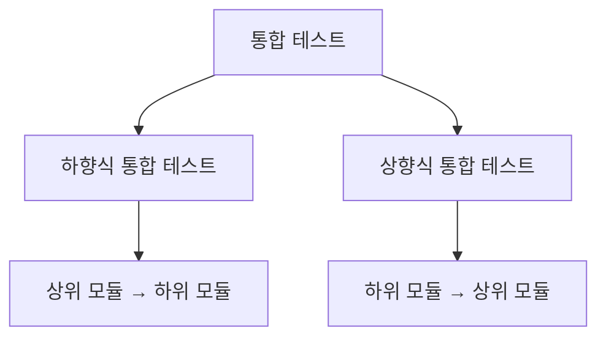
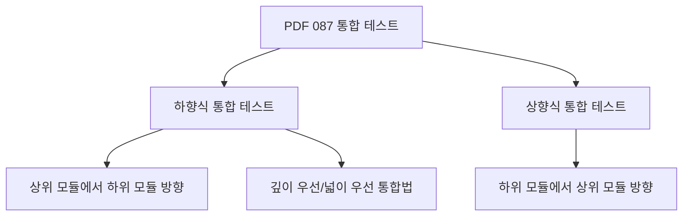
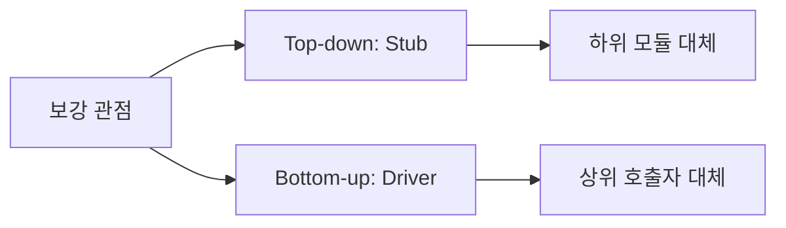
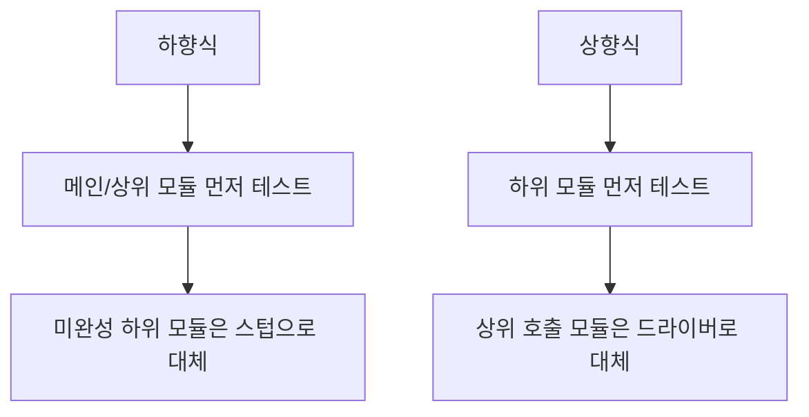
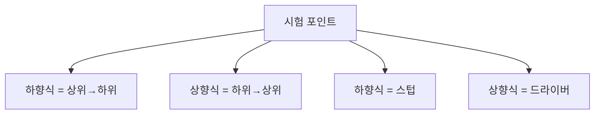
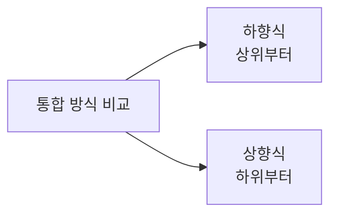
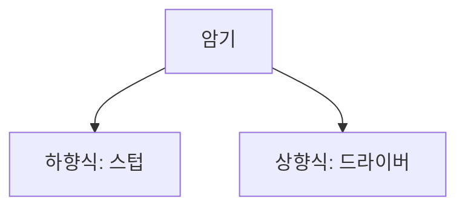
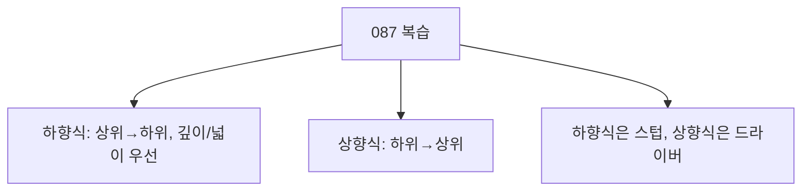

# 087 통합 테스트(Integration Test)

작성 기준일: 2026-06-01
검색/보강일: 2026-06-01
과목: `2과목 소프트웨어 개발`
기준 PDF: `/Users/nes0903/Documents/study/정보처리기사/핵심요약집_2026_정보처리기사필기핵심요약.pdf`
PDF 확인 위치: `14페이지`
검색 보강: 통합 테스트의 상향식/하향식 접근과 스텁·드라이버 사용 자료를 참고하여 PDF 항목을 확장
주제별 검색 키워드: `top down bottom up integration testing stub driver`, `integration testing top-down bottom-up`

---

## 1. 한 줄 요약

- 통합 테스트는 개별 모듈을 결합하면서 모듈 간 인터페이스와 상호작용 오류를 찾는 테스트이다.
- PDF 기준 종류는 `하향식 통합 테스트`와 `상향식 통합 테스트`이다.
- 시험에서는 방향과 보조 도구를 함께 외운다.
  - 하향식: 상위에서 하위 방향, 스텁 사용
  - 상향식: 하위에서 상위 방향, 드라이버 사용

---

## 2. 한눈에 보는 구조

- 통합 테스트의 목적:
  - 모듈 사이의 호출 관계 확인
  - 데이터 전달 형식 확인
  - 인터페이스 오류 발견
  - 단위 테스트에서 찾기 어려운 결합 오류 발견
- 통합 방향:
  - 위에서 아래로 통합하면 하향식이다.
  - 아래에서 위로 통합하면 상향식이다.
- 통합 테스트는 단위 테스트 이후에 수행되는 테스트 수준으로 이해한다.

---

## 3. PDF 기준 핵심

| 종류 | PDF 기준 설명 | 시험 단서 |
|---|---|---|
| 하향식 통합 테스트 | 프로그램의 상위 모듈에서 하위 모듈 방향으로 통합하며 테스트, 깊이 우선 또는 넓이 우선 통합법 사용 | 상위→하위, 깊이/넓이 우선 |
| 상향식 통합 테스트 | 프로그램의 하위 모듈에서 상위 모듈 방향으로 통합하며 테스트 | 하위→상위 |

- PDF에서 하향식 설명에는 `깊이 우선 통합법`과 `넓이 우선 통합법`이 함께 나온다.
- 상향식은 하위 모듈부터 상위 모듈로 올라간다는 방향이 핵심이다.

---

## 4. 검색으로 보강한 관점

- 통합 테스트 보강 자료에서는 하향식 테스트에서 아직 준비되지 않은 하위 모듈을 스텁으로 대체한다고 설명한다.
- 상향식 테스트에서는 상위 모듈이 아직 없을 때 하위 모듈을 호출할 드라이버가 필요하다.
- PDF의 088, 089와 연결:
  - 테스트 드라이버는 상향식 통합 테스트에 사용된다.
  - 테스트 스텁은 하향식 통합 테스트에 사용된다.

---

## 5. 개념 설명

- 하향식 통합 테스트:
  - 상위 제어 흐름을 먼저 확인할 수 있다.
  - 사용자 관점의 큰 흐름을 빨리 확인할 수 있다.
  - 하위 모듈이 준비되지 않았으면 스텁이 필요하다.
- 상향식 통합 테스트:
  - 하위 모듈의 기능을 먼저 안정화한다.
  - 하위 모듈을 묶어 점차 상위 모듈과 통합한다.
  - 상위 모듈이 없으면 테스트 드라이버가 필요하다.
- 통합 테스트의 핵심은 모듈 하나의 내부 로직이 아니라 모듈 사이의 연결이다.

---

## 6. 시험 포인트

- 반드시 외울 방향:
  - 하향식: 상위 모듈에서 하위 모듈 방향
  - 상향식: 하위 모듈에서 상위 모듈 방향
- 반드시 연결할 도구:
  - 하향식 통합 테스트: 테스트 스텁
  - 상향식 통합 테스트: 테스트 드라이버
- 함정:
  - 스텁과 드라이버의 사용 위치를 바꿔 내는 문제가 흔하다.
  - 하향식은 깊이 우선 또는 넓이 우선 통합법이 가능하다.

---

## 7. 헷갈리는 비교

| 구분 | 하향식 통합 테스트 | 상향식 통합 테스트 |
|---|---|---|
| 방향 | 상위 → 하위 | 하위 → 상위 |
| 보조 모듈 | 스텁 | 드라이버 |
| 확인이 빠른 부분 | 상위 제어 흐름 | 하위 세부 기능 |
| PDF 단서 | 깊이 우선, 넓이 우선 | 하위 모듈 방향 시작 |

- `상위`가 먼저면 하향식, `하위`가 먼저면 상향식이다.
- 스텁은 하위 모듈을 흉내 내고, 드라이버는 상위 호출자를 흉내 낸다.

---

## 8. 예시 또는 암기 포인트

- 암기 문장:
  - `하향식은 스텁, 상향식은 드라이버.`
  - `위에서 내려가면 하향식, 아래에서 올라가면 상향식.`
- 예시:
  - 메인 메뉴부터 결제 상세 모듈로 내려가며 테스트하면 하향식이다.
  - 결제 계산 모듈, 쿠폰 모듈 같은 하위 기능을 먼저 묶고 상위 주문 모듈로 올라가면 상향식이다.

---

## 9. 빠른 복습

- 통합 테스트는 모듈을 결합하면서 테스트한다.
- 하향식 통합 테스트는 상위 모듈에서 하위 모듈 방향으로 진행한다.
- 상향식 통합 테스트는 하위 모듈에서 상위 모듈 방향으로 진행한다.
- 하향식에는 스텁, 상향식에는 드라이버가 연결된다.

---

## 10. 참고 링크

- [기준 PDF: 핵심요약집_2026_정보처리기사필기핵심요약](/Users/nes0903/Documents/study/정보처리기사/핵심요약집_2026_정보처리기사필기핵심요약.pdf)
- [Q-Net 정보처리기사 종목별 상세정보](https://www.q-net.or.kr/crf005.do?id=crf00503&jmCd=1320)
- [GeeksforGeeks - Difference between Top Down and Bottom Up Integration Testing](https://www.geeksforgeeks.org/software-engineering/difference-between-top-down-and-bottom-up-integration-testing/)
