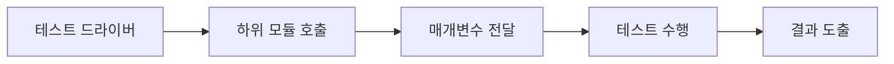
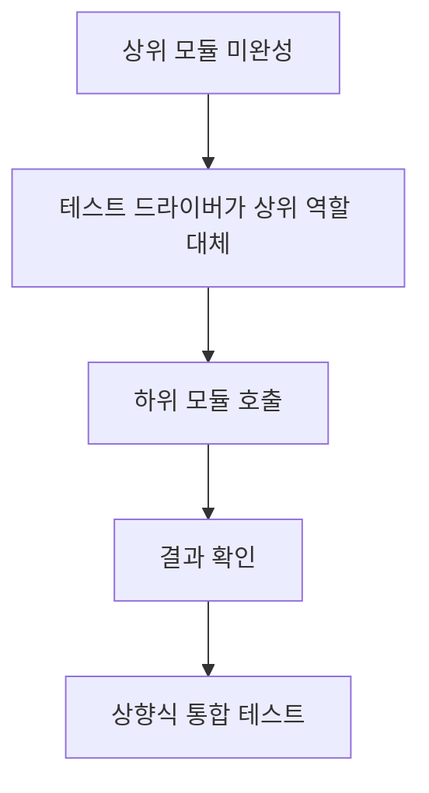
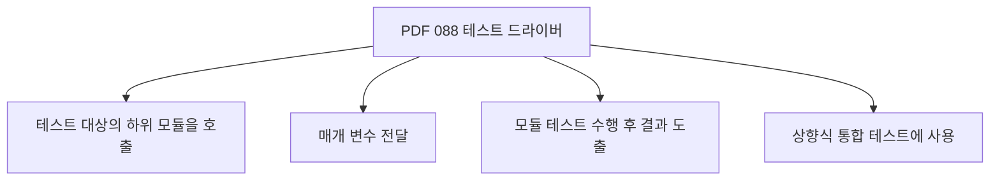
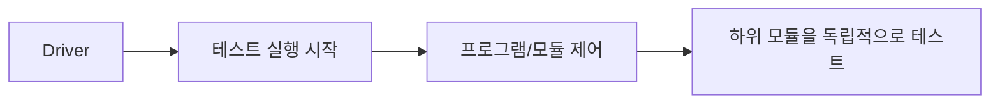
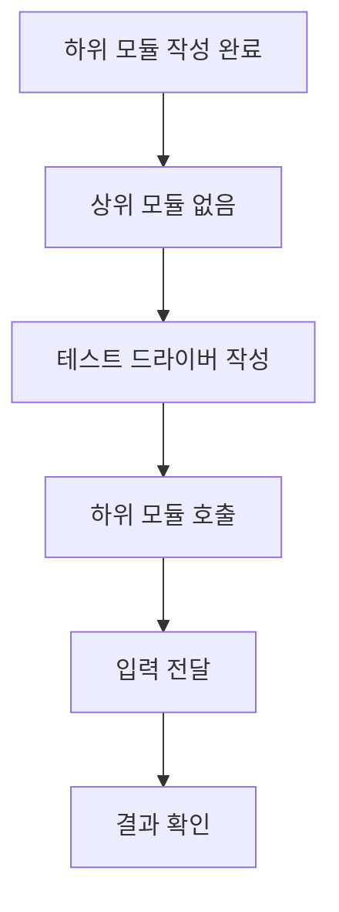
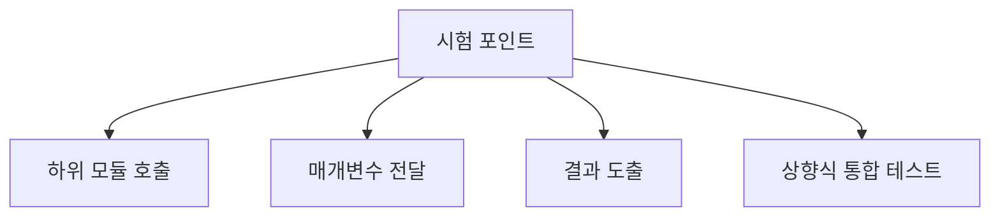
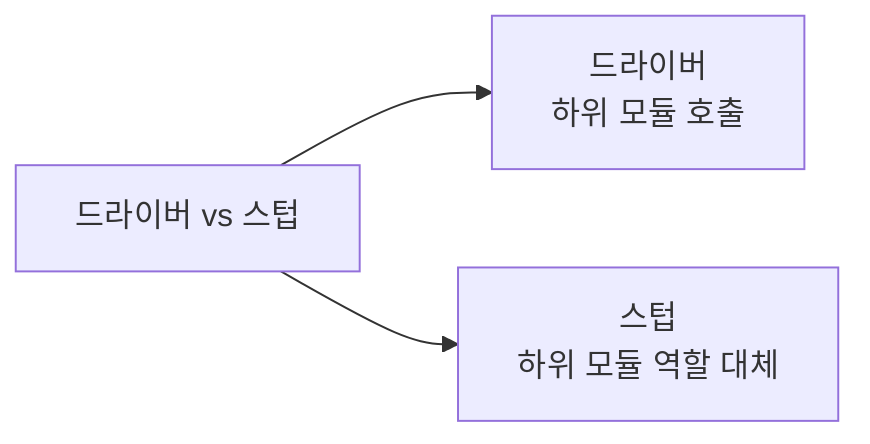
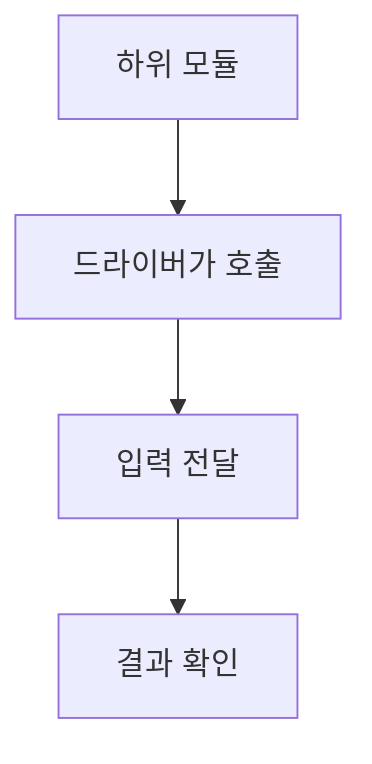
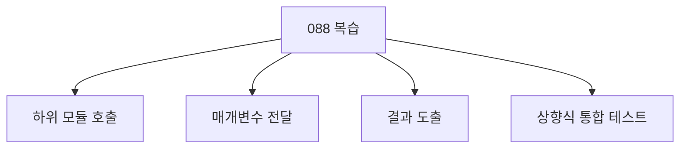

# 088 테스트 드라이버(Test Driver)

작성 기준일: 2026-06-01
검색/보강일: 2026-06-01
과목: `2과목 소프트웨어 개발`
기준 PDF: `/Users/nes0903/Documents/study/정보처리기사/핵심요약집_2026_정보처리기사필기핵심요약.pdf`
PDF 확인 위치: `14페이지`
검색 보강: 통합 테스트 보조 모듈 자료를 참고하여 테스트 드라이버의 호출자 역할과 상향식 통합 테스트 연결을 확장
주제별 검색 키워드: `test driver software testing bottom-up integration`, `test driver calls lower module parameter result`

---

## 1. 한 줄 요약

- 테스트 드라이버는 테스트 대상 하위 모듈을 호출하고 필요한 매개변수를 전달해 결과를 확인하는 시험용 호출 모듈이다.
- PDF 기준 핵심은 `하위 모듈 호출`, `매개변수 전달`, `결과 도출`, `상향식 통합 테스트에 사용`이다.
- 시험에서는 테스트 스텁과 반대로 외운다.

---

## 2. 한눈에 보는 구조

- 테스트 드라이버가 필요한 이유:
  - 하위 모듈은 만들어졌지만 이를 호출할 상위 모듈이 아직 없을 수 있다.
  - 이때 드라이버가 상위 모듈처럼 하위 모듈을 호출한다.
- 주요 기능:
  - 테스트 대상 모듈 호출
  - 입력값 또는 매개변수 전달
  - 반환값 또는 실행 결과 수집
  - 테스트 결과 출력
- 상향식 통합 테스트에서 하위 모듈을 먼저 검증하기 위해 사용한다.

---

## 3. PDF 기준 핵심

- PDF 핵심:
  - 테스트 대상의 하위 모듈을 호출하는 도구이다.
  - 매개 변수(Parameter)를 전달한다.
  - 모듈 테스트 수행 후의 결과를 도출한다.
  - 상향식 통합 테스트에 사용된다.
- PDF 표현에서 시험 단서:
  - 하위 모듈 호출
  - 매개 변수 전달
  - 결과 도출
  - 상향식

---

## 4. 검색으로 보강한 관점

- 테스트 드라이버는 테스트 대상 모듈을 실행시키는 제어 프로그램 성격을 가진다.
- 상향식 통합 테스트에서는 하위 모듈들이 먼저 존재하므로, 이를 호출해 줄 상위 역할이 필요하다.
- 드라이버는 실제 운영 코드가 아니라 테스트를 위해 만든 보조 코드라는 점이 중요하다.

---

## 5. 개념 설명

- 예시:
  - `calculateTax(amount)` 하위 함수가 있다.
  - 아직 주문 처리 상위 모듈은 완성되지 않았다.
  - 테스트 드라이버가 `calculateTax(10000)`을 호출한다.
  - 반환된 세금 계산 결과가 예상값과 같은지 확인한다.
- 드라이버의 역할:
  - 실제 상위 모듈처럼 테스트 대상 모듈을 호출한다.
  - 테스트 입력값을 넣는다.
  - 결과를 출력하거나 비교한다.
- 사용 위치:
  - 상향식 통합 테스트
  - 하위 모듈을 먼저 개발하고 검증하는 경우

---

## 6. 시험 포인트

- 반드시 외울 내용:
  - 드라이버는 테스트 대상의 하위 모듈을 호출한다.
  - 드라이버는 매개변수를 전달하고 결과를 도출한다.
  - 드라이버는 상향식 통합 테스트에 사용된다.
- 오답 함정:
  - 하향식 통합 테스트에 사용된다고 하면 스텁과 바뀐 설명이다.
  - 하위 모듈 역할을 대신한다고 하면 스텁에 가까운 설명이다.

---

## 7. 헷갈리는 비교

| 구분 | 테스트 드라이버 | 테스트 스텁 |
|---|---|---|
| 역할 | 하위 모듈을 호출하는 상위 역할 | 호출되는 하위 모듈 역할 |
| 사용 테스트 | 상향식 통합 테스트 | 하향식 통합 테스트 |
| 핵심 단서 | 매개변수 전달, 결과 도출 | 필요한 조건만 가진 시험용 모듈 |
| 방향 | 아래 모듈을 테스트하기 위해 위 역할 수행 | 위 모듈 테스트를 위해 아래 역할 수행 |

- 드라이버는 `운전한다`는 느낌으로 모듈을 실행시키는 쪽이다.
- 스텁은 아직 없는 하위 모듈을 대신하는 쪽이다.

---

## 8. 예시 또는 암기 포인트

- 암기 문장:
  - `드라이버는 상향식에서 하위 모듈을 호출한다.`
- 예시:
  - 결제 계산 모듈을 먼저 만들었다.
  - 주문 전체 모듈은 아직 없다.
  - 드라이버가 결제 계산 모듈을 호출해 테스트한다.

---

## 9. 빠른 복습

- 테스트 드라이버는 테스트 대상 하위 모듈을 호출한다.
- 매개변수를 전달하고 결과를 도출한다.
- 상향식 통합 테스트에 사용된다.
- 스텁과 사용 방향을 반드시 구분한다.

---

## 10. 참고 링크

- [기준 PDF: 핵심요약집_2026_정보처리기사필기핵심요약](/Users/nes0903/Documents/study/정보처리기사/핵심요약집_2026_정보처리기사필기핵심요약.pdf)
- [Q-Net 정보처리기사 종목별 상세정보](https://www.q-net.or.kr/crf005.do?id=crf00503&jmCd=1320)
- [Wikipedia - Test driver](https://en.wikipedia.org/wiki/Test_driver_(software))
- [GeeksforGeeks - Top Down and Bottom Up Integration Testing](https://www.geeksforgeeks.org/software-engineering/difference-between-top-down-and-bottom-up-integration-testing/)
