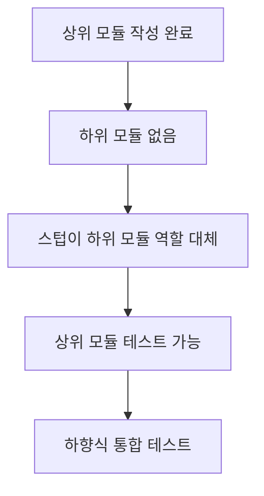
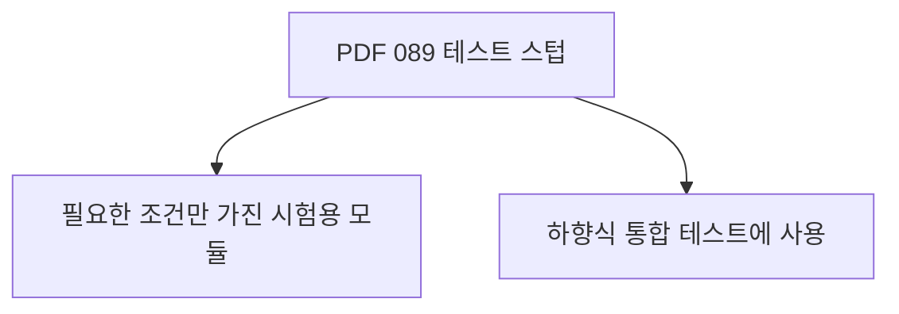
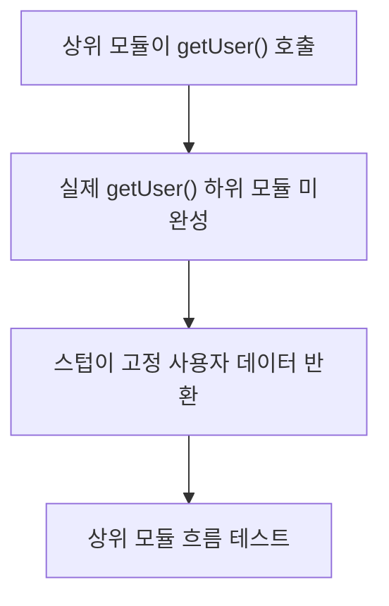
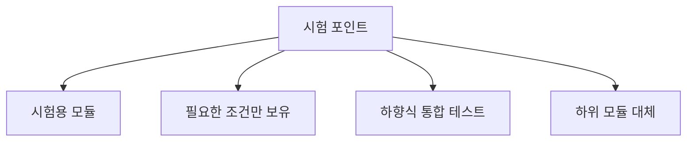
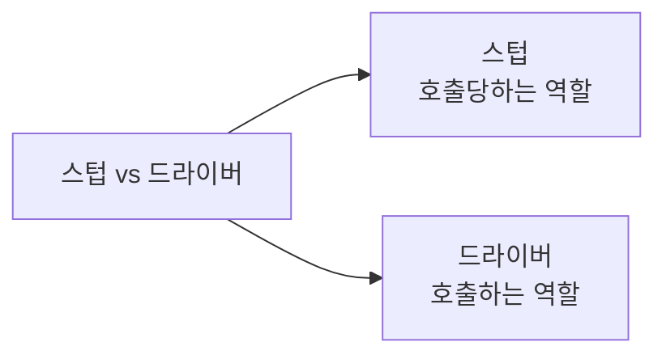
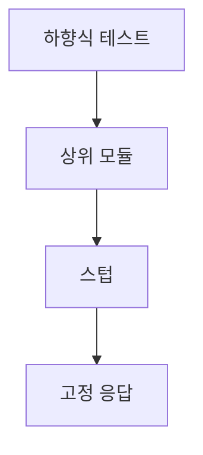
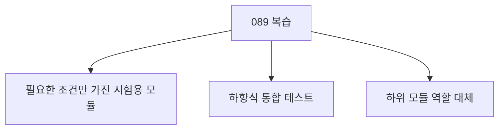

# 089 테스트 스텁(Test Stub)

작성 기준일: 2026-06-01
검색/보강일: 2026-06-01
과목: `2과목 소프트웨어 개발`
기준 PDF: `/Users/nes0903/Documents/study/정보처리기사/핵심요약집_2026_정보처리기사필기핵심요약.pdf`
PDF 확인 위치: `14페이지`
검색 보강: ISTQB stub 용어와 통합 테스트 자료를 참고하여 스텁의 하위 모듈 대체 역할을 확장
주제별 검색 키워드: `test stub top-down integration testing`, `stub predefined responses test double`

---

## 1. 한 줄 요약

- 테스트 스텁은 하향식 통합 테스트에서 아직 완성되지 않은 하위 모듈을 대신하기 위해 필요한 조건만 갖춘 시험용 모듈이다.
- PDF 기준 핵심은 `필요한 조건만 가지고 있는 시험용 모듈`과 `하향식 통합 테스트에 사용`이다.
- 시험에서는 테스트 드라이버와 반대로 외운다.

---

## 2. 한눈에 보는 구조

- 스텁이 필요한 이유:
  - 상위 모듈은 하위 모듈을 호출해야 한다.
  - 하위 모듈이 아직 개발되지 않았으면 테스트가 막힌다.
  - 스텁이 하위 모듈의 최소 동작을 흉내 내면 상위 모듈 테스트를 계속할 수 있다.
- 스텁은 실제 완성 모듈이 아니다.
  - 필요한 입력을 받는다.
  - 정해진 값을 반환한다.
  - 상위 모듈의 흐름을 테스트할 수 있게 돕는다.

---

## 3. PDF 기준 핵심

- PDF 핵심:
  - 필요한 조건만을 가지고 있는 시험용 모듈이다.
  - 하향식 통합 테스트에 사용된다.
- 시험 단서:
  - 시험용 모듈
  - 필요한 조건만
  - 하향식
  - 하위 모듈 대체

---

## 4. 검색으로 보강한 관점

- ISTQB 계열 용어에서 stub은 미리 정의된 응답을 제공하는 테스트 더블로 설명된다.
- 통합 테스트에서는 아직 개발되지 않은 하위 모듈을 대신하는 역할로 이해한다.
- 정보처리기사에서는 `test double`보다 `하향식 통합 테스트에서 쓰는 시험용 하위 모듈`로 기억하는 것이 더 직접적이다.

---

## 5. 개념 설명

- 예시:
  - 주문 화면 상위 모듈이 재고 조회 하위 모듈을 호출해야 한다.
  - 재고 조회 모듈은 아직 없다.
  - 스텁이 `재고 있음`이라는 고정 응답을 반환한다.
  - 주문 화면의 다음 흐름을 테스트할 수 있다.
- 스텁의 특징:
  - 실제 기능 전체를 구현하지 않는다.
  - 테스트에 필요한 최소 조건만 제공한다.
  - 상위 모듈의 흐름과 호출 로직을 확인하게 한다.

---

## 6. 시험 포인트

- 반드시 외울 내용:
  - 스텁은 필요한 조건만 가진 시험용 모듈이다.
  - 스텁은 하향식 통합 테스트에 사용된다.
- 오답 함정:
  - 상향식 통합 테스트에 사용된다고 하면 드라이버와 바뀐 설명이다.
  - 하위 모듈을 호출하는 도구라고 하면 드라이버 설명이다.

---

## 7. 헷갈리는 비교

| 구분 | 테스트 스텁 | 테스트 드라이버 |
|---|---|---|
| 역할 | 하위 모듈 역할 대체 | 하위 모듈 호출 |
| 사용 방식 | 상위 모듈이 스텁을 호출 | 드라이버가 하위 모듈을 호출 |
| 통합 방식 | 하향식 | 상향식 |
| 핵심 단서 | 시험용 모듈, 필요한 조건 | 매개변수 전달, 결과 도출 |

- 스텁은 `아래쪽 빈자리를 채움`으로 기억한다.
- 드라이버는 `아래 모듈을 실행시킴`으로 기억한다.

---

## 8. 예시 또는 암기 포인트

- 암기 문장:
  - `스텁은 하향식에서 하위 모듈을 대신한다.`
- 예시:
  - 결제 화면은 완성되었지만 실제 PG 연동 모듈은 아직 없다.
  - 스텁이 `결제 성공` 응답을 반환해 결제 화면 흐름을 테스트한다.

---

## 9. 빠른 복습

- 테스트 스텁은 필요한 조건만 가진 시험용 모듈이다.
- 하향식 통합 테스트에 사용된다.
- 아직 없는 하위 모듈을 대신한다.
- 드라이버와 사용 방향을 반드시 구분한다.

---

## 10. 참고 링크

- [기준 PDF: 핵심요약집_2026_정보처리기사필기핵심요약](/Users/nes0903/Documents/study/정보처리기사/핵심요약집_2026_정보처리기사필기핵심요약.pdf)
- [Q-Net 정보처리기사 종목별 상세정보](https://www.q-net.or.kr/crf005.do?id=crf00503&jmCd=1320)
- [Lexicon for ISTQB - Stub](https://istqb.missionwares.com/glossary/stub.html)
- [GeeksforGeeks - Top Down and Bottom Up Integration Testing](https://www.geeksforgeeks.org/software-engineering/difference-between-top-down-and-bottom-up-integration-testing/)
