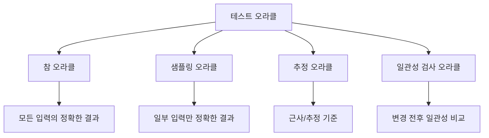
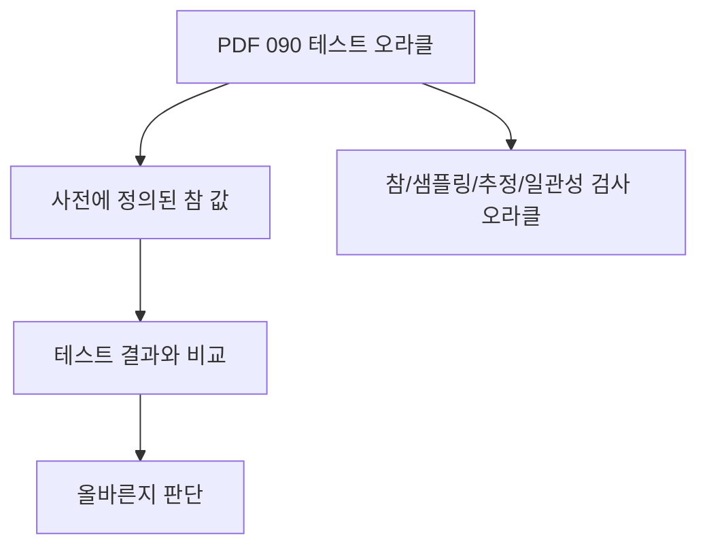
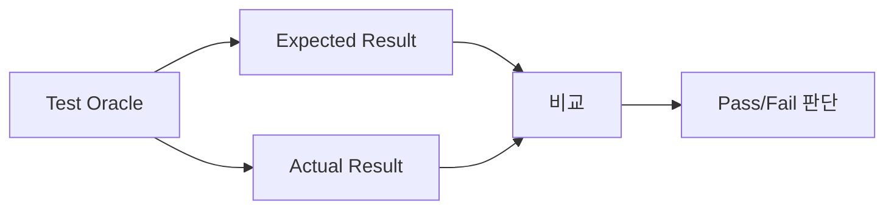
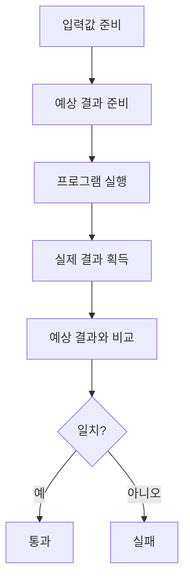
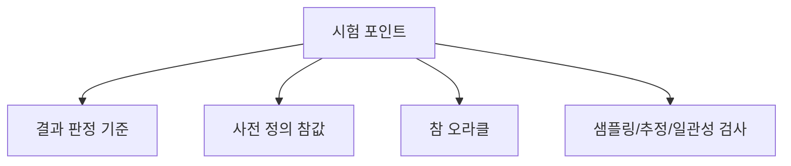
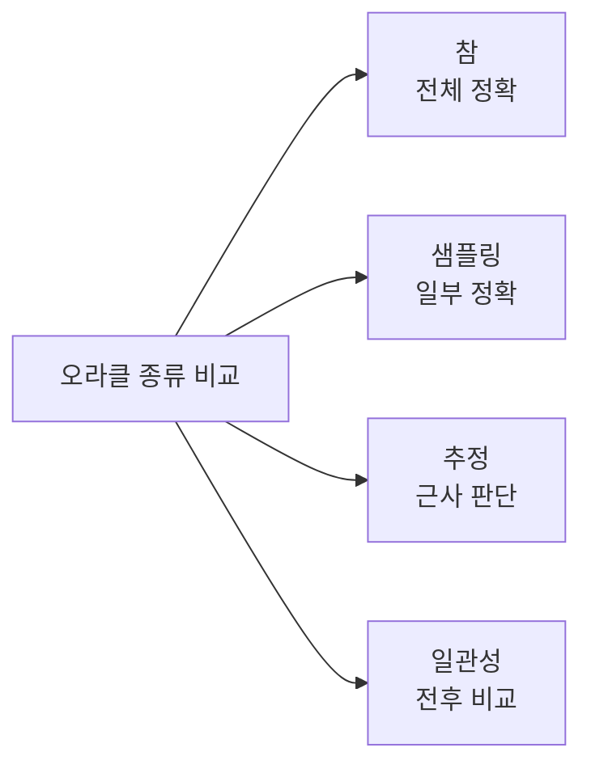
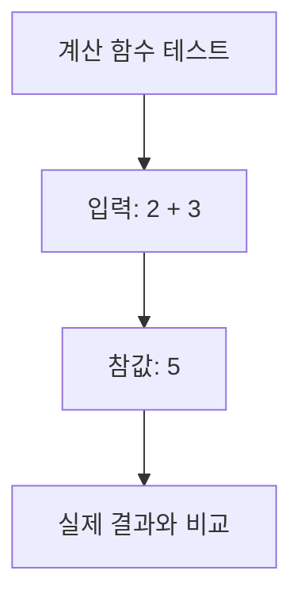
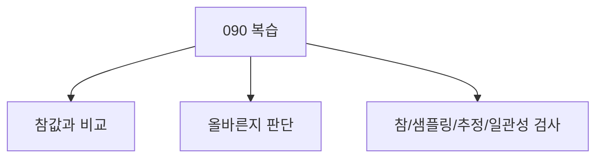

# 090 테스트 오라클(Test Oracle)

작성 기준일: 2026-06-01
검색/보강일: 2026-06-01
과목: `2과목 소프트웨어 개발`
기준 PDF: `/Users/nes0903/Documents/study/정보처리기사/핵심요약집_2026_정보처리기사필기핵심요약.pdf`
PDF 확인 위치: `14페이지`
검색 보강: ISTQB test oracle 용어를 참고하여 테스트 결과 판정 기준과 네 가지 오라클 종류를 확장
주제별 검색 키워드: `test oracle true sampling heuristic consistent oracle`, `ISTQB test oracle expected result`

---

## 1. 한 줄 요약

- 테스트 오라클은 테스트 결과가 올바른지 판단하기 위해 사전에 정의된 참값이나 판단 기준과 실제 결과를 비교하는 기법 및 활동이다.
- PDF 기준 종류는 `참 오라클`, `샘플링 오라클`, `추정 오라클`, `일관성 검사 오라클`이다.
- 시험에서는 오라클이 테스트를 실행하는 도구가 아니라 결과의 옳고 그름을 판정하는 기준이라는 점을 잡는다.

---

## 2. 한눈에 보는 구조

- 테스트는 실행만으로 끝나지 않는다.
  - 실제 결과가 맞는지 판단해야 한다.
  - 이 판단 기준이 테스트 오라클이다.
- 오라클 종류는 정확한 참값을 얼마나 제공할 수 있는지, 어떤 방식으로 판정하는지에 따라 나뉜다.
- PDF의 네 종류는 그대로 암기해야 한다.

---

## 3. PDF 기준 핵심

- PDF 핵심:
  - 테스트 결과가 올바른지 판단하기 위해 사전에 정의된 참 값을 대입하여 비교하는 기법 및 활동이다.
  - 종류:
    - 참 오라클
    - 샘플링 오라클
    - 추정 오라클
    - 일관성 검사 오라클
- 중요한 단서:
  - 참값
  - 비교
  - 올바른지 판단
  - 네 가지 종류

---

## 4. 검색으로 보강한 관점

- ISTQB 계열 용어에서 test oracle은 기대 결과를 결정하거나 실제 결과와 비교해 판정하는 근거로 이해할 수 있다.
- 보강 관점:
  - 오라클이 없으면 테스트 결과가 나와도 맞는지 틀린지 판단하기 어렵다.
  - 자동화 테스트에서는 예상값, 규칙, 참조 구현, 이전 버전 결과 등이 오라클 역할을 할 수 있다.
- 정보처리기사에서는 PDF의 네 종류와 정의가 핵심이다.

---

## 5. 개념 설명

- 참 오라클:
  - 모든 입력값에 대해 정확한 기대 결과를 알고 있는 경우다.
  - 가장 이상적이지만 비용이 크다.
- 샘플링 오라클:
  - 전체 입력 중 일부 샘플에 대해서만 정확한 결과를 알고 있다.
  - 모든 경우를 검증하기 어려울 때 사용한다.
- 추정 오라클:
  - 정확한 결과 대신 근사값이나 추정값을 기준으로 판단한다.
  - 수치 계산, AI 결과, 복잡한 시뮬레이션에서 활용될 수 있다.
- 일관성 검사 오라클:
  - 이전 결과와 현재 결과의 일관성을 비교한다.
  - 회귀 테스트나 버전 변경 검증과 연결된다.

---

## 6. 시험 포인트

- 반드시 암기:
  - 테스트 오라클은 결과가 올바른지 판단하는 기법 및 활동이다.
  - 사전에 정의된 참값과 비교한다.
  - 종류는 참, 샘플링, 추정, 일관성 검사 오라클이다.
- 오답 함정:
  - 테스트 오라클을 테스트 데이터를 생성하는 도구로만 설명한다.
  - 테스트 드라이버나 스텁과 혼동한다.
  - 종류에 블랙박스 테스트 기법을 섞는다.

---

## 7. 헷갈리는 비교

| 종류 | 핵심 의미 | 시험 단서 |
|---|---|---|
| 참 오라클 | 모든 입력의 기대 결과를 정확히 앎 | 모든 결과, 정확한 참값 |
| 샘플링 오라클 | 일부 입력에 대해서만 참값 제공 | 샘플, 일부 |
| 추정 오라클 | 근사값 또는 추정으로 판단 | 추정, 근사 |
| 일관성 검사 오라클 | 변경 전후 결과 일관성 확인 | 일관성, 회귀 |

- 오라클은 실행 보조 모듈이 아니라 판정 기준이다.
- 드라이버/스텁은 테스트 실행을 돕고, 오라클은 결과 판정을 돕는다.

---

## 8. 예시 또는 암기 포인트

- 암기 문장:
  - `오라클은 테스트 결과의 정답지다.`
- 예시:
  - 세금 계산 함수에서 예상 세금 금액을 미리 계산해 둔다.
  - 실제 함수 결과와 비교한다.
  - 다르면 결함 가능성이 있다.

---

## 9. 빠른 복습

- 테스트 오라클은 테스트 결과가 올바른지 판단하는 기준이다.
- 사전에 정의된 참값을 대입해 비교한다.
- 종류는 참 오라클, 샘플링 오라클, 추정 오라클, 일관성 검사 오라클이다.

---

## 10. 참고 링크

- [기준 PDF: 핵심요약집_2026_정보처리기사필기핵심요약](/Users/nes0903/Documents/study/정보처리기사/핵심요약집_2026_정보처리기사필기핵심요약.pdf)
- [Q-Net 정보처리기사 종목별 상세정보](https://www.q-net.or.kr/crf005.do?id=crf00503&jmCd=1320)
- [Lexicon for ISTQB - Test oracle](https://istqb.missionwares.com/glossary/test-oracle.html)

<!-- study-links:start -->
## 관련 문서

- `테스트 드라이버`: [[정보처리기사/2과목 소프트웨어 개발/088 테스트 드라이버(Test Driver)/088 테스트 드라이버(Test Driver)|088 테스트 드라이버(Test Driver)]]
<!-- study-links:end -->
