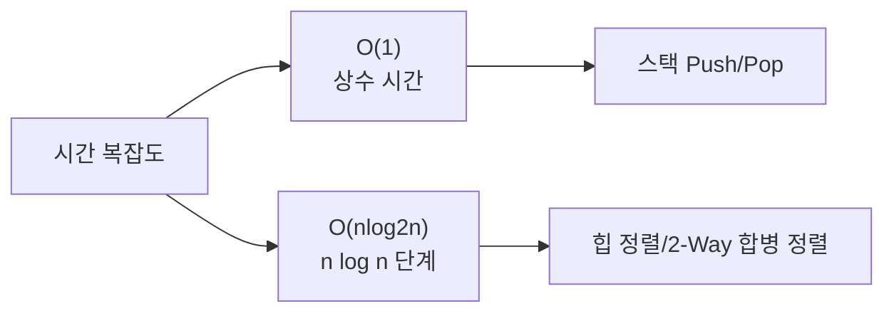
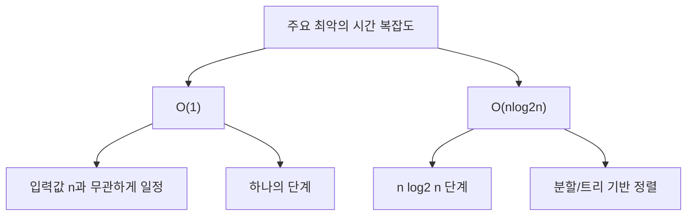
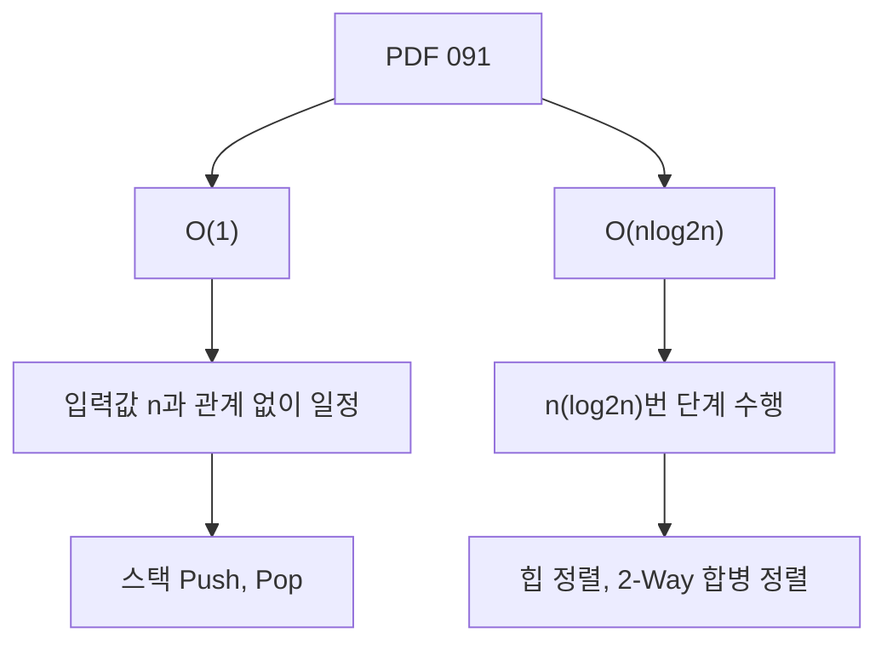
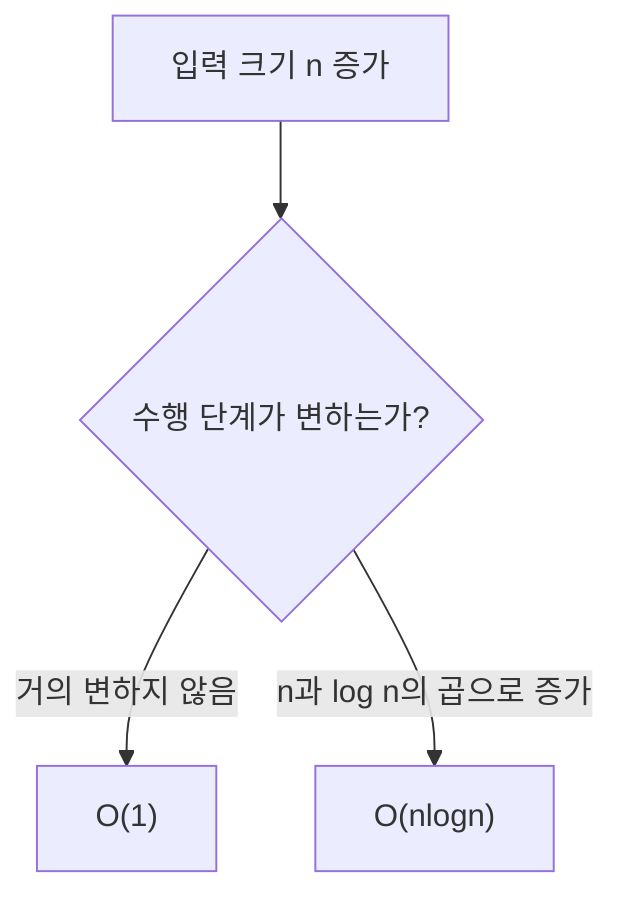
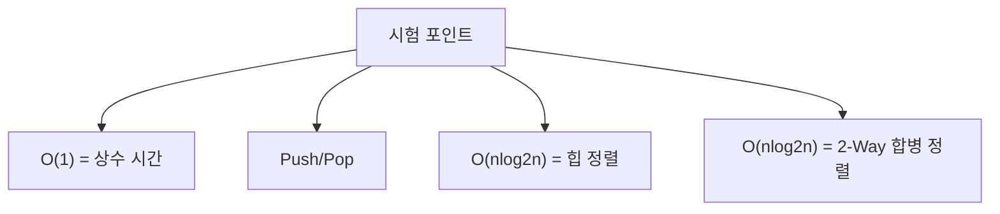
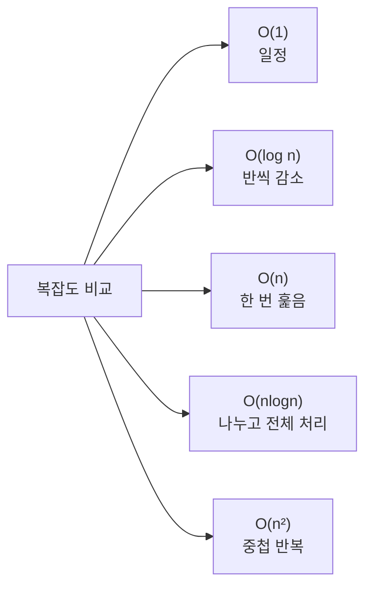
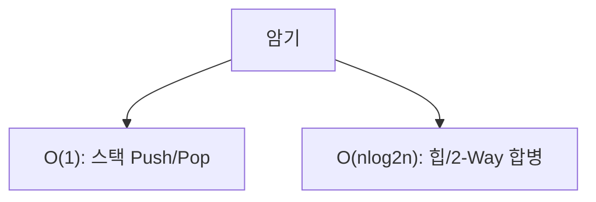
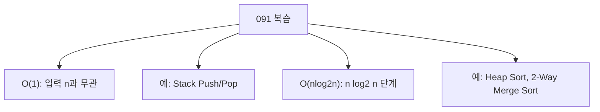

# 091 주요 최악의 시간 복잡도

작성 기준일: 2026-06-01
검색/보강일: 2026-06-01
과목: `2과목 소프트웨어 개발`
기준 PDF: `/Users/nes0903/Documents/study/정보처리기사/핵심요약집_2026_정보처리기사필기핵심요약.pdf`
PDF 확인 위치: `14페이지`
검색 보강: NIST DADS의 Big-O, heapsort, merge sort 설명을 참고하여 O(1)과 O(nlog2n)의 의미를 확장
주제별 검색 키워드: `NIST DADS big O notation`, `heap sort O(n log n)`, `merge sort O(n log n)`

---

## 1. 한 줄 요약

- 시간 복잡도는 입력 크기 `n`이 커질 때 알고리즘 수행 시간이 어떻게 증가하는지 나타내는 표기이다.
- PDF 기준 핵심은 `O(1)`과 `O(nlog2n)`의 의미와 예시이다.
- 시험에서는 표기와 예시를 매칭한다.
  - `O(1)`: 스택의 삽입(Push), 삭제(Pop)
  - `O(nlog2n)`: 힙 정렬, 2-Way 합병 정렬

---

## 2. 한눈에 보는 구조

- 최악의 시간 복잡도:
  - 입력 중 가장 불리한 경우에 걸리는 시간을 나타낸다.
  - 시험에서는 대표 알고리즘과 연결해 출제된다.
- Big-O 표기:
  - 큰 입력에서 증가 양상을 표현한다.
  - 상수나 낮은 차수 항은 보통 생략한다.
- PDF는 두 항목만 제시한다.
  - `O(1)`
  - `O(nlog2n)`

---

## 3. PDF 기준 핵심

| 표기 | PDF 기준 의미 | PDF 예시 |
|---|---|---|
| `O(1)` | 입력값 `n`에 관계 없이 일정하게 문제 해결에 하나의 단계만 거침 | 스택의 삽입(Push), 삭제(Pop) |
| `O(nlog2n)` | 문제 해결에 필요한 단계가 `n(log2n)`번만큼 수행됨 | 힙 정렬, 2-Way 합병 정렬 |

- PDF 표기 `log2n`은 밑이 2인 로그를 의미한다.
- 정보처리기사 문제에서는 보통 `O(n log n)`과 같은 의미로 이해해도 된다.
- 예시 매칭이 중요하다.

---

## 4. 검색으로 보강한 관점

- NIST DADS는 Big-O를 입력 크기 `n`에 따른 알고리즘 수행 시간 또는 메모리의 이론적 척도로 설명한다.
- NIST DADS의 heapsort 항목은 힙 정렬의 실행 시간이 `O(n log n)`임을 제시한다.
- 합병 정렬도 일반적으로 분할과 병합 과정을 통해 `O(n log n)`으로 설명된다.
- 시험에서는 이론 증명보다 PDF의 의미와 예시를 빠르게 매칭하는 것이 중요하다.

---

## 5. 개념 설명

- `O(1)`:
  - 입력 데이터가 10개든 100만 개든 수행 단계가 거의 일정하다.
  - 스택의 맨 위에 push/pop을 수행하면 전체 데이터를 훑을 필요가 없다.
- `O(nlog2n)`:
  - `log2n`은 데이터를 반으로 나누는 단계 수와 연결해서 이해할 수 있다.
  - 각 단계에서 전체 데이터 `n`을 처리하면 `nlog2n`이 된다.
  - 힙 정렬과 2-Way 합병 정렬의 대표적인 최악 시간 복잡도로 외운다.
- `최악`이라는 말:
  - 알고리즘이 마주할 수 있는 가장 불리한 입력에서의 상한을 의미한다.
  - 평균이나 최선과 다를 수 있다.

---

## 6. 시험 포인트

- 반드시 외울 매칭:
  - `O(1)` → 스택 삽입(Push), 삭제(Pop)
  - `O(nlog2n)` → 힙 정렬, 2-Way 합병 정렬
- 오답 함정:
  - 스택 Push/Pop을 `O(n)`으로 고르는 실수
  - 힙 정렬과 2-Way 합병 정렬을 `O(n²)`로 고르는 실수
  - `log2n`의 2를 곱셈으로 오해하는 실수

---

## 7. 헷갈리는 비교

| 표기 | 느낌 | 대표 예시 |
|---|---|---|
| `O(1)` | 입력 크기와 무관하게 일정 | 스택 Push/Pop |
| `O(log n)` | 반씩 줄어듦 | 이분 검색 |
| `O(n)` | 전체를 한 번 훑음 | 순차 검색 |
| `O(nlogn)` | 분할 단계마다 전체 처리 | 힙 정렬, 합병 정렬 |
| `O(n²)` | 이중 반복 | 삽입/선택/버블 정렬 평균·최악 |

- PDF 091의 직접 범위는 `O(1)`과 `O(nlog2n)`이다.
- 비교표는 다른 알고리즘과 헷갈리지 않기 위한 보강이다.

---

## 8. 예시 또는 암기 포인트

- 암기 문장:
  - `스택 Push/Pop은 O(1), 힙과 2-Way 합병은 O(nlogn).`
- 예시:
  - 스택 top에 데이터를 넣는 것은 위치가 정해져 있으므로 상수 시간이다.
  - 합병 정렬은 반씩 나누는 단계가 `log2n`, 각 단계의 병합 비용이 `n`으로 이해할 수 있다.

---

## 9. 빠른 복습

- `O(1)`은 입력값 `n`과 관계없이 일정한 단계로 해결된다.
- PDF 예시는 스택의 삽입(Push), 삭제(Pop)이다.
- `O(nlog2n)`은 `n(log2n)` 단계가 수행된다.
- PDF 예시는 힙 정렬과 2-Way 합병 정렬이다.

---

## 10. 참고 링크

- [기준 PDF: 핵심요약집_2026_정보처리기사필기핵심요약](/Users/nes0903/Documents/study/정보처리기사/핵심요약집_2026_정보처리기사필기핵심요약.pdf)
- [Q-Net 정보처리기사 종목별 상세정보](https://www.q-net.or.kr/crf005.do?id=crf00503&jmCd=1320)
- [NIST DADS - big-O notation](https://xlinux.nist.gov/dads/HTML/bigOnotation.html)
- [NIST DADS - heapsort](https://xlinux.nist.gov/dads/HTML/heapSort.html)
- [NIST DADS - merge sort](https://xlinux.nist.gov/dads/HTML/mergeSort.html)

<!-- study-links:start -->
## 관련 문서

- `버블 정렬`: [[정보처리기사/2과목 소프트웨어 개발/068 버블 정렬(Bubble Sort)/068 버블 정렬(Bubble Sort)|068 버블 정렬(Bubble Sort)]]
- `이분 검색`: [[정보처리기사/2과목 소프트웨어 개발/069 이분 검색(이진 검색)/069 이분 검색(이진 검색)|069 이분 검색(이진 검색)]]
- `스택`: [[정보처리기사/2과목 소프트웨어 개발/057 스택(Stack)/057 스택(Stack)|057 스택(Stack)]]
<!-- study-links:end -->
