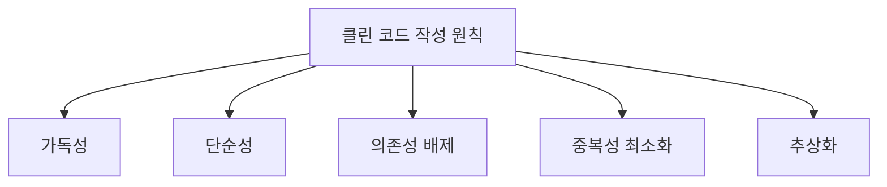
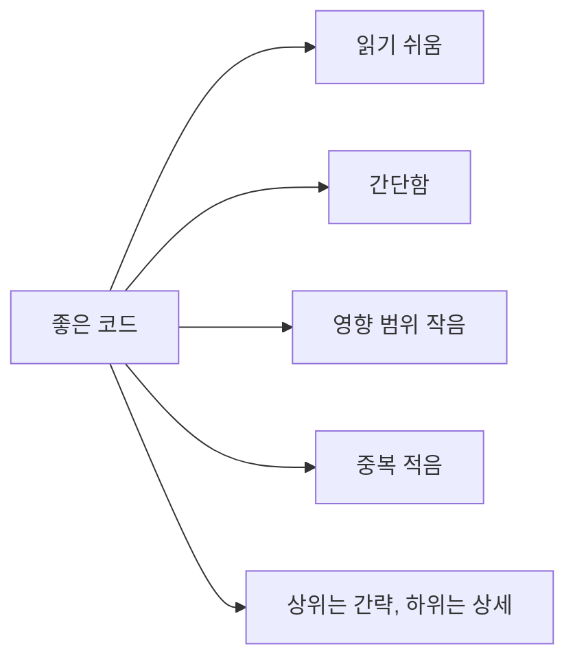
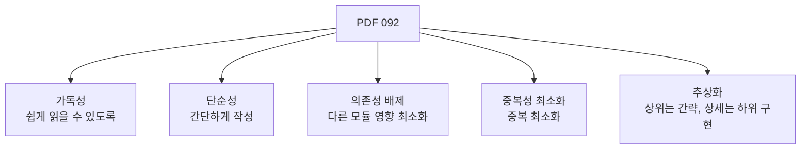
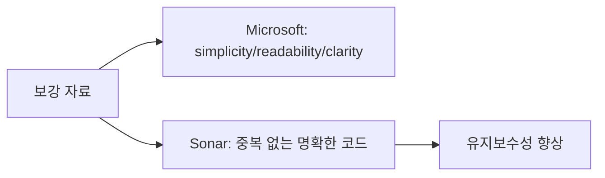
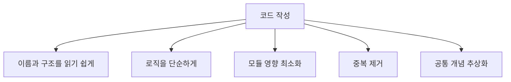
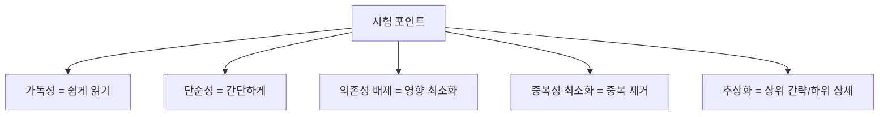
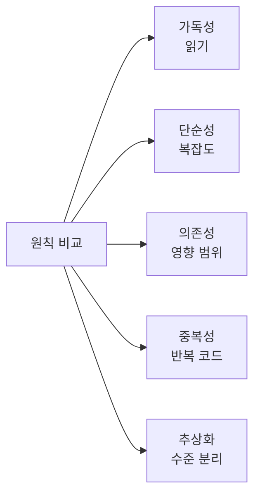
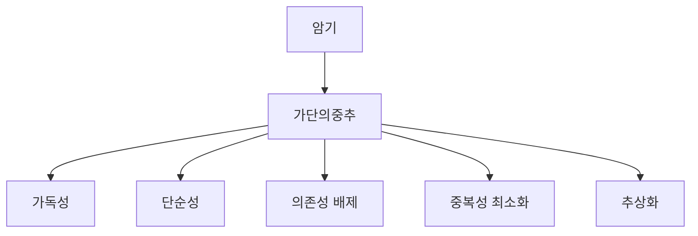
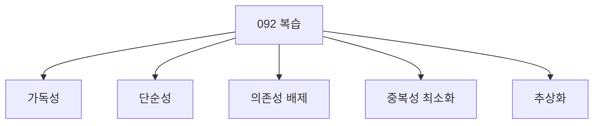

# 092 클린 코드 작성 원칙

작성 기준일: 2026-06-01
검색/보강일: 2026-06-01
과목: `2과목 소프트웨어 개발`
기준 PDF: `/Users/nes0903/Documents/study/정보처리기사/핵심요약집_2026_정보처리기사필기핵심요약.pdf`
PDF 확인 위치: `14페이지`
검색 보강: Microsoft의 좋은 코드 특성 설명과 SonarSource의 clean code 정의를 참고하여 PDF의 다섯 원칙을 확장
주제별 검색 키워드: `clean code principles readability simplicity dependency duplication abstraction`, `Microsoft good code readability simplicity clarity`, `Sonar clean code duplicate code`

---

## 1. 한 줄 요약

- 클린 코드는 읽기 쉽고 단순하며, 불필요한 의존성과 중복을 줄이고, 적절한 추상화로 유지보수하기 쉽게 작성한 코드이다.
- PDF 기준 작성 원칙은 `가독성`, `단순성`, `의존성 배제`, `중복성 최소화`, `추상화`이다.
- 시험에서는 각 원칙의 정의 문장을 정확히 매칭해야 한다.

---

## 2. 한눈에 보는 구조

- 클린 코드의 목적:
  - 개발자가 코드를 빨리 이해한다.
  - 변경 시 부작용을 줄인다.
  - 중복 수정 비용을 줄인다.
  - 상위 수준과 상세 구현을 분리한다.
- 클린 코드는 성능만 빠른 코드가 아니다.
  - 유지보수성
  - 이해 가능성
  - 변경 용이성
  - 결함 감소와 연결된다.

---

## 3. PDF 기준 핵심

| 원칙 | PDF 기준 설명 | 시험 단서 |
|---|---|---|
| 가독성 | 누구든지 코드를 쉽게 읽을 수 있도록 작성 | 읽기 쉬움 |
| 단순성 | 코드를 간단하게 작성 | 간단함 |
| 의존성 배제 | 코드가 다른 모듈에 미치는 영향을 최소화 | 영향 최소화, 결합 낮춤 |
| 중복성 최소화 | 코드의 중복을 최소화 | 반복 제거 |
| 추상화 | 상위 클래스/메소드/함수에서는 간략히 특성을 나타내고 상세 내용은 하위에서 구현 | 상위 간략, 하위 상세 |

- PDF의 `추상화` 설명은 특히 길어서 그대로 의미를 잡아야 한다.
- `의존성 배제`는 무조건 의존성이 0이라는 뜻이 아니라 다른 모듈에 미치는 영향을 줄이는 방향이다.

---

## 4. 검색으로 보강한 관점

- Microsoft 자료는 좋은 코드의 특성으로 단순성, 가독성, 명확성 등을 강조한다.
- SonarSource 자료는 clean code를 이해 가능하고, 중복이 적으며, 의도와 책임이 분명한 코드 관점으로 설명한다.
- 시험 보강 관점:
  - 클린 코드는 협업과 유지보수 비용을 줄이는 실무 원칙이다.
  - PDF의 다섯 항목은 유지보수성 향상을 위한 핵심 체크리스트로 볼 수 있다.

---

## 5. 개념 설명

- 가독성:
  - 변수명, 함수명, 구조가 의미를 드러내야 한다.
  - 한 번 읽고 의도를 이해할 수 있어야 한다.
- 단순성:
  - 불필요하게 복잡한 조건, 중첩, 우회 로직을 줄인다.
  - 단순한 해결책이 유지보수에 유리하다.
- 의존성 배제:
  - 한 모듈 변경이 다른 모듈에 과도하게 영향을 주지 않게 한다.
  - 인터페이스나 추상화를 통해 결합을 낮출 수 있다.
- 중복성 최소화:
  - 같은 로직이 여러 곳에 있으면 수정 누락 위험이 커진다.
  - 공통 함수나 공통 모듈로 정리한다.
- 추상화:
  - 상위 수준에서는 핵심 의도를 보여 준다.
  - 상세 구현은 하위 클래스, 메소드, 함수에서 담당한다.

---

## 6. 시험 포인트

- 원칙과 설명을 매칭한다.
- 오답 함정:
  - 가독성을 실행 속도 최적화로 설명한다.
  - 단순성을 기능을 줄이는 것으로만 설명한다.
  - 의존성 배제를 모듈을 전혀 사용하지 않는 것으로 설명한다.
  - 추상화를 상세 구현을 상위에 모두 작성하는 것으로 설명한다.
- 시험에서는 `상위 클래스/메소드/함수`와 `하위 클래스/메소드/함수` 표현이 나오면 추상화로 연결한다.

---

## 7. 헷갈리는 비교

| 원칙 | 줄이는 것 | 높이는 것 |
|---|---|---|
| 가독성 | 해석 비용 | 이해도 |
| 단순성 | 불필요한 복잡도 | 명확성 |
| 의존성 배제 | 변경 전파 | 독립성 |
| 중복성 최소화 | 반복 수정 | 재사용성 |
| 추상화 | 상세 노출 | 구조화 |

- 가독성은 읽는 사람의 부담을 줄인다.
- 단순성은 로직 자체의 복잡도를 줄인다.
- 의존성 배제는 변경 영향 범위를 줄인다.
- 중복성 최소화는 같은 코드 반복을 줄인다.
- 추상화는 상위 의도와 하위 구현을 분리한다.

---

## 8. 예시 또는 암기 포인트

- 암기 문장:
  - `클린 코드는 가단의중추.`
- 예시:
  - 가독성: `x`보다 `totalPrice`가 이해하기 쉽다.
  - 단순성: 복잡한 중첩 조건을 함수로 분리한다.
  - 의존성 배제: 결제 모듈이 배송 모듈 내부 구현에 직접 의존하지 않게 한다.
  - 중복성 최소화: 같은 검증 로직을 공통 함수로 모은다.
  - 추상화: 상위 함수는 주문 처리 흐름만 보이고 세부 계산은 하위 함수에서 처리한다.

---

## 9. 빠른 복습

- 클린 코드 작성 원칙은 가독성, 단순성, 의존성 배제, 중복성 최소화, 추상화다.
- 가독성은 쉽게 읽을 수 있게 하는 것이다.
- 단순성은 코드를 간단하게 작성하는 것이다.
- 의존성 배제는 다른 모듈에 미치는 영향을 최소화하는 것이다.
- 중복성 최소화는 코드 중복을 줄이는 것이다.
- 추상화는 상위에서는 간략히 특성을 나타내고 상세 내용은 하위에서 구현하는 것이다.

---

## 10. 참고 링크

- [기준 PDF: 핵심요약집_2026_정보처리기사필기핵심요약](/Users/nes0903/Documents/study/정보처리기사/핵심요약집_2026_정보처리기사필기핵심요약.pdf)
- [Q-Net 정보처리기사 종목별 상세정보](https://www.q-net.or.kr/crf005.do?id=crf00503&jmCd=1320)
- [Microsoft Learn Archive - What Makes Good Code Good?](https://learn.microsoft.com/en-us/archive/msdn-magazine/2004/july/%7B-end-bracket-%7D-what-makes-good-code-good)
- [SonarSource Docs - Clean Code definition](https://docs.sonarsource.com/sonarqube-server/10.8/core-concepts/clean-code/definition)
