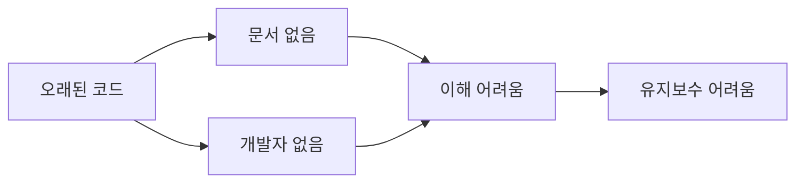
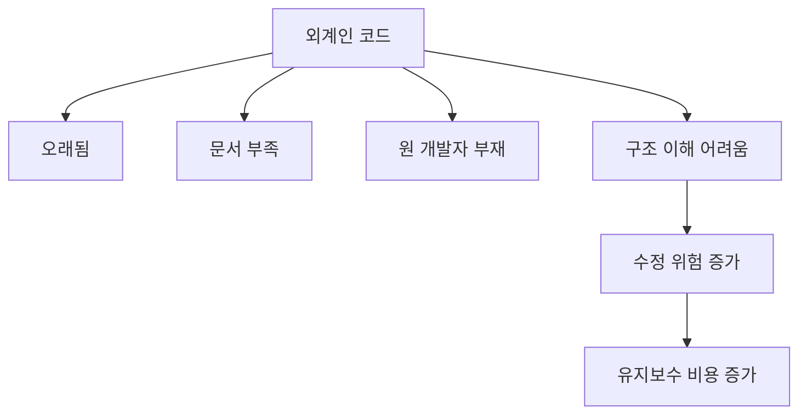
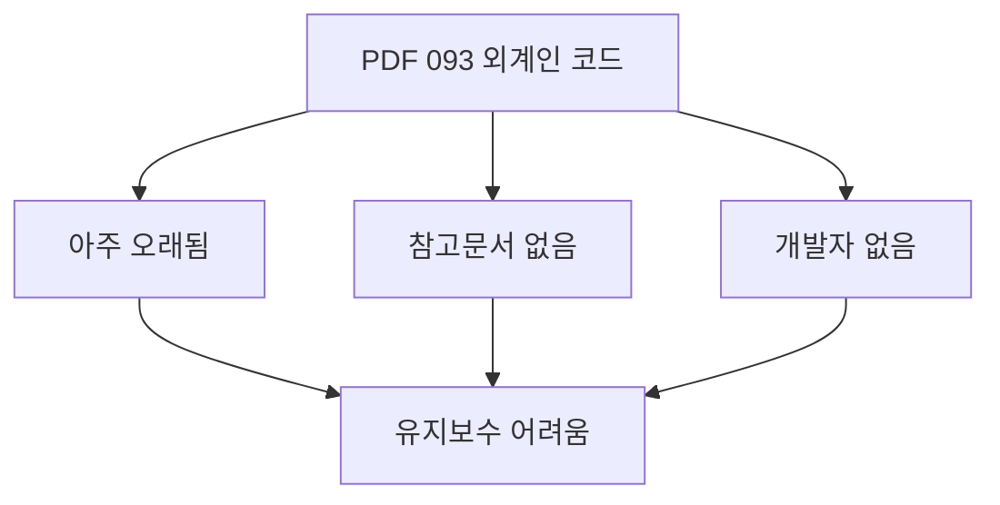
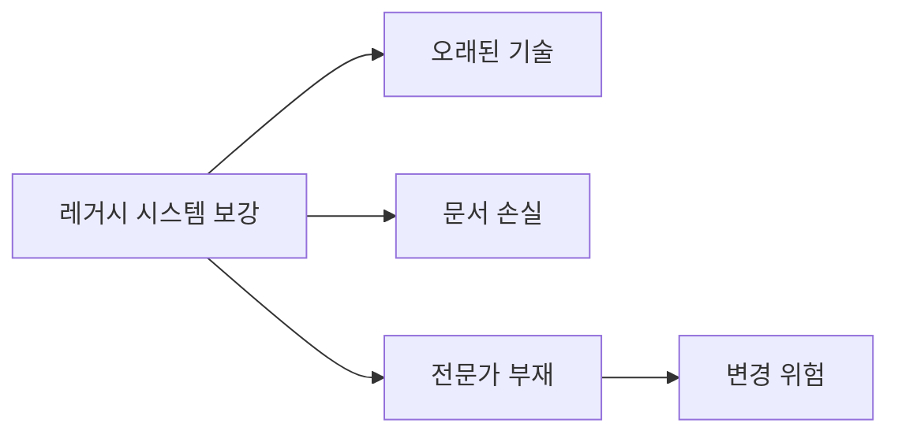
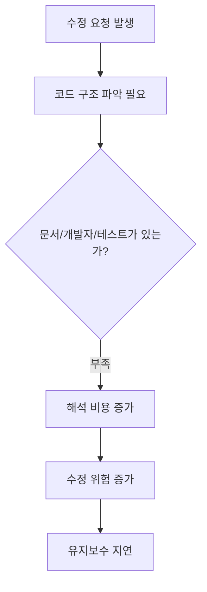
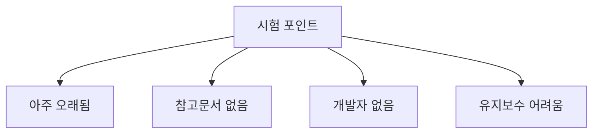
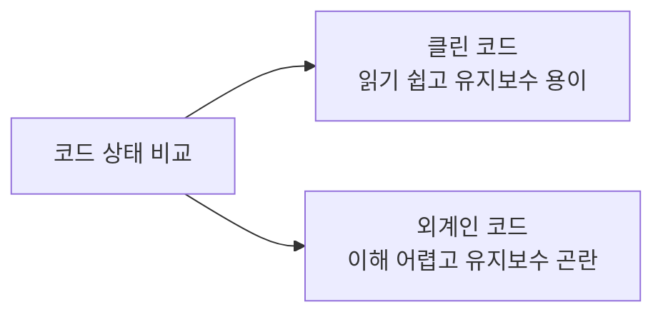
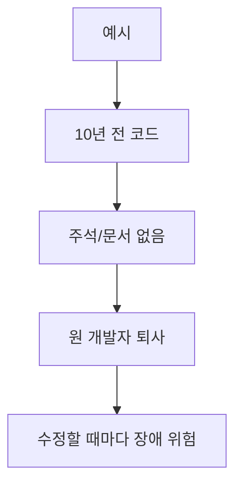

# 093 외계인 코드(Alien Code)

작성 기준일: 2026-06-01
검색/보강일: 2026-06-01
과목: `2과목 소프트웨어 개발`
기준 PDF: `/Users/nes0903/Documents/study/정보처리기사/핵심요약집_2026_정보처리기사필기핵심요약.pdf`
PDF 확인 위치: `14페이지`
검색 보강: 레거시 시스템과 문서 부족 코드의 유지보수 위험 설명을 참고하여 외계인 코드의 의미를 확장
주제별 검색 키워드: `alien code legacy code no documentation hard to maintain`, `legacy system old undocumented software hard to maintain`

---

## 1. 한 줄 요약

- 외계인 코드는 오래되었거나 참고문서와 개발자가 없어 구조를 이해하기 어렵고 유지보수하기 힘든 코드를 의미한다.
- PDF 기준 핵심은 `아주 오래되거나`, `참고문서 또는 개발자가 없거나`, `유지보수 작업이 어려운 코드`이다.
- 시험에서는 클린 코드와 반대되는 유지보수 곤란 코드로 이해하면 된다.

---

## 2. 한눈에 보는 구조

- 외계인 코드의 특징:
  - 작성된 지 오래되었다.
  - 사용 기술이 낡았다.
  - 참고 문서가 없다.
  - 원 개발자가 없다.
  - 테스트가 부족할 수 있다.
  - 수정 시 부작용을 예측하기 어렵다.
- 외계인 코드라는 표현은 시험 용어로, 실무에서는 레거시 코드 또는 이해하기 어려운 기존 코드와 연결해 이해할 수 있다.

---

## 3. PDF 기준 핵심

- PDF 핵심:
  - 아주 오래되거나 참고문서 또는 개발자가 없어 유지 보수 작업이 어려운 코드를 의미한다.
- 중요한 단서:
  - 오래된 코드
  - 참고문서 없음
  - 개발자 없음
  - 유지보수 어려움
- 시험에서는 `외계인 코드 = 유지보수 난이도가 높은 미지의 코드`로 기억한다.

---

## 4. 검색으로 보강한 관점

- 레거시 시스템 설명에서는 오래된 기술, 사라진 문서, 원 개발자 부재, 이해 부족이 유지보수 어려움으로 이어진다고 설명된다.
- 문서화되지 않은 기존 코드는 신규 개발자가 구조를 파악하는 데 큰 비용을 만든다.
- 외계인 코드는 단순히 오래된 코드만 뜻하지 않는다.
  - 오래되었어도 문서와 테스트가 잘 있으면 유지보수 가능하다.
  - 비교적 새 코드라도 문서와 담당자가 없고 구조가 난해하면 외계인 코드처럼 다뤄질 수 있다.

---

## 5. 개념 설명

- 유지보수가 어려운 이유:
  - 코드 의도를 알기 어렵다.
  - 어떤 기능이 어디서 처리되는지 찾기 어렵다.
  - 수정하면 어떤 부작용이 생길지 예측하기 어렵다.
  - 테스트가 부족하면 변경 후 정상 동작을 확인하기 어렵다.
- 외계인 코드의 위험:
  - 개발 비용 증가
  - 장애 가능성 증가
  - 신규 개발자 온보딩 지연
  - 기능 추가 속도 저하
- 대응 방향:
  - 현재 동작을 문서화한다.
  - 변경 전 테스트를 추가한다.
  - 작은 단위로 리팩터링한다.
  - 담당 지식을 공유한다.

---

## 6. 시험 포인트

- 반드시 외울 문장:
  - 외계인 코드는 아주 오래되거나 참고문서 또는 개발자가 없어 유지보수 작업이 어려운 코드다.
- 오답 함정:
  - 최신 기술로 작성된 코드라는 설명
  - 문서화가 잘 되어 유지보수가 쉬운 코드라는 설명
  - 성능이 무조건 빠른 코드라는 설명
  - 테스트 자동화가 잘 되어 있는 코드라는 설명
- 연결:
  - 092 클린 코드 작성 원칙과 반대되는 개념으로 이해하면 쉽다.
  - 클린 코드는 유지보수성을 높이고, 외계인 코드는 유지보수성을 떨어뜨린다.

---

## 7. 헷갈리는 비교

| 구분 | 클린 코드 | 외계인 코드 |
|---|---|---|
| 이해 가능성 | 높음 | 낮음 |
| 문서/지식 | 비교적 정리됨 | 부족하거나 없음 |
| 개발자 접근 | 수정 부담 낮음 | 수정 부담 높음 |
| 유지보수 | 쉬움 | 어려움 |
| 시험 단서 | 가독성, 단순성, 추상화 | 오래됨, 문서 없음, 개발자 없음 |

- 오래된 코드가 모두 외계인 코드인 것은 아니다.
- 핵심은 오래됨 자체보다 `이해와 유지보수가 어려운 상태`다.

---

## 8. 예시 또는 암기 포인트

- 암기 문장:
  - `외계인 코드는 오래되고 문서와 개발자가 없어 손대기 어려운 코드.`
- 예시:
  - 회사의 오래된 정산 프로그램이 있다.
  - 설계 문서가 사라졌다.
  - 만든 개발자는 퇴사했다.
  - 작은 수정도 어떤 영향을 줄지 몰라 유지보수가 어렵다.

---

## 9. 빠른 복습

- 외계인 코드는 아주 오래되거나 참고문서 또는 개발자가 없는 코드다.
- 유지보수 작업이 어렵다는 점이 핵심이다.
- 클린 코드와 반대되는 유지보수 곤란 코드로 이해한다.

---

## 10. 참고 링크

- [기준 PDF: 핵심요약집_2026_정보처리기사필기핵심요약](/Users/nes0903/Documents/study/정보처리기사/핵심요약집_2026_정보처리기사필기핵심요약.pdf)
- [Q-Net 정보처리기사 종목별 상세정보](https://www.q-net.or.kr/crf005.do?id=crf00503&jmCd=1320)
- [Wikipedia - Legacy system](https://en.wikipedia.org/wiki/Legacy_system)
- [Gliffy - Documenting Legacy Code](https://www.gliffy.com/blog/documenting-legacy-code)
