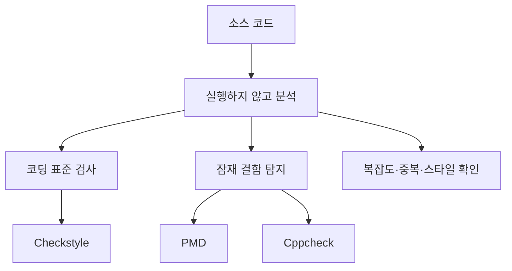

# 094 소스 코드 품질 분석 도구 - 정적 분석 도구

작성 기준일: 2026-06-01
검색/보강일: 2026-06-01
PDF 확인 위치: 15페이지, 2과목 소프트웨어 개발, 094 소스 코드 품질 분석 도구 - 정적 분석 도구

## 한 줄 요약

- 정적 분석 도구는 프로그램을 실행하지 않고 소스 코드 자체를 검사해 코딩 표준 위반, 잠재 결함, 복잡도, 스타일 문제를 찾아내는 품질 분석 도구이다.

## 한눈에 보는 구조

| 구분 | 핵심 의미 | 시험 단서 |
|---|---|---|
| 정적 분석 | 코드를 실행하지 않고 소스 자체를 분석 | 실행 전, 소스 코드 검사, 코딩 표준 |
| 동적 분석 | 프로그램을 실행하면서 동작 결과를 분석 | 실행 중, 테스트 데이터, 런타임 |
| PMD | 다중 언어 정적 소스 분석 도구 | Java, 결함, 중복, 코드 품질 |
| Checkstyle | Java 코딩 표준 준수 여부 검사 | 코딩 스타일, 명명 규칙, 들여쓰기 |
| Cppcheck | C/C++ 정적 분석 도구 | C/C++, 메모리·정의되지 않은 동작 |

## PDF 기준 핵심

- PDF는 `소스 코드 품질 분석 도구 - 정적 분석 도구`를 2과목 소프트웨어 개발의 인터페이스 구현·검증 영역 뒤쪽 핵심 항목으로 제시한다.
- 정적 분석 도구는 작성된 소스 코드를 실행하지 않고 분석한다.
- 분석 대상은 코드 자체이며, 목적은 품질 저하 요인을 조기에 찾아내는 것이다.
- PDF 기준 주요 예시는 다음 세 가지이다.
  - `pmd`
  - `checkstyle`
  - `cppcheck`

## 개념 설명

### 정적 분석의 의미

- 정적 분석은 컴파일 또는 실행 결과만 보는 것이 아니라, 소스 코드의 구조·규칙·패턴을 읽어 결함 가능성을 판단한다.
- 대표적으로 다음 문제를 찾는다.
  - 사용하지 않는 변수
  - 빈 예외 처리 블록
  - 지나치게 복잡한 조건문
  - 중복 코드
  - 명명 규칙 위반
  - 위험한 포인터·메모리 사용
- 테스트 케이스가 없어도 코드 전체를 넓게 훑을 수 있다는 장점이 있다.
- 실제 실행 경로에서만 드러나는 성능 문제나 환경 의존 오류는 동적 테스트가 더 적합하다.

### PMD

- PMD는 정적 소스 코드 분석기로, 소스 코드 안의 품질 문제를 규칙 기반으로 찾아낸다.
- Java 중심으로 많이 알려졌지만, 공식 저장소와 문서는 다중 언어 분석 도구로 설명한다.
- 시험에서는 `PMD = 정적 분석 도구` 정도가 가장 중요하다.
- 함께 기억할 단서:
  - 코드 결함
  - 중복 코드
  - 사용하지 않는 코드
  - 복잡도

### Checkstyle

- Checkstyle은 Java 코드가 정해진 코딩 표준을 지키는지 검사하는 도구이다.
- 공식 설명에서도 Java 코드가 코딩 표준을 따르도록 돕는 개발 도구라고 설명한다.
- 결함 탐지도 일부 가능하지만, 시험에서는 `코딩 표준`, `코딩 스타일`, `Java` 단서가 가장 강하다.
- 검사 예:
  - 클래스·메서드 이름 규칙
  - import 순서
  - 공백과 들여쓰기
  - 중괄호 위치
  - Javadoc 규칙

### Cppcheck

- Cppcheck는 C/C++ 코드의 정적 분석 도구이다.
- 공식 사이트는 C/C++ 코드에서 버그와 위험한 코딩 구조를 찾는 정적 분석 도구로 설명한다.
- 시험에서는 언어 단서가 중요하다.
  - `Cpp`가 보이면 C/C++ 계열
  - `check`가 붙어도 Checkstyle과 혼동하지 않기

## 시험 포인트

- `정적 분석`의 핵심 단어는 `실행하지 않고`이다.
- `테스트 데이터를 넣어 실행한다`는 설명이 나오면 정적 분석이 아니라 동적 분석에 가깝다.
- `Checkstyle`은 이름 그대로 스타일·표준 검사에 초점을 둔다.
- `Cppcheck`는 C/C++ 정적 분석 도구이다.
- `PMD`는 Java 쪽 정적 분석 도구로 자주 출제되지만, 최신 도구 설명은 다중 언어 분석으로 확장되어 있다.
- 정적 분석은 결함을 확정한다기보다 결함 가능성이 높은 지점을 빠르게 알려주는 성격이 강하다.

## 헷갈리는 비교

| 비교 | 정답 단서 | 오답 단서 |
|---|---|---|
| 정적 분석 vs 동적 테스트 | 실행하지 않고 소스 코드 분석 | 테스트 데이터 입력, 프로그램 실행 |
| PMD vs Checkstyle | 결함·중복·복잡도 등 코드 품질 | 코딩 표준·스타일 규칙 |
| Checkstyle vs Cppcheck | Java 코딩 표준 검사 | C/C++ 코드 분석 |
| 정적 분석 도구 vs 빌드 도구 | 품질 검사 자체가 목적 | 빌드·의존성·배포 자동화 |

## 예시 또는 암기 포인트

### 도구별 암기

| 도구 | 암기 문장 |
|---|---|
| PMD | `P`roblem을 미리 Detect하는 정적 분석 |
| Checkstyle | 스타일을 Check하는 Java 규칙 검사 |
| Cppcheck | C/C++ 코드를 Check하는 정적 분석 |

### 문제 풀이 예

- 보기: `소스 코드를 실행하지 않고 코딩 표준 준수 여부를 검사한다.`
  - 정답 방향: 정적 분석 도구
- 보기: `Java 코드의 명명 규칙, 들여쓰기, import 순서를 검사한다.`
  - 정답 방향: Checkstyle
- 보기: `C/C++ 코드에서 위험한 코딩 구조를 탐지한다.`
  - 정답 방향: Cppcheck

## 빠른 복습

- 정적 분석 도구는 실행하지 않고 소스 코드만 분석한다.
- PDF의 주요 예시는 `pmd`, `checkstyle`, `cppcheck`이다.
- PMD는 코드 결함·중복·복잡도 단서와 연결한다.
- Checkstyle은 Java 코딩 표준·스타일 단서와 연결한다.
- Cppcheck는 C/C++ 단서와 연결한다.
- `실행 중 분석`이라는 문장이 나오면 정적 분석이 아니다.

## 참고 링크

- [PMD Source Code Analyzer Documentation](https://docs.pmd-code.org/latest/)
- [Checkstyle](https://checkstyle.org/)
- [Checkstyle Standard Checks](https://checkstyle.org/checks.html)
- [Cppcheck - A tool for static C/C++ code analysis](https://cppcheck.sourceforge.io/)

