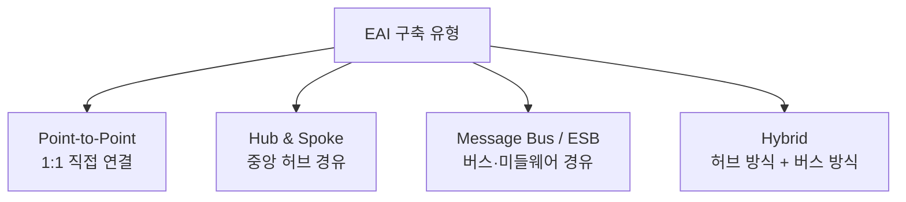

# 095 EAI의 구축 유형

작성 기준일: 2026-06-01
검색/보강일: 2026-06-01
PDF 확인 위치: 15페이지, 2과목 소프트웨어 개발, 095 EAI의 구축 유형

## 한 줄 요약

- EAI 구축 유형은 기업 내부의 여러 애플리케이션을 어떻게 연결하느냐에 따른 구조이며, 시험에서는 `Point-to-Point`, `Hub & Spoke`, `Message Bus(ESB)`, `Hybrid`의 차이를 구분해야 한다.

## 한눈에 보는 구조

| 구축 유형 | 연결 구조 | 장점 | 주의점 | 시험 단서 |
|---|---|---|---|---|
| Point-to-Point | 애플리케이션끼리 1:1 직접 연결 | 단순, 빠른 구축 | 연결 수 폭증, 유지보수 어려움 | 1:1, 직접 연결 |
| Hub & Spoke | 중앙 허브를 통해 연결 | 중앙 통제, 관리 용이 | 허브 장애 영향 큼 | 단일 접점, 중앙 집중 |
| Message Bus / ESB | 공통 버스·미들웨어를 통해 메시지 처리 | 느슨한 결합, 확장성 | 설계·운영 복잡도 | 미들웨어, 버스, ESB |
| Hybrid | Hub & Spoke와 Message Bus 혼합 | 상황별 유연성 | 구조가 복합적 | 혼합, 결합 |

## PDF 기준 핵심

- PDF는 EAI의 구축 유형으로 다음 네 가지를 제시한다.
- `Point-to-Point`
  - 애플리케이션을 1:1로 연결한다.
- `Hub & Spoke`
  - 단일 접점인 허브 시스템을 통해 데이터를 전송하는 중앙 집중형 방식이다.
- `Message Bus`
  - 애플리케이션 사이에 미들웨어를 두어 처리하는 방식이다.
  - ESB 방식으로도 설명된다.
- `Hybrid`
  - Hub & Spoke 방식과 Message Bus 방식을 혼합한 방식이다.

## 개념 설명

### EAI의 의미

- EAI는 `Enterprise Application Integration`의 약자이다.
- 기업 내부의 서로 다른 시스템과 애플리케이션을 연결해 데이터와 업무 흐름을 통합하는 접근이다.
- IBM은 EAI를 서로 다른 시스템과 소프트웨어 애플리케이션을 연결해 데이터 사일로를 줄이고 업무 프로세스를 원활하게 하는 과정으로 설명한다.
- 시험에서는 EAI 자체보다 `구축 유형별 연결 모양`이 자주 출제된다.

### Point-to-Point

- 각 애플리케이션이 필요한 상대와 직접 연결된다.
- 시스템 수가 적을 때는 이해하기 쉽고 빠르게 만들 수 있다.
- 시스템이 많아질수록 연결선이 급격히 늘어난다.
- 예:
  - A 시스템이 B, C, D와 각각 직접 연결
  - B도 C, D와 직접 연결
- 단서:
  - `1:1`
  - `직접 연결`
  - `소규모`
  - `연결 수 증가`

### Hub & Spoke

- 모든 애플리케이션이 중앙 허브에 연결된다.
- 허브가 데이터 변환, 라우팅, 중계 역할을 담당한다.
- 중앙에서 통제하므로 관리가 쉬운 편이다.
- 허브가 병목이나 단일 장애 지점이 될 수 있다.
- 단서:
  - `중앙 집중`
  - `단일 접점`
  - `허브 시스템`
  - `허브 장애`

### Message Bus / ESB

- 애플리케이션들이 공통 메시지 버스 또는 ESB를 통해 통신한다.
- Enterprise Integration Patterns의 Message Bus 설명처럼, 공통 데이터 모델·공통 명령 집합·메시징 인프라를 통해 여러 시스템이 공통 인터페이스로 통신하도록 한다.
- IBM은 ESB가 데이터 모델 변환, 연결, 메시지 라우팅, 프로토콜 변환 등을 수행할 수 있다고 설명한다.
- 단서:
  - `미들웨어`
  - `메시지 버스`
  - `ESB`
  - `느슨한 결합`
  - `표준 인터페이스`

### Hybrid

- Hub & Spoke와 Message Bus 방식을 혼합한다.
- 일부 업무는 중앙 허브로 묶고, 다른 업무는 버스 구조로 분산 처리할 수 있다.
- 시험에서는 복잡한 실무 설명보다 `혼합 방식`이라는 키워드가 중요하다.

## 시험 포인트

- `1:1 직접 연결`이 나오면 Point-to-Point이다.
- `단일 접점`, `허브`, `중앙 집중`이 나오면 Hub & Spoke이다.
- `애플리케이션 사이에 미들웨어`, `ESB`, `Message Bus`가 나오면 Message Bus 방식이다.
- `Hub & Spoke + Message Bus`가 나오면 Hybrid이다.
- EAI 문제는 영문 용어가 섞여 나오므로 한글 단서와 영어 이름을 함께 외워야 한다.
- ESB는 Message Bus의 대표 단서로 함께 묶어 기억한다.

## 헷갈리는 비교

| 헷갈리는 쌍 | 구분 기준 |
|---|---|
| Point-to-Point vs Hub & Spoke | 직접 1:1 연결이면 Point-to-Point, 중앙 허브 경유면 Hub & Spoke |
| Hub & Spoke vs Message Bus | 중앙 집중 허브가 핵심이면 Hub & Spoke, 공통 버스·미들웨어가 핵심이면 Message Bus |
| Message Bus vs Hybrid | 버스 방식 자체면 Message Bus, 허브 방식까지 섞으면 Hybrid |
| EAI vs API | EAI는 기업 애플리케이션 통합 구조 전체, API는 시스템 간 호출 인터페이스 수단 |

## 예시 또는 암기 포인트

### 연결선 암기

- `Point-to-Point`: 선이 여기저기 직접 이어진다.
- `Hub & Spoke`: 자전거 바퀴처럼 중앙 허브에서 바깥 시스템으로 선이 뻗는다.
- `Message Bus`: 공통 버스 위에 시스템들이 붙는다.
- `Hybrid`: 허브와 버스를 함께 쓴다.

### 빠른 판별표

| 문제 문장 | 정답 방향 |
|---|---|
| 애플리케이션을 1:1로 직접 연결 | Point-to-Point |
| 단일 접점 허브 시스템으로 중앙 집중 | Hub & Spoke |
| 애플리케이션 사이의 미들웨어가 메시지 처리 | Message Bus / ESB |
| Hub & Spoke와 Message Bus를 혼합 | Hybrid |

## 빠른 복습

- EAI는 기업 애플리케이션 통합이다.
- Point-to-Point는 1:1 직접 연결이다.
- Hub & Spoke는 중앙 허브 방식이다.
- Message Bus는 미들웨어·ESB 방식이다.
- Hybrid는 허브 방식과 버스 방식을 섞은 방식이다.
- 시험에서는 연결 구조 그림을 머릿속에 그리면 쉽게 풀린다.

## 참고 링크

- [IBM - What is enterprise application integration?](https://www.ibm.com/think/topics/enterprise-application-integration)
- [IBM - What is an Enterprise Service Bus?](https://www.ibm.com/think/topics/esb)
- [Enterprise Integration Patterns - Message Bus](https://www.enterpriseintegrationpatterns.com/patterns/messaging/MessageBus.html)
- [MuleSoft - What is enterprise application integration?](https://www.mulesoft.com/integration/enterprise-application-integration-and-esb)

<!-- study-links:start -->
## 관련 문서

- `미들웨어`: [[정보처리기사/1과목 소프트웨어 설계/054 미들웨어(Middleware)/054 미들웨어(Middleware)|054 미들웨어(Middleware)]]
<!-- study-links:end -->
