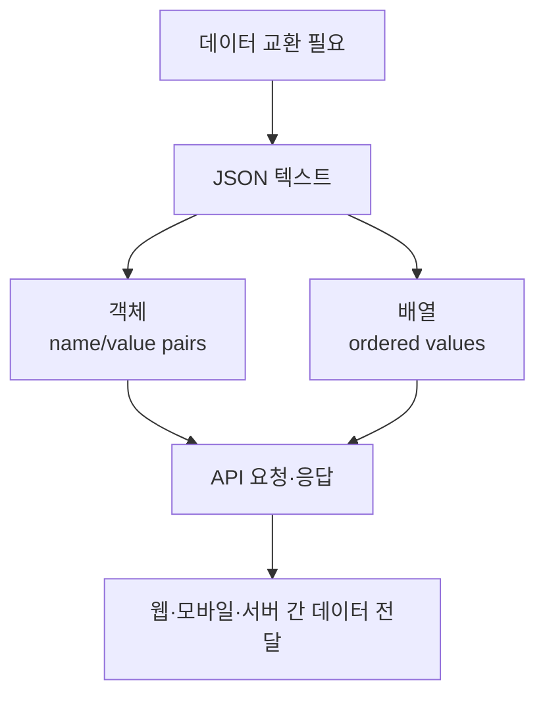

# 096 JSON(JavaScript Object Notation)

작성 기준일: 2026-06-01
검색/보강일: 2026-06-01
PDF 확인 위치: 15페이지, 2과목 소프트웨어 개발, 096 JSON(JavaScript Object Notation)

## 한 줄 요약

- JSON은 속성-값 쌍과 배열을 사람이 읽기 쉬운 텍스트로 표현해 시스템 간 데이터를 주고받는 개방형 표준 데이터 형식이다.



## 한눈에 보는 구조

| 요소 | 의미 | 예 |
|---|---|---|
| Object | 이름과 값의 쌍을 중괄호로 표현 | `{ "name": "kim" }` |
| Array | 값을 순서 있게 대괄호로 표현 | `[1, 2, 3]` |
| String | 큰따옴표로 감싼 문자열 | `"title"` |
| Number | 숫자 값 | `2026` |
| Boolean | 참·거짓 | `true`, `false` |
| Null | 값이 없음을 표현 | `null` |

## PDF 기준 핵심

- PDF는 JSON을 `JavaScript Object Notation`으로 제시한다.
- JSON은 속성-값 쌍, 즉 `Attribute-Value Pairs`로 이루어진 데이터 객체를 전달하기 위해 사용한다.
- 사람이 읽을 수 있는 텍스트를 사용하는 개방형 표준 포맷이다.
- 인터페이스와 데이터 교환 문제에서 자주 연결된다.

## 개념 설명

### JSON의 기본 의미

- JSON은 데이터를 문자열 형태로 표현하는 데이터 교환 형식이다.
- JavaScript 문법에서 출발했지만, 특정 언어에만 종속된 형식은 아니다.
- RFC 8259는 JSON 값을 객체, 배열, 숫자, 문자열, 불리언, null로 구성할 수 있다고 설명한다.
- MDN은 JSON을 데이터 교환 형식으로 설명하며, 여러 프로그래밍 언어가 JSON을 지원한다고 정리한다.

### 객체와 배열

- 객체는 이름과 값의 쌍을 모은 구조이다.
- 배열은 값을 순서 있게 나열한 구조이다.
- 객체와 배열은 서로 중첩될 수 있다.

```json
{
  "student": "kim",
  "passed": true,
  "scores": [80, 90, 95],
  "profile": {
    "grade": "A",
    "year": 2026
  }
}
```

### JSON이 많이 쓰이는 이유

- 텍스트 기반이라 사람이 읽고 디버깅하기 쉽다.
- 구조가 단순하다.
- 웹 API의 요청·응답 형식으로 널리 쓰인다.
- JavaScript뿐 아니라 Java, Python, C#, Go 등 여러 언어에서 파싱과 생성이 쉽다.
- XML보다 문법이 짧아 데이터 교환에서 자주 선택된다.

### 엄격한 JSON에서 주의할 점

- 문자열과 속성 이름은 큰따옴표를 사용한다.
- 함수는 JSON 값이 아니다.
- 주석은 표준 JSON 문법에 포함되지 않는다.
- 끝에 남는 쉼표는 표준 JSON 문법으로 보지 않는다.

## 시험 포인트

- `속성-값 쌍`이 나오면 JSON을 떠올린다.
- `사람이 읽을 수 있는 텍스트`, `개방형 표준 포맷`도 JSON 단서이다.
- JSON은 데이터 교환 형식이지 프로그래밍 언어 자체가 아니다.
- 이름은 JavaScript Object Notation이지만, JavaScript 전용 형식으로만 이해하면 안 된다.
- XML과 비교하는 문제에서는 JSON이 더 가볍고 간결한 텍스트 데이터 형식이라는 식으로 출제될 수 있다.

## 헷갈리는 비교

| 비교 | JSON | XML |
|---|---|---|
| 기본 표현 | 속성-값 쌍, 배열 | 태그 기반 |
| 가독성 | 간결한 편 | 구조가 길어질 수 있음 |
| 웹 API | REST API 응답에서 매우 흔함 | 설정·문서·레거시 연동에서 여전히 사용 |
| 핵심 단서 | `{}`, `[]`, name/value | `<tag>...</tag>` |

| 비교 | JSON | JavaScript 객체 |
|---|---|---|
| 정체 | 데이터 교환용 텍스트 형식 | JavaScript 런타임의 객체 |
| 문자열 키 | 큰따옴표 필요 | 따옴표 생략 가능할 수 있음 |
| 함수 값 | 허용하지 않음 | 함수 프로퍼티 가능 |
| 전송 | 문자열로 주고받음 | 메모리 안의 객체 |

## 예시 또는 암기 포인트

### 암기 문장

- JSON = `속성-값 쌍 + 사람이 읽는 텍스트 + 개방형 표준`
- JSON = JavaScript 이름을 가졌지만 `언어 독립적 데이터 교환 형식`

### 문제 풀이 단서

| 문제 표현 | 정답 방향 |
|---|---|
| Attribute-Value Pairs | JSON |
| 사람이 읽을 수 있는 텍스트 기반 데이터 객체 전달 | JSON |
| 태그로 구조화된 문서 | XML |
| 웹에서 비동기 요청 후 JSON 응답 처리 | AJAX와 함께 사용 가능 |

## 빠른 복습

- JSON은 JavaScript Object Notation이다.
- PDF 핵심은 `속성-값 쌍`, `데이터 객체 전달`, `사람이 읽을 수 있는 텍스트`, `개방형 표준`이다.
- 객체는 `{}`, 배열은 `[]`로 표현한다.
- JSON은 API 요청·응답 데이터 형식으로 매우 흔하다.
- JSON은 JavaScript 전용이 아니라 여러 언어에서 사용하는 데이터 교환 형식이다.

## 참고 링크

- [RFC 8259 - The JavaScript Object Notation (JSON) Data Interchange Format](https://datatracker.ietf.org/doc/html/rfc8259)
- [MDN - JSON](https://developer.mozilla.org/en-US/docs/Glossary/JSON)

