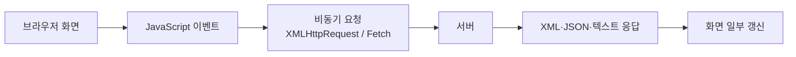
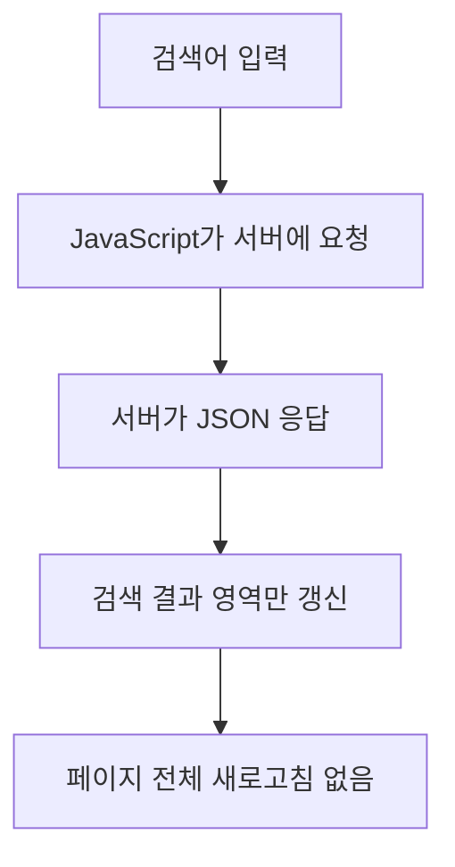

# 097 AJAX(Asynchronous JavaScript and XML)

작성 기준일: 2026-06-01
검색/보강일: 2026-06-01
PDF 확인 위치: 15페이지, 2과목 소프트웨어 개발, 097 AJAX(Asynchronous JavaScript and XML)

## 한 줄 요약

- AJAX는 JavaScript 등을 이용해 웹 페이지 전체를 다시 불러오지 않고 클라이언트와 서버가 비동기로 데이터를 주고받게 하는 웹 통신 기법이다.

## 한눈에 보는 구조

| 요소 | 역할 | 시험 단서 |
|---|---|---|
| JavaScript | 요청 생성, 응답 처리, 화면 갱신 | 클라이언트 스크립트 |
| XMLHttpRequest | 전통적 AJAX 요청 객체 | AJAX 핵심 API |
| Fetch API | 현대적 웹 요청 API | Promise 기반 요청 |
| 서버 | 요청 처리 후 데이터 응답 | XML, JSON, HTML, 텍스트 |
| DOM 갱신 | 페이지 일부만 변경 | 새로고침 없는 갱신 |

## PDF 기준 핵심

- PDF는 AJAX를 `Asynchronous JavaScript and XML`로 제시한다.
- JavaScript 등을 이용한 비동기 통신 기술이다.
- 클라이언트와 서버 간에 XML 데이터를 교환하고 제어하는 기술로 설명된다.
- 인터페이스 구현과 웹 데이터 교환 문맥에서 출제될 수 있다.

## 개념 설명

### AJAX의 의미

- AJAX는 단일 제품이나 특정 라이브러리 이름이 아니라 웹에서 비동기 통신을 구현하는 접근 방식이다.
- MDN은 AJAX를 HTML, CSS, JavaScript, DOM, XML, XSLT, XMLHttpRequest 등을 함께 사용하는 접근으로 설명한다.
- 핵심은 사용자가 페이지를 보고 있는 동안 브라우저가 서버와 백그라운드로 통신할 수 있다는 점이다.
- 전체 페이지를 다시 로딩하지 않아도 일부 영역만 바꿀 수 있다.

### 비동기 통신

- 비동기는 요청을 보낸 뒤 응답을 기다리는 동안 브라우저가 다른 작업을 계속할 수 있다는 뜻이다.
- 동기 요청은 응답이 올 때까지 흐름이 막힐 수 있다.
- AJAX 문제에서는 `Asynchronous`, `비동기`, `페이지 전체 갱신 없이`, `클라이언트-서버 데이터 교환`이 핵심 단서이다.

### XML이라는 이름과 실제 데이터 형식

- 이름에는 XML이 들어가지만, 실제 AJAX 응답은 XML만 사용하지 않는다.
- 현대 웹에서는 JSON을 훨씬 자주 사용한다.
- 시험에서는 PDF 표현을 우선해 `XML 데이터 교환`을 기억하되, 실무 이해로는 JSON·HTML·텍스트도 가능하다고 정리한다.

### XMLHttpRequest와 Fetch

- XMLHttpRequest는 AJAX를 구현하는 전통적 브라우저 API이다.
- MDN은 XMLHttpRequest로 HTTP 요청을 보내 서버와 데이터를 교환할 수 있다고 설명한다.
- Fetch API는 현대적인 요청 API로, Promise 기반으로 네트워크 요청과 응답을 처리한다.
- 시험에서는 Fetch보다 AJAX의 기본 정의가 더 중요하다.

## 시험 포인트

- `Asynchronous JavaScript and XML`의 약자를 정확히 기억한다.
- AJAX는 `비동기 통신 기술`이다.
- 클라이언트와 서버 간 데이터 교환을 수행한다.
- 웹 페이지 전체를 다시 로딩하지 않고 화면 일부를 갱신할 수 있다.
- XML이라는 단어가 있지만, JSON도 AJAX 응답 데이터로 많이 사용된다.
- AJAX는 서버 기술이 아니라 브라우저 쪽 JavaScript 중심의 웹 통신 방식으로 이해한다.

## 헷갈리는 비교

| 비교 | AJAX | JSON |
|---|---|---|
| 정체 | 비동기 통신 방식 | 데이터 표현 형식 |
| 역할 | 요청을 보내고 응답을 받아 화면 갱신 | 응답·요청 데이터를 표현 |
| 키워드 | JavaScript, 비동기, 서버 통신 | 속성-값 쌍, 텍스트, 데이터 객체 |

| 비교 | AJAX | 일반 페이지 이동 |
|---|---|---|
| 화면 처리 | 일부 갱신 가능 | 전체 페이지가 새로 열림 |
| 사용자 경험 | 끊김이 적음 | 페이지 전환이 명확함 |
| 요청 주체 | JavaScript 코드 | 링크 클릭, 폼 제출 등 |

## 예시 또는 암기 포인트

### 동작 예

### 암기 문장

- AJAX = `A`synchronous + JavaScript + XML
- AJAX = `새로고침 없이 서버와 비동기 통신`
- JSON = 데이터 형식, AJAX = 데이터를 주고받는 방식

## 빠른 복습

- AJAX는 Asynchronous JavaScript and XML이다.
- PDF 핵심은 JavaScript 기반 비동기 통신, 클라이언트-서버 XML 데이터 교환 및 제어이다.
- 실제 웹에서는 JSON 응답도 자주 쓴다.
- XMLHttpRequest는 AJAX의 전통적 핵심 API이다.
- Fetch API는 현대 웹 요청 API이다.
- 시험에서는 `비동기`, `JavaScript`, `클라이언트-서버`, `부분 갱신`을 묶어 기억한다.

## 참고 링크

- [MDN - Using XMLHttpRequest](https://developer.mozilla.org/en-US/docs/Web/API/XMLHttpRequest_API/Using_XMLHttpRequest)
- [MDN - Synchronous and asynchronous requests](https://developer.mozilla.org/en-US/docs/Web/API/XMLHttpRequest_API/Synchronous_and_Asynchronous_Requests)
- [MDN - Fetch API](https://developer.mozilla.org/en-US/docs/Web/API/Fetch_API)

<!-- study-links:start -->
## 관련 문서

- `css`: [[tailwindcss/tailwindcss|Tailwind CSS 상세 정리]]
<!-- study-links:end -->
