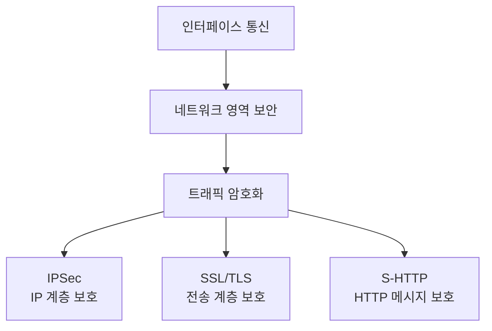

# 098 인터페이스 보안 기능 적용 - 네트워크 영역

작성 기준일: 2026-06-01
검색/보강일: 2026-06-01
PDF 확인 위치: 15페이지, 2과목 소프트웨어 개발, 098 인터페이스 보안 기능 적용 - 네트워크 영역

## 한 줄 요약

- 인터페이스 보안의 네트워크 영역은 전송되는 트래픽을 암호화해 도청·변조·위조 위험을 줄이며, PDF 기준 대표 방식은 IPSec, SSL, S-HTTP이다.

## 한눈에 보는 구조

| 방식 | 보호 위치 | 핵심 역할 | 시험 단서 |
|---|---|---|---|
| IPSec | IP 계층 | IP 패킷 인증·무결성·기밀성 | AH, ESP, VPN, IP 계층 |
| SSL/TLS | 전송 계층 위의 보안 채널 | 클라이언트-서버 통신 암호화 | HTTPS, 인증서, 세션 암호화 |
| S-HTTP | HTTP 메시지 단위 | 웹 메시지 보호 | Secure HTTP, 메시지별 보안 |

## PDF 기준 핵심

- PDF는 `인터페이스 보안 기능 적용 - 네트워크 영역`을 제시한다.
- 네트워크 영역에서는 네트워크 트래픽에 대한 암호화 설정을 적용한다.
- 적용 가능한 방식으로 다음을 제시한다.
  - `IPSec`
  - `SSL`
  - `S-HTTP`
- 시험에서는 보안 영역 중 `네트워크 트래픽 암호화`에 해당하는 기술을 묻는 식으로 출제될 수 있다.

## 개념 설명

### 네트워크 영역 보안의 의미

- 인터페이스는 시스템 간 데이터를 주고받는 접점이다.
- 네트워크 영역 보안은 이 데이터가 네트워크를 지나갈 때 노출되거나 변조되는 것을 막는 데 초점을 둔다.
- 대표적인 보안 목표:
  - 기밀성: 제3자가 내용을 읽지 못하게 함
  - 무결성: 전송 중 변조 여부를 확인
  - 인증: 통신 상대나 데이터 출처 확인

### IPSec

- IPSec은 IP 계층에서 보안 서비스를 제공하는 구조이다.
- RFC 4301은 IPSec이 IPv4와 IPv6에 대해 암호 기반 보안을 제공하도록 설계되었고, 접근 제어·무결성·출처 인증·재전송 방지·기밀성 등을 제공한다고 설명한다.
- 주요 구성 단서:
  - AH: 무결성과 출처 인증
  - ESP: 무결성, 출처 인증, 기밀성 제공 가능
- 시험에서는 `IP 계층`, `패킷 보호`, `VPN`과 연결해서 이해한다.

### SSL/TLS

- PDF에는 SSL로 나오지만, 현재 실무 표준 용어는 TLS가 중심이다.
- RFC 8446은 TLS가 클라이언트와 서버 애플리케이션이 인터넷에서 도청, 변조, 메시지 위조를 막도록 통신하게 하는 프로토콜이라고 설명한다.
- 시험에서는 PDF 표현을 우선해 SSL을 외우되, 이해는 SSL/TLS 보안 채널로 잡으면 된다.
- 대표 사례:
  - HTTPS
  - 서버 인증서
  - 브라우저와 서버 사이의 암호화 통신

### S-HTTP

- S-HTTP는 Secure HyperText Transfer Protocol이다.
- RFC 2660에서 정의된 보안 HTTP 방식이다.
- HTTPS처럼 전송 채널 전체를 보호하는 방식과 달리, HTTP 메시지 단위 보호라는 문맥으로 구분한다.
- 현재 실무에서는 HTTPS/TLS가 훨씬 일반적이지만, 시험 PDF에는 S-HTTP가 명시되어 있으므로 그대로 기억한다.

## 시험 포인트

- `네트워크 영역` 보안은 `트래픽 암호화`가 핵심이다.
- PDF 기준 대표 방식은 `IPSec`, `SSL`, `S-HTTP`이다.
- IPSec은 IP 계층 보안이다.
- SSL/TLS는 웹·클라이언트-서버 통신의 암호화 채널로 이해한다.
- S-HTTP는 Secure HTTP이며, 시험에서는 SSL과 함께 암호화 방식으로 묶인다.
- 데이터베이스 암호화, 인증 토큰, 입력값 검증은 네트워크 영역이 아니라 다른 보안 영역으로 분류될 수 있다.

## 헷갈리는 비교

| 비교 | IPSec | SSL/TLS | S-HTTP |
|---|---|---|---|
| 계층 단서 | IP 계층 | 전송 계층 위 보안 채널 | HTTP 메시지 |
| 대표 사용 | VPN, 네트워크 간 보호 | HTTPS, 웹 서버 보안 | 보안 HTTP 메시지 |
| 시험 키워드 | AH, ESP, 패킷 | 인증서, SSL, TLS | Secure HTTP |
| 기억법 | IP를 보호 | 세션·채널을 보호 | HTTP 메시지를 보호 |

| 영역 | 보안 적용 예 |
|---|---|
| 네트워크 영역 | IPSec, SSL, S-HTTP로 트래픽 암호화 |
| 애플리케이션 영역 | 권한 검증, 입력값 검증, 인증 처리 |
| 데이터 영역 | 데이터 암호화, 중요 정보 마스킹, 접근 제어 |

## 예시 또는 암기 포인트

### 암기 문장

- 네트워크 보안 = `트래픽 암호화`
- PDF 3종 = `IPSec + SSL + S-HTTP`
- IPSec = IP 계층
- SSL/TLS = HTTPS 보안 채널
- S-HTTP = Secure HTTP

### 문제 풀이 단서

| 문제 표현 | 정답 방향 |
|---|---|
| 네트워크 트래픽 암호화 설정 | 네트워크 영역 보안 |
| IP 계층에서 패킷 보안 제공 | IPSec |
| HTTPS에서 사용하는 보안 채널 | SSL/TLS |
| Secure HyperText Transfer Protocol | S-HTTP |

## 빠른 복습

- 인터페이스 보안의 네트워크 영역은 트래픽 암호화가 핵심이다.
- PDF 기준 방식은 IPSec, SSL, S-HTTP이다.
- IPSec은 IP 계층 보안이다.
- SSL은 시험 표현이고, 현대 실무에서는 TLS와 함께 이해한다.
- S-HTTP는 Secure HTTP이다.
- 네트워크 영역 문제는 `통신 구간 보호`를 묻는다고 생각하면 된다.

## 참고 링크

- [RFC 4301 - Security Architecture for the Internet Protocol](https://datatracker.ietf.org/doc/html/rfc4301)
- [RFC 8446 - The Transport Layer Security (TLS) Protocol Version 1.3](https://www.rfc-editor.org/rfc/rfc8446)
- [RFC 2660 - The Secure HyperText Transfer Protocol](https://datatracker.ietf.org/doc/rfc2660/)

